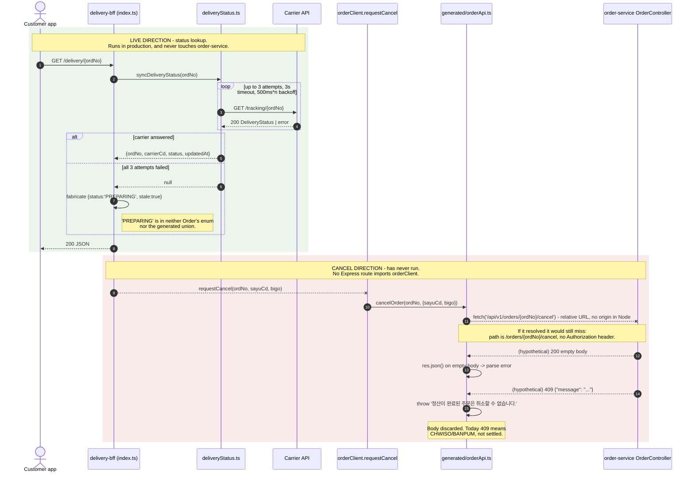

## Parties

- **Order (order-service)** — provider. Owns `POST /orders/{ordNo}/cancel`, the `OrderStatus` vocabulary and the cancellation policy. `SERVER_VERSION` reports 2.8.14; `build.gradle` still says `version = '2.8.4'`. Team: 커머스본부 주문팀 (Commerce Division, order team), per the spec's contact block → `order-service/build.gradle`, `sources/apis/order/openapi.meta.json`
- **Delivery (delivery-bff)** — consumer. A carrier-status proxy at version 1.3.0, described in `package.json` as "셀플로우 배송 조회 BFF. 담당: 커머스본부 물류팀" (sellflow delivery-lookup BFF; owned by the Commerce Division logistics team). It consumes Order through a single code-generated TypeScript file produced once in November 2022 and never regenerated → `delivery-bff/package.json`, `delivery-bff/src/generated/orderApi.ts`
- **The contract document** — `sources/apis/order/openapi.json`, a springdoc artefact generated 2022-11-04 against order-service 2.4.0. It is the only written agreement between the two, and neither side pins a version of it.

## Key Facts

- The client carries a fixed provenance header: generator `openapi-typescript-codegen 0.23.0`, source `order-service-openapi.json`, generated `2022-11-08T04:12:33Z`, with the instruction "자동 생성 파일입니다. 직접 수정하지 마세요." (this is an auto-generated file; do not edit it directly) → `delivery-bff/src/generated/orderApi.ts`
- That makes it **1,411 days old as of 2026-09-19**, generated four days after the spec it names (2022-11-04) and **164 days before SF-2287 repealed the rule it hard-codes** (resolved 2023-04-21). The repealed rule has now been dead for **1,247 days** and the client still enforces it → `delivery-bff/src/generated/orderApi.ts`, `sources/context/tickets/SF-2287.md`
- **The 2022 spec contains no `/api/v1` anywhere** — zero occurrences in the whole document — and documents the cancel path as `/orders/{ordNo}/cancel`. The live controller maps `@RequestMapping("/orders")` + `@PostMapping("/{ordNo}/cancel")` to the same path. The client's `/api/v1` prefix was therefore never correct, at generation time or since → `sources/apis/order/openapi.json`, `order-service/src/main/java/kr/co/sellflow/order/controller/OrderController.java`
- `/api/v1` does exist in order-service, on an unrelated endpoint: `OrderSearchController` is `@RequestMapping("/api/v1/orders/search")`. So the prefix is real but belongs to CS admin search, not to cancellation — a near-miss that makes the wrong path look plausible on inspection → `order-service/src/main/java/kr/co/sellflow/order/search/OrderSearchController.java`
- **The 2022 spec has no `OrderStatus` schema at all.** `OrderMst.sangtaeCd` is declared as a bare `{"type": "string", "description": "주문상태코드"}`, and the string `JUMUN_WANRYO` appears zero times in the document. `openapi-typescript-codegen` cannot synthesise a five-value union from a plain string, so the client's `OrderStatus` type did not come from its named source → `sources/apis/order/openapi.json`, `delivery-bff/src/generated/orderApi.ts`
- The spec does declare enums elsewhere — `gyeolJeCd`, `chaenNelCd`, `taekBaeSaCd`, `changgoCd`, `chulGoSangtae` all carry `enum` arrays — so enum emission was working. Order status specifically was left untyped → `sources/apis/order/openapi.json`
- The spec's 200 response for cancel is `OrderCancel {ordNo, chwisoIlsi, chwisoSayuCd, choriSangtae, bigo}`. The client declares `CancelResponse {ordNo, sangtaeCd}`. Neither field name beyond `ordNo` matches, so the response type was not generated from this spec either → `sources/apis/order/openapi.json`, `delivery-bff/src/generated/orderApi.ts`
- The live controller returns `ResponseEntity<Void>` — `ResponseEntity.ok().build()`, an empty 200 body. The client's last line is `return res.json()`, which on an empty body raises a JSON parse error rather than returning a `CancelResponse`. The declared return type is unreachable on the success path → `order-service/src/main/java/kr/co/sellflow/order/controller/OrderController.java`, `delivery-bff/src/generated/orderApi.ts`
- The client's `OrderStatus` union is `JUMUN_WANRYO | BAESONG_JUNG | BAESONG_WANRYO | CHWISO | BANPUM`. The live enum is `GYEOLJE_WANRYO, SANGPUM_JUNBI, BAESONG_JUNG, BAESONG_WANRYO, JUNGSAN_WANRYO, CHWISO, BANPUM` — seven values, three of them absent from the client, and `JUMUN_WANRYO` present in the client and in nothing else in this reef → `order-service/src/main/java/kr/co/sellflow/order/domain/OrderStatus.java`
- The client converts any HTTP 409 into `Error('정산이 완료된 주문은 취소할 수 없습니다.')` (an order whose settlement is complete cannot be cancelled), and its doc comment repeats it: "취소 요청. 정산 완료 주문은 409 를 반환합니다." (cancel request; settled orders return 409) → `delivery-bff/src/generated/orderApi.ts`
- Order stopped meaning that in April 2023. `OrderCancelService` blocks only `CHWISO` and `BANPUM` — "이미 취소되었거나 반품 프로세스로 넘어간 주문만 차단한다" (block only orders already cancelled or moved into the returns process) — so today's 409 means "already cancelled or returned", never "settled" → `order-service/src/main/java/kr/co/sellflow/order/service/OrderCancelService.java`
- The 409 body itself is discarded. `GlobalExceptionHandler` returns `Map.of("message", e.getMessage())` from `OrderCancelNotAllowedException`, carrying the real reason; the client throws its own hardcoded sentence without reading it → `order-service/src/main/java/kr/co/sellflow/order/exception/GlobalExceptionHandler.java`, `delivery-bff/src/generated/orderApi.ts`
- `sayuCd` is typed `string` in both the 2022 spec and the client. Live, it must be one of `01`–`04`; `CancelReason.of` throws `IllegalArgumentException("알 수 없는 취소 사유 코드: " + code)` (unknown cancel reason code) for anything else, and `GlobalExceptionHandler` has no handler for it, so a bad code surfaces as **500, not 400** — a status the client has no branch for and will try to `res.json()` → `order-service/src/main/java/kr/co/sellflow/order/domain/CancelReason.java`, `order-service/src/main/java/kr/co/sellflow/order/exception/GlobalExceptionHandler.java`
- The spec declares `security: [{"bearerAuth": []}]` globally with `bearerAuth` as `http`/`bearer`/`JWT`. The generated `fetch` sends `{'Content-Type': 'application/json'}` and nothing else — no `Authorization`, and none of the spec's optional `X-Request-Id` / `X-Client-Ver` headers → `sources/apis/order/openapi.json`, `delivery-bff/src/generated/orderApi.ts`
- No enforcement exists on the Order side either. There is no Spring Security dependency, no filter and no `@PreAuthorize` in order-service; the reef's extraction record flags this as unresolved — "Either auth was removed, or it is terminated at the gateway." → `sources/apis/order/openapi.meta.json`
- The `fetch` URL is relative: `` fetch(`/api/v1/orders/${ordNo}/cancel`) ``. delivery-bff is a Node Express process (the registry says Node 16, the README says Node 18, and `package.json` declares no `engines` — see [[SYS-DELIVERY]]) with no document origin, so a relative URL has nothing to resolve against and `fetch` rejects before a request is made. `ORDER_API_BASE=http://order-service.internal` is declared in `.env.template` and read by no file in `src/` → `delivery-bff/src/generated/orderApi.ts`, `delivery-bff/.env.template`, `delivery-bff/README.md`
- `requestCancel` has no caller. `src/index.ts` registers exactly one route, `app.get('/delivery/:ordNo', ...)`, which calls `syncDeliveryStatus` and never imports `orderClient` → `delivery-bff/src/index.ts`, `delivery-bff/src/orderClient.ts`
- The wrapper records the staleness and parks it: "생성 클라이언트가 2022 스펙 기준이라 상태코드 목록이 현재와 다르다. 재생성은 SF-4901 에서 다루기로 함. (미착수)" (the generated client is based on the 2022 spec so its status-code list differs from today's; regeneration will be handled in SF-4901 — not started). It names only the status list, not the path, the 409 policy, the response shape or the relative URL → `delivery-bff/src/orderClient.ts`
- The contract cannot be refreshed from the provider. `springdoc-openapi` is not a declared dependency in `build.gradle`, so order-service can no longer produce an OpenAPI document; SF-4901 would have to regenerate from a spec frozen at 2022 or be written by hand → `sources/apis/order/openapi.meta.json`
- The live direction of this pairing does not touch order-service at all. `syncDeliveryStatus` calls `GET ${CARRIER_API}/tracking/${ordNo}` with a 3s timeout and three attempts, and `index.ts` fabricates `{status: 'PREPARING', stale: true}` on total failure — a status value that appears in neither Order's enum nor the client's union → `delivery-bff/src/deliveryStatus.ts`, `delivery-bff/src/index.ts`
- Even the environment contract inside delivery-bff does not line up: `.env.template` declares `CARRIER_API_BASE` and `RETRY_COUNT`, while the code reads `process.env.CARRIER_API` and hardcodes `MAX_RETRY = 3` → `delivery-bff/.env.template`, `delivery-bff/src/deliveryStatus.ts`

## Agreement

### What was agreed

The 2022 OpenAPI document: 30 paths, `bearerAuth` applied globally, `CancelRequest {sayuCd, bigo?}` in, `OrderCancel` back on 200, 404 for an unknown order, 409 described as "취소 불가 상태 (배송완료·정산완료 등)" (a state in which cancellation is not possible — delivery complete, settlement complete, and so on), 401 and 500 for the rest. Delivery accepted that shape by generating against it. Order never undertook to keep it stable, and nothing on either side pins a spec version, runs a contract test, or fails a build on drift.

The reef's copy of that document now carries a `[STALE — DO NOT TRUST AS CURRENT]` banner recording that only 2 of its 30 paths exist in today's controllers and that it cannot be regenerated → `sources/apis/order/openapi.json`, `sources/apis/order/openapi.meta.json`.

### Every assumption the client encodes, and whether it was ever true

This is the answer to **Q-035** ("what does `src/generated/orderApi.ts` assume about order-service, and is that assumption still true?"). Seven assumptions; **three were never true, three were true once, one is untestable because the call cannot leave the process**.

| # | Assumption in the client | 2022 spec (its named source) | order-service today | Verdict |
|---|---|---|---|---|
| 1 | Path is `/api/v1/orders/{ordNo}/cancel` | `/orders/{ordNo}/cancel`; `/api/v1` occurs 0 times in the whole document | `/orders/{ordNo}/cancel` (`@RequestMapping("/orders")`) | **Never true.** The prefix matches only the unrelated `OrderSearchController`. |
| 2 | 200 returns `CancelResponse {ordNo, sangtaeCd}` | 200 returns `OrderCancel {ordNo, chwisoIlsi, chwisoSayuCd, choriSangtae, bigo}` | `ResponseEntity<Void>` — empty 200 body | **Never true.** Field names match the spec only on `ordNo`, and the live body is empty, so `res.json()` throws on success. |
| 3 | `OrderStatus` is a 5-value union beginning `JUMUN_WANRYO` | No `OrderStatus` schema exists; `sangtaeCd` is a bare string; `JUMUN_WANRYO` occurs 0 times | 7-value enum: `GYEOLJE_WANRYO, SANGPUM_JUNBI, BAESONG_JUNG, BAESONG_WANRYO, JUNGSAN_WANRYO, CHWISO, BANPUM` | **Never true.** Not derivable from the spec, and missing three live values while inventing one. |
| 4 | 409 means "정산이 완료된 주문은 취소할 수 없습니다" (settled order, cannot cancel) | 409 described as "취소 불가 상태 (배송완료·정산완료 등)" — settlement named among the causes | 409 raised only for `CHWISO` or `BANPUM`; settled orders are cancellable since SF-2287 | **True until 2023-04-21, false for 1,247 days.** The policy outlived its repeal inside a `throw`. |
| 5 | `sayuCd` is a free-form `string` | `CancelRequest.sayuCd`: `{"type": "string"}`, no enum | Must be `01`–`04`; anything else throws `IllegalArgumentException`, unhandled → **500** | **True of the spec, false of the service** — and it always was. The spec never constrained it; the code always did. |
| 6 | No `Authorization` header is needed | `security: [{"bearerAuth": []}]` declared globally | No Spring Security, no filter, no `@PreAuthorize` anywhere | **False against the contract, accidentally true against the code.** The client violates the written agreement and works anyway, for a reason nobody documented. |
| 7 | A relative URL resolves to order-service | Spec `servers`: `https://order.internal.sellflow.co.kr` | The only order address anywhere in this repo is `ORDER_API_BASE=http://order-service.internal` in `.env.template`, with no port and no reader | **Never true in this runtime.** Node has no document origin; `ORDER_API_BASE` is read by no file in `src/`. The request cannot be constructed. Which host and path prefix actually front order-service in production is not resolvable from these files — see [[SYS-ORDER]]. |

### The finding that reframes the file

Assumptions 1, 2 and 3 have something in common: **none of them can be produced by running `openapi-typescript-codegen` over the spec the header names.** The prefix is not in that document, the response fields are not in that document, and the status union has no schema to come from. Two readings fit:

- the file was hand-edited after generation, directly contravening its own "직접 수정하지 마세요" banner, and the edits were never reflected back into any spec; or
- it was generated from an older or different order-service spec that this reef does not hold.

Either way, the practical consequence is the same and it is worth stating plainly: **the provenance header on this file is not trustworthy, and regenerating from `sources/apis/order/openapi.json` would not reproduce it.** SF-4901 is scoped as a regeneration; it is really a rewrite. The output shape also argues for hand-authorship — `openapi-typescript-codegen` emits a `core/` directory with `OpenAPI.BASE`, a `request()` helper and per-model files, not a single file with an inline `fetch` and a hardcoded relative path.

## Current State

### Which direction is live

**The status direction is live; the cancel direction has never run.** They are asymmetric in a way the artifact's title understates.

`GET /delivery/:ordNo` is the only route `src/index.ts` registers, it is exercised on every app request, and it goes to the carrier — `axios.get(${CARRIER_API}/tracking/${ordNo})` — not to order-service. The only thing Delivery borrows from Order on this path is the identifier `ordNo`, used as an opaque key against a third party. There is no Order API call in the live path at all, which means the running Order↔Delivery coupling is a shared identifier convention with nothing enforcing it: if order-service changed `ORD_NO`'s format, delivery-bff would keep forwarding whatever it received and the carrier would stop matching, with no error on either side.

The cancel direction is the only real HTTP call between the two services, and every link in it is broken. `requestCancel` has no caller. If it did, `fetch` on a relative URL in a Node process throws before a socket opens. If a base URL were supplied, the path would 404. If the path were fixed, the success branch would throw parsing an empty body. If the body were handled, a 409 would be relabelled with a policy repealed in 2023.

### How stale, with dates

| Date | Event |
|---|---|
| 2022-11-04 | Spec generated by springdoc against order-service **2.4.0** |
| 2022-11-08 | Client generated, 4 days later — the last moment the two were in any sense aligned |
| 2023-04-03 | SF-2287 opened: CS logged **214 enquiries in March** caused by the settled-order cancel block |
| 2023-04-21 | SF-2287 resolved in order-service **2.8.0**; the settlement check is deleted. The client is **164 days old** and instantly wrong |
| 2023-04-24 | CS confirms the fix: "이번 주 관련 문의 3건으로 줄었습니다" (enquiries this week down to 3) |
| 2024-08-19 | A reader comments on the 2021 Confluence policy page that it looks out of date; no one updates it |
| 2026-09-19 | Client is **1,411 days old**; the repealed 409 rule has been wrong for **1,247 days**; order-service is at **2.8.14**; SF-4901 remains 미착수 (not started) |

The version gap alone is 2.4.0 → 2.8.14. And the drift is one-directional and unrecoverable from the provider: `springdoc-openapi` is no longer a declared dependency, so no fresh spec can be produced.

### Does the staleness hurt anyone today

Probably not, because the code is unreachable — and that is exactly why it is worth an artifact. The failure mode is not a live outage but a trap: the next engineer who wires `requestCancel` into a route inherits, in one import, a wrong path, an unresolvable URL, a response type that throws on success, a status union missing three live values, and a user-facing error message asserting a policy the company deliberately abolished after 214 customer complaints in a month. The wrapper's own comment will reassure them that only the status list is stale.

That is the answer to **Q-042**: the contract between Order and Delivery is a 2022 OpenAPI document that neither side pins, that the provider can no longer regenerate, and whose surviving client is 1,411 days stale in six independent ways — three of which predate the drift entirely, because they were never in the contract to begin with.

## Impact Analysis

### What a consumer of this reef must NOT assume

- **Do not assume delivery-bff can cancel orders.** No route calls it, and the call could not leave the process if one did.
- **Do not assume `src/generated/orderApi.ts` describes order-service.** It describes something, at a moment, filtered through at least one undocumented edit. Cite `sources/apis/order/openapi.code-derived.json` for anything present-tense about order-service.
- **Do not assume a 409 from order-service means the order was settled.** It means `CHWISO` or `BANPUM` — already cancelled, or in returns. The opposite proposition is what SF-2287 was raised to destroy.
- **Do not treat the generated file's header as provenance.** Three of its assumptions cannot be derived from the spec it names. Regenerating from that spec will produce a materially different file, and any diff review that expects a no-op will be surprised.
- **Do not assume regenerating the client (SF-4901) restores the contract.** The provider cannot emit a current spec. Regeneration would re-derive the 2022 surface — 30 paths, 28 of which no longer have handlers — and would still get the cancel response shape wrong, because the spec says `OrderCancel` where the controller returns nothing.
- **Do not assume the absence of an `Authorization` header is a bug in the client alone.** The spec mandates bearer JWT and the service implements no authentication at all. Adding the header without a verifier changes nothing; the gap is on the provider side and is unresolved across the whole estate.
- **Do not assume `OrderStatus` values seen in delivery-bff are real.** `JUMUN_WANRYO` exists only in this file. `PREPARING`, invented by `index.ts` on carrier failure, exists only in that one. Neither is an order status.
- **Do not assume the live `GET /delivery/:ordNo` response reflects order state.** It reflects carrier state, or, after three failures, a fabricated placeholder marked `stale: true` — and the carrier is never reconciled against `ORDER_MST.SANGTAE_CD`.
- **Do not assume a passing build means the contract holds.** `tsconfig.json` sets `strict: false`, there is one test file and it asserts `expect(true).toBe(true)`, and no contract test exists on either side.

### If someone fixes this

The minimum safe change is larger than it looks: correct the path, supply a base URL from `ORDER_API_BASE`, stop parsing the success body, read `message` from the 409 body instead of hardcoding one, widen `OrderStatus` to the seven live values, constrain `sayuCd` to `01`–`04` client-side (because the service answers 500, not 400, for anything else), and decide whether the call should carry a bearer token that nothing currently verifies. Regenerating the file addresses none of these on its own.

## Related

- [[SYS-ORDER]] -- the provider and its two surviving endpoints
- [[SYS-DELIVERY]] -- the consumer, its single live route and its unsettled ownership
- [[API-ORDER]] -- the 30-path spec versus the 2-endpoint reality, and why it cannot be regenerated
- [[API-DELIVERY]] -- what Delivery itself exposes and consumes
- [[PROC-ORDER-CANCEL]] -- the cancellation rule that changed underneath the client
- [[PROC-DELIVERY-STATUS-SYNC]] -- the live direction: carrier polling, retries, and the fabricated `PREPARING`
- [[RISK-DELIVERY]] -- the stale-client exposure in full
- [[RISK-SELLFLOW-DOC-DRIFT]] -- the estate-wide pattern this is one instance of
