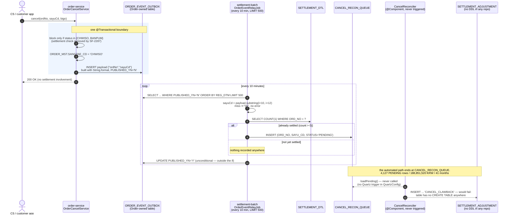

# Order ↔ Settlement Cancellation Contract

## Parties

- **Order (order-service)** — owner 주문팀, Spring Boot 2.3 / Java 8. Produces the cancellation signal. `OrderCancelService.cancel()` writes `ORDER_CANCEL`, flips `ORDER_MST.SANGTAE_CD` to `CHWISO`, and inside the same `@Transactional` boundary calls `OrderEventPublisher.publishOrderCancelled()`, which appends a row to `ORDER_EVENT_OUTBOX`. Order considers its obligation discharged at that insert → `order-service/src/main/java/kr/co/sellflow/order/service/OrderCancelService.java`, `order-service/src/main/java/kr/co/sellflow/order/event/OrderEventPublisher.java`
- **Settlement (settlement-batch)** — owner 정산팀, Spring Batch / Quartz. Consumes the outbox by polling, decides whether the cancelled order was already paid out, and — on paper — deducts the amount from the next month's payout. It also reads Order's `ORDER_MST`/`ORDER_DTL` to choose settlement targets and writes back into `ORDER_MST` → `settlement-batch/src/main/java/kr/co/sellflow/settlement/config/DailySettlementJobConfig.java`, `settlement-batch/src/main/java/kr/co/sellflow/settlement/tasklet/MarkSettledTasklet.java`
- **Third parties with a stake but no code** — 재무기획팀, assigned quarterly verification of the uncorrected balance by procedure v1.1 §3, and CS팀, who requested the change that created the contract → `sources/context/policy/정산_정정_업무절차_v1.1.md`, `sources/context/tickets/SF-2287.md`

There is no HTTP call in either direction between these two services. The entire contract is carried by four tables in one MySQL instance.

## Key Facts

- Order publishes `order.cancelled` into a database outbox rather than a broker; `V8__add_cancel_event_outbox.sql` says so in its header — "정산 배치의 릴레이 잡이 주기적으로 폴링한다. (별도 브로커 없음)" ("the settlement batch's relay job polls it periodically; no separate broker") → `order-service/src/main/resources/db/migration/V8__add_cancel_event_outbox.sql`
- The publisher explicitly disclaims delivery tracking: "구독 측 처리 결과는 본 서비스에서 추적하지 않는다" ("this service does not track the subscriber's processing result") → `order-service/src/main/java/kr/co/sellflow/order/event/OrderEventPublisher.java`
- The payload is built with `String.format("{\"ordNo\":\"%s\",\"sayuCd\":\"%s\"}", ...)` and carries only two fields — no amount, no timestamp, no event version, no partner id → `order-service/src/main/java/kr/co/sellflow/order/event/OrderEventPublisher.java`
- Settlement parses that payload back with `s.substring(i + 10, i + 12)` after an `indexOf("\"sayuCd\":\"")`, not with a JSON parser; the miss branch returns the literal `"00"`, so a whitespace change or a field rename on the producer side degrades silently into a valid-looking reason code rather than an error → `settlement-batch/src/main/java/kr/co/sellflow/settlement/relay/OrderEventRelayJob.java`
- `OrderEventRelayJob` is registered on a `SimpleScheduleBuilder` trigger of `withIntervalInMinutes(10).repeatForever()`, and its query is `LIMIT 500` per run — a hard ceiling of 500 events per 10 minutes, i.e. 72,000 a day → `settlement-batch/src/main/java/kr/co/sellflow/settlement/config/QuartzConfig.java`, `settlement-batch/src/main/java/kr/co/sellflow/settlement/relay/OrderEventRelayJob.java`
- The relay inserts into `CANCEL_RECON_QUEUE` **only if** `SELECT COUNT(1) FROM SETTLEMENT_DTL WHERE ORD_NO = ?` is greater than zero — a cancellation is only "interesting" if that order already has a settlement detail row at the moment of relay → `settlement-batch/src/main/java/kr/co/sellflow/settlement/relay/OrderEventRelayJob.java`
- The ack is unconditional and sits outside that `if`: every polled row is set `PUBLISHED_YN='Y'` whether or not it produced a queue entry. `'Y'` therefore means "the relay looked at it", not "it was delivered" or "it was queued", and the outbox cannot be replayed from its own state → `settlement-batch/src/main/java/kr/co/sellflow/settlement/relay/OrderEventRelayJob.java`
- Settlement reads Order's tables directly to pick settlement targets: `SELECT m.ORD_NO, d.PARTNER_ID, d.SANGPUM_CD, d.SURYANG, d.DANGA FROM ORDER_MST m JOIN ORDER_DTL d ON d.ORD_NO = m.ORD_NO WHERE m.SANGTAE_CD = 'BAESONG_WANRYO' AND DATE(m.UPD_DTM) = ?` → `settlement-batch/src/main/java/kr/co/sellflow/settlement/config/DailySettlementJobConfig.java`
- Settlement also writes Order's tables: `MarkSettledTasklet` runs `UPDATE ORDER_MST SET SANGTAE_CD='JUNGSAN_WANRYO', UPD_DTM=NOW()`, justified in its own javadoc as "ORDER_MST 는 주문팀 소유 테이블이나, 통합 DB 정책에 따라 정산 배치가 직접 갱신한다. (2019년 협의)" ("ORDER_MST is a table owned by the order team, but under the integrated-DB policy the settlement batch updates it directly — agreed in 2019") → `settlement-batch/src/main/java/kr/co/sellflow/settlement/tasklet/MarkSettledTasklet.java`
- This second coupling is undeclared: `services.yaml` calls itself "서비스·소유팀·저장소의 단일 기준" ("the single standard for services, owning teams and repositories"), lists `order-service` with `db: MySQL (order)` and `settlement-batch` with `db: MySQL (settlement)` as if they were separate stores, and has no dependency field at all — while `V1__settlement_schema.sql` states "sellflow_order 와 동일 인스턴스를 사용한다. (2019년 통합 결정)" ("it uses the same instance as sellflow_order — 2019 consolidation decision") → `sources/context/registry/services.yaml`, `settlement-batch/src/main/resources/db/migration/V1__settlement_schema.sql`
- The coupling has already caused one production incident. `V15__rename_bigo_to_memo.sql` renamed `ORDER_CANCEL.BIGO` to `MEMO` in January 2024; `V16__revert_rename_bigo.sql`, dated 2024-01-18, reverses it with the comment "V15 롤백. 정산 배치 쿼리가 BIGO 를 직접 참조하고 있어 장애." ("rollback of V15. A settlement batch query referenced BIGO directly and caused an incident") — an Order-team migration undone by a Settlement-team query neither the registry nor any design document records → `order-service/src/main/resources/db/migration/V15__rename_bigo_to_memo.sql`, `order-service/src/main/resources/db/migration/V16__revert_rename_bigo.sql`
- The coupling runs the other way at the schema level too: `V11__outbox_index.sql` in the **Order** repo carries the comment "아웃박스 릴레이 느려짐. 인덱스 추가 / 2024-05-16 정산팀 요청" ("outbox relay got slow; adding an index — requested by the settlement team, 2024-05-16"). Order's schema is tuned for Settlement's query plan → `order-service/src/main/resources/db/migration/V11__outbox_index.sql`
- The negotiated compensation was never built. `CancelReconciler` is a `@Component` with a working `reconcileCancellations()`, but `QuartzConfig` registers only `dailySettlementQuartzJob` and `orderEventRelayJob`; a grep for `CancelReconciler` and `reconcileCancellations` across all five repos returns only the class's own file — no trigger, no caller, no test → `settlement-batch/src/main/java/kr/co/sellflow/settlement/config/QuartzConfig.java`, `settlement-batch/src/main/java/kr/co/sellflow/settlement/recon/CancelReconciler.java`
- Even a registered trigger would fail on the reconciler's first statement: `INSERT INTO SETTLEMENT_ADJUSTMENT (ORD_NO, SAYU_CD, ADJ_TYPE) VALUES (?, ?, 'CANCEL_CLAWBACK')` targets a table with no `CREATE TABLE` anywhere in the five repos — a full-tree grep for `SETTLEMENT_ADJUSTMENT` returns exactly one hit, that INSERT → `settlement-batch/src/main/java/kr/co/sellflow/settlement/recon/CancelReconciler.java`, `settlement-batch/src/main/resources/db/migration/`
- The queue's own columns drifted from the code that would use them: `V1` defines `RECV_DTM` and `PROCESSED_DTM`, `V4__cancel_recon_queue_index.sql` indexes `(STATUS, REG_DT)` — a column `V1` never creates — and `V5__add_recon_processed_columns.sql` adds `PROCESSED_AT`/`PROCESSED_BY` with the comment "아직 쓰는 코드는 없다" ("there is no code that writes these yet"), while the reconciler sets `PROCESSED_DTM` → `settlement-batch/src/main/resources/db/migration/V1__settlement_schema.sql`, `.../V4__cancel_recon_queue_index.sql`, `.../V5__add_recon_processed_columns.sql`
- The measured consequence: 4,127 rows still `PENDING` across 41 consecutive months, 2023-04 through 2026-08, totalling 188,851,520 KRW → `sources/raw/exports/cancel_recon_queue_monthly_20260901.csv`
- No purge exists on the producer side either: no `DELETE FROM ORDER_EVENT_OUTBOX` appears in any of the five repos, so the outbox grows without bound (verified by full-tree grep for `ORDER_EVENT_OUTBOX`, which returns only the DDL, the two indexes, the entity, and the relay's SELECT/UPDATE) → `order-service/src/main/resources/db/migration/`, `settlement-batch/src/main/java/kr/co/sellflow/settlement/relay/OrderEventRelayJob.java`

## Agreement

### What was negotiated

The agreement was struck in the comments of a Jira ticket in April 2023, not in a design document. CS팀's 최은영 reported 214 enquiries in a single month from customers blocked by the settlement-state check — "정산 배치는 새벽 2시에 돌기 때문에 주문 다음날 오전이면 이미 차단됩니다" ("because the settlement batch runs at 2am, by the morning after the order it is already blocked").

박성민 (Order) agreed the block was easy to remove and asked the question the whole contract hangs on:

> "정산이 이미 나간 건에 대해 취소가 들어오면 그 돈은 어떻게 되나요? 파트너한테 이미 지급된 금액인데요."
> "If a cancellation arrives for an order that has already been paid out, what happens to that money? It's an amount already paid to the partner."

김도윤 (Settlement) answered with the compensation:

> "정산팀에서 수기로 정정 처리하겠습니다. 차월 정산에서 차감하는 방식으로 처리하면 됩니다. ... CS팀 통계 보니 실제 정산 후 취소로 이어지는 건은 월 10건 미만일 것으로 예상됩니다. 당분간은 수기로 충분합니다."
> "The settlement team will correct it manually. Deducting it from the next month's settlement is enough. ... Looking at the CS statistics, I expect fewer than 10 cases a month actually lead to a post-settlement cancellation. Manual handling is sufficient for now."

박성민 then offered the transport — "이벤트 하나 발행하겠습니다. `order.cancelled` 구독하시면 됩니다" ("I'll publish an event; just subscribe to `order.cancelled`") — and 김도윤 accepted it in five words: "네 컨슈머 붙여놓겠습니다" ("Yes, I'll attach a consumer"). The ticket resolved 2023-04-21 in `order-service 2.8.0` → `sources/context/tickets/SF-2287.md`

### What was written down afterwards

정산_정정_업무절차 v1.1 (revised 2024-02-19, approved by 재무본부장) codified the split ten months later:

| 구분 (party) | 책임 (responsibility) |
|---|---|
| 정산팀 | 정정 대상 확인, 차월 차감 반영, 파트너 통지 — identify correction targets, apply the next-month deduction, notify the partner |
| 주문팀 | 취소 이벤트 발행 — publish the cancellation event |
| 재무기획팀 | 분기 결산 시 미정정 잔액 확인 — verify the uncorrected balance at quarterly close |

§4 sets the procedure as: cancellation received → correction-pending registration (system) → settlement team review "월 1회 이상" ("at least once a month") → next-month reflection → partner notification and history record. §5 requires correction history to be kept in the settlement admin for five years → `sources/context/policy/정산_정정_업무절차_v1.1.md`

### What the contract does and does not promise

Promised: at-least-notification from Order into the outbox, and deduction by Settlement — human or machine, the ticket says human, the procedure does not say which.

Not promised, and worth stating because their absence is load-bearing: any acknowledgement back to Order; any ordering or exactly-once guarantee (the relay inserts without a uniqueness check); any amount in the payload — the queue's `EXPECTED_AMT`, which the finance export sums, has no defining migration in `settlement-batch` and no writer in either repo; any schema-change protocol for the tables each side reads in the other's territory; and any reversal of a payment already sent — the agreed remedy is offset, not recall.

## Current State

The producer half runs. The consumer half stops one step short of the point where money moves.

### The pivot

`CancelReconciler` was written in the same month as the relay and never wired up. Its own TODO is the single most precise statement of the gap in the whole corpus:

> "TODO Quartz 스케줄 등록 필요 (박성민님 확인 후 QuartzConfig 에 추가 예정) - 2023-04-24 김도윤"
> "TODO: Quartz schedule registration needed (to be added to QuartzConfig after 박성민 confirms) — 2023-04-24, 김도윤"

→ `settlement-batch/src/main/java/kr/co/sellflow/settlement/recon/CancelReconciler.java`

Three things about that comment matter. It is dated three days after SF-2287 resolved, so the gap was known before the ticket closed. It makes the remaining work conditional on a person in the *other* organisation confirming — which is why it is a contract problem and not a backlog problem. And the matching ticket SF-4512, created that same day, was still `To Do`, unassigned, priority `Low` in the 2026-S17 sprint export more than three years later.

Scheduling it today would still not move money. The first statement in the loop inserts into `SETTLEMENT_ADJUSTMENT`, and a grep for that identifier across order-service, settlement-batch, inventory-api, delivery-bff and settlement-anomaly returns exactly one line — the INSERT itself. No migration in `settlement-batch/src/main/resources/db/migration/` creates it. The reconciler would throw on its first pending row, and there is nothing downstream that would apply an adjustment to a payout even if the table existed.

### The drift, visible in the record and never closed

- **2023-06-02, Slack** — 이수민: "정정 배치 도는 건가요? 이번 달 정산에 차감 반영된 게 안 보여서요" ("Is the correction batch running? I don't see any deduction reflected in this month's settlement"). 김도윤: "아직입니다. 일단 문의 들어온 건만 수기로 보고 있습니다" ("Not yet; for now we only handle the cases that come in as enquiries") → `sources/raw/slack/settlement-dev_2023-04_2026-08.json`
- **2025-03, handover** — "전체 대기열을 주기적으로 확인하는 절차는 없음. 문의가 오면 그 건만 본다" ("there is no procedure for periodically checking the whole queue; when an enquiry comes in we look at that case only"), directly contradicting procedure v1.1 §4's monthly review → `sources/context/handover/2025-03_정산팀_인수인계.md`
- **2026-06-18, kickoff minutes** — 김도윤 asks "그럼 차감은 자동으로 들어가고 있는 거죠?" ("So the deduction is going in automatically, right?") and 박성민 answers "저희가 이벤트까지는 보내드리고, 그 뒤는 정산 쪽에서 보시는 걸로 알고 있습니다" ("We send the event, and after that I understand settlement handles it"). The minutes flag their own gap: "(이 부분 서로 인지가 다름. 확인 필요)" ("the two sides understand this differently; needs confirming") → `sources/context/minutes/2026-06-18_정산정정_자동화_킥오프.md`
- **2026-08-24, finance mail** — 문지영 (재무기획팀): "차감이 정상적으로 이루어지고 있다면 대기 잔액이 이 규모로 누적될 수 없습니다" ("if deductions were being made properly, the pending balance could not accumulate to this scale") → `sources/raw/mail/RE_정산_미정정_금액_문의.eml`
- **2026-09-01** — the export that measured it. `services.yaml`, last reviewed 2026-03-02, still records the queue's consumer as `TODO   # 확인 필요` ("needs checking") → `sources/context/registry/services.yaml`

### The measured balance

Extracted 2026-09-01 at 14:22 from `settlement_prod` (read replica) by 윤서진 (데이터팀) at the request of 문지영 (재무기획팀), with the query `SELECT DATE_FORMAT(RECV_DTM,'%Y-%m') AS ym, COUNT(*), SUM(EXPECTED_AMT) FROM CANCEL_RECON_QUEUE WHERE STATUS='PENDING' GROUP BY 1 ORDER BY 1`:

| Measure | Value |
|---|---|
| Rows in `STATUS='PENDING'` | 4,127 |
| Estimated uncorrected amount | 188,851,520 KRW |
| Months covered | 41, 2023-04 through 2026-08, with no zero month |
| Oldest month | 2023-04 — 48 rows, 2,196,480 KRW (the month SF-2287 shipped) |
| Most recent full month | 2026-08 — 162 rows, 7,413,120 KRW |

→ `sources/raw/exports/cancel_recon_queue_monthly_20260901.csv`, `sources/raw/exports/README.md`

Two caveats from the README are load-bearing and must travel with the figure. First, only `PENDING` rows were returned — "STATUS 가 PENDING 외의 값을 가진 행은 조회되지 않았다. 수기 정정분이 시스템 밖에서 처리되었다면 이 수치에 반영되지 않는다" ("rows with a STATUS other than PENDING were not returned. If manual corrections were handled outside the system, they are not reflected in these figures"). Second, and unconditionally:

> "이 폴더의 파일은 특정 시점에 운영 DB 에서 뽑은 것이다. **재추출 없이 그대로 인용하지 말 것.**"
> "The files in this folder were pulled from the production DB at a particular moment. **Do not cite them as-is without re-extracting.**"

→ `sources/raw/exports/README.md`

Re-extraction is itself not self-service: the README's method is `bin/export-queue.sh --table CANCEL_RECON_QUEUE --group-by month --env prod`, followed by "(스크립트 위치 TBD — 현재는 DBA 에게 요청)" ("script location TBD; for now request it from the DBA"). The measurement that governs a nine-figure balance is a DBA favour.

The volume assumption behind the agreement is also now falsified by its own data. 김도윤 sized the manual process at "월 10건 미만" ("fewer than 10 a month"); the export shows 48 in the first month and 148-163 a month through 2026. The 2026 automation plan still carries the 2023 number forward as present fact — "현행 처리량은 정산팀 확인 결과 **월 10건 내외**로 파악된다" ("current throughput is understood, per the settlement team's confirmation, to be around 10 cases a month") — so the remediation is being sized against a figure its own queue export contradicts by an order of magnitude → `sources/context/tickets/SF-2287.md`, `sources/raw/exports/cancel_recon_queue_monthly_20260901.csv`, `sources/context/plans/2026_정산정정_AI에이전트_자동화_기획.md`

## Impact Analysis

### If Order changes its schema

`MarkSettledTasklet`, `settlementTargetReader` and the relay all bind to Order-owned tables by literal SQL string. None of it is compiled against Order's entities, so a rename type-checks on both sides and fails at runtime, in a batch, at 02:00 KST. The V15/V16 pair is the worked precedent: a routine column-naming tidy-up on `ORDER_CANCEL` shipped and was reverted at most 18 days later — V15's comment records only `2024-01`, V16's `2024-01-18` — because a settlement query referenced `BIGO` directly. The revert comment is the only record anywhere that the dependency existed.

Today's exposure, by inspection: `ORDER_MST.ORD_NO`, `.SANGTAE_CD`, `.UPD_DTM`; `ORDER_DTL.ORD_NO`, `.PARTNER_ID`, `.SANGPUM_CD`, `.SURYANG`, `.DANGA`; `ORDER_EVENT_OUTBOX.EVENT_ID`, `.ORD_NO`, `.PAYLOAD`, `.PUBLISHED_YN`, `.EVENT_TYPE`, `.REG_DTM`. Also the *values*: `settlementTargetReader` filters on the literal `'BAESONG_WANRYO'` and `MarkSettledTasklet` writes the literal `'JUNGSAN_WANRYO'`, so a change to Order's `OrderStatus` enum members silently empties or corrupts the settlement run. Nothing in the registry would warn either team → `settlement-batch/src/main/java/kr/co/sellflow/settlement/config/DailySettlementJobConfig.java`, `order-service/src/main/resources/db/migration/V16__revert_rename_bigo.sql`

### If Order changes the payload shape

The producer builds the payload with `String.format` and the consumer reads it with `indexOf` plus a fixed `substring(i + 10, i + 12)`. Adding a field, pretty-printing, switching to a JSON library that emits `"sayuCd" : "..."` with spaces, or widening the reason code past two characters all produce the same outcome: the `indexOf` misses or the offsets slide, and `sayuCd()` returns `"00"` — a well-formed two-character string that inserts cleanly into `CANCEL_RECON_QUEUE.SAYU_CD VARCHAR(2)`. There is no exception, no log line, no dead-letter. The corruption is only detectable by someone reading the queue's reason-code distribution, and the only export ever taken groups by month alone → `order-service/src/main/java/kr/co/sellflow/order/event/OrderEventPublisher.java`, `settlement-batch/src/main/java/kr/co/sellflow/settlement/relay/OrderEventRelayJob.java`

### If cancellation volume rises past the relay's ceiling

`LIMIT 500` every 10 minutes caps throughput at 3,000/hour. Measured `order.cancelled` volume is far below that, so the ceiling is not currently binding — but the failure mode if it ever is, is a lag, not a loss: unprocessed rows keep `PUBLISHED_YN='N'` and are picked up `ORDER BY REG_DTM` on the next pass. The real hazard is the interaction with the settled-check below, because lag pushes the relay's read of `SETTLEMENT_DTL` later in wall-clock time. Note also that the relay shares a JVM with the daily settlement job — services.yaml records settlement-batch as "일 정산. 아웃박스 릴레이 잡 동거" ("daily settlement; the outbox relay job cohabits") — so relay latency and settlement-run latency are not independent → `settlement-batch/src/main/java/kr/co/sellflow/settlement/relay/OrderEventRelayJob.java`, `sources/context/registry/services.yaml`

### The ack-before-insert ordering defect

This drops events silently, and it is a property of the contract rather than a bug in either service.

The relay acks unconditionally. The insert is conditional on `SETTLEMENT_DTL` already containing the order *at the instant of the relay's poll*. So for any cancellation relayed in the window between the cancellation and that day's 02:00 settlement run, the relay finds `COUNT(1) = 0`, inserts nothing, and still sets `PUBLISHED_YN='Y'`. If the settlement run inserted the `SETTLEMENT_DTL` row hours later, no second pass would ever reconsider that event: the relay's `WHERE PUBLISHED_YN = 'N'` will never return it again.

Whether that drop costs money turns on `settlementTargetReader`, and the answer is no — but not for the reason its javadoc gives. The javadoc states an intent the SQL beneath it does not implement: "주문의 현재 상태나 취소 여부는 조건에 포함하지 않는다. 배송이 완료되었다면 파트너는 이행을 마친 것으로 본다" ("the order's current status and whether it was cancelled are not part of the condition; if delivery completed, the partner is considered to have fulfilled"). The SQL selects on `SANGTAE_CD = 'BAESONG_WANRYO' AND DATE(UPD_DTM) = ?`, and `OrderCancelService.cancel()` calls `OrderMst.chwiso()`, which sets `SANGTAE_CD` to `CHWISO` and `UPD_DTM` to now in the same write. Both predicates therefore fail for a cancelled order: it is not a settlement target on its delivery date's run, or on any other. Nothing anywhere sets the status back to `BAESONG_WANRYO`, so no order can be settled after it has been cancelled.

The exclusion is real but incidental — a side effect of the status write, not a rule. No line of the batch asks about cancellation, no join touches `ORDER_CANCEL`, and the behaviour would disappear the moment cancellation stopped overwriting `SANGTAE_CD` or stopped touching `UPD_DTM`. The same accident makes the dropped population harmless: an event acked with no queue row belongs to an order that will never be paid, so there is nothing to claw back. Two defects cancel, and neither was designed to.

So the 188,851,520 KRW is not understated by a hidden settled-and-cancelled population arriving through this window; that population does not exist in the code as written. What the figure turns on instead is narrower and measurable:

- **Coverage.** The export returned `STATUS='PENDING'` rows only, so rows moved to any other status — including by manual work outside the systems — are not in it → `sources/raw/exports/README.md`
- **Unit.** Every month's amount is the row count times exactly 45,760 KRW, a flat per-case estimate rather than a sum of amounts actually paid. The real number needs a `JOIN SETTLEMENT_DTL` on the queued `ORD_NO`s, which no available source performs → `sources/raw/exports/cancel_recon_queue_monthly_20260901.csv`
- **Staleness.** It is a point-in-time extraction the README forbids citing without re-extraction, and re-extraction runs through a DBA.

The residual hazard the corrected reading exposes points the other way, at underpayment rather than overpayment: because the reader keys on `DATE(UPD_DTM)` and `UPD_DTM` is a generic last-modified column, any write to `ORDER_MST` between delivery completion and the next 02:00 run moves a legitimately deliverable order off its settlement date. That exposure is not quantifiable from anything in these repos → `settlement-batch/src/main/java/kr/co/sellflow/settlement/relay/OrderEventRelayJob.java`, `settlement-batch/src/main/java/kr/co/sellflow/settlement/config/DailySettlementJobConfig.java`, `order-service/src/main/java/kr/co/sellflow/order/service/OrderCancelService.java`, `order-service/src/main/java/kr/co/sellflow/order/domain/OrderMst.java`

An `UPDATE ... SET SANGTAE_CD` in `settlementTargetReader`'s own date column compounds it: `MarkSettledTasklet` writes `UPD_DTM=NOW()`, which is the same column the reader filters on. Any re-run or re-processing therefore reads a different population than the first run did.

### If either side fixes their half alone

Registering `CancelReconciler` without creating `SETTLEMENT_ADJUSTMENT` throws on the first pending row, and — because the reconciler updates the queue row to `PROCESSED` only after the INSERT succeeds — leaves the queue unchanged, which is the safe direction but produces a batch that fails every cycle. Creating `SETTLEMENT_ADJUSTMENT` without a payout consumer produces 4,127 adjustment rows that nothing applies. Fixing the substring parser without coordinating the payload changes nothing until Order changes the payload. And nothing on either side addresses the dropped-ordering population above, because no component holds the state needed to detect it: Order does not track subscriber outcomes by its own javadoc, and Settlement's only record of an event is a row it chose not to write.

The one change that is safe for either side to make unilaterally is moving the `PUBLISHED_YN='Y'` update inside the settled branch — but that converts the drop into an unbounded retry against an outbox with no purge job, which is why it is a contract negotiation and not a one-line patch.

## Related

- [[SYS-ORDER]] — producer side of the contract
- [[SYS-SETTLEMENT]] — consumer side of the contract, and the owner of the unregistered reconciler
- [[PROC-ORDER-CANCEL]] — the flow that emits the event
- [[PROC-SETTLEMENT-CORRECTION]] — the flow that should consume it, with the full evidence chain
- [[DEC-ORDER-OUTBOX-RELAY]] — why there is a polling outbox rather than a broker
- [[DEC-SELLFLOW-SHARED-DB]] — the 2019 shared-instance decision that lets Settlement read and write Order's tables
- [[RISK-SETTLEMENT-RECON-BACKLOG]] — the measured financial exposure this contract's failure produces
- [[PROC-SELLFLOW-CANCEL-MONEY-PATH]] — the same boundary traced as one nine-hop chain, hop by hop with line numbers
