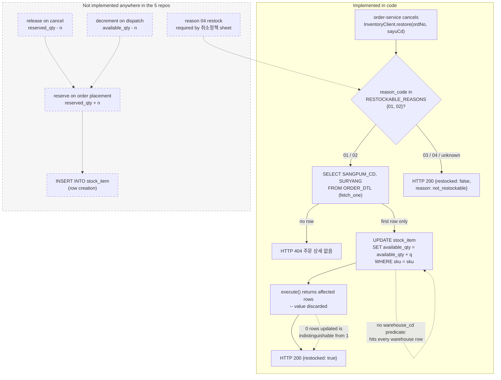

# stock_item Row Lifecycle

## Purpose

`stock_item` is the only table `inventory-api` owns, and a row in it is the system's entire model
of "how much of this SKU is in this warehouse". This artifact follows one such row: how it comes
into existence, what moves its two quantity columns, and — the larger part of the story — what
never touches them at all.

The short version is that a `stock_item` row has exactly one writer in the entire workspace.
`available_qty` is incremented by a single `UPDATE` inside the restock handler; `reserved_qty` is
declared, selected and returned, but never written by any code in any of the five repos. There is
no `INSERT` either, so the row's own birth happens outside everything visible here.

## Key Facts

- `stock_item` is created by `sql/V1__stock.sql` with five columns — `sku VARCHAR(30)`, `warehouse_cd VARCHAR(10)`, `available_qty INT NOT NULL DEFAULT 0`, `reserved_qty INT NOT NULL DEFAULT 0`, `updated_at DATETIME DEFAULT CURRENT_TIMESTAMP` — and `PRIMARY KEY (sku, warehouse_cd)` → inventory-api:sql/V1__stock.sql
- The table has no status, state or flag column of any kind, so a row's "lifecycle" is implicit in its quantities rather than modelled → inventory-api:sql/V1__stock.sql
- Exactly two SQL statements in the whole service mention `stock_item`, both in `app/main.py`: the restock `UPDATE` and the `GET /stock/{sku}` `SELECT` → inventory-api:app/main.py
- The only mutation is `UPDATE stock_item SET available_qty = available_qty + %(q)s WHERE sku = %(sku)s`, a relative increment with no `warehouse_cd` predicate even though `warehouse_cd` is half the primary key → inventory-api:app/main.py, inventory-api:sql/V1__stock.sql
- **Nothing writes `reserved_qty`.** Grepping all five repos (`order-service`, `settlement-batch`, `inventory-api`, `delivery-bff`, `settlement-anomaly`) for `reserved_qty` returns exactly three hits: the DDL that declares it, the `SELECT` in `GET /stock/{sku}` that returns it, and the README mapping table. There is no `UPDATE`, no reservation endpoint and no scheduler → inventory-api:sql/V1__stock.sql, inventory-api:app/main.py, inventory-api:README.md
- The same sweep for `INSERT INTO stock` and for any other `available_qty` writer returns nothing, so no code in the workspace ever creates a `stock_item` row either → inventory-api:app/main.py, inventory-api:sql/V1__stock.sql
- `execute()` in `app/db.py` returns `n`, the affected row count from `cur.execute`, and the restock handler discards it: the call is a bare `execute(...)` statement whose result is never bound → inventory-api:app/db.py, inventory-api:app/main.py
- Consequently a restock against a SKU with no `stock_item` row updates zero rows and still returns `{"restocked": True}` — the 404 earlier in the handler guards the *order* row, never the *stock* row → inventory-api:app/main.py
- `updated_at` carries `DEFAULT CURRENT_TIMESTAMP` but no `ON UPDATE CURRENT_TIMESTAMP`, so the one statement that changes `available_qty` leaves the timestamp at its original value → inventory-api:sql/V1__stock.sql, inventory-api:app/main.py
- `RESTOCKABLE_REASONS = {"01", "02"}` is declared twice with identical values: once in `app/main.py`, once in `app/config.py` → inventory-api:app/main.py, inventory-api:app/config.py
- `app/main.py`'s only intra-package import is `from app.db import fetch_one, execute`; it never imports `app.config`, so the `app/config.py` copy is dead → inventory-api:app/main.py, inventory-api:app/config.py
- The sole importer of the config copy is `tests/test_restore.py` (`from app.config import RESTOCKABLE_REASONS`), so the two tests assert against a constant the handler does not consult and would stay green if the live rule changed → inventory-api:tests/test_restore.py, inventory-api:app/config.py
- The 취소정책 sheet requires stock restoration for reason 04: the row reads `| 04 | 배송 실패 (주소불명·수취거부) | 파트너 | O | O | 물류팀 확인 후 처리 |` — "04, delivery failure (unknown address / refusal of receipt), partner bears the cost, stock restoration O, settlement deduction O, processed after logistics team confirmation" → sellflow-docs:context/business-rules.md
- The code excludes 04 from `RESTOCKABLE_REASONS`, and its only justifying comment concerns 03: "03(고객 변심)은 배송이 시작된 뒤 취소되는 경우가 많아 복원 대상이 아니다." — "03 (customer change of mind) is often cancelled after shipping has started, so it is not subject to restoration." Nothing anywhere argues about 04 → inventory-api:app/main.py, sellflow-docs:context/business-rules.md
- All four reason codes are defined authoritatively on the order side as `CancelReason` — `PARTNER_GWICHAEK("01")`, `SYSTEM_ORYU("02")`, `GOGAEK_BYEONSIM("03")`, `BAESONG_SILPAE("04")` — stored in `ORDER_CANCEL.CHWISO_SAYU_CD` and passed across the boundary as a bare string → order-service:src/main/java/kr/co/sellflow/order/domain/CancelReason.java
- The only warehouse code literal anywhere in the workspace is `DEFAULT 'GIMPO'` on `ORDER_DTL.CHANGGO_CD`, added by `V12__add_warehouse.sql` for the Yongin centre opening ("용인센터 오픈 대응" / "response to the Yongin centre opening"); the Yongin code itself appears nowhere → order-service:src/main/resources/db/migration/V12__add_warehouse.sql
- `app/models.py` declares `Stock(sku_cd, qty, updated_at)`, which matches no column in the table (`sku_cd` vs `sku`, a single `qty` vs `available_qty`/`reserved_qty`, no warehouse at all) and is imported by nothing → inventory-api:app/models.py, inventory-api:sql/V1__stock.sql
- Ownership of the row sits with 재고팀 (the Inventory Team, lead 정하늘, 5 people, under 데이터플랫폼본부), whose listed process is "재고 관리 · 재고 복원" ("inventory management · stock restoration") since the 2022 transfer → sellflow-docs:context/org-chart.md

## Fields

| Column | Type | Constraint | Written by | Read by |
|---|---|---|---|---|
| `sku` | `VARCHAR(30)` | PK part 1 | nothing in the workspace | restock `WHERE`, `GET /stock/{sku}` |
| `warehouse_cd` | `VARCHAR(10)` | PK part 2 | nothing in the workspace | **nothing** — no query names it |
| `available_qty` | `INT` | `NOT NULL DEFAULT 0` | the restock `UPDATE` only (increment) | `GET /stock/{sku}` |
| `reserved_qty` | `INT` | `NOT NULL DEFAULT 0` | **nothing** | `GET /stock/{sku}` |
| `updated_at` | `DATETIME` | `DEFAULT CURRENT_TIMESTAMP` | the database, at insert only | nothing |

Two of the five columns are write-dead and one is read-dead. `warehouse_cd` is load-bearing for
row identity — it is what makes the key composite — yet no statement in the service ever mentions
it, which is why a restock lands on every warehouse row for the SKU rather than one.

### The reserved_qty column has no reservation code

This is the central absence, so it is worth being precise about how it was checked. A
case-insensitive grep across `../sellflow/repos` for `reserved_qty`,
`reserve`, `reserv`, `INSERT INTO stock` and `available_qty` produced hits in exactly four places,
all of them in `inventory-api`: the `CREATE TABLE` in `sql/V1__stock.sql`, the `SELECT` and the
`UPDATE` in `app/main.py`, and the terminology table in `README.md`. `order-service`,
`settlement-batch`, `delivery-bff` and `settlement-anomaly` contain no reference to inventory
quantities at all.

So the column exists in three capacities — declared, defaulted to `0`, and returned in an API
response — and in no fourth one. There is no "reserve stock on order placement" step, no release
on cancellation, and no expiry sweep. Since nothing ever increments it, every row's `reserved_qty`
is whatever the unknown row-creation process put there, permanently. `GET /stock/{sku}` returns
that frozen number to any caller that asks, with no marking to say it is inert.

The README compounds this by mapping a single order-domain concept onto both columns —
"`SURYANG` → `available_qty` / `reserved_qty`" — which reads as though both participate in the
order flow. Only one does, and only in one direction.

## Relationships

| Related entity | Link | Nature |
|---|---|---|
| `ORDER_DTL` (order-service) | `SANGPUM_CD` = `sku` | Cross-database read, no FK. The restock handler selects from `ORDER_DTL` directly on the shared `sellflow_order` instance (`app/db.py` hardcodes `database="sellflow_order"`). |
| `ORDER_DTL.CHANGGO_CD` | would map to `warehouse_cd` | The column that could qualify the update by warehouse. The restock `SELECT` never asks for it. |
| `ORDER_CANCEL.CHWISO_SAYU_CD` | the reason code | Determines whether the quantity moves at all; arrives as a query-string or body string, never as a typed enum. |
| `RESTORE_LOG` | intended audit trail | Never written. See [[PROC-INVENTORY-RESTORE-LOG-LIFECYCLE]]. |

## Creation Path

There isn't one — not inside these repos.

`sql/V1__stock.sql` creates the *table*. No file in `inventory-api` inserts a *row*: there is no
seed SQL, no fixture, no admin endpoint, no CLI, and the Alembic chain (which is broken and
concerns only `RESTORE_LOG`) contains no `stock_item` operation. The restock handler assumes the
row already exists; its `UPDATE` is an increment, not an upsert.

That leaves the row's birth to something outside the workspace — a DBA script, a data load, or a
warehouse-management system that is not among the five repos. Because nothing here can create a
row, a SKU that has never been loaded cannot be brought into existence by any inventory operation;
it can only be restocked into zero rows. This is recorded in `known_unknowns` rather than guessed
at.

## States and Transitions

`stock_item` has no status column, so there is no state machine to draw and none is invented here.
What a row has instead is a set of quantity-mutation *paths*, of which exactly one is implemented.
The implicit lifecycle is:

1. **Absent** — no row for this `(sku, warehouse_cd)`. Reachable from outside only; restocks
   against this state silently do nothing.
2. **Live** — a row exists. `available_qty` and `reserved_qty` hold whatever the external creator
   set. This is the only observable state.
3. **Incremented** — `available_qty` has been raised one or more times by a restock. Not
   distinguishable from *Live* by any column: `updated_at` does not move, and no log row is
   written.

There is no deletion path, no archival path and no zero-out path in code.



## Worked Examples

### Enum: reason codes and what each does to a row

| Code | `CancelReason` constant | 사유 (reason) | 취소정책 sheet: 재고 복원 | Effect on `available_qty` in code |
|---|---|---|---|---|
| `01` | `PARTNER_GWICHAEK` | 파트너 귀책 (재고부족·출고지연) — partner fault (out of stock / late dispatch) | O | incremented |
| `02` | `SYSTEM_ORYU` | 시스템 오류 — system error | O | incremented |
| `03` | `GOGAEK_BYEONSIM` | 고객 변심 — customer change of mind | X (note: 배송 시작 후 취소 시 재고 복원 불가 — "cannot be restored once shipping has started") | unchanged |
| `04` | `BAESONG_SILPAE` | 배송 실패 (주소불명·수취거부) — delivery failure (unknown address / refusal of receipt) | **O** | **unchanged — conflict** |

The code applies 03's exclusion unconditionally, although the sheet makes it conditional on
shipping having started; the handler has no order status to test, so it cannot apply the condition
even if it wanted to.

### Enum: warehouse_cd

| Value | Where it is evidenced | Status |
|---|---|---|
| `GIMPO` | `DEFAULT 'GIMPO'` on `ORDER_DTL.CHANGGO_CD`, `V12__add_warehouse.sql` (order-service) | The only warehouse code literal in the workspace. It is an *order* default, never written to `stock_item`. |
| (Yongin) | The same migration's comment, "용인센터 오픈 대응" ("response to the Yongin centre opening"), dated 2024-09-02 and attributed "물류팀 요청 / 주문팀 반영" ("requested by the Logistics Team, applied by the Order Team") | The migration that exists *because of* a second warehouse introduces no code for it. |
| anything else | — | No lookup table, no enum, no seed, no CHECK constraint. `VARCHAR(10)` accepts any string. |

This is the honest state of the column: `warehouse_cd` is half the primary key of the inventory
table, and its value domain is defined nowhere.

### A realistic query — reading the row a restock actually hits

The handler's `SELECT` returns one arbitrary row. To see what the `UPDATE` really touches, ask for
all of them:

```sql
-- what GET /stock/{sku} returns (one arbitrary row, fetch_one)
SELECT sku, available_qty, reserved_qty
  FROM stock_item
 WHERE sku = 'SKU-1001';

-- what the restock UPDATE actually matches
SELECT sku, warehouse_cd, available_qty, reserved_qty, updated_at
  FROM stock_item
 WHERE sku = 'SKU-1001'
 ORDER BY warehouse_cd;

-- sku      | warehouse_cd | available_qty | reserved_qty | updated_at
-- SKU-1001 | GIMPO        |            40 |            3 | 2024-11-02 03:11:07
-- SKU-1001 | YONGIN       |            12 |            0 | 2025-01-18 22:40:55
```

`reserved_qty = 3` on the first row is not a live hold. Nothing in the workspace can have written
it and nothing will ever clear it; it is a number the row was born with.

### Restock of reason 01 against a two-warehouse SKU

`POST /stock/restock` with `{"ord_no": "2026090100123", "reason_code": "01"}`. `01` passes the
gate; `fetch_one` returns `SANGPUM_CD='SKU-1001'`, `SURYANG=2`; the statement
`UPDATE stock_item SET available_qty = available_qty + 2 WHERE sku = 'SKU-1001'` matches **both**
rows above. `available_qty` becomes 42 and 14 — four units restored for a two-unit cancellation —
and `updated_at` on both rows stays where it was, because the column has no `ON UPDATE` clause.
The response is `{"restocked": true}`.

### Restock against an unknown SKU — success on zero rows

Same request, but `ORDER_DTL` names `SANGPUM_CD='SKU-9999'`, for which no `stock_item` row has
ever been loaded. The 404 branch does not fire: it tests `if not items`, the *order* rows, which
do exist. The `UPDATE` runs, matches nothing, commits nothing. `app/db.py`'s `execute` computes
`n = cur.execute(sql, params)` and returns it; `app/main.py` calls `execute(...)` as a bare
statement and never reads the return value. The handler then logs
"재고 복원 완료. ord_no=%s" ("stock restoration complete") and returns `{"restocked": true}`.

Caller, log line and response are all identical to the successful case. The one signal that would
have distinguished them — the affected row count — was computed and thrown away.

### Reason 04 — the sheet and the code disagree

`{"ord_no": "...", "reason_code": "04"}`. `04` is not in `{"01", "02"}`, so the handler logs
"복원 대상 아님" ("not subject to restoration") and returns HTTP 200 with
`{"restocked": false, "reason": "not_restockable"}`. No quantity moves. The 취소정책 sheet says one
should: 재고 복원 `O`, with 비고 "물류팀 확인 후 처리" ("processed after logistics team
confirmation"). Physically these are goods that came back — refused at the door or undeliverable —
and the sheet also assigns the cost to the partner (비용 부담 주체: 파트너) and requires a
settlement deduction. `InventoryClient.restore` returns `void` and discards the response body, so
order-service never learns the restock was declined.

## Agent Guidance

- **Never read `reserved_qty` as a live figure.** It is returned by `GET /stock/{sku}` and written
  by nothing. Treat any non-zero value as historical residue of unknown provenance, and say so
  when reporting it.
- **`available_qty` is not a stock level in the usual sense.** Within this workspace it only ever
  goes up, and only on cancellation. Whatever decrements it at dispatch is not here.
- **A `{"restocked": true}` response proves nothing about the database.** It is returned when one
  row changed, when several changed, and when none did. To verify a restock, query `stock_item`
  directly for all warehouse rows of the SKU — and note that `updated_at` will not corroborate the
  change.
- **Read `app/main.py` for the live rule, not `app/config.py` and not the tests.** The test suite
  asserts against the dead copy, so a green suite says nothing about the rule the handler applies.
- **When asked whether reason 04 restocks stock, answer both sides.** The sheet says it must; the
  code does not. Do not resolve the conflict silently in either direction — see
  [[RISK-INVENTORY]].
- **Do not assume per-warehouse accuracy.** Every quantity statement in this service is
  SKU-scoped against a warehouse-scoped table.

## Related

- [[API-INVENTORY]] — the two mounted endpoints that read and write the row
- [[CON-ORDER-INVENTORY]] — the order ↔ inventory boundary the restock crosses
- [[GLOSSARY-INVENTORY]] — `sku`, `available_qty`, `reserved_qty`, 재고 복원
- [[PROC-INVENTORY-RESTOCK]] — the restock request flow, step by step
- [[PROC-INVENTORY-RESTORE-LOG-LIFECYCLE]] — the audit table that would have recorded these mutations
- [[RISK-INVENTORY]] — the rule conflict, the duplicated constant, the discarded row count
- [[SCH-INVENTORY]] — the DDL and the ER diagram
- [[SYS-INVENTORY]] — the owning service and team
- [[SYS-ORDER]] — the cancelling system that triggers the only mutation
