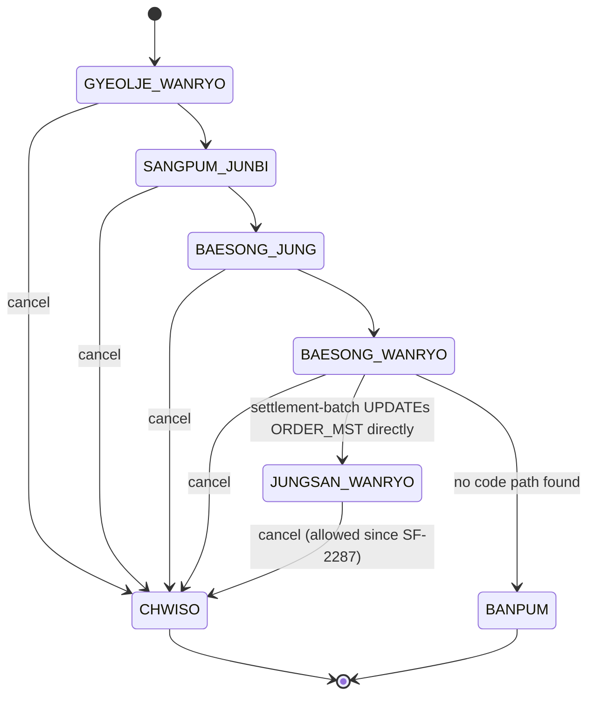

# Order Cancellation Lifecycle

## Purpose

To record what happens when `POST /orders/{ordNo}/cancel` is called — and, more usefully, what does not happen. The cancel path is the only write path in order-service, it was rewritten in 2023 by SF-2287, and three of the side effects a reader would reasonably expect (inventory restore, payment cancellation, status history) are not wired up.

## Key Facts

- Cancellation is blocked only for orders already in `CHWISO` or `BANPUM`; the blocking set is `EnumSet.of(OrderStatus.CHWISO, OrderStatus.BANPUM)` → src/main/java/kr/co/sellflow/order/service/OrderCancelService.java
- Every other status, including `JUNGSAN_WANRYO` (settled), is cancellable — the guard's javadoc says "이미 취소되었거나 반품 프로세스로 넘어간 주문만 차단한다" ("it blocks only orders already cancelled or moved into the return process") → src/main/java/kr/co/sellflow/order/service/OrderCancelService.java
- This inverts the documented policy: the Confluence page states 정산완료 (settled) is 취소 가능 "X" ("cancellable: no") and that the API returns 409 Conflict for such orders → sources/raw/confluence-snapshots/주문-취소-정책_48213.html
- The change was requested by SF-2287 after 214 CS enquiries in one month, and the ticket's change log lists "OrderCancelService.java — 정산 상태 확인 로직 제거" ("removed the settlement-status check") → sources/context/tickets/SF-2287.md
- `CancelReason.of(sayuCd)` throws `IllegalArgumentException("알 수 없는 취소 사유 코드: " + code)` for anything outside 01–04, and no handler catches it → src/main/java/kr/co/sellflow/order/domain/CancelReason.java
- The whole flow is one `@Transactional` method, so the `ORDER_CANCEL` insert, the `ORDER_MST` update and the outbox insert commit or roll back together → src/main/java/kr/co/sellflow/order/service/OrderCancelService.java
- `OrderCancel`'s constructor hardcodes `CHORI_SANGTAE = "COMPLETED"` and stamps `CHWISO_ILSI` from `LocalDateTime.now()` → src/main/java/kr/co/sellflow/order/domain/OrderCancel.java
- `OrderMst.chwiso()` sets `SANGTAE_CD = CHWISO` and `UPD_DTM = now()`, with no transition validation → src/main/java/kr/co/sellflow/order/domain/OrderMst.java
- `OrderEventPublisher.publishOrderCancelled` inserts one `order.cancelled` row into `ORDER_EVENT_OUTBOX` with a `String.format`-built JSON payload → src/main/java/kr/co/sellflow/order/event/OrderEventPublisher.java
- **`InventoryClient` has no caller anywhere in the repository.** `grep -rn InventoryClient src/` returns exactly one line, the class declaration itself, despite its javadoc "재고 API 연동. 취소 시 복원 요청을 보낸다." ("inventory API integration; sends a restore request on cancellation") → src/main/java/kr/co/sellflow/order/client/InventoryClient.java
- **`PaymentClient.cancel` has no caller either.** `grep -rn PaymentClient src/` returns only the class declaration and its own logger field; `OrderCancelService` does not import it → src/main/java/kr/co/sellflow/order/payment/PaymentClient.java
- No `ORDER_STATUS_HIST` row is written by the cancel flow, although the table exists: V1 creates it and `OrderStatusHistory` maps all five columns, but `OrderStatusHistoryRepository` has no caller in the repository → src/main/java/kr/co/sellflow/order/domain/OrderStatusHistory.java, src/main/resources/db/migration/V1__init.sql
- `JUNGSAN_WANRYO` is written directly into `ORDER_MST` by settlement-batch's `MarkSettledTasklet`, bypassing `OrderStatusService` and therefore the history table → settlement-batch:src/main/java/kr/co/sellflow/settlement/tasklet/MarkSettledTasklet.java
- The success log line reports `prevStatus=` using `order.getSangtaeCd()` after `order.chwiso()` has already mutated it, so it always prints the post-state, `CHWISO` → src/main/java/kr/co/sellflow/order/service/OrderCancelService.java
- The business-rules sheet 취소정책 states restock differs by reason (01/02/04 = O, 03 = X), but the reason code is never read for any decision in code → sources/context/business-rules.xlsx
- The spreadsheet also records the settlement rule: "정산 실행 후 취소" → "정산팀이 차월 정산에서 수기 차감" ("cancellation after settlement runs → the settlement team manually deducts it from the following month's settlement") → sources/context/business-rules.xlsx

## States

`OrderStatus` defines seven values. Labels are the enum's own Korean strings, quoted verbatim.

| Value | Label | Written by | Notes |
|---|---|---|---|
| `GYEOLJE_WANRYO` | 결제완료 (payment complete) | not written in this repo | The Confluence page marks it immediately cancellable with full refund. |
| `SANGPUM_JUNBI` | 상품준비중 (preparing goods) | not written in this repo | Same — cancellable, full refund. |
| `BAESONG_JUNG` | 배송중 (in delivery) | not written in this repo | Page marks it △, "물류팀 확인 필요" ("logistics team confirmation required"). Code applies no such condition. |
| `BAESONG_WANRYO` | 배송완료 (delivery complete) | not written in this repo | Page says it converts to the return process. Code cancels it outright. |
| `JUNGSAN_WANRYO` | 정산완료 (settlement complete) | **settlement-batch only** | Enum javadoc: "이 상태는 정산팀 배치가 설정하며 주문팀에서 직접 변경하지 않는다" ("this status is set by the settlement team's batch and is not changed directly by the order team"). |
| `CHWISO` | 취소 (cancelled) | `OrderMst.chwiso()` | Terminal for this flow. Blocks further cancellation. |
| `BANPUM` | 반품 (returned) | not written in this repo | Blocks cancellation. No code path sets it. |

Two observations follow. First, `OrderStatus`'s javadoc says "상태 전이는 OrderStatusValidator 참고" ("for state transitions, see OrderStatusValidator") — that class does not exist in the repository. Second, `OrderStatusService.change()` is the only general-purpose transition method: it loads the order, calls `OrderMst.byeongyeong(to)` and saves, applies no guard of any kind, and has no production caller — it is exercised only by its own unit test.



Transitions into the first four states are drawn from the enum's own ordering and the Confluence page's table; no code in this repository performs them.

## Steps

Statement by statement, as the method reads. Other artifacts count this same path at a coarser grain — five state-touching steps in [[PROC-ORDER-ERROR-HANDLING]], four persistence steps in [[DEC-INVENTORY-RESTOCK-BY-REASON]] — and nine hops end to end across services in [[PROC-SELLFLOW-CANCEL-MONEY-PATH]].

1. **Load the order.** `orderMstRepository.findById(ordNo)` or throw `OrderNotFoundException` → 404.
2. **Check the blocking set.** If `SANGTAE_CD` is `CHWISO` or `BANPUM`, throw `OrderCancelNotAllowedException` → 409. Nothing else is checked: not the delivery state, not the settlement state, not the elapsed time.
3. **Resolve the reason.** `CancelReason.of(sayuCd)` — a linear scan of the enum. An unknown code throws `IllegalArgumentException`, which `GlobalExceptionHandler` does not map, so it escapes as a 500.
4. **Persist the cancellation.** `orderCancelRepository.save(new OrderCancel(ordNo, sayu, bigo))`. `CHORI_SANGTAE` is always `"COMPLETED"`, written before any downstream work is attempted.
5. **Mutate the order.** `order.chwiso()` then `orderMstRepository.save(order)`.
6. **Publish the event.** `eventPublisher.publishOrderCancelled(ordNo, sayu.getCode())` inserts into `ORDER_EVENT_OUTBOX` with `PUBLISHED_YN = 'N'`. See [[DEC-ORDER-OUTBOX-RELAY]].
7. **Log.** `log.info("주문 취소 완료. ordNo={}, sayu={}, prevStatus={}", ordNo, sayu.getCode(), order.getSangtaeCd())`.

Steps that are not in the list, and the evidence that they are absent:

| Expected step | Component that exists | Caller found by grep |
|---|---|---|
| Restore inventory | `InventoryClient.restore(ordNo, sayuCd)` | none — only the class declaration matches |
| Cancel the payment | `PaymentClient.cancel(ordNo, amount)` | none — only the declaration and its logger match |
| Record the status change | `OrderStatusHistoryRepository` | none — the table exists (V1), nothing writes it |
| Validate the transition | `OrderStatusService.change` | none in `src/main`; one unit test. It also validates nothing |

## Worked Examples

**1. Cancelling a settled order — the SF-2287 case.**

Order `ORD20230411002` is in `JUNGSAN_WANRYO`; settlement-batch paid the partner at 02:00. CS calls the cancel endpoint with `sayuCd = "03"`.

- The guard passes: `JUNGSAN_WANRYO` is not in `CHWISO_BULGA`.
- `ORDER_CANCEL` gets a row with `CHORI_SANGTAE = 'COMPLETED'`.
- `ORDER_MST.SANGTAE_CD` becomes `CHWISO`, overwriting `JUNGSAN_WANRYO`. The settlement fact is now invisible on the order row; `SETTLEMENT_DTL` remains the record, as `V14__add_settlement_ref.sql` warns.
- One outbox row is written. Up to ten minutes later, settlement-batch's relay picks it up, finds the order in `SETTLEMENT_DTL`, and inserts into `CANCEL_RECON_QUEUE` with status `PENDING`.
- From there the process is manual. 김도윤 (정산팀) committed to exactly this in SF-2287: "정산팀에서 수기로 정정 처리하겠습니다. 차월 정산에서 차감하는 방식으로 처리하면 됩니다." ("the settlement team will handle the correction manually; deducting it from the following month's settlement works"), estimating "월 10건 미만" ("fewer than ten cases a month").
- Money already paid to the partner is not recovered by any code. `PaymentClient`'s javadoc makes the same point independently: "PG 취소가 성공해도 파트너에게 이미 지급된 정산 금액은 되돌아오지 않는다" ("even if the PG cancellation succeeds, settlement money already paid to the partner does not come back").

**2. The log line that can never tell you what you want.**

```java
order.chwiso();                       // SANGTAE_CD is now CHWISO
orderMstRepository.save(order);
eventPublisher.publishOrderCancelled(ordNo, sayu.getCode());
log.info("주문 취소 완료. ordNo={}, sayu={}, prevStatus={}",
         ordNo, sayu.getCode(), order.getSangtaeCd());
```

`order.getSangtaeCd()` is evaluated after the mutation, so `prevStatus` reads `CHWISO` on every cancellation. Any attempt to answer "how many settled orders were cancelled last month" from application logs will find zero — and since no `ORDER_STATUS_HIST` row is written either, the pre-cancel status of an order is not recoverable from this service at all. The only surviving trace is whether the relay found a `SETTLEMENT_DTL` row, which lives in the settlement side.

**3. A reason code that changes nothing.**

`sayuCd = "01"` (파트너 귀책 / partner's fault) and `sayuCd = "03"` (고객 변심 / customer changed their mind) follow identical code paths. The business-rules sheet assigns them different cost bearers (파트너 versus 셀플로우) and different restock behaviour (O versus X), and the Confluence page limits 03 to "배송 시작 전만 가능" ("possible only before delivery starts"). None of these distinctions appear in code; `CancelReason`'s own javadoc is candid about why: "사유별 비용 부담 주체는 코드에 정의하지 않는다. 정산 정책은 재무본부 소관이며 별도 기준표를 따른다." ("the cost bearer per reason is not defined in code; settlement policy belongs to the finance division and follows a separate reference table"). The code stores the code and forwards it; interpretation happens elsewhere, or not at all.

## Related

- [[SYS-ORDER]] — the owning service
- [[API-ORDER]] — the endpoint that triggers this flow
- [[SCH-ORDER]] — the rows this flow writes
- [[DEC-ORDER-OUTBOX-RELAY]] — the event mechanism in step 6
- [[GLOSSARY-ORDER]] — reason codes and status vocabulary
- [[PROC-SELLFLOW-CANCEL-MONEY-PATH]] — what happens to the money after step 6, traced to the end
