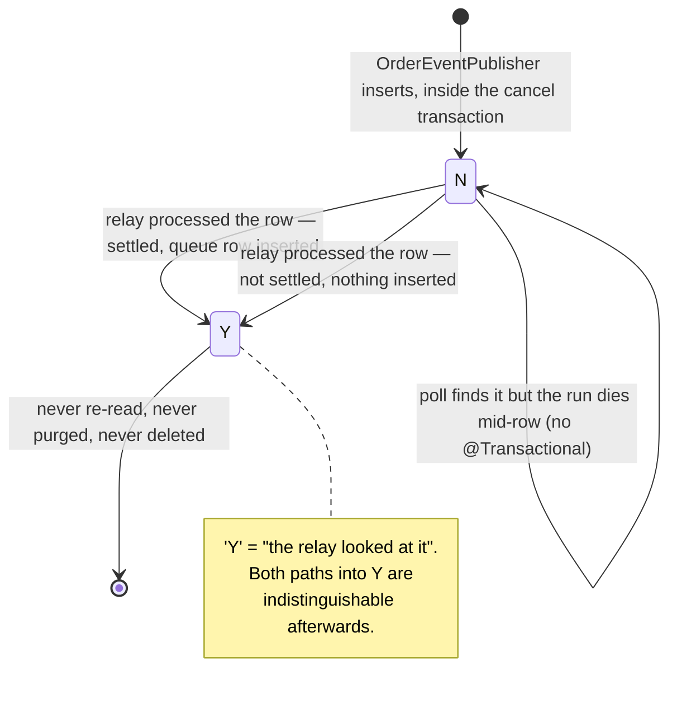

# ORDER_EVENT_OUTBOX Row Lifecycle

## Purpose

To follow one outbox row from `OrderEventPublisher.publishOrderCancelled` to `PUBLISHED_YN='Y'`, across a repository boundary, a team boundary and a deployment boundary, with no message broker anywhere in between.

The row exists because of one exchange in SF-2287. 박성민 (주문팀): "그럼 취소 발생 시 정산팀에 알림이 가야 할 것 같은데요. 이벤트 하나 발행하겠습니다. `order.cancelled` 구독하시면 됩니다." ("then a notification should go to the settlement team when a cancellation happens — I'll publish an event; subscribe to `order.cancelled`"). 김도윤 (정산팀): "네 컨슈머 붙여놓겠습니다." ("sure, I'll attach a consumer"). What got built is a table, a ten-minute poll and ten characters of string matching.

The single most important thing to understand about the row: **`PUBLISHED_YN='Y'` means the relay read it. It does not mean settlement did anything.**

## Key Facts

- The table is created by V8, whose comment is dated 2023-04-18 and signed 박성민, explicitly for SF-2287 (the migration comment dates in this repository are non-monotonic and are not a reliable chronology — see [[SCH-ORDER-MIGRATION-HISTORY]]), and the migration states the transport up front: "정산 배치의 릴레이 잡이 주기적으로 폴링한다. (별도 브로커 없음)" ("the settlement batch's relay job polls it periodically; no separate broker") → src/main/resources/db/migration/V8__add_cancel_event_outbox.sql
- There is no message broker anywhere in 셀플로우 — no Kafka, RabbitMQ, SQS or Celery dependency in any of the five repositories → sources/infra/settlement/queues.md
- The only producer is `OrderEventPublisher.publishOrderCancelled`, and the only `EVENT_TYPE` ever written is the constant `EVT_ORDER_CANCELLED = "order.cancelled"` → src/main/java/kr/co/sellflow/order/event/OrderEventPublisher.java
- The publisher is called once, from `OrderCancelService.cancel`, inside that method's `@Transactional` boundary — so the outbox row, the `ORDER_CANCEL` insert and the `ORDER_MST` update commit or roll back together → src/main/java/kr/co/sellflow/order/service/OrderCancelService.java
- The payload is built by `String.format("{\"ordNo\":\"%s\",\"sayuCd\":\"%s\"}", ordNo, sayuCd)` — no serialiser, no escaping, no schema → src/main/java/kr/co/sellflow/order/event/OrderEventPublisher.java
- **It is read back by a substring, not a parser**: `int i = s.indexOf("\"sayuCd\":\"")` then `return i < 0 ? "00" : s.substring(i + 10, i + 12)` → settlement-batch:src/main/java/kr/co/sellflow/settlement/relay/OrderEventRelayJob.java
- `"00"` is not a member of `CancelReason` (which defines only `01`–`04`), so the fallback writes a reason code into `CANCEL_RECON_QUEUE.SAYU_CD` that maps to nothing — and does so silently, with no log line, no metric and no error column → src/main/java/kr/co/sellflow/order/domain/CancelReason.java, settlement-batch:src/main/java/kr/co/sellflow/settlement/relay/OrderEventRelayJob.java
- The fixed offset `+10`/`+12` also assumes the code is exactly two characters at a fixed position; a reason vocabulary that grew to three characters would be silently truncated rather than rejected → settlement-batch:src/main/java/kr/co/sellflow/settlement/relay/OrderEventRelayJob.java
- `PUBLISHED_YN` defaults to `'N'` twice over — a `DEFAULT 'N'` in the DDL and a field initializer in the entity — and `REG_DTM` likewise carries both a `CURRENT_TIMESTAMP` default and a `LocalDateTime.now()` initializer, so the stored timestamp is the application JVM's clock, not the database's → src/main/resources/db/migration/V8__add_cancel_event_outbox.sql, src/main/java/kr/co/sellflow/order/event/OrderEventOutbox.java
- The relay polls `WHERE PUBLISHED_YN = 'N' AND EVENT_TYPE = ? ORDER BY REG_DTM LIMIT 500`, every 10 minutes, forever (`SimpleScheduleBuilder.simpleSchedule().withIntervalInMinutes(10).repeatForever()`) → settlement-batch:src/main/java/kr/co/sellflow/settlement/relay/OrderEventRelayJob.java, settlement-batch:src/main/java/kr/co/sellflow/settlement/config/QuartzConfig.java
- **500 rows per 10 minutes is a hard ceiling of ~3,000 events/hour, ~72,000/day**, and it applies to all `order.cancelled` events, not only the settled ones that produce queue rows → sources/infra/settlement/queues.md
- For each row the relay runs `SELECT COUNT(1) FROM SETTLEMENT_DTL WHERE ORD_NO = ?` and inserts into `CANCEL_RECON_QUEUE` **only if the count is > 0**; the other rows produce no downstream artefact at all → settlement-batch:src/main/java/kr/co/sellflow/settlement/relay/OrderEventRelayJob.java
- **`UPDATE ORDER_EVENT_OUTBOX SET PUBLISHED_YN='Y'` runs outside that `if`** — every examined row is flagged whether or not anything was inserted → settlement-batch:src/main/java/kr/co/sellflow/settlement/relay/OrderEventRelayJob.java
- `executeInternal` carries no `@Transactional` and issues three separate `JdbcTemplate` calls per row, so the insert and the flag are not atomic; a failure between them leaves the row `'N'` and it will be processed again, with no uniqueness constraint on `CANCEL_RECON_QUEUE` to absorb the duplicate → settlement-batch:src/main/java/kr/co/sellflow/settlement/relay/OrderEventRelayJob.java, settlement-batch:src/main/resources/db/migration/V1__settlement_schema.sql
- Two indexes support the poll: `IX_ORDER_EVENT_OUTBOX_01 (PUBLISHED_YN, REG_DTM)` from V8, and `IX_ORDER_EVENT_OUTBOX_02 (EVENT_TYPE, PUBLISHED_YN)` added in V11, comment dated 2024-05-16 "아웃박스 릴레이 느려짐. 인덱스 추가 / 2024-05-16 정산팀 요청" ("the outbox relay got slow; adding an index — requested by the settlement team") → src/main/resources/db/migration/V11__outbox_index.sql
- order-service does not track what happens next, and says so: "구독 측 처리 결과는 본 서비스에서 추적하지 않는다" ("this service does not track the subscriber's processing result") → src/main/java/kr/co/sellflow/order/event/OrderEventPublisher.java
- The relay runs on the same clustered Quartz scheduler as the daily settlement job (`job-store-type: jdbc`, `org.quartz.jobStore.isClustered: true`) — the scheduler whose clustering configuration was applied to only one node in the 2025-07-12 P2 incident → settlement-batch:src/main/resources/application.yml, sources/context/runbooks/장애회고_2025-07-12_정산배치_중복실행.md
- The row's downstream terminus, `CANCEL_RECON_QUEUE`, has no consumer: `CancelReconciler` was never registered in `QuartzConfig` and 4,127 rows / 188,851,520 KRW have accumulated since 2023-04 → settlement-batch:src/main/java/kr/co/sellflow/settlement/recon/CancelReconciler.java, and see [[RISK-SETTLEMENT-RECON-BACKLOG]]

## Fields

| Column | Type | Origin | Written by | Value |
|---|---|---|---|---|
| `EVENT_ID` | BIGINT AUTO_INCREMENT | V8 | database | PK; also the relay's update key |
| `EVENT_TYPE` | VARCHAR(50) NOT NULL | V8 | `OrderEventPublisher` | always `order.cancelled` |
| `ORD_NO` | VARCHAR(20) NOT NULL | V8 | `OrderEventPublisher` | the cancelled order; duplicated inside `PAYLOAD` |
| `PAYLOAD` | TEXT NOT NULL | V8 | `OrderEventPublisher` | `{"ordNo":"...","sayuCd":".."}`, `String.format`-built |
| `PUBLISHED_YN` | CHAR(1) DEFAULT 'N' | V8 | publisher (`'N'`), relay (`'Y'`) | **`'Y'` = the relay read it, not that settlement acted** |
| `REG_DTM` | DATETIME DEFAULT CURRENT_TIMESTAMP | V8 | entity field initializer | application JVM clock; the poll's `ORDER BY` key |

No retry counter, no attempt count, no error column, no dead-letter target, no correlation id beyond `ORD_NO`, and no `PROCESSED_DTM`. The row's entire observable history is one flag.

## Relationships

- `ORDER_MST` 1 : 0..n `ORDER_EVENT_OUTBOX` on `ORD_NO`, no foreign key. In practice 0..1 per order, because a second cancellation of the same order is rejected by the `CHWISO_BULGA` guard before it reaches the publisher.
- Written in the same transaction as the `ORDER_CANCEL` row, but with no key or column linking the two beyond `ORD_NO`.
- Read by exactly one thing: settlement-batch's `OrderEventRelayJob`. The registry agrees — `producer: order-service`, `consumer: settlement-batch (OrderEventRelayJob)` → sources/context/registry/services.yaml
- Produces at most one `CANCEL_RECON_QUEUE` row, and only for orders already present in `SETTLEMENT_DTL`. There is no back-reference: the queue row stores `ORD_NO` and `SAYU_CD`, never `EVENT_ID`, so a queue row cannot be traced to the outbox row that created it.

## Creation Path

```
OrderCancelService.cancel(ordNo, sayuCd, bigo)         @Transactional
   ├─ ORDER_CANCEL insert      (CHORI_SANGTAE='COMPLETED')
   ├─ ORDER_MST   update       (SANGTAE_CD='CHWISO')
   └─ OrderEventPublisher.publishOrderCancelled(ordNo, sayu.getCode())
          payload = String.format("{\"ordNo\":\"%s\",\"sayuCd\":\"%s\"}", ordNo, sayuCd)
          outboxRepository.save(new OrderEventOutbox("order.cancelled", ordNo, payload))
                                → PUBLISHED_YN='N', REG_DTM=now()
```

`publishOrderCancelled` carries its own `@Transactional`, which joins the caller's transaction rather than starting a new one — so the row is not visible to the relay until the cancel commits. That is the outbox pattern working as intended, and it is the one part of this mechanism that is structurally sound: there is no window in which settlement can see a cancellation that later rolled back.

The value passed as `sayuCd` has already survived `CancelReason.of()`, so the payload's reason is always a valid two-character code from `01`–`04`. The parser's `"00"` fallback therefore cannot be triggered by user input today; it can only be triggered by a change to the payload's shape.

## States and Transitions



Two observations follow from the diagram.

First, the two edges into `Y` are the whole problem. Given a row with `PUBLISHED_YN='Y'`, nothing in `ORDER_EVENT_OUTBOX` records which branch it took. Reconstructing that requires joining `SETTLEMENT_DTL` and `CANCEL_RECON_QUEUE` on `ORD_NO` after the fact — and the second of those joins is ambiguous because there is no `EVENT_ID` on the queue row.

Second, the self-loop is real, not theoretical. The three statements per row are `SELECT COUNT(1)`, `INSERT`, `UPDATE`, with nothing binding them. The Quartz job has no transaction manager attached. If the process dies after the insert and before the update, the next poll ten minutes later sees the same `'N'` row, finds the same `SETTLEMENT_DTL` match, and inserts a second `CANCEL_RECON_QUEUE` row: `CREATE TABLE CANCEL_RECON_QUEUE` has `SEQ` auto-increment as its only key and no unique constraint on `ORD_NO` → settlement-batch:src/main/resources/db/migration/V1__settlement_schema.sql

The 2025-07-12 postmortem makes this less hypothetical than it sounds. Its root cause was "배치 서버 이중화 작업 중 Quartz 클러스터 설정이 한쪽에만 반영됨" ("during batch-server duplication work, the Quartz cluster setting was applied to only one side"), and two scheduler instances triggered the same job at 02:04. The relay runs on that same scheduler. The postmortem documents only the duplicate partner payment requests and never mentions the outbox — recorded in `known_unknowns`, not asserted here.

## Worked Examples

**1. One row, end to end, for a settled order.**

`ORD20230411002` is in `JUNGSAN_WANRYO`; CS cancels it with `sayuCd="03"` at 14:03:11.

| Time | Actor | Effect on the row |
|---|---|---|
| 14:03:11 | `OrderCancelService.cancel` commits | `EVENT_ID=881204`, `EVENT_TYPE='order.cancelled'`, `ORD_NO='ORD20230411002'`, `PAYLOAD='{"ordNo":"ORD20230411002","sayuCd":"03"}'`, `PUBLISHED_YN='N'`, `REG_DTM='2026-…14:03:11'` |
| ≤14:13 | relay poll | row is in the first 500 of the `'N'` set ordered by `REG_DTM` |
| " | relay | `SELECT COUNT(1) FROM SETTLEMENT_DTL WHERE ORD_NO='ORD20230411002'` → 1 |
| " | relay | `INSERT INTO CANCEL_RECON_QUEUE (ORD_NO, SAYU_CD, STATUS) VALUES ('ORD20230411002','03','PENDING')`; logs `정산 정정 대기 등록 완료. ord_no=…` |
| " | relay | `UPDATE ORDER_EVENT_OUTBOX SET PUBLISHED_YN='Y' WHERE EVENT_ID=881204` |
| ever after | — | nothing. `CancelReconciler` is not scheduled; the queue row stays `PENDING` |

Worst-case latency from cancel to queue row is the poll interval, so just under 10 minutes. Latency from queue row to money moving is, on the evidence of a 41-month export with no zero month, unbounded.

**2. The same row for an unsettled order — the invisible branch.**

Identical up to the `SELECT COUNT(1)`, which returns 0. No queue row is inserted, no log line is written (the `log.info` is inside the `if`), and `PUBLISHED_YN` still flips to `'Y'`. Afterwards the two cases look the same in `ORDER_EVENT_OUTBOX`. The only aggregate log line is `log.info("아웃박스 릴레이 처리 {}건", events.size())` ("outbox relay processed {} rows"), which counts rows *examined*, not rows *queued* — so even the log cannot separate the branches.

This is the single most consequential fact in the artifact, because the natural monitoring query is exactly the wrong one:

```sql
-- WRONG: "are cancellations reaching settlement?"  This answers "is the relay alive?"
SELECT PUBLISHED_YN, COUNT(*) FROM ORDER_EVENT_OUTBOX GROUP BY PUBLISHED_YN;

-- RIGHT: reconstruct the branch after the fact
SELECT e.EVENT_ID,
       e.ORD_NO,
       e.REG_DTM,
       e.PUBLISHED_YN,
       SUBSTRING(e.PAYLOAD,
                 LOCATE('"sayuCd":"', e.PAYLOAD) + 10, 2) AS payload_sayu,  -- the relay's own logic
       c.CHWISO_SAYU_CD                                   AS authoritative_sayu,
       s.RUN_ID       AS settled_in_run,
       q.SEQ          AS recon_seq,
       q.SAYU_CD      AS recon_sayu,
       q.STATUS       AS recon_status,
       CASE WHEN s.RUN_ID IS NOT NULL AND q.SEQ IS NULL
            THEN 'SETTLED BUT NOT QUEUED'                 -- the case worth alerting on
            WHEN s.RUN_ID IS NULL  THEN 'not settled: correctly skipped'
            ELSE 'queued' END                             AS branch
  FROM ORDER_EVENT_OUTBOX e
  LEFT JOIN ORDER_CANCEL       c ON c.ORD_NO = e.ORD_NO
  LEFT JOIN SETTLEMENT_DTL     s ON s.ORD_NO = e.ORD_NO
  LEFT JOIN CANCEL_RECON_QUEUE q ON q.ORD_NO = e.ORD_NO
 WHERE e.EVENT_TYPE = 'order.cancelled'
   AND e.REG_DTM >= '2026-08-01'
 ORDER BY e.REG_DTM;
```

The join works only because all of these tables share one MySQL instance — settlement-batch V1: "주의: sellflow_order 와 동일 인스턴스를 사용한다. (2019년 통합 결정)" ("note: uses the same instance as sellflow_order (2019 consolidation decision)"). Note the `payload_sayu` versus `authoritative_sayu` columns: comparing them is the only available detector for a parser drift, and `q.SAYU_CD` is where a `'00'` would surface.

**3. Enum and coded-value tables for this row.**

`PUBLISHED_YN` — CHAR(1), no enum type, no constraint:

| Value | Set by | Means | Does **not** mean |
|---|---|---|---|
| `N` | publisher (DDL default and entity initializer) | not yet examined by the relay | that the cancel failed |
| `Y` | relay, unconditionally per examined row | **the relay read this row** | that a `CANCEL_RECON_QUEUE` row exists; that settlement deducted anything; that a partner was clawed back |
| anything else | nothing | undefined | — |

`EVENT_TYPE` — VARCHAR(50), indexed as a discriminator by V11:

| Value | Written by | Read by |
|---|---|---|
| `order.cancelled` | `OrderEventPublisher.EVT_ORDER_CANCELLED` | relay's `EVT_ORDER_CANCELLED` — a **second, independent copy** of the same string literal in another repository |
| any other value | nothing | n/a — the relay's `WHERE EVENT_TYPE = ?` would silently ignore it forever |

That last line is worth dwelling on: a new event type added by 주문팀 would be inserted, indexed, never selected, and never flagged — accumulating as permanent `'N'` rows that no alert would notice, because no alert exists.

`PAYLOAD.sayuCd` — the values the relay can produce:

| Parsed value | When | Consequence |
|---|---|---|
| `01`–`04` | normal path; the publisher only ever emits codes that passed `CancelReason.of` | copied to `CANCEL_RECON_QUEUE.SAYU_CD` |
| `00` | `indexOf("\"sayuCd\":\"")` returns −1 — i.e. the key was renamed, the payload was rewritten by a serialiser that orders or spaces fields differently, or the payload is not the expected JSON at all | a queue row with a reason code that maps to no `CancelReason`, written silently |
| a two-character slice of something else | the key is present but the value is no longer exactly two characters at offset +10 | a corrupt code, also silent |

## Agent Guidance

- **Never read `PUBLISHED_YN='Y'` as "settlement handled it".** It means one thing only: the relay's `SELECT` returned the row. Say so explicitly whenever you report on outbox health.
- **Never use outbox counts as a proxy for reconciliation health.** The backlog lives in `CANCEL_RECON_QUEUE`; the outbox drains correctly and continuously while the money does not move. A green outbox is entirely compatible with 188 million KRW of unreconciled balance.
- **Treat `CANCEL_RECON_QUEUE.SAYU_CD` as derived, and `ORDER_CANCEL.CHWISO_SAYU_CD` as authoritative.** They come from different paths; only the second went through enum validation.
- **If you change the payload, you must change another team's repository in the same deployment.** The coupling is a 10-character string literal and a numeric offset, with no shared schema, no contract test and no version field. Adding a field is safe only if `"sayuCd":"` keeps its exact spelling and its value stays exactly two characters.
- **Adding a new `EVENT_TYPE` silently does nothing.** The relay filters by the one literal it knows.
- **When estimating throughput, use 500 rows per 10 minutes** and remember the cap counts all `order.cancelled` rows, including the majority that produce no queue row.
- If you are asked to make delivery exactly-once, the missing pieces are, in order: a transaction (or an idempotency key) around the relay's insert-then-flag pair, and a uniqueness constraint on `CANCEL_RECON_QUEUE`. The 2025-07-12 postmortem already carries an unassigned action item for the first of these on the payment side: "지급 요청 전 멱등성 키 도입 — 담당 미지정" ("introduce an idempotency key before payment requests — owner unassigned").

## Related

- [[DEC-ORDER-OUTBOX-RELAY]] — why this is a table and not a broker
- [[CON-ORDER-SETTLEMENT]] — the 주문팀 / 정산팀 boundary this row crosses
- [[PROC-ORDER-ORDER-CANCEL-LIFECYCLE]] — where the payload's `sayuCd` comes from
- [[PROC-ORDER-ORDER-MST-LIFECYCLE]] — the order row changed in the same transaction
- [[RISK-SETTLEMENT-RECON-BACKLOG]] — what the downstream queue has accumulated
- [[SCH-ORDER]] — the table definition in context
- [[SYS-ORDER]] — the producing service
