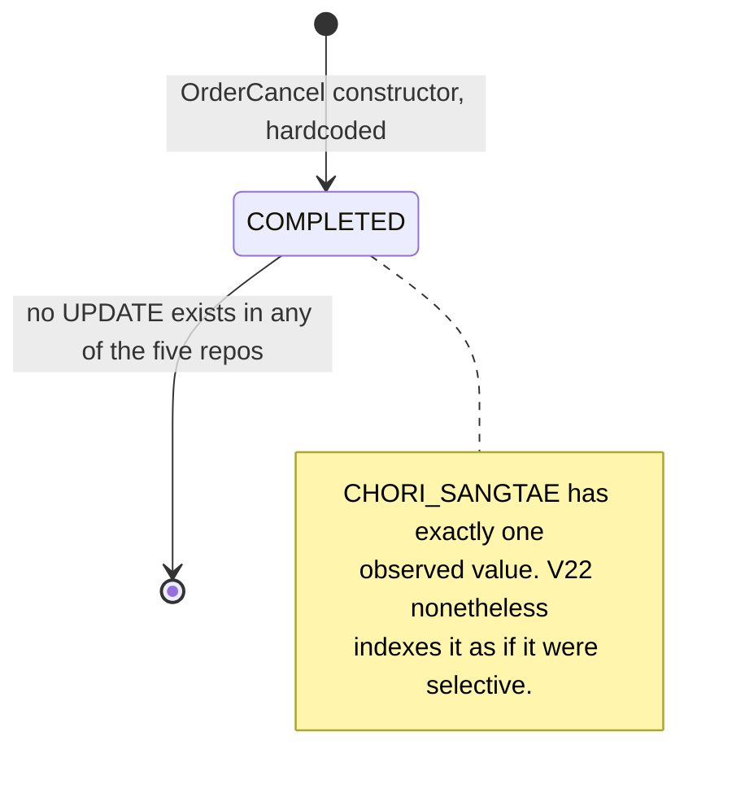

# ORDER_CANCEL Row Lifecycle

## Purpose

To trace one `ORDER_CANCEL` row: what creates it, what it can contain, what each of its coded fields sets in motion downstream, and what changes it afterwards. The answer to the last question is "nothing", which makes this a short lifecycle and a long story about the columns.

Two of those columns deserve attention beyond their size. `BIGO` was renamed and un-renamed within a single month in 2024 because another team's query broke — the clearest piece of evidence in the reef that the shared-database decision has operational teeth. And `CHNL_CD` looks like captured provenance but is not: every value in the table was written by a migration, not by the cancel path.

## Key Facts

- The table is created in V1 with five columns and a primary key of `ORD_NO` alone, which caps an order at **one** cancellation row for all time → src/main/resources/db/migration/V1__init.sql
- That primary key is what structurally blocks partial cancellation, which 박성민's own notes still list as open: "- [ ] 부분취소" ("partial cancellation") → order-service:TASK.md
- The row is created only by `orderCancelRepository.save(new OrderCancel(ordNo, sayu, bigo))` inside `OrderCancelService.cancel`, in the same transaction as the `ORDER_MST` update and the outbox insert → src/main/java/kr/co/sellflow/order/service/OrderCancelService.java
- **The row has exactly one state.** `CHORI_SANGTAE` is hardcoded to `"COMPLETED"` in the constructor, and `grep -rn ORDER_CANCEL repos/` finds no `UPDATE` against the table anywhere in the five repositories → src/main/java/kr/co/sellflow/order/domain/OrderCancel.java
- **The table is write-only within this codebase.** The same grep finds no `SELECT` either — not in order-service, not in settlement-batch's relay, not in settlement-anomaly. Downstream consumers read the *outbox payload* instead, never this row → settlement-batch:src/main/java/kr/co/sellflow/settlement/relay/OrderEventRelayJob.java
- `CHWISO_ILSI` is stamped `LocalDateTime.now()` in the application JVM, with no explicit zone, while settlement's clock is pinned to `Asia/Seoul` in `QuartzConfig` → src/main/java/kr/co/sellflow/order/domain/OrderCancel.java
- `CHWISO_SAYU_CD` accepts only `01`–`04`; `CancelReason.of` throws `IllegalArgumentException("알 수 없는 취소 사유 코드: " + code)` ("unknown cancellation reason code") for anything else, and `GlobalExceptionHandler` maps only `OrderNotFoundException` and `OrderCancelNotAllowedException`, so a bad code escapes as a 500 → src/main/java/kr/co/sellflow/order/domain/CancelReason.java, src/main/java/kr/co/sellflow/order/exception/GlobalExceptionHandler.java
- The only code anywhere that branches on the reason is in another team's service: `RESTOCKABLE_REASONS = {"01", "02"}` in inventory-api → inventory-api:app/main.py
- That set **contradicts the business-rules sheet**, which marks `04` 배송 실패 (delivery failure) as 재고 복원 O ("restock: yes"). inventory-api's own comment explains only `03`: "03(고객 변심)은 배송이 시작된 뒤 취소되는 경우가 많아 복원 대상이 아니다" ("03, customer change of mind, is usually cancelled after delivery has started, so it is not a restock case") — and says nothing about `04` → inventory-api:app/main.py, sources/context/business-rules.md
- The contradiction may be moot: `InventoryClient` in order-service has no caller, so whether the reason code ever reaches inventory-api from the cancel path is unestablished → src/main/java/kr/co/sellflow/order/client/InventoryClient.java, and see [[PROC-ORDER-CANCEL]]
- `BIGO` grew from `VARCHAR(500)` (V1) to `VARCHAR(2000)` in V9, dated 2023-07-05, at CS's request: "취소 비고 길이 확장 (CS 요청)" → src/main/resources/db/migration/V9__order_cancel_bigo_extend.sql
- **V15 renamed `BIGO` to `MEMO` and V16 renamed it straight back**, with the reason in the file: "V15 롤백. 정산 배치 쿼리가 BIGO 를 직접 참조하고 있어 장애. 2024-01-18" ("rollback of V15. The settlement batch query references BIGO directly, causing an outage") → src/main/resources/db/migration/V16__revert_rename_bigo.sql
- No trace of that coupling survives in settlement-batch. `grep -rn BIGO settlement-batch/` returns nothing today; the outage's cause is attested only by the migration comment that undid it → settlement-batch/ (grep)
- The cleanup was never finished — TASK.md still carries "- [ ] V15 롤백 정리 (V16 으로 되돌림, 나중에 정리)" ("tidy up the V15 rollback — reverted with V16, clean up later") → order-service:TASK.md
- `CHNL_CD` was added in V17 with the comment `'취소 접수 채널 (APP/ADMIN/CS)'` ("cancellation intake channel") and immediately blanket-set: `UPDATE ORDER_CANCEL SET CHNL_CD = 'ADMIN' WHERE CHNL_CD IS NULL` — every historic row became `ADMIN` regardless of where it came from → src/main/resources/db/migration/V17__add_cancel_channel.sql
- V18 then reclassified a subset to `APP` by joining the order's inflow channel — "앱 취소분을 로그 기준으로 재분류" ("reclassify app cancellations on the basis of logs") — so historic `CHNL_CD` is **derived from the order's channel, not captured at cancel time** → src/main/resources/db/migration/V18__backfill_cancel_channel.sql
- V18 runs against the schema these migrations build: it joins `m.CHAENNEL_CD` (V3) and filters `c.CHWISO_ILSI >= '2023-01-01'` (V1), so the 2023 cut-off is on the *cancellation* date while the channel value comes from the *order* → src/main/resources/db/migration/V18__backfill_cancel_channel.sql, src/main/resources/db/migration/V3__add_channel_code.sql, src/main/resources/db/migration/V1__init.sql
- **No application code writes `CHNL_CD`.** `grep -rn 'CHNL_CD\|chnlCd' repos/` returns only V17 and V18. Neither the controller's `CancelRequest` (`sayuCd`, `bigo`) nor the entity has a channel field, so every row inserted since V17 leaves it NULL → src/main/java/kr/co/sellflow/order/controller/OrderController.java, src/main/java/kr/co/sellflow/order/domain/OrderCancel.java
- V22 indexes `ORDER_CANCEL (CHORI_SANGTAE, CHWISO_ILSI)` — both real columns, but the leading one has a single distinct value in practice, so the index behaves as one on `CHWISO_ILSI` alone → src/main/resources/db/migration/V22__order_cancel_status_index.sql
- The deprecated `OrderCancelServiceV1` writes the same row by hand and omits `BIGO` from its column list entirely; it is `@Deprecated` with **zero callers** → src/main/java/kr/co/sellflow/order/legacy/OrderCancelServiceV1.java

### How the zero-caller claim on OrderCancelServiceV1 was verified

Three checks, all negative:

1. `grep -rn "OrderCancelServiceV1" repos/` returns exactly two lines — the class declaration in `src/main/java/kr/co/sellflow/order/legacy/OrderCancelServiceV1.java` and the test class declaration in `src/test/java/kr/co/sellflow/order/legacy/OrderCancelServiceV1Test.java`. No import, no injection point, no `new`.
2. The class carries no stereotype annotation (`@Service`, `@Component`, `@Repository`) — only `@Deprecated` — so Spring never instantiates it and its `@Autowired DataSource` is never injected. It cannot be reached by dependency injection even accidentally.
3. Its only test is `@Disabled("SF-2287 이후 정책 변경. legacy 클래스 제거 시 함께 삭제")` ("policy changed after SF-2287; delete along with the legacy class") and has an empty body — three `given/when/then` comments and no statements. So even CI does not exercise it.

Its retention is explained in its own javadoc: "삭제 예정이나 배치에서 참조 가능성이 있어 남겨둠. - 2023-04-21 박성민" ("slated for deletion but kept in case a batch references it"). The same fear that kept this class alive is what V16 later confirmed in a different form: the settlement batch really was reaching into order-owned objects directly.

## Fields

| Column | Type | Origin | Written by | Value actually written |
|---|---|---|---|---|
| `ORD_NO` | VARCHAR(20) NOT NULL | V1 | `OrderCancel` constructor | the cancelled order number; **PK, one row per order** |
| `CHWISO_ILSI` | DATETIME NOT NULL | V1 | `OrderCancel` constructor | `LocalDateTime.now()`, no zone |
| `CHWISO_SAYU_CD` | VARCHAR(2) NOT NULL | V1 | `OrderCancel` constructor | `sayu.getCode()` — `01`, `02`, `03` or `04` |
| `CHORI_SANGTAE` | VARCHAR(20) NOT NULL | V1 | `OrderCancel` constructor | always the literal `"COMPLETED"` |
| `BIGO` | VARCHAR(500) → VARCHAR(2000) | V1, widened V9 | `OrderCancel` constructor | the request body's `bigo`, nullable |
| `CHNL_CD` | VARCHAR(10) NULL | V17 | **migrations only** | `'ADMIN'` (V17 blanket), then `'APP'` for a V18-selected subset; NULL for anything inserted since |

Indexes: none in V1 beyond the primary key; `IDX_ORDER_CANCEL_STATUS (CHORI_SANGTAE, CHWISO_ILSI)` from V22 — the only index on this table, and effectively a date index because its leading column never varies.

## Relationships

- `ORDER_MST` 1 : 0..1 `ORDER_CANCEL`, joined on `ORD_NO`, **no foreign key** — V1: "주의: FK 제약 없음" ("note: no FK constraints"). The cancel row cannot be orphan-checked by the database.
- The row has no relationship to `ORDER_EVENT_OUTBOX` other than a shared `ORD_NO`. The outbox row is written from the same method in the same transaction, but the payload is built from the service's local variables, not read back from this table.
- No relationship at all to `SETTLEMENT_DTL` or `CANCEL_RECON_QUEUE`. The settlement side learns of a cancellation from the outbox and confirms settlement from its own tables; it never joins `ORDER_CANCEL`.
- `CHWISO_SAYU_CD` is the same vocabulary as `CANCEL_RECON_QUEUE.SAYU_CD` and inventory-api's `reason_code`, but the value reaches those places by being copied through a JSON payload and an HTTP body — not by anyone reading this column.

## Creation Path

```
POST /orders/{ordNo}/cancel  { "sayuCd": "03", "bigo": "..." }
   │  OrderController.cancel                                (delivery-bff also calls this route)
   ▼  OrderCancelService.cancel  — one @Transactional unit
   1. orderMstRepository.findById(ordNo)         → 404 if absent
   2. CHWISO_BULGA guard: CHWISO or BANPUM       → 409 if blocked
   3. CancelReason.of(sayuCd)                    → 500 on an unknown code
   4. new OrderCancel(ordNo, sayu, bigo)         → THIS ROW, CHORI_SANGTAE='COMPLETED'
   5. order.chwiso(); orderMstRepository.save(order)
   6. eventPublisher.publishOrderCancelled(ordNo, sayu.getCode())
```

Three things about step 4 are worth stating plainly. It happens **before** any downstream work is attempted, so `COMPLETED` records an intent, not an outcome. It is the *only* insert path — the legacy class's hand-written INSERT is unreachable. And it never sets `CHNL_CD`, so the channel is not captured even though the caller is distinguishable: delivery-bff has its own client wrapper for this route, and CS admin traffic arrives at the same endpoint → delivery-bff:src/generated/orderApi.ts

A second-cancel attempt never reaches step 4: the guard in step 2 rejects it because `ORDER_MST.SANGTAE_CD` is already `CHWISO`. If it ever did reach step 4, the `ORD_NO` primary key would reject it at the database.

## States and Transitions



The state machine is degenerate on purpose or by omission — the sources do not say which. What can be said from evidence: the column is `VARCHAR(20)` where two characters would have done for a flag, it is named 처리상태 ("processing status"), and the row is created already-`COMPLETED` synchronously. V22's index on `(CHORI_SANGTAE, CHWISO_ILSI)` reads like a query plan for a *worklist* — "find cancellations in state X ordered by cancellation date" — which is a query that would make sense only if the column moved. Nothing in the repository ever moves it.

## Worked Examples

**1. Everything the databases know about one cancellation.**

```sql
SELECT c.ORD_NO,
       c.CHWISO_ILSI,
       c.CHWISO_SAYU_CD,
       c.CHORI_SANGTAE,          -- 'COMPLETED' for every row
       c.CHNL_CD,                -- 'ADMIN'/'APP' if pre-V18, NULL if written since
       LENGTH(c.BIGO)  AS bigo_len,
       m.SANGTAE_CD    AS order_state_now,
       m.UPD_DTM,
       e.EVENT_ID, e.PUBLISHED_YN, e.PAYLOAD,
       s.RUN_ID        AS settled_in_run,
       q.SEQ AS recon_seq, q.SAYU_CD AS recon_sayu, q.STATUS AS recon_status
  FROM ORDER_CANCEL c
  JOIN ORDER_MST    m ON m.ORD_NO = c.ORD_NO
  LEFT JOIN ORDER_EVENT_OUTBOX e ON e.ORD_NO = c.ORD_NO
                                AND e.EVENT_TYPE = 'order.cancelled'
  LEFT JOIN SETTLEMENT_DTL     s ON s.ORD_NO = c.ORD_NO
  LEFT JOIN CANCEL_RECON_QUEUE q ON q.ORD_NO = c.ORD_NO
 WHERE c.CHWISO_ILSI >= '2026-08-01'
 ORDER BY c.CHWISO_ILSI;
```

The join is legal because all five tables share one MySQL instance (settlement-batch V1: "주의: sellflow_order 와 동일 인스턴스를 사용한다. (2019년 통합 결정)" — "note: uses the same instance as sellflow_order (2019 consolidation decision)"). Note what the query cannot do: it cannot restrict by `CHORI_SANGTAE` usefully, it cannot group by channel for anything cancelled after the V18 backfill, and `q.SAYU_CD` may disagree with `c.CHWISO_SAYU_CD` if the payload parser fell back to `"00"` — see [[PROC-ORDER-EVENT-OUTBOX-LIFECYCLE]].

**2. `CHWISO_SAYU_CD` — the reason codes and what each one actually triggers.**

| Code | `CancelReason` constant | Label (verbatim) | Meaning | Documented cost bearer | Documented restock | What the code actually does |
|---|---|---|---|---|---|---|
| `01` | `PARTNER_GWICHAEK` | 파트너 귀책 | partner at fault (stock shortage, shipping delay) | 파트너 (partner) | O | inventory-api **would** restock — if it were called |
| `02` | `SYSTEM_ORYU` | 시스템 오류 | system error | 셀플로우 (Sellflow) | O | inventory-api **would** restock — if it were called |
| `03` | `GOGAEK_BYEONSIM` | 고객 변심 | customer changed their mind | 셀플로우 | X | not restockable; wiki restricts it to "배송 시작 전만 가능" ("only before delivery starts") — unenforced |
| `04` | `BAESONG_SILPAE` | 배송 실패 | delivery failure (bad address, refusal) | 파트너 | O in the sheet | **not** in inventory-api's `RESTOCKABLE_REASONS` — the one outright contradiction |
| `00` | — | — | not a valid code | — | — | never written here, but produced by the relay's payload parser and stored in `CANCEL_RECON_QUEUE.SAYU_CD` |

Beyond restock, the code is copied — never interpreted — along two hops: into the outbox payload by `OrderEventPublisher`, and from there into `CANCEL_RECON_QUEUE.SAYU_CD` by the relay. `CancelReconciler` would copy it once more into `SETTLEMENT_ADJUSTMENT`, but that component has never run. The settlement deduction the sheet promises for every reason — "정산 실행 후 취소 → 정산팀이 차월 정산에서 수기 차감" ("cancellation after settlement runs → the settlement team manually deducts it from the following month") — is a human process, and the reason code plays no part in it that any file records.

`CancelReason`'s javadoc is candid about the split: "사유별 비용 부담 주체는 코드에 정의하지 않는다. 정산 정책은 재무본부 소관이며 별도 기준표를 따른다." ("the cost bearer per reason is not defined in code; settlement policy belongs to the finance division and follows a separate reference table").

**3. `CHORI_SANGTAE` and `CHNL_CD` — the other two coded fields.**

`CHORI_SANGTAE`:

| Value | Written by | Meaning | Notes |
|---|---|---|---|
| `COMPLETED` | `OrderCancel` constructor, hardcoded | processing complete | the only value in the codebase; also the only value the legacy INSERT writes |
| anything else | nothing | undefined | no enum, no lookup table, no comment defines the vocabulary |

`CHNL_CD` — 취소 접수 채널 (cancellation intake channel), per V17's column comment:

| Value | Written by | Meaning | Provenance |
|---|---|---|---|
| `ADMIN` | V17's blanket `UPDATE` | received via CS admin | assumed for every row that existed in 2024-02, correct or not |
| `APP` | V18's backfill | received via the customer app | **inferred** from `ORDER_MST.CHAENNEL_CD = 'APP'` for rows with `CHWISO_ILSI >= '2023-01-01'` — i.e. from how the order arrived, not how the cancellation did |
| `CS` | nothing | received via CS | named in the column comment; no statement in any migration or class produces it |
| `NULL` | the default for every row inserted since V17 | unknown | the insert path has no channel field |

The honest reading: `CHNL_CD` answers "which channel did this customer order through, as of a 2024 backfill" for old rows and nothing at all for new ones. Any analysis that treats it as captured cancellation provenance will be wrong in both directions — an app order cancelled by a CS agent reads `APP`, and everything since early 2024 reads NULL.

**4. The rename that another team's query undid.**

The sequence, all of it from the two migration files and TASK.md:

| When | What | File |
|---|---|---|
| 2023-07-05 | `BIGO` widened 500 → 2000 at CS's request | V9 |
| 2024-01 (day not recorded) | `ALTER TABLE ORDER_CANCEL CHANGE COLUMN BIGO MEMO VARCHAR(2000) NULL` — "비고 컬럼 이름 통일" ("unifying the remark column's name") | V15 |
| 2024-01-18 | `CHANGE COLUMN MEMO BIGO` — "V15 롤백. 정산 배치 쿼리가 BIGO 를 직접 참조하고 있어 장애." | V16 |
| still open | "V15 롤백 정리 (V16 으로 되돌림, 나중에 정리)" | TASK.md |

What makes this a cross-team story rather than a botched rename: order-service's own code would have survived it. The `OrderCancel` entity maps the column by name in one place, and `@Column(name = "BIGO")` is a one-line change. What broke was a query in another team's repository, against a table order-service owns, that no one in 주문팀 could see when reviewing the migration. The shared instance is the mechanism — settlement-batch runs against `sellflow_order` (settlement-batch V1, README) — and the absence of foreign keys or views means there is no declared surface to check a rename against.

The follow-up is the uncomfortable part. `grep -rn BIGO settlement-batch/` returns nothing today: the query that caused a production outage in January 2024 is not in the repository that the outage was blamed on. Either it was removed in the same window and left no trace, or it never lived in version control at all — an operations query, a report, or something run by hand. Both readings are worse than the rename. Recorded in `known_unknowns`; a question for a human is filed in `.reef/questions-for-owner.md`.

## Agent Guidance

- **Never count cancellations by `CHORI_SANGTAE`.** It has one value. A query filtering on it is a no-op filter, and an index on it (V22) does not change that.
- **Never treat `CHNL_CD` as captured data.** Pre-2024 rows were assigned `ADMIN` wholesale, a subset was re-derived as `APP` from the *order's* channel, and everything since is NULL. If someone needs cancellation-channel analytics, the answer is "the data does not exist", not "join on CHNL_CD".
- **Use `ORDER_CANCEL` to establish *that* an order was cancelled and when and why — nothing more.** It carries no outcome, no settlement link, no actor and no history.
- **`CHWISO_SAYU_CD` is stored, forwarded and — except for the restock check in another service — never interpreted.** Policy meaning lives in the business-rules sheet and the finance division's separate reference table, neither of which is in code.
- **Before renaming any column on an order table, grep all five repositories, and assume the grep is incomplete.** V16 is the precedent; the breaking query is not findable today even knowing it existed.
- **Do not plan partial cancellation without a primary-key change.** `ORD_NO` alone is the PK; a second row for the same order cannot exist.
- When reconciling a cancellation against settlement, go via `SETTLEMENT_DTL` and `CANCEL_RECON_QUEUE` — this table has no link to either.

## Related

- [[PROC-ORDER-CANCEL]] — the request-level flow and its absent side effects
- [[PROC-ORDER-ORDER-MST-LIFECYCLE]] — the order row this cancellation mutates
- [[PROC-ORDER-EVENT-OUTBOX-LIFECYCLE]] — where `CHWISO_SAYU_CD` goes next
- [[SCH-ORDER]] — the surrounding table inventory
- [[SCH-ORDER-MIGRATION-HISTORY]] — V9/V15/V16/V17/V18/V22 in their full context
- [[SYS-ORDER]] — the owning service
- [[GLOSSARY-ORDER]] — reason-code and status vocabulary
