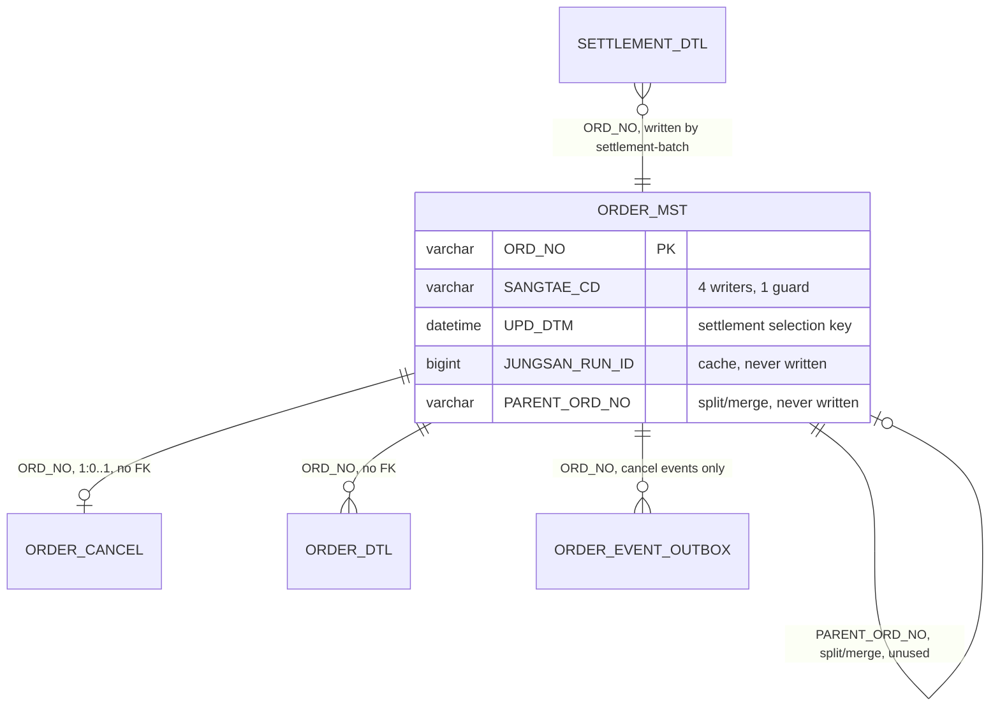
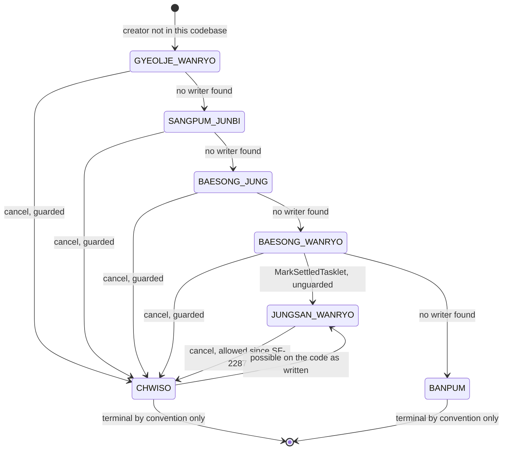

# ORDER_MST Row Lifecycle

## Purpose

To trace one `ORDER_MST` row from the moment it exists to the moment nothing changes it again, and to name every piece of code that can move its `SANGTAE_CD`. The row is the closest thing 셀플로우 has to an order aggregate: settlement selects work from it, the anomaly detector judges settlement against it, and the cancel API mutates it. It has no foreign keys, no transition validation, no history, and — in this repository — no creator.

The practical question this artifact answers is "if `SANGTAE_CD` says X, what put it there, and what was it before?" The second half of that question turns out to be unanswerable for most rows, and the reason is worth knowing before you build anything on top of the column.

## Key Facts

- The row is keyed by `ORD_NO VARCHAR(20)` and carries no foreign keys in either direction; V1's header says so as a design decision: "주의: FK 제약 없음. 성능 이슈로 2019년 설계 당시 제외함." ("note: no FK constraints; excluded at 2019 design time for performance reasons") → src/main/resources/db/migration/V1__init.sql
- **No code in any of the five repos inserts an `ORDER_MST` row.** `grep -rn 'ORDER_MST' repos/` returns only SELECTs, UPDATEs, migrations and one `@Table` annotation; `OrderController` maps a single route, `POST /orders/{ordNo}/cancel` → src/main/java/kr/co/sellflow/order/controller/OrderController.java
- `SANGTAE_CD` is `VARCHAR(20)` in the DDL and `@Enumerated(EnumType.STRING)` in the entity, so the stored value is the Java constant name (`BAESONG_WANRYO`, not `배송완료`) → src/main/java/kr/co/sellflow/order/domain/OrderMst.java, src/main/resources/db/migration/V1__init.sql
- `SANGTAE_CD` has **four** writers across the two Java repos: `OrderMst.chwiso()`, `OrderMst.byeongyeong()` via `OrderStatusService.change()`, settlement-batch's `MarkSettledTasklet`, and the deprecated `OrderCancelServiceV1`'s raw `UPDATE`. Only the first is reachable from an HTTP request → src/main/java/kr/co/sellflow/order/domain/OrderMst.java, src/main/java/kr/co/sellflow/order/service/OrderStatusService.java, src/main/java/kr/co/sellflow/order/legacy/OrderCancelServiceV1.java, settlement-batch:src/main/java/kr/co/sellflow/settlement/tasklet/MarkSettledTasklet.java
- **Exactly one of those writers runs a guard**, and it guards the caller, not the write: `OrderCancelService` rejects a source state in `EnumSet.of(CHWISO, BANPUM)` before calling `chwiso()`. `chwiso()` itself sets the field unconditionally → src/main/java/kr/co/sellflow/order/service/OrderCancelService.java, src/main/java/kr/co/sellflow/order/domain/OrderMst.java
- `OrderStatusService.change(ordNo, to)` writes whatever enum value it is handed, with no source-state check, no target-state check and no history row — the body is a log line and a setter → src/main/java/kr/co/sellflow/order/service/OrderStatusService.java
- That method has **no production caller**. `grep -rn OrderStatusService repos/` returns the class, its own constructor and logger, and one unit test that asserts only `verify(repo).findById("ORD1")` → src/test/java/kr/co/sellflow/order/service/OrderStatusServiceTest.java
- It reaches the entity through `OrderMst.byeongyeong(OrderStatus to)`, a mutator built to the same shape as `chwiso()`: it assigns `this.sangtaeCd = to` and stamps `this.updDtm = LocalDateTime.now()`, then the service calls `orderMstRepository.save(order)` → src/main/java/kr/co/sellflow/order/domain/OrderMst.java, src/main/java/kr/co/sellflow/order/service/OrderStatusService.java
- `OrderMst`'s complete member list is seven fields, five getters, `chwiso()` and `byeongyeong(OrderStatus)`. There is no generic setter, no Lombok annotation and no inherited class, so `byeongyeong` and `chwiso` are the only two ways the entity's status can move → src/main/java/kr/co/sellflow/order/domain/OrderMst.java
- Both mutators stamp `UPD_DTM` with application time, and `UPD_DTM` is settlement's day-selection key — so any transition through either method moves the row between settlement days as a side effect → src/main/java/kr/co/sellflow/order/domain/OrderMst.java, settlement-batch:src/main/java/kr/co/sellflow/settlement/config/DailySettlementJobConfig.java
- `MarkSettledTasklet` sets `SANGTAE_CD='JUNGSAN_WANRYO'` by set-based UPDATE keyed on `SETTLEMENT_DTL` membership for the newest `RUN_ID`. Its `WHERE` clause contains no predicate on the current status, so the transition is unconditional on the source state → settlement-batch:src/main/java/kr/co/sellflow/settlement/tasklet/MarkSettledTasklet.java
- That cross-team write is policy, not accident: "ORDER_MST 는 주문팀 소유 테이블이나, 통합 DB 정책에 따라 정산 배치가 직접 갱신한다. (2019년 협의)" ("ORDER_MST is the order team's table, but under the shared-DB policy the settlement batch updates it directly (agreed 2019)") → settlement-batch:src/main/java/kr/co/sellflow/settlement/tasklet/MarkSettledTasklet.java
- Because that write bypasses the application, the history table is known-incomplete by design: "TODO(성민) 2022-11-08: 정산완료 전이는 여기 안 쌓인다. 배치에서 직접 UPDATE 하기 때문." ("the settled transition doesn't accumulate here, because the batch UPDATEs directly") → src/main/java/kr/co/sellflow/order/domain/OrderStatusHistory.java
- The transition rulebook the enum points at does not exist: `OrderStatus`'s javadoc says "상태 전이는 OrderStatusValidator 참고" ("for state transitions see OrderStatusValidator"), and no such class is in the repository → src/main/java/kr/co/sellflow/order/domain/OrderStatus.java
- `UPD_DTM` is not merely an audit column — it is settlement's selection key. The daily reader is `WHERE m.SANGTAE_CD = 'BAESONG_WANRYO' AND DATE(m.UPD_DTM) = ?`, so any write that stamps `UPD_DTM` moves the row between settlement days → settlement-batch:src/main/java/kr/co/sellflow/settlement/config/DailySettlementJobConfig.java
- `JUNGSAN_RUN_ID` (V14, 2025-11-20, added at 정산팀's request) is explicitly a cache: "주의: 실제 정산 여부는 SETTLEMENT_DTL 이 정본이다. 본 컬럼은 캐시 성격." ("note: whether settlement actually happened is authoritative in SETTLEMENT_DTL; this column is cache-like") → src/main/resources/db/migration/V14__add_settlement_ref.sql
- **Nothing writes or reads `JUNGSAN_RUN_ID`.** `grep -rn 'JUNGSAN_RUN_ID\|jungsanRunId'` over all five repos returns one line: the `ALTER TABLE` that creates it. It is also absent from the `OrderMst` entity mapping → src/main/resources/db/migration/V14__add_settlement_ref.sql, src/main/java/kr/co/sellflow/order/domain/OrderMst.java
- V21 then indexes it — `CREATE INDEX IDX_ORDER_MST_SETTLE_REF ON ORDER_MST (JUNGSAN_RUN_ID)` — so the column now has a column, an index and still no query → src/main/resources/db/migration/V21__add_settlement_ref_index.sql
- `PARENT_ORD_NO` (V10, 2024-01-29, 주문 분할/병합 — order split/merge) is in the same position: column plus index `IX_ORDER_MST_04`, no entity field, no query, no service → src/main/resources/db/migration/V10__add_split_merge.sql
- The entity maps 7 columns; the table has 14 after V13 and V20's drops. Everything added from V2 onward — memo, channel, waybill, carrier, `PARENT_ORD_NO`, `JUNGSAN_RUN_ID` — is invisible to JPA, so `orderMstRepository.save()` never touches it → src/main/resources/db/migration/, src/main/java/kr/co/sellflow/order/domain/OrderMst.java
- Two services outside 주문팀 read `SANGTAE_CD` directly over the shared database: settlement-batch's target reader and settlement-anomaly's `/detect` join, whose `CANCELLED_SETTLED` rule fires on `CHWISO` or `BANPUM` → settlement-batch:src/main/java/kr/co/sellflow/settlement/config/DailySettlementJobConfig.java, settlement-anomaly:app/main.py

## Fields

Columns as created by the migrations, with the entity mapping and the writer for each. "—" in the Writer column means nothing in the five repos writes it.

| Column | Type | Origin | Mapped by `OrderMst`? | Writer(s) | Notes |
|---|---|---|---|---|---|
| `ORD_NO` | VARCHAR(20) | V1 | yes (`@Id`) | — (no creator found) | PK. Also the join key for every other order table. |
| `GOGAEK_ID` | VARCHAR(20) NOT NULL | V1 | yes | — | Indexed with `JUMUN_ILSI` as `IX_ORDER_MST_01`. |
| `JUMUN_ILSI` | DATETIME NOT NULL | V1 | yes | — | The only order-date column any migration creates. |
| `SANGTAE_CD` | VARCHAR(20) NOT NULL | V1 | yes, `EnumType.STRING` | `chwiso()`, `OrderStatusService.change()`, `MarkSettledTasklet`, `OrderCancelServiceV1` | The subject of this artifact. |
| `CHONG_GEUMAEK` | DECIMAL(15,0) NOT NULL | V1 | yes | — | Order total. Settlement recomputes from `ORDER_DTL` rather than reading this. |
| `BAESONG_JUSO` | VARCHAR(500) | V1 | yes | — | |
| `REG_DTM` | DATETIME DEFAULT CURRENT_TIMESTAMP | V1 | **no** | database default | |
| `UPD_DTM` | DATETIME | V1 | yes (no getter) | `chwiso()`, `MarkSettledTasklet`, `OrderCancelServiceV1` | Settlement's selection key — see Key Facts. |
| `GOGAEK_MEMO` | VARCHAR(500) | V2 | no | — | Prefix-indexed by V24 as `IDX_ORDER_MST_MEMO (GOGAEK_MEMO(64))`; no query filters on it. |
| `CHAENNEL_CD` | VARCHAR(20) | V3 | no | V3's own blanket `UPDATE ... = 'WEB'` | V18's cancel-channel backfill joins on it. |
| `UNSONGJANG_BEONHO` | VARCHAR(30) | V5 | no | — | Indexed `IX_ORDER_MST_03`. |
| `TAEKBAESA_CD` | VARCHAR(10) | V5 | no | — | |
| `JEOKRIPGEUM`, `HALIN_GEUMAEK` | DECIMAL(15,0) DEFAULT 0 | V7 | no | — | **Dropped by V20** (2024-09); points moved to a separate system — see [[SCH-ORDER-MIGRATION-HISTORY]]. |
| `TEMP_FLAG` | CHAR(1) DEFAULT 'N' | V1 | no | — | **Dropped by V13** (2025-03) after six years with no reader. |
| `PARENT_ORD_NO` | VARCHAR(20) | V10 | no | — | Split/merge. Column and index only. |
| `JUNGSAN_RUN_ID` | BIGINT | V14 | no | — | Declared a cache over `SETTLEMENT_DTL`; never populated. |

## Relationships



Cardinality is by convention only; no constraint in the database enforces any of it. `ORDER_CANCEL`'s primary key is `ORD_NO` alone, which is what caps an order at one cancellation row and structurally blocks partial cancellation — see [[PROC-ORDER-ORDER-CANCEL-LIFECYCLE]].

## Creation Path

There is not one in this repository. The evidence, in the order a reader should check it:

1. `OrderController` declares one method, `cancel`, on `POST /orders/{ordNo}/cancel`. There is no create endpoint → src/main/java/kr/co/sellflow/order/controller/OrderController.java
2. `OrderMstRepository` is a bare `JpaRepository<OrderMst, String>`; its only callers are `OrderQueryService.findById`, `OrderCancelService` (`findById` + `save` of an already-loaded entity) and `OrderStatusService` (`findById`) → src/main/java/kr/co/sellflow/order/repository/OrderMstRepository.java
3. `OrderMst` has no public constructor other than the implicit no-arg one and no builder; nothing constructs it in `src/main` → src/main/java/kr/co/sellflow/order/domain/OrderMst.java
4. `grep -rn "INSERT INTO ORDER_MST" repos/` returns nothing across all five repositories.

So the first state of the row, and whatever sets it, are outside the boundary of everything the reef has read. The Confluence page assumes `결제완료` (payment complete) is the entry state, and `OrderStatus` declares `GYEOLJE_WANRYO` first, which is suggestive but is not evidence → sources/raw/confluence-snapshots/주문-취소-정책_48213.html

Practically: **do not answer "how is an order created" from this artifact or from order-service.** Record it as out of scope and go looking for the checkout system.

## States and Transitions

`OrderStatus` declares seven values. Labels are the enum's own Korean strings.

| Value | Label | Written by | Guard on the write |
|---|---|---|---|
| `GYEOLJE_WANRYO` | 결제완료 (payment complete) | nothing in the five repos | n/a |
| `SANGPUM_JUNBI` | 상품준비중 (preparing goods) | nothing in the five repos | n/a |
| `BAESONG_JUNG` | 배송중 (in delivery) | nothing in the five repos | n/a |
| `BAESONG_WANRYO` | 배송완료 (delivery complete) | nothing in the five repos | n/a — but this is the value settlement selects on |
| `JUNGSAN_WANRYO` | 정산완료 (settlement complete) | settlement-batch `MarkSettledTasklet` | **none.** Set-based UPDATE with no source-state predicate |
| `CHWISO` | 취소 (cancelled) | `OrderMst.chwiso()` via `OrderCancelService` | source state must not be `CHWISO` or `BANPUM` |
| `BANPUM` | 반품 (returned) | nothing in the five repos | n/a |

Only one guard exists in the whole machine, and it lives in the service, not the entity. `OrderStatusService.change()` will write any of the seven to any row — it compiles, it saves, and nothing calls it.



The `CHWISO --> JUNGSAN_WANRYO` edge is the one a reader will not expect. `MarkSettledTasklet` updates every `ORD_NO` in the newest settlement run's `SETTLEMENT_DTL` with no regard to the row's current status, and the settlement reader that produced those rows deliberately ignores cancellation: "배송이 완료되었다면 파트너는 이행을 마친 것으로 본다" ("if delivery completed, the partner is considered to have fulfilled") → settlement-batch:src/main/java/kr/co/sellflow/settlement/config/DailySettlementJobConfig.java. An order cancelled between the reader and the tasklet, or re-settled in a later run, lands back in `JUNGSAN_WANRYO`. Nothing in the code prevents it and nothing records that it happened.

The guards, stated once, per transition:

| Transition | Guard that runs | Where |
|---|---|---|
| any → `CHWISO` | `CHWISO_BULGA.contains(order.getSangtaeCd())` → 409 | `OrderCancelService.cancel` |
| any → `JUNGSAN_WANRYO` | **none** | `MarkSettledTasklet.execute` |
| any → any (uncalled path) | **none** — `change` writes whatever value it is handed | `OrderStatusService.change` → `OrderMst.byeongyeong` |
| `JUNGSAN_WANRYO` → `CHWISO` | **none since 2023-04-21** | removed by SF-2287, "OrderCancelService.java — 정산 상태 확인 로직 제거" |
| any → `GYEOLJE_WANRYO`/`SANGPUM_JUNBI`/`BAESONG_JUNG`/`BAESONG_WANRYO`/`BANPUM` | **no writer, therefore no guard** | — |

The removed guard is still visible in the dead legacy class, which queried settlement directly before allowing a cancel: `SELECT COUNT(1) FROM SETTLEMENT_DTL WHERE ORD_NO = ?` then `throw new IllegalStateException("정산 완료된 주문은 취소할 수 없습니다. ...")` ("an order whose settlement is complete cannot be cancelled") → src/main/java/kr/co/sellflow/order/legacy/OrderCancelServiceV1.java

## Worked Examples

**1. Reconstructing an order's history — and failing.**

Given `ORD20230411002` currently in `CHWISO`, the join that gathers everything the databases know:

```sql
SELECT m.ORD_NO,
       m.SANGTAE_CD,
       m.UPD_DTM,
       m.JUNGSAN_RUN_ID,            -- always NULL: nothing writes it
       m.PARENT_ORD_NO,             -- always NULL: nothing writes it
       c.CHWISO_ILSI,
       c.CHWISO_SAYU_CD,
       c.CHORI_SANGTAE,
       o.EVENT_ID,
       o.PUBLISHED_YN,
       s.RUN_ID       AS settled_run,
       s.JUNGSAN_AMT,
       q.SEQ          AS recon_seq,
       q.STATUS       AS recon_status
  FROM ORDER_MST m
  LEFT JOIN ORDER_CANCEL       c ON c.ORD_NO = m.ORD_NO
  LEFT JOIN ORDER_EVENT_OUTBOX o ON o.ORD_NO = m.ORD_NO
                                AND o.EVENT_TYPE = 'order.cancelled'
  LEFT JOIN SETTLEMENT_DTL     s ON s.ORD_NO = m.ORD_NO
  LEFT JOIN CANCEL_RECON_QUEUE q ON q.ORD_NO = m.ORD_NO
 WHERE m.ORD_NO = 'ORD20230411002';
```

All five tables live in the same MySQL instance, so this join is legal — that is the 2019 shared-database decision, recorded in settlement-batch's V1: "주의: sellflow_order 와 동일 인스턴스를 사용한다. (2019년 통합 결정)". What the result cannot tell you is what `SANGTAE_CD` was before `CHWISO`. `ORDER_STATUS_HIST` has no writer, the log line that claims to print `prevStatus` reads the field after mutation, and `chwiso()` overwrites in place. The presence of a `SETTLEMENT_DTL` row is the only surviving evidence that the order was once `JUNGSAN_WANRYO`, and that is exactly the inference `OrderEventRelayJob` and the anomaly detector both make.

**2. `UPD_DTM` as an accidental scheduler.**

A cancellation stamps `UPD_DTM = now()`. The settlement reader selects `SANGTAE_CD='BAESONG_WANRYO' AND DATE(UPD_DTM) = :jungsanIlja`. So a cancel does not merely change the status — it also rewrites the date the row would have been selected on had the status still matched. Two consequences follow. An order cancelled and somehow restored to `BAESONG_WANRYO` is settled on the cancel date, not the delivery date. And no column anywhere records when the row *entered* `BAESONG_WANRYO`, because `UPD_DTM` is a single last-touched timestamp shared by every writer.

**3. Enum tables for the status and code fields on this row.**

`ORDER_MST.SANGTAE_CD` — values are `OrderStatus` constant names:

| Stored value | Korean label | Meaning | Set by |
|---|---|---|---|
| `GYEOLJE_WANRYO` | 결제완료 | payment complete | not in this codebase |
| `SANGPUM_JUNBI` | 상품준비중 | goods being prepared | not in this codebase |
| `BAESONG_JUNG` | 배송중 | in delivery | not in this codebase |
| `BAESONG_WANRYO` | 배송완료 | delivery complete | not in this codebase; settlement's selection value |
| `JUNGSAN_WANRYO` | 정산완료 | settlement complete | settlement-batch only |
| `CHWISO` | 취소 | cancelled | order-service cancel path |
| `BANPUM` | 반품 | returned | nothing; blocks cancellation if present |

`ORDER_MST.CHAENNEL_CD` — no enum, no lookup table. V3 blanket-set every existing row to `'WEB'` and nothing has written it since; the documented vocabulary for the *cancel* channel (`APP/ADMIN/CS`) lives on a different column on a different table → src/main/resources/db/migration/V3__add_channel_code.sql

`ORDER_MST.JUNGSAN_RUN_ID` — not an enum; a foreign key by intent to `SETTLEMENT_RUN.RUN_ID`, never populated, and not a real FK.

## Agent Guidance

- **`SANGTAE_CD` is current state, not history.** There is no reliable way to answer "what was this order before?" from order-service. If you need the prior state, the only proxies are the existence of an `ORDER_CANCEL` row (was cancelled), a `SETTLEMENT_DTL` row (was settled at some point), and a `CANCEL_RECON_QUEUE` row (was settled *and then* cancelled).
- **`JUNGSAN_WANRYO` in `ORDER_MST` is neither necessary nor sufficient for "this order was settled."** Not necessary, because a later cancel overwrites it; not sufficient in the other direction either, since V14 states plainly that `SETTLEMENT_DTL` is the source of truth. Query `SETTLEMENT_DTL` directly.
- **Never treat `JUNGSAN_RUN_ID` as populated.** It is a cache column with no writer. Any code or report that reads it will read NULL for every row.
- **Do not assume split/merge exists.** `PARENT_ORD_NO` is schema with no behaviour behind it.
- **Do not add a transition without deciding where the rulebook lives.** The enum already points at a validator that was never written, and one of the four writers is in another team's repository and another team's deployment.
- If you need to know what moves an order through the four pre-delivery states, that answer is not in these repos — see the first entry in `known_unknowns` before searching again.

## Related

- [[SYS-ORDER]] — the owning service
- [[SCH-ORDER]] — the full table inventory this row sits in
- [[SCH-ORDER-MIGRATION-HISTORY]] — why several columns on this row have no writer
- [[PROC-ORDER-CANCEL]] — the request-level flow that drives the only guarded transition
- [[PROC-ORDER-ORDER-CANCEL-LIFECYCLE]] — the `ORDER_CANCEL` row this lifecycle spawns
- [[PROC-ORDER-EVENT-OUTBOX-LIFECYCLE]] — the outbox row written in the same transaction
- [[GLOSSARY-ORDER]] — the status and reason vocabulary
