# SETTLEMENT_ANOMALY Row Lifecycle

## Purpose

A `SETTLEMENT_ANOMALY` row is an assertion that one settled order looks wrong: either its amounts are statistical outliers, or — the case that matters most in this domain — it was settled and is now cancelled. The table was created in 2025-06 by 데이터플랫폼본부 데이터팀 as the output sink of `settlement-anomaly`, a small FastAPI service that reads the settlement and order tables directly and scores them.

The lifecycle is one state long. A row is inserted with `STATUS='DETECTED'` and is never read, never updated and never deleted by any code in any of the five repositories. This artifact documents what is written, by which rule, and the precise shape of the nothing that follows — which is the answer to Q-025.

## Key Facts

- The table has exactly one writer: `app/main.py`'s `POST /detect` handler, which loops over the detector's findings and executes `INSERT INTO SETTLEMENT_ANOMALY (ORD_NO, ANOMALY_CD, SCORE, DETECTED_DTM, STATUS) VALUES (..., NOW(), 'DETECTED')` → settlement-anomaly:app/main.py (lines 41-47)
- `'DETECTED'` is a hardcoded string literal in that `INSERT`, not a parameter — every row is born in the same state, and the column's `DEFAULT 'DETECTED'` is never even relied on → settlement-anomaly:app/main.py, settlement-anomaly:sql/V1__anomaly_schema.sql
- No `UPDATE` or `DELETE` against `SETTLEMENT_ANOMALY` exists in any of the five repos, and no `SELECT` either. The service writes the table and then never looks at it again → settlement-anomaly:app/main.py
- `REVIEWED_BY` and `REVIEWED_DTM` have no writer and no reader. A `grep -rn "REVIEWED_BY\|REVIEWED_DTM"` across all five repos matches only the `CREATE TABLE` that declares them → settlement-anomaly:sql/V1__anomaly_schema.sql
- The schema is nonetheless designed around a review workflow that does not exist: `KEY IX_SETTLEMENT_ANOMALY_01 (STATUS, DETECTED_DTM)` is precisely the index a "show me undetected-reviewed items oldest first" work queue would need, and nothing issues that query → settlement-anomaly:sql/V1__anomaly_schema.sql
- The registry states the gap in the service's own entry: "이상 탐지만 수행. 조치 주체는 정의되어 있지 않음. TODO" — "performs detection only; the party responsible for acting on it is not defined. TODO" — in a file whose header calls itself the single source of truth for services → sellflow-docs:context/registry/services.yaml
- The README says the same thing from the other side: "후속 조치 프로세스는 본 서비스 범위 밖이다." — "the follow-up action process is outside the scope of this service." Both documents are consistent, and neither names the party that is in scope → settlement-anomaly:README.md
- The README documents four anomaly codes; the detector emits two. `AMT_OUTLIER` and `CANCELLED_SETTLED` appear in `model/detector.py`; `DUP_SETTLE` and `FEE_MISMATCH` appear only in the README table — a `grep -rn "DUP_SETTLE\|FEE_MISMATCH"` across all five repos matches nothing but those two README lines → settlement-anomaly:model/detector.py, settlement-anomaly:README.md
- `CANCELLED_SETTLED` is a pure rule, not a model output: if `row["sangtae_cd"] in {"CHWISO", "BANPUM"}` the detector appends a finding with a fixed `score` of `1.0` and `continue`s, so a cancelled order is never also scored for amount anomaly → settlement-anomaly:model/detector.py (lines 11, 29-36)
- `AMT_OUTLIER` is the only model-driven code. `_amount_score` builds a single two-element feature vector `[[jungsan_amt, susuryo]]`, calls `-self.model.score_samples(feat)[0]`, and the finding is emitted when that value exceeds the hardcoded threshold `0.85` → settlement-anomaly:model/detector.py (lines 38-49)
- The four names in `model/features.py` — `amount_zscore`, `partner_daily_count`, `cancel_after_settle_flag`, `fee_rate_delta` — are never used by the detector, which feeds it two raw currency amounts instead. `FEATURES` is imported by exactly one thing: the repository's only test, which asserts that the list contains `cancel_after_settle_flag` → settlement-anomaly:model/features.py, settlement-anomaly:tests/test_detector.py
- That unused list carries a warning the running code has already made moot: "TODO(지우) 2025-02-10: cancel_after_settle_flag 가 사실상 단독으로 결과를 좌우한다. 가중치 재조정 필요." — "the cancel_after_settle_flag effectively determines the outcome on its own; the weights need rebalancing." In the shipped detector the cancel condition is not a weighted feature at all, it is an unconditional rule with `score = 1.0` → settlement-anomaly:model/features.py, settlement-anomaly:model/detector.py
- The model file predates the service. `features.py`'s docstring says "2024-11 이후 재학습 이력 없음" ("no retraining since 2024-11") and the org chart records `settlement-anomaly` entering service on 2025-06-09 — so the artefact scoring production settlements is at least seven months older than the service and, as of this pass, roughly two years old → settlement-anomaly:model/features.py, sellflow-docs:context/org-chart.md
- The model path is hardcoded at import time — `AnomalyDetector.load("model/artifacts/iforest_v3.pkl")` runs at module scope, so a missing file prevents the app starting — while `.env.template` advertises a different, unread variable: `MODEL_PATH=./model/detector.pkl` → settlement-anomaly:app/main.py (line 19), settlement-anomaly:.env.template
- `app/schemas.py` defines an `AnomalyRow` Pydantic model that nothing imports, and it does not match the table: it declares `run_id: str` (the table has no `RUN_ID` at all) and `anomaly_type` (the column is `ANOMALY_CD`) → settlement-anomaly:app/schemas.py, settlement-anomaly:sql/V1__anomaly_schema.sql
- Detection is not idempotent. `/detect` takes a `jungsan_ilja` date, re-selects every detail row for that date and inserts a fresh row per finding; nothing constrains `(ORD_NO, ANOMALY_CD, date)` and nothing checks for an existing row, so calling it twice for one date doubles the rows → settlement-anomaly:app/main.py, settlement-anomaly:sql/V1__anomaly_schema.sql
- The service reads across the service boundary on a shared connection: its input query joins `SETTLEMENT_DTL`, `SETTLEMENT_RUN` (both owned by 정산팀) and `ORDER_MST` (owned by 주문팀), against the hardcoded database `sellflow_order` — while the registry records its `db` as `MySQL (settlement)` → settlement-anomaly:app/main.py, settlement-anomaly:app/db.py, sellflow-docs:context/registry/services.yaml

## Fields

| Column | Type | Written by | Value in practice | Read by |
|---|---|---|---|---|
| `ANOMALY_ID` | `BIGINT AUTO_INCREMENT` PK | MySQL | surrogate | nothing |
| `ORD_NO` | `VARCHAR(20) NOT NULL` | `/detect` | from `SETTLEMENT_DTL.ORD_NO` via the detector's finding | nothing |
| `ANOMALY_CD` | `VARCHAR(30) NOT NULL` | `/detect` | only ever `CANCELLED_SETTLED` or `AMT_OUTLIER` | nothing |
| `SCORE` | `DECIMAL(5,4) NOT NULL` | `/detect` | exactly `1.0` for the rule; `>0.85` from the model for the outlier | nothing |
| `DETECTED_DTM` | `DATETIME NOT NULL` | `/detect` (`NOW()`) | insert time, not the settlement date — the settlement date is **not stored** | nothing |
| `STATUS` | `VARCHAR(20) DEFAULT 'DETECTED'` | `/detect`, hardcoded `'DETECTED'` | `DETECTED`, always | nothing |
| `REVIEWED_BY` | `VARCHAR(30)` | **nothing in any repo** | null | nothing |
| `REVIEWED_DTM` | `DATETIME` | **nothing in any repo** | null | nothing |

Indexes: `IX_SETTLEMENT_ANOMALY_01 (STATUS, DETECTED_DTM)`, `IX_SETTLEMENT_ANOMALY_02 (ANOMALY_CD)`.

Two absences are worth naming because they limit what the table can ever answer. There is **no `RUN_ID`** and no settlement-date column, so a row cannot be traced back to the run that produced the suspect payout without re-joining `SETTLEMENT_DTL` by `ORD_NO` and guessing among runs. And there is **no amount**, so the financial size of the anomalies cannot be summed from this table alone.

## Relationships

| Related entity | Link | Direction | Enforced? |
|---|---|---|---|
| `SETTLEMENT_DTL` | `ORD_NO`; the detector's input rows come from here | read-only, cross-service | No FK; no `RUN_ID` carried across |
| `SETTLEMENT_RUN` | joined on `RUN_ID` to filter by `JUNGSAN_ILJA` | read-only, cross-service | No FK; the join key is not persisted into the anomaly row |
| `ORDER_MST` | joined on `ORD_NO` for `SANGTAE_CD`, which drives the `CANCELLED_SETTLED` rule | read-only, cross-team | No FK |
| `CANCEL_RECON_QUEUE` | none — no key, no join, no code path connects them | — | The two tables record overlapping but differently-defined populations |

That last row is the important one for anyone trying to reconcile totals. `CANCEL_RECON_QUEUE` is populated by *an event having been relayed* at the moment of cancellation; `SETTLEMENT_ANOMALY.CANCELLED_SETTLED` is populated by *the order's current state at detection time*. An order cancelled before it was settled never enters the queue but would be flagged by the rule if a detail row exists; an order whose queue row was created in 2023 would be re-flagged on every detection run that touches its settlement date. Neither table can validate the other.

## Creation Path

```
[ ??? ]  something calls POST /detect {"jungsan_ilja": "YYYY-MM-DD"}
         README: "정산 배치 종료 후 (매일 03:00) 트리거된다"
         No caller exists in any of the five repos. No auth on the endpoint.
      ↓
app.main.detect
  rows := SELECT d.RUN_ID, d.ORD_NO, d.PARTNER_ID, d.JUNGSAN_AMT, d.SUSURYO, m.SANGTAE_CD
            FROM SETTLEMENT_DTL d
            JOIN SETTLEMENT_RUN r ON r.RUN_ID = d.RUN_ID
            JOIN ORDER_MST     m ON m.ORD_NO = d.ORD_NO
           WHERE r.JUNGSAN_ILJA = %(ilja)s
      ↓
AnomalyDetector.detect(rows)            model: iforest_v3.pkl, loaded at import
  per row:
    if sangtae_cd in {CHWISO, BANPUM} → CANCELLED_SETTLED, score 1.0, continue
    else score := -model.score_samples([[jungsan_amt, susuryo]])[0]
         if score > 0.85               → AMT_OUTLIER, score
      ↓
per finding: INSERT INTO SETTLEMENT_ANOMALY
             (ORD_NO, ANOMALY_CD, SCORE, DETECTED_DTM, STATUS)
             VALUES (?, ?, ?, NOW(), 'DETECTED')
      ↓
log "이상 탐지 완료. 기준일=%s, 탐지 %d건"   ← the count exists only in the log line
      ↓
response {"detected": n, "jungsan_ilja": ...}
      ↓
( end of lifecycle )
```

Note the ordering effect of `continue`: the cancel rule pre-empts scoring, so a cancelled order is never reported as an amount outlier even if it also is one. And note where the count goes — the endpoint returns it to a caller nobody has identified, and logs it. Nothing persists a detection-run record, so "was detection run for 2026-08-31?" is answerable only from application logs, not from the database.

## States and Transitions

```mermaid
stateDiagram-v2
    [*] --> DETECTED : POST /detect — INSERT with literal 'DETECTED'
    DETECTED --> DETECTED : no UPDATE exists in any of the five repos
    DETECTED --> [*] : no terminal transition; rows accumulate indefinitely

    note right of DETECTED
        The only state.
        REVIEWED_BY and REVIEWED_DTM
        have no writer anywhere.
        IX_..._01 (STATUS, DETECTED_DTM)
        indexes a work queue nobody queries.
    end note
```



| `STATUS` | Set by | Meaning | Ever observed |
|---|---|---|---|
| `DETECTED` | `app/main.py`, hardcoded literal | a finding was recorded | the only value any code can produce |
| any reviewed / dismissed / actioned value | nothing | — | not implemented; the column is an unconstrained `VARCHAR(20)` |

| `ANOMALY_CD` | Decided by | Score | Implemented |
|---|---|---|---|
| `CANCELLED_SETTLED` | rule: `ORDER_MST.SANGTAE_CD ∈ {CHWISO, BANPUM}` | fixed `1.0` | **yes** — `model/detector.py` |
| `AMT_OUTLIER` | IsolationForest over `[jungsan_amt, susuryo]`, threshold `> 0.85` | model output | **yes** — `model/detector.py` |
| `DUP_SETTLE` | README: 동일 주문 복수 정산 ("the same order settled more than once") | — | **no** — documented only |
| `FEE_MISMATCH` | README: 계약 수수료율과 상이 ("differs from the contracted fee rate") | — | **no** — documented only |

The two unimplemented codes are the two that would have caught the domain's known defects. `DUP_SETTLE` describes the 2025-07-12 duplicate-execution incident exactly; `FEE_MISMATCH` describes the fact that every settlement uses the hardcoded `0.12` rather than `PARTNER_CONTRACT.FEE_RATE`. Both are in the README as if they worked → settlement-anomaly:README.md, and see [[PROC-SETTLEMENT-RUN-LIFECYCLE]], [[SCH-SETTLEMENT-FIELD-LINEAGE-SETTLEMENT-DTL]]

## Worked Examples

### 1. The review queue the schema anticipates, and that no code issues

```sql
-- what IX_SETTLEMENT_ANOMALY_01 exists to serve
SELECT ANOMALY_ID, ORD_NO, ANOMALY_CD, SCORE, DETECTED_DTM
  FROM SETTLEMENT_ANOMALY
 WHERE STATUS = 'DETECTED'
 ORDER BY DETECTED_DTM
 LIMIT 100;
```

Because `STATUS` is never updated, this query returns every row ever inserted — the index makes an unbounded scan fast rather than making a queue drain.

### 2. Re-attaching the money, which the table cannot supply

```sql
SELECT a.ANOMALY_ID, a.ORD_NO, a.ANOMALY_CD, a.SCORE, a.DETECTED_DTM,
       d.RUN_ID, d.PARTNER_ID, d.JUNGSAN_AMT, d.SUSURYO,
       r.JUNGSAN_ILJA, m.SANGTAE_CD,
       q.SEQ AS recon_queue_seq, q.STATUS AS recon_status
  FROM SETTLEMENT_ANOMALY a
  JOIN SETTLEMENT_DTL d ON d.ORD_NO = a.ORD_NO
  JOIN SETTLEMENT_RUN r ON r.RUN_ID = d.RUN_ID
  JOIN ORDER_MST     m ON m.ORD_NO = a.ORD_NO
  LEFT JOIN CANCEL_RECON_QUEUE q ON q.ORD_NO = a.ORD_NO
 WHERE a.ANOMALY_CD = 'CANCELLED_SETTLED'
 ORDER BY a.DETECTED_DTM DESC;
```

The `JOIN SETTLEMENT_DTL` fans out for any order settled in more than one run, because the anomaly row carries no `RUN_ID`. The `LEFT JOIN` is the reconciliation between the two independent signals, and rows where it comes back null are the interesting ones: an order the detector considers cancelled-and-settled that never produced a queue row.

### 3. Duplicate detections from a re-run

```sql
SELECT ORD_NO, ANOMALY_CD, COUNT(*) AS times_detected,
       MIN(DETECTED_DTM), MAX(DETECTED_DTM)
  FROM SETTLEMENT_ANOMALY
 GROUP BY ORD_NO, ANOMALY_CD
HAVING COUNT(*) > 1;
```

Expect hits wherever `/detect` was called more than once for a date, and expect `CANCELLED_SETTLED` to recur indefinitely for old orders: `ORDER_MST.SANGTAE_CD` stays `CHWISO` forever, so every detection run covering that order's settlement date re-flags it.

### 4. Q-025, answered: what happens to a row after detection

The question was "what happens to a row in `SETTLEMENT_ANOMALY` after detection — who acts on it?" From the code and documents available, in full:

| Step a reviewer would need | Exists? | Evidence |
|---|---|---|
| A way to list detected rows | No API. `settlement-anomaly` exposes `POST /detect` and `GET /health` only | settlement-anomaly:app/main.py |
| A screen | None found. The nearest planned UI, SF-5120, is for `CANCEL_RECON_QUEUE`, not this table, and was still `In Progress` at the end of 2026-S17 | sellflow-docs:context/sprints/tickets_2026-S17.csv |
| A code path that reads the table | None in any of the five repos | grep across all repos |
| A way to record that a row was reviewed | Columns exist (`REVIEWED_BY`, `REVIEWED_DTM`, `STATUS`); no writer exists | settlement-anomaly:sql/V1__anomaly_schema.sql |
| A named owner for the action | No. 데이터팀 owns the model's operation per the org chart; the registry says the action owner is undefined | sellflow-docs:context/org-chart.md, sellflow-docs:context/registry/services.yaml |
| An alert, notification or export | None in the repo | settlement-anomaly:app/main.py |

So the answer is: **nothing happens to it.** The row is written and then is inert — no reader, no state change, no owner, no interface. And the question sits one level deeper than it looks, because there is no evidence any row exists: nothing calls `POST /detect`. The detector is a control that has been built and documented but whose operation this pass could not confirm from the repositories.

Two residues cannot be settled from code — whether a person queries the table directly (a dashboard, a notebook), and what actually invokes `/detect` in production. Both are recorded in `.reef/questions-for-owner.md` under this artifact's ID.

## Agent Guidance

- **Never describe `SETTLEMENT_ANOMALY` as a review queue.** It is an append-only log with review columns nobody writes. If asked who reviews anomalies, answer: no one, per the registry's own TODO.
- **Do not cite the README's four anomaly codes as capabilities.** Two are implemented. When asked whether the system detects duplicate settlements or fee mismatches, the answer is no — and both gaps map to real, documented defects elsewhere in the domain.
- **Treat `CANCELLED_SETTLED` as a rule, not a model finding.** Its `1.0` is a constant. Quoting it as a confidence score would misrepresent it.
- **Do not reconcile this table against `CANCEL_RECON_QUEUE` and expect the counts to match.** Different definitions, different timing, no key between them; see [[PROC-SETTLEMENT-CANCEL-RECON-QUEUE-LIFECYCLE]].
- **Do not treat the detector as a compensating control in any remediation plan** without first confirming that something calls `/detect`. Nothing in the repos does.
- **A row carries no `RUN_ID` and no amount.** Any financial statement about anomalies requires a join back to `SETTLEMENT_DTL`, and that join is ambiguous for orders settled in more than one run.
- **The model is older than the service it runs in** and is scored on two raw amounts, not on the four features the repo documents. Say so before any claim about detection quality.

## Related

- [[API-SETTLEMENT-ANOMALY]] — the two-endpoint surface and the absent caller
- [[PROC-SETTLEMENT-CANCEL-RECON-QUEUE-LIFECYCLE]] — the other, independently-populated record of the same problem
- [[PROC-SETTLEMENT-RUN-LIFECYCLE]] — where the detector's input rows come from, and the duplicate-run incident `DUP_SETTLE` would describe
- [[RISK-SETTLEMENT-RECON-BACKLOG]] — the exposure this table would independently evidence
- [[SCH-SETTLEMENT-ANOMALY]] — the table in the context of its schema
- [[SCH-SETTLEMENT-FIELD-LINEAGE-SETTLEMENT-DTL]] — the hardcoded fee rate `FEE_MISMATCH` would have caught
- [[SYS-ORDER]] — owner of `ORDER_MST`, joined across the boundary for `SANGTAE_CD`
- [[SYS-SETTLEMENT-ANOMALY]] — the owning service
