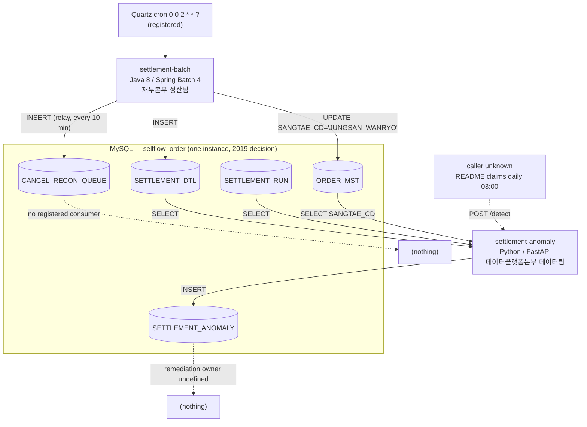

# settlement-batch vs settlement-anomaly — Side-by-Side

## Purpose

Two applications carry the settlement domain at Sellflow. `settlement-batch` computes and pays it; `settlement-anomaly` inspects the result afterwards. They read the same tables in the same MySQL schema, speak the same romanised Korean column vocabulary, and one of them contains a SQL column sequence copied verbatim from the other — yet they share no language, no build system, no migration tooling, no deployment pipeline, no owning division and no test convention.

This artifact puts the two side by side so an agent asked "how does settlement work" does not assume one coherent stack, and so anyone planning work across both knows which of the differences are load-bearing and which are accidents nobody decided.

## Key Facts

- The two applications sit in different divisions: `settlement-batch` belongs to 재무본부 정산팀 (팀장 김도윤, 3 people), `settlement-anomaly` to 데이터플랫폼본부 데이터팀 (팀장 윤서진, 7 people) → sources/context/org-chart.md, sources/context/registry/services.yaml
- They are separated by six years of platform generation: `settlement-batch` is Java 8 / Spring Boot 2.3.12 / Spring Batch 4 / Quartz (`sourceCompatibility = '1.8'`), `settlement-anomaly` is Python / FastAPI 0.104.1 / scikit-learn 1.3.2 → settlement-batch:build.gradle, settlement-anomaly:requirements.txt
- Both connect to the same schema. `settlement-batch` hardcodes `jdbc:mysql://${DB_HOST}:3306/sellflow_order` in `application.yml` and `settlement-anomaly` hardcodes `"database": "sellflow_order"` in `app/db.py`. The registry claims `db: MySQL (settlement)` for both; it is wrong for both → settlement-batch:src/main/resources/application.yml, settlement-anomaly:app/db.py, sources/context/registry/services.yaml
- The shared instance is a 2019 decision recorded only in a SQL comment: "주의: sellflow_order 와 동일 인스턴스를 사용한다. (2019년 통합 결정)" — "note: uses the same instance as sellflow_order (2019 consolidation decision)" → settlement-batch:src/main/resources/db/migration/V1__settlement_schema.sql
- `settlement-anomaly`'s `/detect` query selects `d.RUN_ID, d.ORD_NO, d.PARTNER_ID, d.JUNGSAN_AMT, d.SUSURYO` — the same five identifiers, in the same order, as the column list of `settlement-batch`'s `INSERT INTO SETTLEMENT_DTL (RUN_ID, ORD_NO, PARTNER_ID, JUNGSAN_AMT, SUSURYO)`. The sequence is byte-identical across the two repositories, with no shared schema definition, ORM, DTO or generated client to keep it that way → settlement-anomaly:app/main.py, settlement-batch:src/main/java/kr/co/sellflow/settlement/job/SettlementItemWriter.java
- Schema tooling diverges completely: `settlement-batch` runs Flyway (`spring.flyway.enabled: true`, `classpath:db/migration`, V1–V6), while `settlement-anomaly` has a single file `sql/V1__anomaly_schema.sql` named in Flyway's convention with no Flyway, no Alembic and no migration library in `requirements.txt` → settlement-batch:src/main/resources/application.yml, settlement-anomaly:sql/V1__anomaly_schema.sql, settlement-anomaly:requirements.txt
- Trigger mechanisms are not comparable: `settlement-batch` is driven by two registered Quartz triggers (cron `0 0 2 * * ?` Asia/Seoul, and a 10-minute simple schedule), `settlement-anomaly` exposes `POST /detect` and contains no scheduler at all — its README's claimed daily 03:00 trigger depends on an external caller found nowhere in the five repositories → settlement-batch:src/main/java/kr/co/sellflow/settlement/config/QuartzConfig.java, sources/infra/settlement/queues.md
- Deployment is asymmetric to the point of absence: `settlement-batch` has three GitHub Actions workflows (dev/stage/prod), all `workflow_dispatch`-only, all running `./gradlew clean build -x test`; `settlement-anomaly` has no workflow, no Dockerfile and no manifest — only a README line, `uvicorn app.main:app --port 8090` → settlement-batch:.github/workflows/settlement-batch-prod-cd.yml, settlement-anomaly:README.md
- Each repository has exactly one test, and neither tests its own production path. The Java test asserts `MoneyUtil.fee(14999, 0.1) == 1499` for a utility class `SettlementItemProcessor` never calls; the Python test asserts the string `"cancel_after_settle_flag"` is present in the `FEATURES` list, which `detector._amount_score` does not use → settlement-batch:src/test/java/kr/co/sellflow/settlement/job/SettlementItemProcessorTest.java, settlement-anomaly:tests/test_detector.py, settlement-anomaly:model/features.py
- Neither application authenticates anything. `settlement-batch` declares no `spring-boot-starter-web` and no `@RestController`, so it has no HTTP surface to protect; `settlement-anomaly` exposes two unauthenticated FastAPI routes on port 8090 with no dependency, middleware or API-key check → sources/apis/settlement/batch/openapi.meta.json, settlement-anomaly:app/main.py
- Both applications declare environment variables their code never reads. `settlement-batch/.env.dev` sets `DB_URL` and `QUARTZ_ENABLED`, neither of which is referenced; `settlement-anomaly/.env.template` sets `DB_URL` and `MODEL_PATH`, and `main.py` hardcodes the model path to a different value (`model/artifacts/iforest_v3.pkl` versus the template's `./model/detector.pkl`) → sources/infra/settlement/runtime.md, settlement-anomaly:app/main.py
- Both applications write exactly one table whose consumer is undefined. `settlement-batch` fills `CANCEL_RECON_QUEUE` (registry: `consumer: TODO   # 확인 필요` — "consumer: TODO, needs checking"), `settlement-anomaly` fills `SETTLEMENT_ANOMALY` (registry: "이상 탐지만 수행. 조치 주체는 정의되어 있지 않음. TODO" — "performs detection only; the party responsible for action is not defined") → sources/context/registry/services.yaml
- The domain vocabulary is genuinely shared and unversioned. `JUNGSAN_AMT`, `SUSURYO`, `SANGTAE_CD`, `JUNGSAN_ILJA`, `ORD_NO`, `RUN_ID` and the state literals `CHWISO`/`BANPUM` appear in both codebases, defined in neither — `settlement-anomaly` hardcodes `CANCELLED_STATES = {"CHWISO", "BANPUM"}` as a Python set literal against a column `settlement-batch` writes with a different literal (`'JUNGSAN_WANRYO'`) → settlement-anomaly:model/detector.py, settlement-batch:src/main/java/kr/co/sellflow/settlement/tasklet/MarkSettledTasklet.java
- `settlement-anomaly` is the newer service by two years of operation: the org chart change log records "2025-06-09 | settlement-anomaly 운영 시작 (데이터팀)" ("settlement-anomaly entered operation, data team"), while `settlement-batch` predates the 2019 DB consolidation note in its own V1 → sources/context/org-chart.md, settlement-batch:src/main/resources/db/migration/V1__settlement_schema.sql

## Scope

In scope: the two applications named in the service registry as `settlement-batch` and `settlement-anomaly`, compared across stack, deployment, data access, schema tooling, table ownership, testing, configuration, auth, org ownership and CI/CD; plus an assessment of what is genuinely shared between them and what diverges without a recorded reason.

Out of scope: the cancel-reconciliation causal chain ([[PROC-SETTLEMENT-CORRECTION]]), the queue backlog figures ([[RISK-SETTLEMENT-RECON-BACKLOG]]), the daily settlement job's internal steps ([[PROC-SETTLEMENT-DAILY-BATCH]]) and the detector's model quality ([[RISK-SETTLEMENT-ANOMALY]]). Those are traced elsewhere and are cited here only where a comparison row depends on them.

## Current State

### 1. Language and framework

| | settlement-batch | settlement-anomaly |
|---|---|---|
| Language | Java 8 (`sourceCompatibility = '1.8'`) | Python — README says 3.9, registry says 3.11, unresolved |
| Framework | Spring Boot 2.3.12.RELEASE, Spring Batch 4, Quartz | FastAPI 0.104.1, uvicorn 0.24.0 |
| Data / ML | — | scikit-learn 1.3.2 (IsolationForest) |
| Validation | none (raw `Map<String,Object>` rows) | pydantic 2.5.2 |
| Declared version | `version = '1.6.2'` in build.gradle | `FastAPI(title=..., version="1.4.0")` in code |
| Build | Gradle (`build.gradle`, Spring dependency-management plugin) | `requirements.txt`, 5 pinned packages, no lockfile, no venv config |
| HTTP surface | none — no `spring-boot-starter-web`, no controller | 2 routes: `POST /detect`, `GET /health` |

→ settlement-batch:build.gradle, settlement-anomaly:requirements.txt, settlement-anomaly:app/main.py, sources/apis/settlement/batch/openapi.meta.json

### 2. Deployment and trigger

| | settlement-batch | settlement-anomaly |
|---|---|---|
| Entry point | `SettlementBatchApplication` (Spring Boot main, no web port) | `uvicorn app.main:app --port 8090` (README only) |
| Scheduler | Quartz, JDBC job store, `isClustered: true` | none in the repository |
| Triggers | `dailySettlementTrigger` (cron `0 0 2 * * ?`, Asia/Seoul); `orderEventRelayTrigger` (every 10 min, forever) | none — `POST /detect` awaits an external caller |
| Claimed schedule | README: 매일 새벽 02:00 KST | README: "정산 배치 종료 후 (매일 03:00) 트리거된다" — "triggered after the settlement batch ends (daily 03:00)" |
| Actual caller | the registered Quartz triggers | **not found in any of the five repositories** |
| Startup coupling | none | `AnomalyDetector.load("model/artifacts/iforest_v3.pkl")` runs at module import; the artefact is absent from the repo |

The asymmetry matters more than it looks. `settlement-batch`'s schedule is a fact recorded in code that anyone can read; `settlement-anomaly`'s is a sentence in a README with nothing behind it. The extraction pass could not even import the app to dump its OpenAPI spec, because the model file it loads at import time is not in the repository → sources/apis/settlement/anomaly/openapi.meta.json, sources/infra/settlement/queues.md

### 3. Database access style

| | settlement-batch | settlement-anomaly |
|---|---|---|
| Driver | `mysql-connector-java`, Spring JDBC | `pymysql` 1.1.0 |
| Idiom | `JdbcTemplate.queryForList/update/queryForObject`, `JdbcCursorItemReader` for the chunked read | two module-level helpers, `fetch_all(sql, params)` and `execute(sql, params)` in `app/db.py` |
| ORM | none | none |
| Row shape | `Map<String, Object>` with UPPER-CASE keys, or `SettlementTargetRowMapper` → `SettlementTarget` | `pymysql.cursors.DictCursor` → dict with UPPER-CASE keys |
| Parameter style | positional `?` | named `%(name)s` |
| Connection | Spring-managed `DataSource`, pooled | a fresh `pymysql.connect(**DSN)` per call, inside a `with` block |
| Transactions | Spring Batch chunk boundaries; explicit per-statement otherwise | `conn.commit()` inside `execute()` — one commit per row inserted in the `/detect` loop |
| Schema reached | `sellflow_order` (application.yml) | `sellflow_order` (hardcoded in `db.py`) |

Both are hand-written SQL against the same schema with no shared definition. The one structural difference with a runtime consequence is commit granularity: `/detect` commits each anomaly row individually in a Python loop, so a partial detection run leaves a partial result set with no marker → settlement-anomaly:app/main.py, settlement-anomaly:app/db.py

### 4. Schema and migration tooling

| | settlement-batch | settlement-anomaly |
|---|---|---|
| Tool | Flyway (`spring.flyway.enabled: true`, `locations: classpath:db/migration`) | **none** |
| Files | V1–V6 under `src/main/resources/db/migration/` | one file, `sql/V1__anomaly_schema.sql` |
| Naming | Flyway `V{n}__{description}.sql` | Flyway `V{n}__{description}.sql` — the convention without the tool |
| Applied by | the application at startup | unknown; nothing in the repository applies it |
| Defects on record | V4 indexes `REG_DT`, a column V1 never defines; V5 adds `PROCESSED_AT`/`PROCESSED_BY` with the comment "아직 쓰는 코드는 없다" ("no code writes these yet"); V2/V6 build an orphan table | none in the DDL itself; the mismatch is that `app/schemas.py` defines an `AnomalyRow` with a `run_id` field and an `anomaly_type` field that the table does not have |
| Missing DDL | `SETTLEMENT_ADJUSTMENT` — referenced by an INSERT in `CancelReconciler`, created by no migration anywhere | — |

→ settlement-batch:src/main/resources/db/migration/V4__cancel_recon_queue_index.sql, settlement-batch:src/main/resources/db/migration/V5__add_recon_processed_columns.sql, settlement-anomaly:sql/V1__anomaly_schema.sql, sources/schemas/settlement/batch/schema.md

The anomaly repository copying Flyway's filename convention while running no migration tool is the single clearest sign of a stack imitated rather than adopted. Nothing applies that file; the table's existence in production is unexplained by either repository.

### 5. Tables owned vs tables read

| Table | settlement-batch | settlement-anomaly |
|---|---|---|
| `SETTLEMENT_RUN` | owns DDL (V1); reads `MAX(RUN_ID) WHERE SANGTAE='RUNNING'`; **never inserts** | reads (JOIN on `RUN_ID`, filter `JUNGSAN_ILJA`) |
| `SETTLEMENT_DTL` | owns DDL (V1); inserts | reads 5 columns |
| `CANCEL_RECON_QUEUE` | owns DDL (V1, V4, V5); inserts (relay); would update (`CancelReconciler`, unscheduled) | no access |
| `PARTNER_CONTRACT` | owns DDL (V3); `PartnerContractRepository` reads it but is never called | no access |
| `SETTLEMENT_RUN_LOG` | owns DDL (V2, V6); **no reader, no writer** | no access |
| `SETTLEMENT_ADJUSTMENT` | inserts (from the unscheduled reconciler); **no DDL anywhere** | no access |
| `SETTLEMENT_ANOMALY` | no access | owns DDL; inserts |
| `ORDER_MST` | reads (settlement reader) **and writes** (`MarkSettledTasklet` sets `SANGTAE_CD='JUNGSAN_WANRYO'`) | reads `SANGTAE_CD` only |
| `ORDER_DTL` | reads (JOIN in the settlement reader) | no access |
| `ORDER_EVENT_OUTBOX` | reads and updates `PUBLISHED_YN` | no access |

Both services reach across the ownership line into the order team's tables, but only one of them writes there. `MarkSettledTasklet` documents the exception in its own Javadoc: "ORDER_MST 는 주문팀 소유 테이블이나, 통합 DB 정책에 따라 정산 배치가 직접 갱신한다. (2019년 협의)" — "ORDER_MST is a table owned by the order team, but under the integrated-DB policy the settlement batch updates it directly (agreed in 2019)". `settlement-anomaly` stays read-only outside its own table → settlement-batch:src/main/java/kr/co/sellflow/settlement/tasklet/MarkSettledTasklet.java, sources/schemas/settlement/anomaly/schema.md

### 6. Test coverage

| | settlement-batch | settlement-anomaly |
|---|---|---|
| Test files | 1 (`SettlementItemProcessorTest.java`) | 1 (`tests/test_detector.py`) |
| Test methods | 1 (`수수료는_절사한다` — "the fee is truncated") | 1 (`test_cancel_flag_is_a_feature`) |
| What it asserts | `MoneyUtil.fee(14999, 0.1) == 1499` | `"cancel_after_settle_flag" in FEATURES` |
| What it covers of the class under test | nothing — the test is named for `SettlementItemProcessor` but never instantiates it; the processor uses `BigDecimal` + `HALF_UP` while `MoneyUtil` uses FLOOR | nothing — `FEATURES` is a module-level list; `detector._amount_score` feeds the model only `[jungsan_amt, susuryo]` |
| Test runner in CI | none — all three workflows build with `-x test` | none — no CI workflow exists |
| Framework | JUnit 5 via `spring-boot-starter-test` | plain assert, no pytest dependency declared in `requirements.txt` |

Neither repository's single test touches the code path that moves or judges money, and neither test would run in either deployment pipeline. Note that `settlement-batch`'s test is actively misleading — it certifies a rounding rule (FLOOR) that the production processor does not use (HALF_UP) → settlement-batch:src/test/java/kr/co/sellflow/settlement/job/SettlementItemProcessorTest.java, settlement-batch:src/main/java/kr/co/sellflow/settlement/job/SettlementItemProcessor.java, settlement-anomaly:tests/test_detector.py

### 7. Configuration surface

| | settlement-batch | settlement-anomaly |
|---|---|---|
| Config files | `application.yml`, `.env.dev` | `.env.template` |
| Vars actually read | `DB_HOST` (default `localhost`), `DB_USER` (default `sellflow`) | `DB_HOST` (default `localhost`), `DB_USER` (default `sellflow`) |
| Vars declared but unread | `DB_URL` (points at a separate `settlement` DB), `QUARTZ_ENABLED` | `DB_URL` (points at a separate `settlement` DB), `MODEL_PATH` |
| Per-environment config | `.env.dev` only; no stage or prod file in the repository | none |
| Hardcoded in code | schema name `sellflow_order`, fee rate `0.12`, chunk size 500, cron string | schema name `sellflow_order`, model path, port (README), `CANCELLED_STATES` |
| Password source | not present anywhere in the repository | not present anywhere in the repository |

The symmetry here is striking and is itself the finding: both repositories declare a `DB_URL` pointing at a `settlement` database, both ignore it, and both fall back to the same default user `sellflow` against the same hardcoded `sellflow_order` schema. Two teams, six years apart, produced the same configuration defect → sources/infra/settlement/runtime.md

### 8. Auth

| | settlement-batch | settlement-anomaly |
|---|---|---|
| Inbound auth | n/a — no HTTP surface exists | **none** — `POST /detect` and `GET /health` are unauthenticated |
| Outbound auth | DB credentials only (user from `DB_USER`, password source unidentified) | DB credentials only (same) |
| Network controls | no ingress, gateway or network policy in the repository | no ingress, gateway or network policy in the repository |
| Deploy-time auth | GitHub Actions `workflow_dispatch` (anyone with dispatch rights on the repo) | none — no pipeline |

`POST /detect` takes a single `jungsan_ilja` date and writes rows to a money-adjacent table, with no caller identity, no rate limit and no authorisation. See [[PROC-SETTLEMENT-AUTH]] for the full treatment → settlement-anomaly:app/main.py

### 9. Ownership

| | settlement-batch | settlement-anomaly |
|---|---|---|
| Registry `owner_team` | 정산팀 | 데이터팀 |
| Org-chart division | 재무본부 (Finance) | 데이터플랫폼본부 (Data Platform) |
| Team lead | 김도윤 | 윤서진 |
| Team headcount | 3 (reduced from 4 on 2024-07-01) | 7 (increased from 4 on 2025-09-01, "AI 과제 확대" — AI programme expansion) |
| Org-chart 담당 프로세스 | 파트너 정산 · 정산 오류 수기 정정 | 리포팅 · 지표 산출 · ETA 예측 모델 운영 · **이상 정산 탐지 모델 운영** |
| In-repo ownership note | V1 header: "담당: 재무본부 정산팀"; relay Javadoc: "담당: 재무본부 정산팀 (2023-04)" | README: "담당: 데이터플랫폼본부 데이터팀"; DDL header: "담당: 데이터플랫폼본부 데이터팀 (2025-06)" |
| Output remediation owner | undefined (`consumer: TODO   # 확인 필요`) | undefined ("조치 주체는 정의되어 있지 않음. TODO") |
| Registry last reviewed | `last_reviewed: 2026-03-02   # 이후 갱신 없음` — "no updates since" | same file, same date |

The headcount movements run in opposite directions across the same problem: the team that owns the money process lost a person in 2024-07 while the team that owns the detection model gained three in 2025-09. The 2026 automation plan cites the first explicitly as a reason to raise the automation priority: "정산팀 인원 조정(2024-07, 4명→3명) 이후 업무 부담이 증가했다는 의견이 있어 자동화 우선순위를 상향 조정하였다" — "after the settlement team headcount adjustment (2024-07, 4→3) there were views that the workload had increased, so the automation priority was raised" → sources/context/org-chart.md, sources/context/plans/2026_정산정정_AI에이전트_자동화_기획.md

### 10. CI/CD

| | settlement-batch | settlement-anomaly |
|---|---|---|
| Workflows | 3: `settlement-batch-{dev,stage,prod}-cd.yml` | **0** |
| Trigger | `workflow_dispatch` only, all three — no push, no tag, no PR | n/a |
| Build step | `./gradlew clean build -x test` (identical in all three) | n/a |
| Test step | none — explicitly skipped | n/a |
| Deploy step | `./deploy.sh $ENVIRONMENT` — the script is **not in the repository** | n/a |
| Container image | no Dockerfile in the repository | no Dockerfile in the repository |
| Environment differentiation | only the `ENVIRONMENT` env var; the three files are otherwise byte-for-byte the same | n/a |

The prod workflow is the same file as the dev workflow with one word changed, it never runs a test, and the thing it actually invokes is absent from version control. The anomaly service does not even have that → settlement-batch:.github/workflows/settlement-batch-prod-cd.yml, settlement-batch:.github/workflows/settlement-batch-dev-cd.yml

### What is genuinely shared

Three things, and only three.

**1. The MySQL instance.** Both resolve to the `sellflow_order` schema — `settlement-batch` through `application.yml`, `settlement-anomaly` through a hardcoded dict in `app/db.py`. So does `order-service` and so does `inventory-api`. This is not an integration; it is an absence of one. The two applications communicate by writing and reading each other's tables, with no API, no event, no contract and no foreign key between them. The reason is a 2019 decision that survives only as a comment in V1 → settlement-batch:src/main/resources/db/migration/V1__settlement_schema.sql, sources/infra/settlement/runtime.md, see [[DEC-SELLFLOW-SHARED-DB]]

**2. The settlement domain vocabulary.** `JUNGSAN_AMT` (정산액, settled amount), `SUSURYO` (수수료, fee), `JUNGSAN_ILJA` (정산일자, settlement date), `SANGTAE_CD` (상태코드, status code), `ORD_NO` (주문번호, order number) — romanised Korean identifiers used identically in Java string literals and Python string literals, defined in no shared artefact. The state vocabulary travels the same way: `settlement-batch` writes `'JUNGSAN_WANRYO'` into `ORDER_MST.SANGTAE_CD` and `settlement-anomaly` tests that same column against `{"CHWISO", "BANPUM"}`, two literals neither repository declares → settlement-batch:src/main/java/kr/co/sellflow/settlement/tasklet/MarkSettledTasklet.java, settlement-anomaly:model/detector.py, see [[PAT-SELLFLOW-ROMANISED-NAMING]]

**3. Overlapping SQL, copied rather than generated.** The clearest instance:

```
settlement-batch  INSERT INTO SETTLEMENT_DTL
                  (RUN_ID, ORD_NO, PARTNER_ID, JUNGSAN_AMT, SUSURYO)

settlement-anomaly  SELECT d.RUN_ID, d.ORD_NO, d.PARTNER_ID, d.JUNGSAN_AMT, d.SUSURYO,
                           m.SANGTAE_CD
                      FROM SETTLEMENT_DTL d ...
```

The five-identifier sequence `RUN_ID, ORD_NO, PARTNER_ID, JUNGSAN_AMT, SUSURYO` is byte-identical, in the same order, in a Java string concatenation and a Python string concatenation in two repositories owned by two divisions. Nothing keeps them aligned — there is no shared DDL package, no generated model, no view. If a V7 migration adds a column to `SETTLEMENT_DTL` or renames one, the writer changes in one repository and the reader silently does not change in the other. The anomaly service's read is also a deliberate complement to the batch's write: `settlement-batch`'s reader comments that "주문의 현재 상태나 취소 여부는 조건에 포함하지 않는다" ("the order's current status or whether it was cancelled is not part of the condition"), and `settlement-anomaly` exists to join exactly that omitted condition back in → settlement-batch:src/main/java/kr/co/sellflow/settlement/job/SettlementItemWriter.java, settlement-batch:src/main/java/kr/co/sellflow/settlement/config/DailySettlementJobConfig.java, settlement-anomaly:app/main.py

### What diverges without an evident reason

Divergences that a language or platform choice explains are not listed here. These are the ones where no source in the available material records a decision, and where the difference is not entailed by the stack.

| Divergence | batch | anomaly | Why it is not explained by the stack |
|---|---|---|---|
| Migration tooling | Flyway, V1–V6, applied at startup | Flyway *naming*, no tool | Python has Alembic and several alternatives; the repository picked neither, yet adopted the other stack's filename convention. No ADR, ticket or minute discusses it. |
| CI/CD existence | 3 workflows | none | Nothing about FastAPI prevents a workflow. The registry lists the service as operational since 2025-06. |
| Container packaging | none | none | Consistent, but consistently absent in both — so the divergence is with the registry's implied deployability, not between the two. |
| Test convention | JUnit 5, Korean method name, unused utility | bare assert, no pytest declared | Both repositories arrived at one vacuous test independently. |
| `DB_URL` handling | declared in `.env.dev`, unread | declared in `.env.template`, unread | The identical defect in two stacks suggests a copied template, not two decisions. |
| Output ownership | `consumer: TODO` | "조치 주체는 정의되어 있지 않음. TODO" | Two teams, two tables, the same unfilled field in the same registry file. |
| Declared vs actual DB | registry says `MySQL (settlement)` | registry says `MySQL (settlement)` | Both are wrong in the same direction; the registry was last reviewed 2026-03-02 and not updated since. |
| Python version | n/a | README 3.9 vs registry 3.11 | Nothing in the repository resolves it — no `.python-version`, no Dockerfile, no `python_requires`. |

The pattern across the table is not two teams making different engineering choices. It is one team's practices being partially imitated by another team that then stopped short — Flyway's filenames without Flyway, a `.env` template copied with its unread variables intact, a registry row filled in with the same `TODO` in the same field.

### How the two relate at runtime



→ settlement-batch:src/main/java/kr/co/sellflow/settlement/config/QuartzConfig.java, settlement-anomaly:app/main.py, sources/context/registry/services.yaml

### What this means for an agent working across both

- **Do not assume a change to one schema propagates.** There is no generated client and no contract test. A column added to `SETTLEMENT_DTL` by a Flyway migration in `settlement-batch` is invisible to `settlement-anomaly` until someone edits a Python string literal.
- **Do not treat `settlement-anomaly` as a running control.** Its trigger has no identified caller and its model artefact is not in the repository. Treat its output as latent until a caller is found.
- **Ask who, before asking how.** Any change touching both applications crosses a division boundary (재무본부 ↔ 데이터플랫폼본부) and both services' output tables have an explicitly undefined owner. The registry says so in both rows, and has not been reviewed since 2026-03-02.
- **Neither pipeline runs tests.** A change verified by the repository's own test suite is a change verified by one assertion about an unused utility.

## Related

- [[API-SETTLEMENT-ANOMALY]] — the two FastAPI routes and the missing caller
- [[API-SETTLEMENT-BATCH]] — why settlement-batch has no HTTP surface, and its Quartz-trigger surface instead
- [[DEC-SELLFLOW-SHARED-DB]] — the 2019 consolidation that makes table-level coupling possible
- [[PAT-SELLFLOW-ROMANISED-NAMING]] — the shared identifier vocabulary neither repository defines
- [[PROC-SELLFLOW-OWNERSHIP]] — the registry and org-chart ownership picture the comparison draws on
- [[PROC-SETTLEMENT-AUTH]] — the auth row above, in full
- [[PROC-SETTLEMENT-CORRECTION]] — the correction chain this artifact deliberately does not restate
- [[PROC-SETTLEMENT-DAILY-BATCH]] — the batch job's internal steps
- [[RISK-SETTLEMENT-ANOMALY]] — the detector's model and data-quality problems
- [[RISK-SETTLEMENT-RECON-BACKLOG]] — the measured exposure behind the unowned queue
- [[SYS-SETTLEMENT]] — the owning system
- [[SYS-SETTLEMENT-ANOMALY]] — the second application as a system
