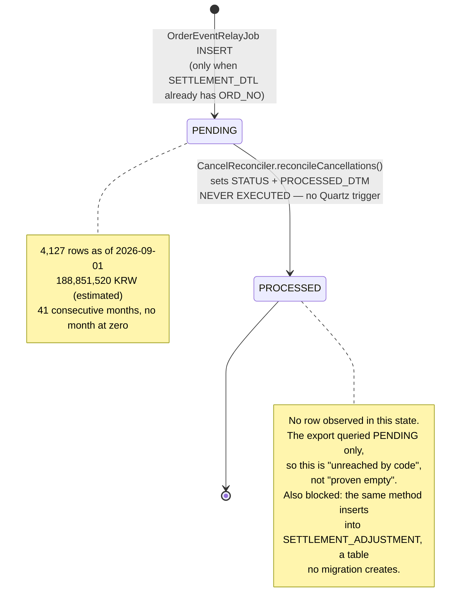

# CANCEL_RECON_QUEUE Row Lifecycle

## Purpose

One row of `CANCEL_RECON_QUEUE` is a claim: money has already been paid to a partner for an order the customer subsequently cancelled, and that amount should come back out of the partner's next payout. The row exists because SF-2287 (2023-04) removed `order-service`'s block on cancelling a settled order, and the compensation agreed in the ticket comments was that 정산팀 would deduct the amount the following month.

The row is written by a relay job that polls the order outbox. It is supposed to be read by `CancelReconciler`, which would insert a `SETTLEMENT_ADJUSTMENT` and flip the row to `PROCESSED`. That second half has never executed. This artifact follows a single row from the conditional `INSERT` that creates it to the `PROCESSED` state that no row has been shown to reach, and records exactly which columns have a writer and which do not.

## Key Facts

- The table has exactly one `INSERT` in all five repos, inside `OrderEventRelayJob.executeInternal`, and it is conditional: the relay first runs `SELECT COUNT(1) FROM SETTLEMENT_DTL WHERE ORD_NO = ?` and only inserts when that count is greater than zero → settlement-batch:src/main/java/kr/co/sellflow/settlement/relay/OrderEventRelayJob.java (lines 38-48)
- That condition is the whole definition of "already settled". It is a presence test against `SETTLEMENT_DTL`, not a check of `ORDER_MST.SANGTAE_CD`, so a row is queued exactly when a settlement detail line already exists for the order → settlement-batch:src/main/java/kr/co/sellflow/settlement/relay/OrderEventRelayJob.java
- The insert supplies three columns only — `ORD_NO`, `SAYU_CD`, `STATUS='PENDING'`. `SEQ` comes from `AUTO_INCREMENT`, `RECV_DTM` from `DEFAULT CURRENT_TIMESTAMP`, and `PROCESSED_DTM` is left null → settlement-batch:src/main/java/kr/co/sellflow/settlement/relay/OrderEventRelayJob.java, settlement-batch:src/main/resources/db/migration/V1__settlement_schema.sql
- `SAYU_CD` is extracted from the outbox payload by string search, not by JSON parsing: `s.indexOf("\"sayuCd\":\"")` then a fixed two-character slice, falling back to `"00"` when the marker is absent. `"00"` is not a defined cancel reason code in the business rules, so it is a silent sentinel → settlement-batch:src/main/java/kr/co/sellflow/settlement/relay/OrderEventRelayJob.java (lines 60-64), sellflow-docs:context/business-rules.md
- The outbox row is marked `PUBLISHED_YN='Y'` unconditionally, outside the `if`, so a cancellation of a not-yet-settled order is consumed and leaves no queue row — correct behaviour here, but it means the outbox cannot be replayed to rebuild the queue → settlement-batch:src/main/java/kr/co/sellflow/settlement/relay/OrderEventRelayJob.java (lines 50-52)
- The only transition out of `PENDING` lives in `CancelReconciler.reconcileCancellations()`, which per row inserts a `SETTLEMENT_ADJUSTMENT` with `ADJ_TYPE='CANCEL_CLAWBACK'` and then runs `UPDATE CANCEL_RECON_QUEUE SET STATUS='PROCESSED', PROCESSED_DTM=NOW() WHERE SEQ=?` → settlement-batch:src/main/java/kr/co/sellflow/settlement/recon/CancelReconciler.java (lines 32-52)
- Nothing calls that method. `QuartzConfig` declares four beans covering two jobs, `dailySettlementQuartzJob` and `orderEventRelayJob`; `CancelReconciler` is a bare `@Component` with no trigger, and `grep -rn "CancelReconciler\|reconcileCancellations"` across all five repos returns only its own class declaration, logger and method signature → settlement-batch:src/main/java/kr/co/sellflow/settlement/config/QuartzConfig.java, settlement-batch:src/main/java/kr/co/sellflow/settlement/recon/CancelReconciler.java
- The class says so itself, in a comment dated the day the relay shipped: "TODO Quartz 스케줄 등록 필요 (박성민님 확인 후 QuartzConfig 에 추가 예정) - 2023-04-24 김도윤" — "TODO: needs Quartz schedule registration; to be added to QuartzConfig after checking with 박성민. 2023-04-24, 김도윤" → settlement-batch:src/main/java/kr/co/sellflow/settlement/recon/CancelReconciler.java (lines 16-17)
- `SF-4512 CancelReconciler Quartz 스케줄 등록` was raised the same day, 2023-04-24, and is still `To Do`, priority `Low`, with an empty assignee in the 2026-S17 export → sellflow-docs:context/sprints/tickets_2026-S17.csv
- `PROCESSED_DTM` (V1) therefore has exactly one writer, and that writer has never run. `PROCESSED_AT` and `PROCESSED_BY` (V5) have no writer at all — a `grep -rn "PROCESSED_AT\|PROCESSED_BY\|processedAt\|processedBy"` across the five repos matches only the migration that creates them, and the migration admits it: "정정 처리 결과를 남기기 위한 컬럼. 아직 쓰는 코드는 없다." — "columns for recording the correction result. There is no code writing them yet." → settlement-batch:src/main/resources/db/migration/V5__add_recon_processed_columns.sql
- So the table carries two generations of completion columns, neither populated, and the older generation is the one the (unscheduled) code targets. Any future consumer has to choose between them, and the V5 pair is the one with an owner column → settlement-batch:src/main/resources/db/migration/V1__settlement_schema.sql, settlement-batch:src/main/resources/db/migration/V5__add_recon_processed_columns.sql
- V4 creates `IDX_CANCEL_RECON_STATUS ON CANCEL_RECON_QUEUE (STATUS, REG_DT)`, but V1 defines the timestamp column as `RECV_DTM`; `REG_DT` does not exist on this table. The usable index is V1's `IX_CANCEL_RECON_QUEUE_01 (STATUS, RECV_DTM)`, which is the one `loadPending()`'s `WHERE STATUS='PENDING' ORDER BY RECV_DTM` would use → settlement-batch:src/main/resources/db/migration/V4__cancel_recon_queue_index.sql, settlement-batch:src/main/resources/db/migration/V1__settlement_schema.sql
- The `PROCESSED` state may be unreachable rather than merely unscheduled: `SETTLEMENT_ADJUSTMENT` is inserted into by `CancelReconciler` but created by no migration in any of the five repos, and the 2025-03 handover records "`SETTLEMENT_ADJUSTMENT` 테이블이 문서에는 나오는데 실제로 조회가 안 됨" — "the SETTLEMENT_ADJUSTMENT table appears in the documents but cannot actually be queried" → settlement-batch:src/main/java/kr/co/sellflow/settlement/recon/CancelReconciler.java, sellflow-docs:context/handover/2025-03_정산팀_인수인계.md (§3)
- Nothing enforces one row per order: the primary key is the surrogate `SEQ`, there is no unique index on `ORD_NO`, and the relay's only idempotency guard is the outbox `PUBLISHED_YN` flag → settlement-batch:src/main/resources/db/migration/V1__settlement_schema.sql
- The service registry still records the consumer as unknown: `consumer: TODO   # 확인 필요` — "consumer: TODO, needs checking" — under `queues: - name: CANCEL_RECON_QUEUE`, in a file whose header says it is the single source of truth for services and was last reviewed 2026-03-02 → sellflow-docs:context/registry/services.yaml

## Fields

From `V1__settlement_schema.sql` plus the two columns added by `V5__add_recon_processed_columns.sql`.

| Column | Type | Nullability / default | Written by | Read by |
|---|---|---|---|---|
| `SEQ` | `BIGINT AUTO_INCREMENT` | PK | MySQL | `CancelReconciler.loadPending()` selects it; the `UPDATE` keys on it |
| `ORD_NO` | `VARCHAR(20)` | `NOT NULL` | `OrderEventRelayJob` — from `ORDER_EVENT_OUTBOX.ORD_NO` | `CancelReconciler` (into `SETTLEMENT_ADJUSTMENT`) |
| `SAYU_CD` | `VARCHAR(2)` | `NOT NULL` | `OrderEventRelayJob.sayuCd(payload)` — substring parse, `"00"` fallback | `CancelReconciler` (into `SETTLEMENT_ADJUSTMENT`) |
| `RECV_DTM` | `DATETIME` | `DEFAULT CURRENT_TIMESTAMP` | MySQL default; never set explicitly | `CancelReconciler` `ORDER BY`; the monthly export groups on it |
| `STATUS` | `VARCHAR(20)` | `DEFAULT 'PENDING'`, set explicitly to `'PENDING'` by the relay | `OrderEventRelayJob` (insert), `CancelReconciler` (update to `'PROCESSED'`, never executed) | `CancelReconciler.loadPending()`; the export's `WHERE` |
| `PROCESSED_DTM` | `DATETIME` | nullable, no default | `CancelReconciler` only — a component with no schedule | nothing |
| `PROCESSED_AT` | `DATETIME` | nullable (V5) | **nothing in any repo** | nothing |
| `PROCESSED_BY` | `VARCHAR(30)` | nullable (V5) | **nothing in any repo** | nothing |

Indexes: `IX_CANCEL_RECON_QUEUE_01 (STATUS, RECV_DTM)` from V1; `IDX_CANCEL_RECON_STATUS (STATUS, REG_DT)` from V4, naming a column this table does not define.

Not present, though the export's query references it: `EXPECTED_AMT`. A `grep -rn "EXPECTED_AMT"` across the five repos returns nothing. The queue therefore carries no amount of its own in the schema as committed — the money in the backlog figure comes from somewhere the code does not show.

## Relationships

| Related entity | Link | Cardinality | Enforced? |
|---|---|---|---|
| `ORDER_EVENT_OUTBOX` (order-service) | the relay reads `EVENT_TYPE='order.cancelled'` rows and may produce one queue row per event | 1 outbox row → 0..1 queue rows | No FK; the relay decides |
| `SETTLEMENT_DTL` | the existence test that gates the insert — `COUNT(1) ... WHERE ORD_NO = ?` | queue row implies ≥1 detail row at relay time | No FK; point-in-time check only |
| `ORDER_MST` | `ORD_NO` refers to the order whose `SANGTAE_CD` will be `CHWISO` or `BANPUM` | 1:0..n | No FK anywhere in the schema (V1 of order-service: "FK 제약 없음" — "no FK constraints") |
| `SETTLEMENT_ADJUSTMENT` | the intended output of processing a row | 1 queue row → 1 adjustment row | No migration creates the table |
| `SETTLEMENT_ANOMALY` | an independent second signal over an overlapping population (`CANCELLED_SETTLED`) | no key relationship at all | Not linked; the two tables never join |

The last row matters for anyone reconciling counts: `CANCEL_RECON_QUEUE` is defined by *an event having arrived*, `SETTLEMENT_ANOMALY.CANCELLED_SETTLED` by *the order's current state at detection time*. They are different populations that happen to overlap.

## Creation Path

```
order-service: cancel accepted
  → ORDER_EVENT_OUTBOX row, EVENT_TYPE='order.cancelled', PUBLISHED_YN='N'
      ↓  (orderEventRelayTrigger — simpleSchedule, every 10 minutes, repeatForever)
OrderEventRelayJob.executeInternal
  1. SELECT EVENT_ID, ORD_NO, PAYLOAD FROM ORDER_EVENT_OUTBOX
       WHERE PUBLISHED_YN='N' AND EVENT_TYPE='order.cancelled'
       ORDER BY REG_DTM LIMIT 500
  2. for each event:
       settled := SELECT COUNT(1) FROM SETTLEMENT_DTL WHERE ORD_NO = ?
       if settled > 0:
           INSERT INTO CANCEL_RECON_QUEUE (ORD_NO, SAYU_CD, STATUS)
             VALUES (?, sayuCd(PAYLOAD), 'PENDING')      ← the row is born here
           log "정산 정정 대기 등록 완료. ord_no={}"
       UPDATE ORDER_EVENT_OUTBOX SET PUBLISHED_YN='Y'    ← runs either way
```

Three properties of this path shape everything downstream:

1. **The gate is a count against `SETTLEMENT_DTL`.** If the cancel arrives before the nightly batch has written a detail line, no row is created and none is needed — the daily batch simply will not pick the order up... except that the batch's reader filters on `SANGTAE_CD='BAESONG_WANRYO'` and `DATE(UPD_DTM)`, and a cancel updates `SANGTAE_CD`, so the exclusion is incidental rather than designed. That interaction is traced in [[SCH-SETTLEMENT-FIELD-LINEAGE-SETTLEMENT-DTL]].
2. **There is no batching or transaction boundary per event.** Each `INSERT` and each outbox `UPDATE` is its own statement on the shared `JdbcTemplate` — neither the class nor `executeInternal` carries `@Transactional` (lines 27-28). Deep re-reading corrects an earlier wording here: the statements are ordered, so only one failure mode exists. The `INSERT` at lines 43-46 commits first and the ack at lines 50-52 second, so a crash between them leaves the outbox row at `'N'` with the queue row already written — the next run of the relay re-reads that event and inserts a second row for the same `ORD_NO`, which nothing constrains. The reverse (an acked event with no queue row) cannot arise from a crash; it arises only from the `if` at line 42 evaluating false, which is the designed path.
3. **Nothing records *why* a row was skipped.** The `log.info` fires only on insert.

## States and Transitions



`STATUS` is a two-value vocabulary in practice, and neither value is constrained by the schema — the column is a plain `VARCHAR(20)` with a default.

| `STATUS` | Set by | Meaning | Observed |
|---|---|---|---|
| `PENDING` | `OrderEventRelayJob` insert (and the column default) | awaiting deduction from the next month's payout | 4,127 rows, 2023-04 → 2026-08 |
| `PROCESSED` | `CancelReconciler` update — unscheduled | adjustment written, deduction claimed | none via code; the export did not look |

There is no `FAILED`, no `CANCELLED`, no retry counter and no error column. A row that could not be processed has nowhere to say so.

## Worked Examples

### 1. What a settlement analyst would run to see a row's full context

The queue carries no amount, so the money has to be fetched from `SETTLEMENT_DTL`, and the order's current state from `ORDER_MST`. All three tables live in the same MySQL instance (`sellflow_order`), which is what makes this join possible at all — see [[DEC-SELLFLOW-SHARED-DB]].

```sql
SELECT q.SEQ,
       q.ORD_NO,
       q.SAYU_CD,
       q.RECV_DTM,
       q.STATUS,
       q.PROCESSED_DTM,                      -- always NULL
       d.RUN_ID,
       d.PARTNER_ID,
       d.JUNGSAN_AMT,                        -- what the partner was paid
       d.SUSURYO,
       m.SANGTAE_CD,                         -- expect CHWISO or BANPUM
       r.JUNGSAN_ILJA
  FROM CANCEL_RECON_QUEUE q
  JOIN SETTLEMENT_DTL d ON d.ORD_NO = q.ORD_NO
  JOIN SETTLEMENT_RUN r ON r.RUN_ID = d.RUN_ID
  JOIN ORDER_MST     m ON m.ORD_NO = q.ORD_NO
 WHERE q.STATUS = 'PENDING'
 ORDER BY q.RECV_DTM
 LIMIT 50;
```

Expect `JOIN SETTLEMENT_DTL` to be one-to-many where an order was settled more than once (the 2025-07-12 duplicate-execution incident produced exactly that shape for 17 partners — see [[PROC-SETTLEMENT-RUN-LIFECYCLE]]). `PROCESSED_DTM`, `PROCESSED_AT` and `PROCESSED_BY` can be omitted; none has ever been written.

To answer the one question the 2026-09-01 export could not, because its `WHERE` excluded it:

```sql
SELECT STATUS, COUNT(*), MIN(RECV_DTM), MAX(PROCESSED_DTM)
  FROM CANCEL_RECON_QUEUE
 GROUP BY STATUS;
```

### 2. Enum tables

`STATUS` — see the table above.

`SAYU_CD` — the two-character cancel reason carried from the order payload. The codes are defined in the business-rules spreadsheet, not in any migration or enum class in `settlement-batch`:

| `SAYU_CD` | 사유 (reason) | 비용 부담 주체 (cost borne by) | 재고 복원 (restock) | 정산 차감 (settlement deduction) |
|---|---|---|---|---|
| `01` | 파트너 귀책 (재고부족·출고지연) — partner at fault (out of stock, late dispatch) | 파트너 (partner) | O | O |
| `02` | 시스템 오류 — system error | 셀플로우 (Sellflow) | O | O |
| `03` | 고객 변심 — customer changed their mind | 셀플로우 (Sellflow) | X | O |
| `04` | 배송 실패 (주소불명·수취거부) — delivery failed (bad address, refused) | 파트너 (partner) | O | O |
| `00` | **not a defined code** — the relay's fallback when the payload has no `sayuCd` marker | — | — | — |

Every defined reason code carries 정산 차감 = O, "deduct from settlement". That is the whole justification for the queue: the business rules say all four reasons require a deduction, and the same sheet states the split explicitly — 정산 실행 전 취소 → exclude the order from settlement; 정산 실행 후 취소 → 정산팀이 차월 정산에서 수기 차감 ("Settlement deducts it manually from the following month's settlement") → sellflow-docs:context/business-rules.md

### 3. The monthly distribution, and what it does to the 2026 plan's sizing

The export at `sources/raw/exports/cancel_recon_queue_monthly_20260901.csv` has 41 monthly rows plus a total line. Recomputed from the file on 2026-09-19:

| Measure | Value |
|---|---|
| Months covered | 41 — first `2023-04`, last `2026-08`, no gaps |
| Total `PENDING` rows | 4,127 |
| Total estimated amount | 188,851,520 KRW |
| Mean run rate | **100.7 rows/month** |
| Trailing 12 months (2025-09 → 2026-08) | 1,742 rows — **145.2/month** |
| First 12 months (2023-04 → 2024-03) | 679 rows — 56.6/month |
| Smallest month | `2023-05`, 34 rows |
| Largest month | `2026-06`, 163 rows |
| Rows by year | 2023 (9 months): 485 · 2024: 987 · 2025: 1,450 · 2026 (8 months): 1,205 |

Against the figure the 2026 automation plan is sized on — "현행 처리량은 정산팀 확인 결과 **월 10건 내외**로 파악된다" ("current throughput is understood to be around 10 cases a month, per 정산팀's check") — the arithmetic is unambiguous:

- **10.1×** the plan's figure on the 41-month average;
- **14.5×** on the trailing twelve months;
- and the gap is widening, because the rate has risen in every year measured.

The 10-a-month number is not an observation. It is a 2023 forecast: 김도윤 wrote in SF-2287 on 2023-04-07 "CS팀 통계 보니 실제 정산 후 취소로 이어지는 건은 **월 10건 미만**일 것으로 예상됩니다. 당분간은 수기로 충분합니다." — "looking at CS's statistics, I expect fewer than 10 cases a month actually lead to a post-settlement cancellation. Manual handling is sufficient for now." Procedure v0.3 §5 (2023-05-02) then hardened the forecast into a rule — "예상 처리량 월 10건 미만. 별도 시스템 없이 수기로 처리한다" ("expected throughput under 10 a month; handle manually with no dedicated system") — and the 2026 plan cites it back as a present-tense measurement three years later. The kickoff minutes show the room knew it was soft: 이수민 said "요즘은 좀 더 되는 것 같기는 한데 정확히 세어보진 않았습니다." — "it feels like rather more these days, but we've never counted precisely." The action item 현행 월 처리 건수 실측 ("measure the actual monthly volume") was left with no due date → sellflow-docs:context/plans/2026_정산정정_AI에이전트_자동화_기획.md, sellflow-docs:context/tickets/SF-2287.md, sellflow-docs:context/policy/정산_정정_업무절차_v0.3.md, sellflow-docs:context/minutes/2026-06-18_정산정정_자동화_킥오프.md

Two properties of the file should stop anyone from treating it as a ledger:

- **Every monthly amount is exactly `count × 45,760`.** All 41 rows divide evenly, remainder zero, and `4,127 × 45,760 = 188,851,520`. The amount column is a flat per-case estimate applied uniformly, not a sum of distinct order values — which is consistent with the header calling it 추정 미정정 금액 ("estimated uncorrected amount") and inconsistent with reading it as a balance.
- **The column it claims to sum does not exist in the committed schema.** The README's recorded query is `SUM(EXPECTED_AMT)`; `EXPECTED_AMT` appears in no migration in any repo.

### 4. The re-extraction warning, verbatim

The export README opens with it, and it governs every number above:

> "이 폴더의 파일은 특정 시점에 운영 DB 에서 뽑은 것이다. **재추출 없이 그대로 인용하지 말 것.**"

"The files in this folder were pulled from the production DB at a particular point in time. **Do not cite them as-is without re-extracting.**"

The instruction is load-bearing for three reasons the README itself supplies. First, the extraction is a snapshot: 2026-09-01 14:22, `settlement_prod` read replica, run by 윤서진 (데이터팀) at the request of 문지영 (재무기획팀) — and at ~145 rows a month the queue has grown by well over a thousand rows since. Second, the query's scope was narrower than the table: "STATUS 가 PENDING 외의 값을 가진 행은 조회되지 않았다." — "rows with a STATUS other than PENDING were not returned" — so the file cannot be used to prove that nothing has ever been processed; only the code can, and it does. Third, the figure is blind to work done outside the system: "수기 정정분이 시스템 밖에서 처리되었다면 이 수치에 반영되지 않는다." — "if manual corrections were handled outside the system, they are not reflected in these figures" — which the 2025-03 handover confirms is exactly the practice, with corrections tracked in individual spreadsheets. And re-extraction is not self-service: "스크립트 위치 TBD — 현재는 DBA 에게 요청" ("script location TBD; for now, ask the DBA") → sellflow-docs:raw/exports/README.md, sellflow-docs:context/handover/2025-03_정산팀_인수인계.md

## Agent Guidance

- **Do not describe a row as "processed" or "deducted" on the strength of `STATUS`.** `PROCESSED` is written by one method in one unscheduled class. If you find a `PROCESSED` row, that is new information worth escalating, not confirmation the pipeline works.
- **Never quote 4,127 / 188,851,520 KRW without the README's caveats.** Present them as "recorded as awaiting deduction as of 2026-09-01", never as "owed". The amount is a flat estimate; the count is `PENDING`-only; both are a snapshot.
- **When asked "how many cases a month?", answer from the export, not from the documents.** The documents say ~10; the data says ~101 on average and ~145 lately. Anyone planning capacity off the documents is planning for a tenth of the work.
- **Treat `SAYU_CD='00'` as a parse failure, not a reason.** It means the relay's substring search did not find `"sayuCd":"` in the payload.
- **Before proposing "just schedule `CancelReconciler`", check `SETTLEMENT_ADJUSTMENT` exists.** The method's first statement inserts into it; no migration creates it; the handover says it cannot be queried. Scheduling the job without that table turns a silent backlog into a loud one.
- **If you write a consumer, pick the completion columns deliberately.** V1's `PROCESSED_DTM` is what the existing code targets; V5's `PROCESSED_AT`/`PROCESSED_BY` is the pair with an actor column, which is what procedure v1.1 §5's five-year retention of correction history would actually need.
- **Do not join this table to `SETTLEMENT_ANOMALY` and expect agreement.** Different definitions, different populations, no key between them.

## Related

- [[PROC-SELLFLOW-CANCEL-MONEY-PATH]] — the nine-hop chain this row sits at hop six of, traced line by line
- [[PROC-SETTLEMENT-CORRECTION]] — the business workflow the row is embedded in, with the full ownership history
- [[PROC-SETTLEMENT-RUN-LIFECYCLE]] — where `SETTLEMENT_DTL` comes from, which is what the insert gate tests
- [[RISK-SETTLEMENT-RECON-BACKLOG]] — the financial exposure these rows add up to
- [[SCH-SETTLEMENT-BATCH]] — the table alongside the rest of the settlement schema
- [[SCH-SETTLEMENT-FIELD-LINEAGE-SETTLEMENT-DTL]] — why the daily batch is blind to cancellation in the first place
- [[SYS-ORDER]] — the producer of the events the relay consumes
- [[SYS-SETTLEMENT]] — the owning service
- [[DEC-SELLFLOW-SHARED-DB]] — the shared instance that lets the relay test `SETTLEMENT_DTL` with a plain `SELECT`
