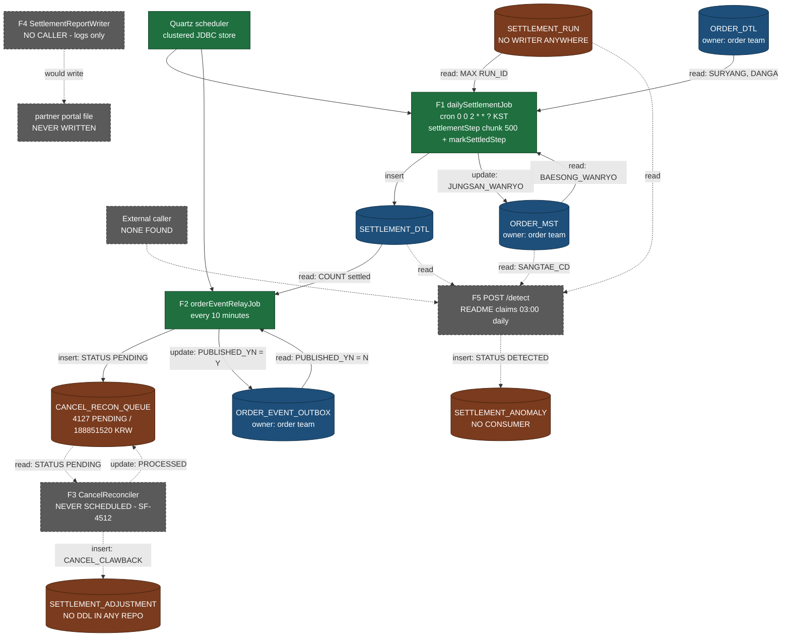

# Settlement Flow Catalog

## Purpose

Enumerate every executable flow across `settlement-batch` and `settlement-anomaly` in one place, and state for each one — from code, not from documentation — what triggers it, what it reads and writes, how it ends, what it does on failure, and whether it actually runs. The last column is the reason this artifact exists: three of the five flows in this domain have no trigger, and two of those three are the flows that would correct money and report it to partners.

Sibling artifacts go deeper on individual flows ([[PROC-SETTLEMENT-DAILY-BATCH]], [[PROC-SETTLEMENT-CORRECTION]]) and on failure behaviour ([[PROC-SETTLEMENT-ERROR-HANDLING]]). This one is the index.

## Key Facts

- `QuartzConfig` is the domain's entire scheduler, and it registers exactly two `JobDetail`/`Trigger` pairs: `dailySettlementQuartzJob` on cron `0 0 2 * * ?` in `Asia/Seoul`, and `orderEventRelayJob` on a simple schedule of `withIntervalInMinutes(10).repeatForever()` → `settlement-batch:src/main/java/kr/co/sellflow/settlement/config/QuartzConfig.java`
- There is no second scheduler anywhere: settlement-anomaly's `requirements.txt` contains FastAPI, uvicorn, scikit-learn, pymysql and pydantic and no scheduling library, and neither repo holds a cron file, systemd unit or scheduled CI workflow → `settlement-anomaly:requirements.txt`, `sellflow-docs:infra/settlement/runtime.md`
- `spring.batch.job.enabled: false` prevents Spring Batch from auto-launching at startup, so Quartz is the sole trigger for F1 → `settlement-batch:src/main/resources/application.yml`
- Quartz runs in clustered JDBC mode (`job-store-type: jdbc`, `org.quartz.jobStore.isClustered: true`), which places the trigger state in the same shared MySQL instance as the settlement data → `settlement-batch:src/main/resources/application.yml`, `sellflow-docs:infra/settlement/runtime.md`
- **F1 `dailySettlementJob` runs.** Two steps in order — `settlementStep` (chunk 500: `JdbcCursorItemReader` → `SettlementItemProcessor` → `SettlementItemWriter`) then `markSettledStep` (a tasklet) — wired `.start(settlementStep).next(markSettledStep)` → `settlement-batch:src/main/java/kr/co/sellflow/settlement/config/DailySettlementJobConfig.java`
- **F2 `orderEventRelayJob` runs.** It polls `ORDER_EVENT_OUTBOX` for `PUBLISHED_YN='N' AND EVENT_TYPE='order.cancelled'`, `ORDER BY REG_DTM LIMIT 500`, conditionally inserts into `CANCEL_RECON_QUEUE`, and acks every row it inspects → `settlement-batch:src/main/java/kr/co/sellflow/settlement/relay/OrderEventRelayJob.java`
- The 500-row cap at a 10-minute interval gives a ceiling of roughly 3,000 cancel events per hour → `sellflow-docs:infra/settlement/queues.md`
- **F3 `CancelReconciler.reconcileCancellations()` does not run.** It is a `@Component` with a public method, no Quartz registration, and no caller in any of the five repos; its own javadoc records the omission — "TODO Quartz 스케줄 등록 필요 (박성민님 확인 후 QuartzConfig 에 추가 예정) - 2023-04-24 김도윤" ("TODO: needs Quartz schedule registration, to be added to QuartzConfig after checking with 박성민") → `settlement-batch:src/main/java/kr/co/sellflow/settlement/recon/CancelReconciler.java`, `settlement-batch:src/main/java/kr/co/sellflow/settlement/config/QuartzConfig.java`
- **F4 `SettlementReportWriter.write(runId)` does not run**, and would do nothing if it did: the method body is a single `log.info("settlement report written runId={}", runId)` under a javadoc promising a file that the partner portal reads → `settlement-batch:src/main/java/kr/co/sellflow/settlement/report/SettlementReportWriter.java`
- **F5 `POST /detect` runs only if something outside these repos calls it.** No caller exists in any of the five repos, settlement-batch has no HTTP client in `build.gradle`, and the extracted infra notes file this endpoint under "Unscheduled / externally triggered" — while the service's README asserts "정산 배치 종료 후 (매일 03:00) 트리거된다." ("triggered after the settlement batch finishes, daily at 03:00") → `settlement-anomaly:app/main.py`, `settlement-anomaly:README.md`, `sellflow-docs:infra/settlement/queues.md`
- The two flows that run are the two the service's README documents; the three that do not are documented only in javadoc, in a README table of detection types, or not at all → `settlement-batch:README.md`, `settlement-anomaly:README.md`
- Across all five flows, `CANCEL_RECON_QUEUE` is written by one flow (F2) and read by one flow (F3) — and F3 is the one that does not run, which is the whole of [[RISK-SETTLEMENT-RECON-BACKLOG]] in one sentence → `settlement-batch:src/main/java/kr/co/sellflow/settlement/relay/OrderEventRelayJob.java`, `settlement-batch:src/main/java/kr/co/sellflow/settlement/recon/CancelReconciler.java`
- `SETTLEMENT_DTL` is the domain's hub: written by F1, read by F2 (the `COUNT(1)` settled check), read by F5's join, and read by F1's own `markSettledStep` subquery → `settlement-batch:src/main/java/kr/co/sellflow/settlement/job/SettlementItemWriter.java`, `settlement-batch:src/main/java/kr/co/sellflow/settlement/relay/OrderEventRelayJob.java`, `settlement-anomaly:app/main.py`, `settlement-batch:src/main/java/kr/co/sellflow/settlement/tasklet/MarkSettledTasklet.java`
- `SETTLEMENT_RUN` is read by two flows (F1's writer and F1's tasklet, plus F5's join) and written by none — no `INSERT INTO SETTLEMENT_RUN` exists in any repo → `settlement-batch:src/main/java/kr/co/sellflow/settlement/job/SettlementItemWriter.java`, `settlement-anomaly:app/main.py`, `settlement-batch:src/main/resources/db/migration/V1__settlement_schema.sql`
- Two flows write tables owned by another team: F1's `markSettledStep` updates `ORDER_MST`, and F2 updates `ORDER_EVENT_OUTBOX`. Both are direct SQL under the 2019 shared-database agreement, with no API and no authorisation step → `settlement-batch:src/main/java/kr/co/sellflow/settlement/tasklet/MarkSettledTasklet.java`, `settlement-batch:src/main/java/kr/co/sellflow/settlement/relay/OrderEventRelayJob.java`
- Only one flow has any error handling at all: F1's Quartz wrapper catches `Exception` and rethrows it as `IllegalStateException`. F2, F3, F4 and F5 have no try/catch → `settlement-batch:src/main/java/kr/co/sellflow/settlement/job/DailySettlementQuartzJob.java`
- No flow is idempotent. F1's `ts` job parameter makes every launch a new `JobInstance`; F2 has no dedupe beyond the `PUBLISHED_YN` flag it sets itself; F5's insert has no uniqueness guard and its table no unique constraint → `settlement-batch:src/main/java/kr/co/sellflow/settlement/job/DailySettlementQuartzJob.java`, `settlement-anomaly:sql/V1__anomaly_schema.sql`

## Input / Output

| Flow | Trigger | Reads | Writes | Runs? |
|---|---|---|---|---|
| **F1** `dailySettlementJob` | Quartz cron `0 0 2 * * ?` Asia/Seoul | `ORDER_MST`, `ORDER_DTL`, `SETTLEMENT_RUN`, `SETTLEMENT_DTL` | `SETTLEMENT_DTL`, `ORDER_MST` | **Yes — inferred**† |
| **F2** `orderEventRelayJob` | Quartz simple, every 10 min, forever | `ORDER_EVENT_OUTBOX`, `SETTLEMENT_DTL` | `CANCEL_RECON_QUEUE`, `ORDER_EVENT_OUTBOX` | **Yes — inferred**† |
| **F3** `CancelReconciler` | none — no registration, no caller | `CANCEL_RECON_QUEUE` | `SETTLEMENT_ADJUSTMENT`, `CANCEL_RECON_QUEUE` | **No** |
| **F4** `SettlementReportWriter` | none — no caller | nothing | nothing (a log line) | **No** |
| **F5** `POST /detect` | external HTTP, caller unidentified | `SETTLEMENT_DTL`, `SETTLEMENT_RUN`, `ORDER_MST` | `SETTLEMENT_ANOMALY` | **Unknown — no caller found** |

† **What "runs" means here, and what it does not.** Three claims have to stay
separate. (a) `QuartzConfig` registers both triggers — verified from code. (b) The service
registry records `schedule: 매일 02:00 KST` — a document, consistent with the cron. (c) That
the job is deployed and firing in production — **not verifiable from these repositories**, as
[[API-SETTLEMENT-BATCH]] states, because `deploy.sh` and any production profile live outside
them. The inference to **Yes** rests on data rather than on deployment evidence: the
2026-09-01 export shows `CANCEL_RECON_QUEUE` rows in all 41 consecutive months since 2023-04,
and F2 inserts a row only when `SETTLEMENT_DTL` already holds the order — so F1 and F2 were
both producing over that window. That is strong evidence of past execution, not a statement
about the current deployment.

### Flow dependency diagram

Solid boxes and arrows are flows and data paths that run. Dashed boxes and arrows are written-but-unreachable code. Each edge is labelled with the table it touches.

The shape to notice: money flows left to right through F1 every night and lands in `SETTLEMENT_DTL` and `ORDER_MST`. Every path that would take money *back* — F3's clawback into `SETTLEMENT_ADJUSTMENT` — is dashed. `CANCEL_RECON_QUEUE` sits on the boundary: a live flow fills it, a dead flow would drain it.

## Steps / Phases

### F1 — `dailySettlementJob` · runs

- **Trigger:** `dailySettlementTrigger`, cron `0 0 2 * * ?`, `TimeZone Asia/Seoul` → `settlement-batch:src/main/java/kr/co/sellflow/settlement/config/QuartzConfig.java`
- **Launch:** `DailySettlementQuartzJob.executeInternal` builds `jungsanIlja = LocalDate.now().minusDays(1).toString()` and `ts = System.currentTimeMillis()`, then calls `jobLauncher.run(...)` → `settlement-batch:src/main/java/kr/co/sellflow/settlement/job/DailySettlementQuartzJob.java`
- **Step 1 `settlementStep`** (chunk 500): reads `ORDER_MST` joined to `ORDER_DTL` where `SANGTAE_CD='BAESONG_WANRYO' AND DATE(UPD_DTM)=?`, computes `fee = gross × 0.12` rounded `HALF_UP`, and inserts one `SETTLEMENT_DTL` row per item under `RUN_ID = MAX(RUN_ID) WHERE SANGTAE='RUNNING'` → `settlement-batch:src/main/java/kr/co/sellflow/settlement/config/DailySettlementJobConfig.java`, `settlement-batch:src/main/java/kr/co/sellflow/settlement/job/SettlementItemProcessor.java`, `settlement-batch:src/main/java/kr/co/sellflow/settlement/job/SettlementItemWriter.java`
- **Step 2 `markSettledStep`** (tasklet): `UPDATE ORDER_MST SET SANGTAE_CD='JUNGSAN_WANRYO', UPD_DTM=NOW()` for every order in the latest run → `settlement-batch:src/main/java/kr/co/sellflow/settlement/tasklet/MarkSettledTasklet.java`
- **Terminal states:** `COMPLETED` (both steps done) or `FAILED` (any exception, with prior chunks committed). There is no `STOPPED` path, no `ExitStatus` customisation and no completion callback → `settlement-batch:src/main/java/kr/co/sellflow/settlement/config/DailySettlementJobConfig.java`
- **Note:** the two steps disagree on which run is current — the writer filters `SANGTAE='RUNNING'`, the tasklet uses a bare `MAX(RUN_ID)` → `settlement-batch:src/main/java/kr/co/sellflow/settlement/job/SettlementItemWriter.java`, `settlement-batch:src/main/java/kr/co/sellflow/settlement/tasklet/MarkSettledTasklet.java`

### F2 — `orderEventRelayJob` · runs

- **Trigger:** `orderEventRelayTrigger`, `SimpleScheduleBuilder.simpleSchedule().withIntervalInMinutes(10).repeatForever()` → `settlement-batch:src/main/java/kr/co/sellflow/settlement/config/QuartzConfig.java`
- **Steps:** select up to 500 unpublished `order.cancelled` events; for each, `SELECT COUNT(1) FROM SETTLEMENT_DTL WHERE ORD_NO=?`; if greater than zero, insert a `PENDING` row into `CANCEL_RECON_QUEUE` with a reason code parsed by `substring`; then unconditionally `UPDATE ORDER_EVENT_OUTBOX SET PUBLISHED_YN='Y'` → `settlement-batch:src/main/java/kr/co/sellflow/settlement/relay/OrderEventRelayJob.java`
- **Terminal states:** the method returns after the loop; there is no completion record beyond a log line, and no run row. A partially completed run leaves earlier events acked and later ones not.
- **Purpose of record:** SF-2287, quoted in the README — "별도 메시지 브로커 없이 `ORDER_EVENT_OUTBOX` 를 폴링하여 정산 후 취소 건을 `CANCEL_RECON_QUEUE` 에 적재한다" ("without a separate message broker, it polls ORDER_EVENT_OUTBOX and loads post-settlement cancellations into CANCEL_RECON_QUEUE") → `settlement-batch:README.md`

### F3 — `CancelReconciler.reconcileCancellations()` · does not run

- **Trigger:** none. `QuartzConfig` has no bean for it and grep finds no caller in any repo → `settlement-batch:src/main/java/kr/co/sellflow/settlement/config/QuartzConfig.java`
- **Steps as written:** `loadPending()` selects `SEQ, ORD_NO, SAYU_CD, RECV_DTM` where `STATUS='PENDING'` ordered by `RECV_DTM`; for each row, insert into `SETTLEMENT_ADJUSTMENT` with `ADJ_TYPE='CANCEL_CLAWBACK'`, then `UPDATE CANCEL_RECON_QUEUE SET STATUS='PROCESSED', PROCESSED_DTM=NOW()`; return the count. An empty queue logs 정정 대상 없음 ("no correction targets") and returns 0 → `settlement-batch:src/main/java/kr/co/sellflow/settlement/recon/CancelReconciler.java`
- **Terminal states as written:** a queue row would move `PENDING → PROCESSED`. No row has ever made that transition, because the flow has no trigger; the export shows 4,127 rows still `PENDING` → `sellflow-docs:raw/exports/cancel_recon_queue_monthly_20260901.csv`
- **It would fail on its first row even if scheduled:** no migration in any of the five repos creates `SETTLEMENT_ADJUSTMENT`, and the 2025 handover records "`SETTLEMENT_ADJUSTMENT` 테이블이 문서에는 나오는데 실제로 조회가 안 됨. WIP" ("the SETTLEMENT_ADJUSTMENT table appears in the documentation but cannot actually be queried") → `sellflow-docs:context/handover/2025-03_정산팀_인수인계.md` (§3)
- **Loads no batch infrastructure:** it is a plain `@Component`, not a `QuartzJobBean` and not a Spring Batch job, so scheduling it would also require writing the job wrapper → `settlement-batch:src/main/java/kr/co/sellflow/settlement/recon/CancelReconciler.java`

### F4 — `SettlementReportWriter.write(runId)` · does not run

- **Trigger:** none. No step, tasklet, listener or other class references it → `settlement-batch:src/main/java/kr/co/sellflow/settlement/report/SettlementReportWriter.java`
- **Steps as written:** one log line. The javadoc describes a different program: "정산 결과 요약을 파일로 떨군다. 파트너 포털이 이 파일을 읽어간다." ("drops a settlement result summary to a file; the partner portal reads this file")
- **Terminal states:** none; the method returns void after logging.
- **Known gap even in the intended design:** its TODO says corrections would be excluded anyway — "TODO(도윤) 2024-11-02: 취소 정정분은 이 리포트에 포함되지 않는다. 별도 확인 필요." ("cancellation corrections are not included in this report; needs separate checking") → `settlement-batch:src/main/java/kr/co/sellflow/settlement/report/SettlementReportWriter.java`

### F5 — `POST /detect` · externally triggered, by nobody found

- **Trigger:** an HTTP request. No caller was found in any of the five repos, and the only candidate scheduler in the domain, `QuartzConfig`, registers nothing that performs HTTP → `settlement-anomaly:app/main.py`, `settlement-batch:src/main/java/kr/co/sellflow/settlement/config/QuartzConfig.java`
- **Steps:** one SELECT joining `SETTLEMENT_DTL` → `SETTLEMENT_RUN` (on `RUN_ID`, filtered by `JUNGSAN_ILJA`) → `ORDER_MST` (on `ORD_NO`); score each row; insert one `SETTLEMENT_ANOMALY` row per hit with `STATUS='DETECTED'` → `settlement-anomaly:app/main.py`
- **Terminal states:** HTTP 200 with `{"detected": n, "jungsan_ilja": ...}`. Rows terminate at `DETECTED` — no code anywhere advances them → `settlement-anomaly:app/main.py`, `settlement-anomaly:sql/V1__anomaly_schema.sql`
- **Startup dependency:** the model pickle is loaded at import scope from the hardcoded path `model/artifacts/iforest_v3.pkl`, which is not in the repository, so the process cannot start without an artefact obtained from somewhere undocumented → `settlement-anomaly:app/main.py`
- Detailed in [[RISK-SETTLEMENT-ANOMALY]] and [[API-SETTLEMENT-ANOMALY]].

## Error Handling

Summarised here; traced in full in [[PROC-SETTLEMENT-ERROR-HANDLING]].

| Flow | On failure | Retry | Idempotent | Alert |
|---|---|---|---|---|
| F1 | Chunk rolls back, job `FAILED`, prior chunks committed; `markSettledStep` never runs | None. The `ts` parameter makes the next launch a new instance, never a restart | No — a re-run either duplicates under a new `RUN_ID` or hits `PRIMARY KEY (RUN_ID, ORD_NO)` | None in code; external run-history alerting referenced by the postmortem and SF-5099 |
| F2 | No try/catch; run aborts. Each statement auto-commits, so acked rows stay acked and the failing row stays `'N'` | Accidental but effective: the next 10-minute poll resumes at the failing row | No, and worse — it acks events it took no action on, permanently dropping pre-settlement cancellations | None |
| F3 | n/a — never executes. Would have no fault tolerance if it did, and its first INSERT targets a table with no DDL | n/a | No | n/a |
| F4 | n/a — never executes; cannot fail, and cannot succeed | n/a | n/a | n/a |
| F5 | No try/catch; an exception returns HTTP 500 with rows already inserted for earlier hits in the loop | None | No — repeated calls duplicate rows | None |

→ `settlement-batch:src/main/java/kr/co/sellflow/settlement/job/DailySettlementQuartzJob.java`, `settlement-batch:src/main/java/kr/co/sellflow/settlement/relay/OrderEventRelayJob.java`, `settlement-anomaly:app/main.py`, `settlement-batch:src/main/resources/db/migration/V1__settlement_schema.sql`

The one recorded operational failure in this catalog was not a flow failing but a flow running twice: on 2025-07-12 two Quartz instances triggered F1 simultaneously at 02:04, duplicate payment requests appeared at 02:11 for 17 partners (≈42,000,000 KRW), and the condition was recognised at 08:40 through a partner enquiry. Quartz clustering was fixed on both nodes on 2025-07-14; the application-level idempotency key remains unassigned → `sellflow-docs:context/runbooks/장애회고_2025-07-12_정산배치_중복실행.md`

## Related

- [[PROC-SETTLEMENT-DAILY-BATCH]] — F1 traced phase by phase
- [[PROC-SETTLEMENT-CORRECTION]] — F2 and F3 as a business process, and what fills the gap
- [[PROC-SETTLEMENT-ERROR-HANDLING]] — the failure, retry and alerting behaviour summarised above
- [[RISK-SETTLEMENT]] — the dead-component and migration findings behind F3 and F4
- [[RISK-SETTLEMENT-ANOMALY]] — why F5's trigger, model and output are all unresolved
- [[RISK-SETTLEMENT-RECON-BACKLOG]] — what accumulates when F2 runs and F3 does not
- [[SYS-SETTLEMENT]] — the service hosting F1 through F4
- [[SYS-SETTLEMENT-ANOMALY]] — the service hosting F5
