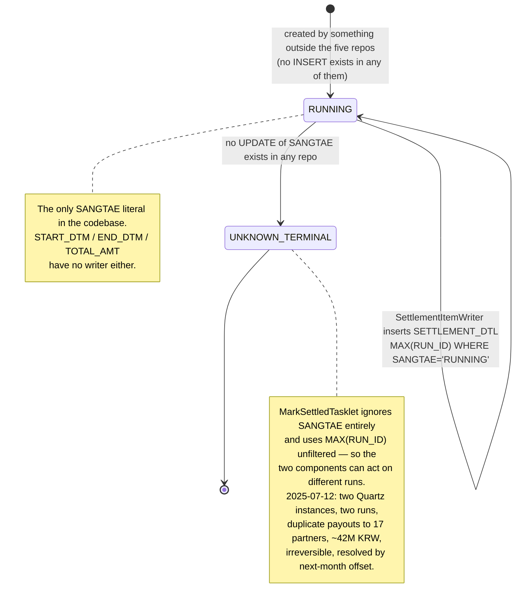

# SETTLEMENT_RUN and SETTLEMENT_DTL Lifecycle

## Purpose

A `SETTLEMENT_RUN` row is one night's settlement: a date (`JUNGSAN_ILJA`), a state (`SANGTAE`), and a total. Its children in `SETTLEMENT_DTL` are one line per order settled in that run, carrying the amount paid to the partner and the fee retained. Together they are the record of what Sellflow paid whom, and — via `MarkSettledTasklet` — the reason an order's `SANGTAE_CD` becomes `JUNGSAN_WANRYO`.

The pair is also the point where the system's identity model is weakest. The run row that gives every detail line its `RUN_ID` has no creator in any repository, and the two components that resolve "the current run" resolve it differently. This artifact follows a run and its details from the Quartz trigger to the order-status update, and states precisely which columns have a writer.

## Key Facts

- `SETTLEMENT_RUN` has no writer in any of the five repos. `grep -rn "SETTLEMENT_RUN"` returns a `CREATE TABLE` (V1), two `SELECT`s inside `settlement-batch`, one `JOIN` in `settlement-anomaly`, and nothing else — no `INSERT`, no `UPDATE`. `SANGTAE`, `START_DTM`, `END_DTM` and `TOTAL_AMT` are therefore unwritten by code → settlement-batch:src/main/resources/db/migration/V1__settlement_schema.sql, settlement-batch:src/main/java/kr/co/sellflow/settlement/job/SettlementItemWriter.java, settlement-anomaly:app/main.py
- Every `SETTLEMENT_DTL` insert depends on that unwritten row. `SettlementItemWriter.currentRunId()` runs `SELECT MAX(RUN_ID) FROM SETTLEMENT_RUN WHERE SANGTAE='RUNNING'` once per chunk and stamps the result onto all 500 rows of that chunk → settlement-batch:src/main/java/kr/co/sellflow/settlement/job/SettlementItemWriter.java (lines 28, 41-45)
- `'RUNNING'` is the only `SANGTAE` literal that appears anywhere in the codebase. The schema puts no constraint on the column (`VARCHAR(20) NOT NULL`, no default, no enum), so the rest of the vocabulary — a completed state, a failed state — exists only in whatever process creates the rows → settlement-batch:src/main/resources/db/migration/V1__settlement_schema.sql
- **The writer and the tasklet disagree about which run is current.** The writer filters on `SANGTAE='RUNNING'`; `MarkSettledTasklet` uses `(SELECT MAX(RUN_ID) FROM SETTLEMENT_RUN)` with no filter at all. The two agree only while the highest `RUN_ID` in the table is also the running one → settlement-batch:src/main/java/kr/co/sellflow/settlement/job/SettlementItemWriter.java, settlement-batch:src/main/java/kr/co/sellflow/settlement/tasklet/MarkSettledTasklet.java (line 31)
- The consequence of that divergence is concrete: if a newer run row exists in any state when `markSettledStep` runs — a second node's run, a manually created row, a pre-seeded next-day row — the tasklet flips `ORDER_MST.SANGTAE_CD` to `JUNGSAN_WANRYO` for the orders of *that* run, not the one just written. It is an unqualified `UPDATE ... WHERE ORD_NO IN (SELECT ...)` against a table owned by another team → settlement-batch:src/main/java/kr/co/sellflow/settlement/tasklet/MarkSettledTasklet.java
- The job is two steps, in order: `settlementStep` (chunk 500, reader → processor → writer) then `markSettledStep` (tasklet). Nothing between them re-reads what was written; the tasklet re-derives the run id independently → settlement-batch:src/main/java/kr/co/sellflow/settlement/config/DailySettlementJobConfig.java (lines 37-53, 82-87)
- The trigger is a Quartz cron, `"0 0 2 * * ?"` pinned to `Asia/Seoul`, and `spring.batch.job.enabled: false` means Spring Batch never auto-launches the job at startup — Quartz is the only entry point → settlement-batch:src/main/java/kr/co/sellflow/settlement/config/QuartzConfig.java (lines 26-35), settlement-batch:src/main/resources/application.yml
- `DailySettlementQuartzJob` builds job parameters `jungsanIlja = LocalDate.now().minusDays(1)` (ISO `yyyy-MM-dd`, **system default zone**, not the KST the cron is pinned to) plus `ts = System.currentTimeMillis()`. The `ts` parameter makes every launch a distinct `JobInstance`, which disables Spring Batch's own duplicate-instance protection by construction → settlement-batch:src/main/java/kr/co/sellflow/settlement/job/DailySettlementQuartzJob.java (lines 22-26)
- `DateUtil.settlementBaseDate()` exists precisely to handle the 00:00–02:00 edge — "배치가 02:00 에 돌기 때문에, 00:00~02:00 사이에 수동 실행되면 전전일이 기준일이 되어야 한다" ("because the batch runs at 02:00, a manual run between 00:00 and 02:00 should use the day before yesterday as the base date") — and nothing calls it. A `grep -rn "DateUtil"` in `settlement-batch` matches only its own declaration and a comment. It also formats `yyyyMMdd`, which would not match the reader's `DATE(m.UPD_DTM) = ?` comparison the way the ISO string does → settlement-batch:src/main/java/kr/co/sellflow/settlement/common/DateUtil.java
- `SETTLEMENT_DTL`'s primary key is `(RUN_ID, ORD_NO)`. It prevents an order from appearing twice *within* one run; it does not prevent the same order being settled again under a different `RUN_ID`, which is exactly the shape of the 2025-07-12 incident → settlement-batch:src/main/resources/db/migration/V1__settlement_schema.sql
- On 2025-07-12 the batch ran twice: "02:04 정산 배치 스케줄 중복 실행 (Quartz 인스턴스 2개가 동시에 트리거)" — "02:04, duplicate scheduled execution of the settlement batch (two Quartz instances triggered simultaneously)" — producing duplicate payment requests for 17 partners totalling roughly 42,000,000 KRW, graded P2, detected at 08:40 only because a partner asked → sellflow-docs:context/runbooks/장애회고_2025-07-12_정산배치_중복실행.md
- The cause was deployment, not configuration in this repo: "배치 서버 이중화 작업 중 Quartz 클러스터 설정이 한쪽에만 반영됨" — "during the batch server duplication work, the Quartz cluster settings were applied to only one side." `application.yml` does declare `job-store-type: jdbc` and `org.quartz.jobStore.isClustered: true`, so the committed configuration was correct and the running estate was not → sellflow-docs:context/runbooks/장애회고_2025-07-12_정산배치_중복실행.md, settlement-batch:src/main/resources/application.yml
- Nothing could be undone: "`SettlementItemWriter` 는 지급 요청 전송 후 되돌릴 수 없음. 취소 경로 없음." — "SettlementItemWriter cannot be reversed once the payment request is sent. There is no cancellation path." The 42M was recovered by 차월 상계, next-month offset — the same mechanism as cancel reconciliation, and one performed by hand → sellflow-docs:context/runbooks/장애회고_2025-07-12_정산배치_중복실행.md, sellflow-docs:context/handover/2025-03_정산팀_인수인계.md (§5)
- Two of the five remediation items closed (cluster config, execution-history alerting — the latter tracked to completion as SF-5099 on 2026-09-02); three did not. Still open: "지급 요청 전 멱등성 키 도입" ("introduce an idempotency key before the payment request") with 담당 미지정, no owner; "취소 건이 정산 대상에서 제외되는지 점검" ("check whether cancelled orders are excluded from settlement targets"), raised 2025-07-15 and marked 이후 논의 없음, no discussion since; and a full audit of settlement batches 스케줄 등록 여부 포함, "including whether they are registered on a schedule" → sellflow-docs:context/runbooks/장애회고_2025-07-12_정산배치_중복실행.md, sellflow-docs:context/sprints/tickets_2026-S17.csv
- That third item is the one that would have found [[PROC-SETTLEMENT-CANCEL-RECON-QUEUE-LIFECYCLE]]'s unregistered reconciler, and the postmortem's closing note records it being pushed out of scope: a request from 정산팀 to also check "취소 건 차감이 자동으로 도는지" ("whether the cancellation deduction runs automatically") was split into a separate ticket whose number is 미확인, unconfirmed. Slack corroborates the same day — 박성민 offered to raise it, 김도윤 replied "이번 장애랑은 분리해서 보시죠" ("let's look at it separately from this incident") → sellflow-docs:context/runbooks/장애회고_2025-07-12_정산배치_중복실행.md, sellflow-docs:raw/slack/settlement-dev_2023-04_2026-08.json
- `SettlementReportWriter`, the class that would produce the partner-facing summary for a run, is a `@Component` nobody calls; its `write(String runId)` only logs, and it takes a `String` where `RUN_ID` is `BIGINT`. Its standing TODO is material to this lifecycle: "취소 정정분은 이 리포트에 포함되지 않는다" — "cancellation corrections are not included in this report" (도윤, 2024-11-02) → settlement-batch:src/main/java/kr/co/sellflow/settlement/report/SettlementReportWriter.java

## Fields

### SETTLEMENT_RUN (V1)

| Column | Type | Written by | Read by | Notes |
|---|---|---|---|---|
| `RUN_ID` | `BIGINT AUTO_INCREMENT` PK | MySQL, on an insert that exists in no repo | `SettlementItemWriter.currentRunId()`, `MarkSettledTasklet`, `settlement-anomaly` | The identity every detail row hangs off |
| `JUNGSAN_ILJA` | `DATE NOT NULL` | **nothing in any repo** | `settlement-anomaly` `WHERE r.JUNGSAN_ILJA = %(ilja)s` | The only column another service filters on |
| `SANGTAE` | `VARCHAR(20) NOT NULL` | **nothing in any repo** | `SettlementItemWriter` (`= 'RUNNING'`) | Unconstrained; `'RUNNING'` is the only literal in code |
| `START_DTM` | `DATETIME` | **nothing** | nothing | |
| `END_DTM` | `DATETIME` | **nothing** | nothing | |
| `TOTAL_AMT` | `DECIMAL(18,0)` | **nothing** | nothing | No code sums `SETTLEMENT_DTL` into it |

### SETTLEMENT_DTL (V1)

| Column | Type | Written by | Derivation |
|---|---|---|---|
| `RUN_ID` | `BIGINT NOT NULL`, PK part 1 | `SettlementItemWriter` | `MAX(RUN_ID) WHERE SANGTAE='RUNNING'`, resolved once per chunk |
| `ORD_NO` | `VARCHAR(20) NOT NULL`, PK part 2 | `SettlementItemWriter` | `ORDER_MST.ORD_NO` via the reader |
| `PARTNER_ID` | `VARCHAR(20) NOT NULL` | `SettlementItemWriter` | `ORDER_DTL.PARTNER_ID` — line-level, carried up unchanged |
| `JUNGSAN_AMT` | `DECIMAL(15,0) NOT NULL` | `SettlementItemWriter` | `gross - fee` in `SettlementItemProcessor` |
| `SUSURYO` | `DECIMAL(15,0) NOT NULL` | `SettlementItemWriter` | `gross × 0.12`, `HALF_UP` to scale 0 |

Indexes: `IX_SETTLEMENT_DTL_01 (ORD_NO)` — the index `OrderEventRelayJob`'s settled-check leans on — and `IX_SETTLEMENT_DTL_02 (PARTNER_ID)`. Full per-column provenance is in [[SCH-SETTLEMENT-FIELD-LINEAGE-SETTLEMENT-DTL]].

## Relationships

| From | To | Link | Enforced? |
|---|---|---|---|
| `SETTLEMENT_DTL` | `SETTLEMENT_RUN` | `RUN_ID` | No FK. Resolved at write time by a `MAX()` query, not by a passed-down identity |
| `SETTLEMENT_DTL` | `ORDER_MST` / `ORDER_DTL` | `ORD_NO` | No FK anywhere in either schema |
| `SETTLEMENT_DTL` | `ORDER_MST.SANGTAE_CD` | `MarkSettledTasklet` writes `JUNGSAN_WANRYO` for the orders of `MAX(RUN_ID)` | Cross-team write under the 2019 shared-DB agreement |
| `SETTLEMENT_DTL` | `CANCEL_RECON_QUEUE` | the relay's `COUNT(1) ... WHERE ORD_NO = ?` gate | Presence test only, at relay time |
| `SETTLEMENT_RUN` + `SETTLEMENT_DTL` | `settlement-anomaly` | a three-way join with `ORDER_MST`, from another service on the same instance | No contract; a direct cross-service table read |
| `ORDER_MST.JUNGSAN_RUN_ID` | `SETTLEMENT_RUN.RUN_ID` | a denormalised cache column added by order-service V14 at 정산팀's request (2025-11-20) | No writer: `grep -rn "JUNGSAN_RUN_ID\|jungsanRunId"` across the five repos matches only the migration. Its own comment concedes the point: "실제 정산 여부는 SETTLEMENT_DTL 이 정본이다. 본 컬럼은 캐시 성격." — "SETTLEMENT_DTL is authoritative for whether settlement happened; this column is cache-like" |

## Creation Path

```
Quartz (jdbc job store, isClustered: true)
  cron 0 0 2 * * ?  @ Asia/Seoul
      ↓
DailySettlementQuartzJob.executeInternal
  params: jungsanIlja = LocalDate.now().minusDays(1)   ← system default zone, ISO
          ts          = System.currentTimeMillis()      ← forces a new JobInstance
  jobLauncher.run(dailySettlementJob, params)
      ↓
[ ??? ]  a SETTLEMENT_RUN row with SANGTAE='RUNNING' must already exist.
         No code in any of the five repos creates it.
      ↓
settlementStep — chunk(500)
  reader    JdbcCursorItemReader over ORDER_MST ⋈ ORDER_DTL
              WHERE m.SANGTAE_CD = 'BAESONG_WANRYO' AND DATE(m.UPD_DTM) = :jungsanIlja
  processor fee = gross × 0.12 (HALF_UP); jungsanAmt = gross − fee
  writer    runId := MAX(RUN_ID) WHERE SANGTAE='RUNNING'   ← per chunk
            INSERT INTO SETTLEMENT_DTL (RUN_ID, ORD_NO, PARTNER_ID, JUNGSAN_AMT, SUSURYO)
      ↓
markSettledStep — tasklet
  UPDATE ORDER_MST SET SANGTAE_CD='JUNGSAN_WANRYO', UPD_DTM=NOW()
   WHERE ORD_NO IN (SELECT ORD_NO FROM SETTLEMENT_DTL
                     WHERE RUN_ID = (SELECT MAX(RUN_ID) FROM SETTLEMENT_RUN))
                                     ↑ no SANGTAE filter — the divergence
      ↓
[ ??? ]  nothing closes the run: no UPDATE of SANGTAE, END_DTM or TOTAL_AMT.
```

The `[ ??? ]` at the top is the important one. `currentRunId()` uses `queryForObject(..., Long.class)`, which returns `null` when `MAX()` has no rows to aggregate over rather than throwing; the subsequent insert would then attempt a `null` into `RUN_ID`, a `NOT NULL` primary-key column, and fail per row. Settlement demonstrably happens — `SETTLEMENT_DTL` is populated enough for the relay's settled-check to fire 4,127 times — so something outside these repositories creates the run row on schedule. What that something is, and whether it also closes the run, is the largest gap in this lifecycle.

Note also what `markSettledStep` does *not* do: it never writes `ORDER_MST.JUNGSAN_RUN_ID`, the column added for exactly this purpose. And the transition it performs bypasses the order domain's own state machine — `OrderStatusService`'s javadoc says so: "정산완료(JUNGSAN_WANRYO) 전이는 이 클래스를 거치지 않는다. 정산 배치가 ORDER_MST 를 직접 갱신한다 (2019 협의, 통합 DB 정책)" — "the transition to JUNGSAN_WANRYO does not go through this class; the settlement batch updates ORDER_MST directly (2019 agreement, integrated-DB policy)" → order-service:src/main/java/kr/co/sellflow/order/service/OrderStatusService.java

## States and Transitions



| `SANGTAE` value | Set by | Read by | Observed in code |
|---|---|---|---|
| `RUNNING` | nothing in the repos (assumed: the unknown creator) | `SettlementItemWriter.currentRunId()` | Yes — the only literal present |
| any completed value | nothing | nothing | No. The vocabulary is undocumented and unconstrained |
| any failed value | nothing | nothing | No. A crashed run leaves no state change |

`SETTLEMENT_DTL` has no status column at all. A detail row is immutable once written: no `UPDATE` or `DELETE` against it exists in any repo. That immutability is the technical reason corrections must be next-month offsets rather than reversals — the writer's javadoc states the business form of the same rule: "지급 요청이 전송되면 되돌릴 수 없다. 은행 이체는 익영업일에 실행된다. 정정이 필요한 경우 차월 정산에서 조정한다." — "once the payment request is sent it cannot be undone. The bank transfer executes on the next business day. If a correction is needed, adjust it in the following month's settlement."

## Worked Examples

### 1. Reconstructing one run

```sql
-- the run and its size
SELECT r.RUN_ID, r.JUNGSAN_ILJA, r.SANGTAE, r.START_DTM, r.END_DTM, r.TOTAL_AMT,
       COUNT(d.ORD_NO)      AS dtl_rows,
       SUM(d.JUNGSAN_AMT)   AS paid_out,
       SUM(d.SUSURYO)       AS fee_retained
  FROM SETTLEMENT_RUN r
  LEFT JOIN SETTLEMENT_DTL d ON d.RUN_ID = r.RUN_ID
 WHERE r.JUNGSAN_ILJA = '2026-08-31'
 GROUP BY r.RUN_ID;
```

Expect `TOTAL_AMT` to be null or stale and to disagree with `SUM(d.JUNGSAN_AMT)`; nothing computes it. Expect `START_DTM`/`END_DTM` to be null. Use the aggregate, not the column.

### 2. Detecting the 2025-07-12 failure mode in data

```sql
-- orders settled under more than one run: duplicate payouts
SELECT ORD_NO, COUNT(DISTINCT RUN_ID) AS runs,
       GROUP_CONCAT(RUN_ID), SUM(JUNGSAN_AMT)
  FROM SETTLEMENT_DTL
 GROUP BY ORD_NO
HAVING COUNT(DISTINCT RUN_ID) > 1;

-- two runs for the same settlement date: the duplicate-execution signature
SELECT JUNGSAN_ILJA, COUNT(*) AS runs, GROUP_CONCAT(RUN_ID)
  FROM SETTLEMENT_RUN
 GROUP BY JUNGSAN_ILJA
HAVING COUNT(*) > 1;
```

The `(RUN_ID, ORD_NO)` primary key permits the first result set entirely. It is a within-run uniqueness control, not a settle-once control — which is why the postmortem's unowned remediation item is an **idempotency key before the payment request**, not a database constraint.

### 3. Where the writer and the tasklet part company

```sql
-- what SettlementItemWriter considers current
SELECT MAX(RUN_ID) FROM SETTLEMENT_RUN WHERE SANGTAE = 'RUNNING';
-- what MarkSettledTasklet considers current
SELECT MAX(RUN_ID) FROM SETTLEMENT_RUN;
```

If these two queries ever return different values, the run that received the `SETTLEMENT_DTL` rows and the run whose orders were marked `JUNGSAN_WANRYO` are different runs. Orders from the newer run get flagged settled without necessarily having a detail line from this execution, and the orders just written stay at `BAESONG_WANRYO` — which makes them eligible for the reader again the next time `DATE(UPD_DTM)` lines up, because the reader keys on status and update date and nothing else.

### 4. Enum tables

`SETTLEMENT_RUN.SANGTAE` — see the state table above; the vocabulary beyond `RUNNING` is not observable from the repos.

`ORDER_MST.SANGTAE_CD`, the column this lifecycle writes into, from the order domain's enum:

| Value | Label | Relevance to a settlement run |
|---|---|---|
| `GYEOLJE_WANRYO` | 결제완료 (payment complete) | not a settlement target |
| `SANGPUM_JUNBI` | 상품준비중 (preparing) | not a settlement target |
| `BAESONG_JUNG` | 배송중 (in delivery) | not a settlement target |
| `BAESONG_WANRYO` | 배송완료 (delivered) | **the reader's only status filter** — the run's input set |
| `JUNGSAN_WANRYO` | 정산완료 (settled) | **written by `MarkSettledTasklet`**, not by order-service |
| `CHWISO` | 취소 (cancelled) | invisible to the reader; a cancel after settlement lands in `CANCEL_RECON_QUEUE` |
| `BANPUM` | 반품 (returned) | same |

→ order-service:src/main/java/kr/co/sellflow/order/domain/OrderStatus.java

## Agent Guidance

- **Do not assume a `SETTLEMENT_RUN` row is produced by this repo.** When asked how a run starts, say plainly that no code in the five repos inserts one, and that this is the load-bearing unknown for the whole pipeline.
- **Never treat `TOTAL_AMT`, `START_DTM` or `END_DTM` as data.** Aggregate `SETTLEMENT_DTL` instead.
- **When reasoning about "the current run", always say which definition you mean.** The writer's (`SANGTAE='RUNNING'`) and the tasklet's (`MAX(RUN_ID)`) are different queries and can return different answers.
- **`(RUN_ID, ORD_NO)` is not a duplicate-settlement control.** Do not cite it as one. The 2025-07-12 incident is the counterexample.
- **A settlement is irreversible in both the code and the business rules.** Any proposal that involves "undoing" a payout is outside what the system can do; the only correction mechanism is a next-month offset, and the component that would automate it has never run — see [[PROC-SETTLEMENT-CANCEL-RECON-QUEUE-LIFECYCLE]].
- **The batch is cancellation-blind by construction.** The reader filters on `SANGTAE_CD='BAESONG_WANRYO'` and never checks `ORDER_CANCEL`; the postmortem's open item asking whether cancelled orders are excluded has been open since 2025-07-15. See [[SCH-SETTLEMENT-FIELD-LINEAGE-SETTLEMENT-DTL]].
- **Distinguish committed config from the running estate.** `application.yml` clusters Quartz correctly; the 2025-07-12 outage came from a node that did not have it. Reading the repo alone would have said the system was safe.

## Related

- [[PROC-SETTLEMENT-DAILY-BATCH]] — the step-by-step mechanics of the job itself
- [[PROC-SETTLEMENT-ANOMALY-LIFECYCLE]] — the consumer that joins `SETTLEMENT_RUN` from another service
- [[PROC-SETTLEMENT-CANCEL-RECON-QUEUE-LIFECYCLE]] — what happens when an order settled here is later cancelled
- [[PROC-SETTLEMENT-RUN-LOG-LIFECYCLE]] — the second, never-populated run table that shadows `SETTLEMENT_RUN`
- [[RISK-SETTLEMENT]] — the domain's risk themes, including irreversibility
- [[SCH-SETTLEMENT-BATCH]] — both tables in the context of the full schema
- [[SCH-SETTLEMENT-FIELD-LINEAGE-SETTLEMENT-DTL]] — per-column derivation of the detail rows
- [[SYS-ORDER]] — owner of `ORDER_MST`, the table `markSettledStep` writes to
- [[SYS-SETTLEMENT]] — the owning service
