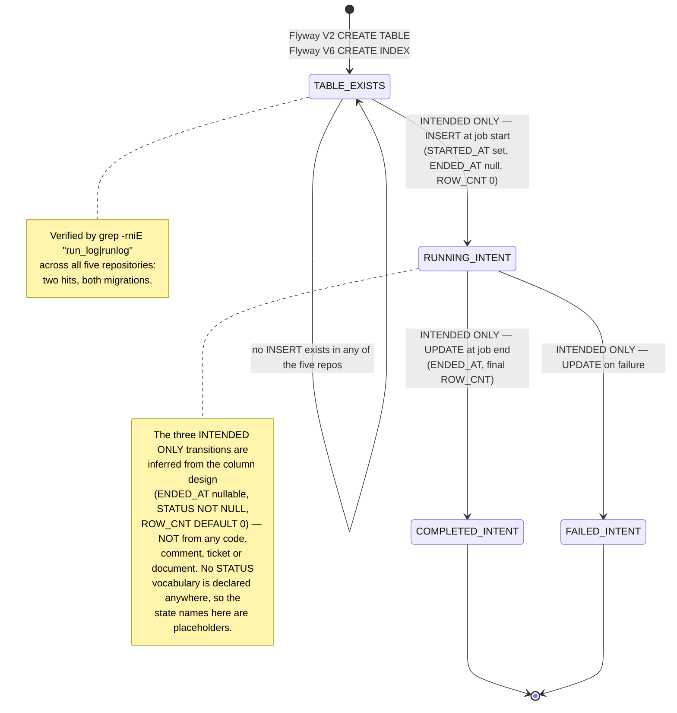

# SETTLEMENT_RUN_LOG Lifecycle — Created by Migration, Never Populated

## Purpose

`SETTLEMENT_RUN_LOG` is a table that exists in the database and in no code path. Flyway creates it (V2) and later indexes it (V6); nothing in any of the five Sellflow repositories inserts, updates, selects or deletes a row.

It is documented here for a specific reason. The settlement domain has a real and acute question — *did the nightly batch run, and when, and how many rows did it write?* — that came up in the 2025-07-12 duplicate-execution incident and again in sprint 2026-S17. A reader inspecting the schema would find a table apparently built to answer exactly that question, with a start time, an end time, a status and a row count, freshly indexed on `STARTED_AT`. Believing it would be a mistake. This artifact records the shape it was intended to have, the evidence that nothing touches it, and what its presence implies about the schema it sits in.

## Key Facts

- The table is created by `V2__add_settlement_run_log.sql` with five columns — `RUN_ID VARCHAR(32)` primary key, `STARTED_AT DATETIME NOT NULL`, `ENDED_AT DATETIME NULL`, `STATUS VARCHAR(20) NOT NULL`, `ROW_CNT INT NOT NULL DEFAULT 0` — and no comment, author or date, unlike V1 and V5 which carry all three → settlement-batch:src/main/resources/db/migration/V2__add_settlement_run_log.sql
- Four migrations later, `V6__settlement_run_log_index.sql` adds `IDX_SETTLEMENT_RUN_LOG_DT ON SETTLEMENT_RUN_LOG (STARTED_AT)` — an index on a column nothing writes, meaning at least two separate pieces of work were invested in a table with no code behind it → settlement-batch:src/main/resources/db/migration/V6__settlement_run_log_index.sql
- Nothing in any of the five repositories reads or writes it. `grep -rniE "run_log|runlog"` across `order-service`, `settlement-batch`, `inventory-api`, `delivery-bff` and `settlement-anomaly` returns exactly two lines: the `CREATE TABLE` in V2 and the `CREATE INDEX` in V6. A second pass, `grep -rn "SETTLEMENT_RUN_LOG" --exclude-dir=migration`, returns nothing at all → settlement-batch (whole repo), all four other repos
- The table is nonetheless physically real in every environment. `application.yml` sets `spring.flyway.enabled: true` with `locations: classpath:db/migration`, so V2 and V6 apply on startup wherever the service runs — this is an empty, indexed table, not a dead file → settlement-batch:src/main/resources/application.yml
- It shadows `SETTLEMENT_RUN` from V1 on four of its five columns: `STARTED_AT`↔`START_DTM`, `ENDED_AT`↔`END_DTM`, `STATUS`↔`SANGTAE`, and `RUN_ID`↔`RUN_ID`. It adds `ROW_CNT`, which `SETTLEMENT_RUN` lacks, and omits `JUNGSAN_ILJA` and `TOTAL_AMT`, which `SETTLEMENT_RUN` has → settlement-batch:src/main/resources/db/migration/V1__settlement_schema.sql, settlement-batch:src/main/resources/db/migration/V2__add_settlement_run_log.sql
- That column split is a legible design intent: dropping the settlement date and the money while adding a row count turns a *business* run record into an *execution* record. The two tables are not redundant in purpose — one says which settlement this is, the other how the job behaved → settlement-batch:src/main/resources/db/migration/V1__settlement_schema.sql, settlement-batch:src/main/resources/db/migration/V2__add_settlement_run_log.sql
- **The key types are incompatible.** `SETTLEMENT_RUN.RUN_ID` is `BIGINT AUTO_INCREMENT`; `SETTLEMENT_RUN_LOG.RUN_ID` is `VARCHAR(32)` with no auto-generation. The two tables cannot be joined without a cast, and `SETTLEMENT_DTL.RUN_ID` (`BIGINT`) points at the V1 table only. Whatever V2's author had in mind, it was not the identifier the running code uses → settlement-batch:src/main/resources/db/migration/V1__settlement_schema.sql, settlement-batch:src/main/resources/db/migration/V2__add_settlement_run_log.sql
- `VARCHAR(32)` is the width of a hex UUID with no dashes, and the only String-typed run identifiers anywhere in the codebase are `SettlementReportWriter.write(String runId)` — a method nothing calls — and `settlement-anomaly`'s unused `AnomalyRow.run_id: str`. Neither names this table, so this is a coincidence of types worth noting and not a traced link → settlement-batch:src/main/java/kr/co/sellflow/settlement/report/SettlementReportWriter.java, settlement-anomaly:app/schemas.py
- Its naming register differs from V1's. V1 uses romanised Korean (`JUNGSAN_ILJA`, `SANGTAE`, `SUSURYO`); V2 uses plain English (`STARTED_AT`, `ENDED_AT`, `ROW_CNT`) — as do V3 through V6. The break falls exactly at the boundary between the original schema and everything added afterwards, which is the same pattern recorded in [[PAT-SELLFLOW-ROMANISED-NAMING]] → settlement-batch:src/main/resources/db/migration/
- The reef's own extracted schema already reached this conclusion independently during the source pass: the table is listed as "SETTLEMENT_RUN_LOG — 실행 로그 (V2, V6) — orphan ... No reader, no writer in this repo." This artifact confirms it across all five repos rather than one → sellflow-docs:schemas/settlement/batch/schema.md
- The capability the table would have provided was in fact delivered, elsewhere. The 2025-07-12 postmortem's remediation list includes "[x] 배치 실행 이력 알림 추가 — 2025-07-18 완료" ("add batch execution history alerting — completed 2025-07-18"), and SF-5099 정산 배치 실행 이력 알림 개선 ("improve settlement batch execution history alerting") closed `Done` on 2026-09-02. Neither touches this table; no code in `settlement-batch` sends an alert at all → sellflow-docs:context/runbooks/장애회고_2025-07-12_정산배치_중복실행.md, sellflow-docs:context/sprints/tickets_2026-S17.csv
- So run history is tracked twice over in principle and zero times in this schema: `SETTLEMENT_RUN` has no writer either (see [[PROC-SETTLEMENT-RUN-LIFECYCLE]]), and `SETTLEMENT_RUN_LOG` has neither writer nor reader. The only durable evidence that a settlement job ran is the `SETTLEMENT_DTL` rows it left behind and the Spring Batch metadata tables, which `spring.batch.initialize-schema: always` provisions separately → settlement-batch:src/main/java/kr/co/sellflow/settlement/job/SettlementItemWriter.java, settlement-batch:src/main/resources/application.yml

## Fields

The intended shape, as declared. Every "Written by" cell is the finding.

| Column | Type | Constraint | Intended meaning | Written by | Read by |
|---|---|---|---|---|---|
| `RUN_ID` | `VARCHAR(32)` | `NOT NULL PRIMARY KEY` | identity of one execution; not the `BIGINT` used elsewhere | **nothing** | **nothing** |
| `STARTED_AT` | `DATETIME` | `NOT NULL` | execution start; indexed by V6 | **nothing** | **nothing** |
| `ENDED_AT` | `DATETIME` | `NULL` | execution end — nullable, i.e. a row is expected to exist while the job is still running | **nothing** | **nothing** |
| `STATUS` | `VARCHAR(20)` | `NOT NULL` | execution outcome; unconstrained, no default, no vocabulary declared anywhere | **nothing** | **nothing** |
| `ROW_CNT` | `INT` | `NOT NULL DEFAULT 0` | rows processed by the execution | **nothing** | **nothing** |

Index: `IDX_SETTLEMENT_RUN_LOG_DT (STARTED_AT)` (V6).

`ENDED_AT NULL` plus `STATUS NOT NULL` plus `ROW_CNT DEFAULT 0` together describe an insert-then-update pattern: write the row when the job starts, with a status and a zero count, then fill in the end time and the final count when it finishes. That is a coherent design. No code implements either half of it.

## Relationships

| Candidate relationship | Status |
|---|---|
| `SETTLEMENT_RUN_LOG` ↔ `SETTLEMENT_RUN` | Conceptually the same run; **not joinable** — `VARCHAR(32)` versus `BIGINT AUTO_INCREMENT`, and no code populates either key in the log table |
| `SETTLEMENT_RUN_LOG` ↔ `SETTLEMENT_DTL` | None. `SETTLEMENT_DTL.RUN_ID` is `BIGINT` and resolves against `SETTLEMENT_RUN` |
| `SETTLEMENT_RUN_LOG` ↔ Spring Batch metadata (`BATCH_JOB_EXECUTION` etc.) | None in code. `spring.batch.initialize-schema: always` creates Spring Batch's own tables, which already record start time, end time and status per execution — arguably making this table redundant on arrival |
| `SETTLEMENT_RUN_LOG` ↔ the alerting delivered in 2025-07 / SF-5099 | None found. The alerting is not implemented in any of the five repos |

The third row is the most useful for anyone deciding what to do with the table: Spring Batch, which this application already runs with a JDBC job repository, persists exactly `STARTED_AT`/`ENDED_AT`/`STATUS` per job execution as a matter of course, and `ROW_CNT` is available as the step's write count.

## Creation Path

```
Flyway migrate on application startup
  (spring.flyway.enabled: true, locations: classpath:db/migration)
      ↓
V1__settlement_schema.sql  → SETTLEMENT_RUN, SETTLEMENT_DTL, CANCEL_RECON_QUEUE
      ↓
V2__add_settlement_run_log.sql → CREATE TABLE SETTLEMENT_RUN_LOG   ← the table appears
      ↓
V3, V4, V5 …
      ↓
V6__settlement_run_log_index.sql → CREATE INDEX IDX_SETTLEMENT_RUN_LOG_DT
      ↓
( no further events — no INSERT path exists in any repository )
```

The row-level creation path is empty. There is no application code, no scheduled job, no tasklet, no listener and no script in any of the five repositories that would produce a row. For a `JobExecutionListener` writing this table, the natural home would be `DailySettlementJobConfig`, which declares no listener of any kind.

## States and Transitions

`STATUS` exists, so a state machine is implied by the schema. None of it is reachable.



| `STATUS` value | Declared where | Written by | Observed |
|---|---|---|---|
| — | nowhere. The column is `VARCHAR(20) NOT NULL` with no default, no enum, no check constraint and no literal anywhere in the codebase | nothing | never |

Contrast `SETTLEMENT_RUN.SANGTAE`, which at least has one literal in code (`'RUNNING'`, read by `SettlementItemWriter`). `SETTLEMENT_RUN_LOG.STATUS` has none — not even a value a reader could guess from.

## Worked Examples

### 1. How the absence was verified

Run from `../sellflow/repos`, covering all five repositories at once:

```bash
# every case-insensitive spelling of the name
grep -rniE "run_log|runlog" .
#   settlement-batch/.../V2__add_settlement_run_log.sql:1:CREATE TABLE SETTLEMENT_RUN_LOG (
#   settlement-batch/.../V6__settlement_run_log_index.sql:1:CREATE INDEX IDX_SETTLEMENT_RUN_LOG_DT ...

# the exact table name, with migrations excluded — i.e. any application code
grep -rn "SETTLEMENT_RUN_LOG" . --exclude-dir=migration
#   (no output)

# the neighbouring table, for contrast: it has readers even though it has no writer
grep -rn "SETTLEMENT_RUN" .
#   V1 CREATE TABLE
#   V2/V6 (the _LOG table)
#   SettlementItemWriter.java:43   SELECT MAX(RUN_ID) ... WHERE SANGTAE='RUNNING'
#   MarkSettledTasklet.java:31     SELECT MAX(RUN_ID) FROM SETTLEMENT_RUN
#   settlement-anomaly/app/main.py:33  JOIN SETTLEMENT_RUN r ON r.RUN_ID = d.RUN_ID
```

The contrast in the third command is what makes the finding sharp. The grep is not failing to find code — it finds five references to the sibling table in the same sweep, and zero to this one.

A search of the document corpus agrees: `grep -rni "settlement_run_log\|run_log" sellflow-reef/sources` matches only the reef's own extracted schema note, never a ticket, minute, runbook, procedure or Slack message. The table is not discussed anywhere in three and a half years of settlement documentation.

### 2. The query someone would want to run, and what it would return

```sql
SELECT RUN_ID, STARTED_AT, ENDED_AT, STATUS, ROW_CNT
  FROM SETTLEMENT_RUN_LOG
 WHERE STARTED_AT >= '2025-07-12 00:00:00'
   AND STARTED_AT <  '2025-07-13 00:00:00'
 ORDER BY STARTED_AT;
```

This is precisely the query the 2025-07-12 postmortem would have wanted — two executions at 02:04 would have shown as two rows — and `IDX_SETTLEMENT_RUN_LOG_DT` is precisely the index to serve it. It returns nothing, because the table is empty. The incident was detected instead at 08:40, by a partner asking why they had been paid twice.

What actually answers the question today:

```sql
-- the only durable evidence a settlement job ran, in this schema
SELECT RUN_ID, COUNT(*) AS rows_written, MIN(ORD_NO), MAX(ORD_NO)
  FROM SETTLEMENT_DTL
 GROUP BY RUN_ID;
```

Plus Spring Batch's own `BATCH_JOB_EXECUTION` / `BATCH_STEP_EXECUTION` tables, which the application provisions via `spring.batch.initialize-schema: always` and which already carry start time, end time, exit status and write counts.

### 3. Enum tables

None can be given. `STATUS` has no declared vocabulary in the schema, in code, or in any document — the honest enum table is the empty one above. This is itself the finding: a `NOT NULL` status column whose permitted values exist nowhere.

## Agent Guidance

- **Never cite `SETTLEMENT_RUN_LOG` as a source of run history.** It is empty. If asked "when did the batch last run?", answer from `SETTLEMENT_DTL` grouped by `RUN_ID`, or from Spring Batch's metadata tables, and say plainly that the run-log table is unpopulated.
- **Do not infer behaviour from schema.** This table is the clearest case in the reef of a migration describing an intention that code never carried out; the same trap applies to `CANCEL_RECON_QUEUE.PROCESSED_AT`/`PROCESSED_BY`, `SETTLEMENT_ANOMALY.REVIEWED_BY`/`REVIEWED_DTM`, `PARTNER_CONTRACT.FEE_RATE` and `ORDER_MST.JUNGSAN_RUN_ID` — all declared, none written.
- **If you find rows in it, that is new information.** It would mean a writer exists outside these five repositories, and it should be escalated rather than assumed.
- **Do not propose deleting it casually.** The key-type mismatch means nothing depends on it, so a drop is low risk — but the design it encodes (an execution record with a row count, separate from the business run) is a reasonable answer to a real operational need that is currently met by alerting built elsewhere. Resolve the duplication deliberately: either populate it, or drop it and lean on Spring Batch's metadata.
- **Treat V6 as a signal about beliefs, not usage.** Someone indexed this table after it had already sat empty for four migrations. Schema activity is not evidence that a table is live.

## Related

- [[PROC-SETTLEMENT-RUN-LIFECYCLE]] — `SETTLEMENT_RUN`, the table this one shadows, which has readers but no writer either
- [[SCH-SETTLEMENT-BATCH]] — the full settlement schema, where this table sits as an orphan
- [[PAT-SELLFLOW-ROMANISED-NAMING]] — the naming break between V1 and everything added after it
- [[RISK-SELLFLOW-DOC-DRIFT]] — the wider pattern of declared-but-unimplemented artefacts across the estate
- [[SYS-SETTLEMENT]] — the owning service
