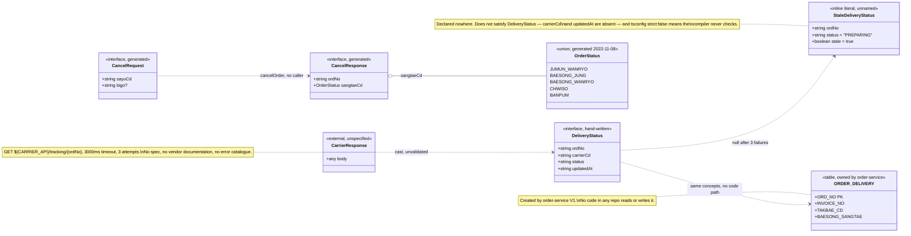

## Overview

This artifact is thin on purpose. delivery-bff has no schema in the usual sense: the service registry records `db: none` for it, and reading all of `src/` turns up no ORM, no query, no migration, no cache, and no file write. Every data shape in the repository is a TypeScript type that exists only for the duration of one HTTP request.

That matters for anyone reasoning about the delivery domain. If you are looking for where delivery state actually lives, it is not here — it is `ORDER_DELIVERY` on the order-service side, described at the end of this artifact and bridged in [[CON-ORDER-DELIVERY]].

### Why a class diagram and not an ER diagram

A Mermaid `erDiagram` would be misleading here. An ER diagram asserts persisted entities with keys and cardinalities; this service has no tables, no primary keys, no foreign keys, and no lifetime beyond a single request. Drawing one would manufacture a data model the service does not have.

What it does have is a set of TypeScript types with a direction of travel: a carrier payload arrives, is cast, and either leaves unchanged or is replaced by a fabricated literal. That is a class structure and a flow, so the mandatory diagram below is a `classDiagram`. The one genuine table in this domain, `ORDER_DELIVERY`, belongs to the order system; it appears at the edge of the diagram, and in its own section at the end, marked as owned elsewhere.



Read the edges carefully: every one of them is dashed, one-directional and transient. `CarrierResponse ..> DeliveryStatus` is a cast, not a mapping — no field is copied, renamed or checked. `DeliveryStatus ..> StaleDeliveryStatus` is a *replacement*, not a derivation, because the fallback is built from the path parameter and two literals, with nothing carried over from a previous successful response. And `DeliveryStatus ..> ORDER_DELIVERY` is the edge that does not exist in code at all: the two describe the same real-world facts and no line of either repository connects them. Nothing in this diagram is stored; every box except `ORDER_DELIVERY` ceases to exist when the request ends.

## Key Facts

- The service registry records `db: none` for delivery-bff → sources/context/registry/services.yaml
- No persistence code exists anywhere in `src/` — no ORM import, no SQL, no cache client → src/index.ts
- The dependency manifest confirms the absence from the other direction: `dependencies` is exactly `{axios, express}` and `devDependencies` exactly `{typescript, @types/express}` — no `pg`, `mysql2`, `mongoose`, `redis`, `prisma`, `typeorm`, `knex` or `sequelize` → package.json
- There is no migrations directory and no schema file of any kind: the repository's entire file list is README.md, .env.template, package.json, tsconfig.json, .eslintrc.json, five files under `src/` and one under `tests/` → package.json
- Consequently every shape in this artifact is request-scoped. Nothing here survives the response, and nothing here can be queried after the fact → src/index.ts
- The service therefore has no schema-evolution story at all — no versioned types, no compatibility layer, no consumer contract — which is why the 2022 generated client could drift for four years without anything breaking → src/generated/orderApi.ts
- None of these interfaces is enforced at a boundary: `"strict": false` in tsconfig.json disables the checks that would have rejected both the unvalidated cast and the incomplete fallback literal → tsconfig.json
- The live cancel signature on the order side is `cancel(@PathVariable ordNo, @RequestBody CancelRequest req)` returning `ResponseEntity<Void>`, so the generated `CancelResponse` type describes a body the server does not send → order-service:src/main/java/kr/co/sellflow/order/controller/OrderController.java
- The live `OrderStatus` enum carries a Korean label per constant (`GYEOLJE_WANRYO("결제완료")` and so on) and a `getLabel()` accessor; the generated union is bare strings with no labels, so display text cannot round-trip through this service → order-service:src/main/java/kr/co/sellflow/order/domain/OrderStatus.java, src/generated/orderApi.ts
- `DeliveryStatus` declares exactly four fields: ordNo, carrierCd, status, updatedAt, all typed string → src/deliveryStatus.ts
- The carrier response is cast without validation: `return res.data as DeliveryStatus` → src/deliveryStatus.ts
- The generated `OrderStatus` union lists five values: JUMUN_WANRYO, BAESONG_JUNG, BAESONG_WANRYO, CHWISO, BANPUM → src/generated/orderApi.ts
- `CancelRequest` carries sayuCd (required) and bigo (optional) → src/generated/orderApi.ts
- `CancelResponse` carries ordNo and sangtaeCd, the latter typed as the generated OrderStatus union → src/generated/orderApi.ts
- The degraded response body is a fourth, unnamed shape — an inline object literal `{ ordNo, status: 'PREPARING', stale: true }` that no interface describes → src/index.ts
- The persistent equivalent is the ORDER_DELIVERY table mapped by the order-service DeliveryInfo entity, with columns ORD_NO, INVOICE_NO, TAKBAE_CD, BAESONG_SANGTAE → kr/co/sellflow/order/domain/DeliveryInfo.java
- The order-service entity comment states "배송 정보. 주문당 1건. 분할배송은 지원하지 않는다" (delivery information, one per order; split delivery is not supported) → kr/co/sellflow/order/domain/DeliveryInfo.java
- A delivery-status vocabulary does exist on the order side, and the BFF's fallback is its first member: the 2022 spec's `DeliveryInfo.baesongSangtae` is an enum of PREPARING, PICKED_UP, IN_TRANSIT, OUT_FOR_DELIVERY, DELIVERED, FAILED → sources/raw/specs/order-service-openapi.json (components.schemas.DeliveryInfo)
- The carrier-code enum CJ, HANJIN, LOTTE, POST, LOGEN is declared on `OrderMst.taekBaeSaCd` only. The identically named field on the spec's own `DeliveryInfo` schema is a bare `type: string` with no enum, so the spec constrains the carrier code on the order master and leaves it free on the delivery record → sources/raw/specs/order-service-openapi.json (components.schemas.OrderMst, components.schemas.DeliveryInfo)
- Neither vocabulary is enforced anywhere in delivery-bff: `status` and `carrierCd` are plain `string` on a hand-written interface, the carrier body is cast rather than parsed, and the two enums appear in no file of this repository → src/deliveryStatus.ts
- ORDER_DELIVERY is created by order-service's `V1__init.sql`: `ORD_NO VARCHAR(20) NOT NULL` as the primary key, `INVOICE_NO VARCHAR(30)`, `TAKBAE_CD VARCHAR(10)`, `BAESONG_SANGTAE VARCHAR(20)`, plus `KEY IX_ORDER_DELIVERY_01 (INVOICE_NO)`. The `DeliveryInfo` entity maps all four columns → order-service:src/main/resources/db/migration/V1__init.sql, kr/co/sellflow/order/domain/DeliveryInfo.java
- Nothing reads or writes it. `DeliveryInfoRepository` is declared and never injected, and no SQL in any of the five repos names the table — so the only durable delivery state in the domain is a table nobody touches → order-service:src/main/java/kr/co/sellflow/order/repository/DeliveryInfoRepository.java

## Entities

### DeliveryStatus (src/deliveryStatus.ts)

The carrier lookup result, and the success response body verbatim. Hand-written, not generated.

| Field | Type | Notes |
|-------|------|-------|
| ordNo | string | 주문번호 (order number). The path parameter, echoed back. Same identifier as order-service `OrderMst.ordNo`. |
| carrierCd | string | 택배사 코드 (carrier code). Free-form string here; no enum constrains it. |
| status | string | Delivery status. No union type, no constant list. The only literal in the repo is the fallback `'PREPARING'`. |
| updatedAt | string | Last update timestamp. Format unspecified and never parsed. |

TypeScript strict mode is off (`"strict": false` in tsconfig.json), so nothing in the build forces these fields to be present at runtime either. The cast `res.data as DeliveryStatus` accepts whatever the carrier sends.

### Generated order types (src/generated/orderApi.ts)

The file header reads "자동 생성 파일입니다. 직접 수정하지 마세요" (this is an auto-generated file; do not edit it directly), with `generator: openapi-typescript-codegen 0.23.0`, `source: order-service-openapi.json`, `generated: 2022-11-08T04:12:33Z`.

**OrderStatus** — the enum drift, both sides side by side.

This is the single most consequential type in the file, because `CancelResponse.sangtaeCd` is typed with it and because anything reading this client will take it for the system's status vocabulary. The generated union is a string union of five values, frozen on 2022-11-08. The live definition is a seven-constant Java enum, each constant carrying a Korean label (order-service:src/main/java/kr/co/sellflow/order/domain/OrderStatus.java). Set against each other:

| Live enum constant | Korean label | Meaning | In the generated union? |
|---|---|---|---|
| `GYEOLJE_WANRYO` | 결제완료 | Payment complete | **No** — unrepresentable |
| `SANGPUM_JUNBI` | 상품준비중 | Preparing goods | **No** — unrepresentable |
| `BAESONG_JUNG` | 배송중 | In delivery | Yes |
| `BAESONG_WANRYO` | 배송완료 | Delivery complete | Yes |
| `JUNGSAN_WANRYO` | 정산완료 | Settlement complete | **No** — unrepresentable |
| `CHWISO` | 취소 | Cancelled | Yes |
| `BANPUM` | 반품 | Returned | Yes |
| — | — | — | `JUMUN_WANRYO` (주문완료, order complete) exists **only** in the generated union; no such constant is in the live enum |

Counted plainly: seven live constants, five in the union, four in common. Three live states cannot be expressed by this client at all, and one value it can express does not exist on the server. A consumer deserialising a real status into `OrderStatus` would produce a value outside its own declared union for three of the seven possible inputs — and TypeScript would not notice, because `"strict": false` and because the value arrives through `res.json()`, which is typed `any` at the boundary anyway (tsconfig.json, src/generated/orderApi.ts).

The omission that matters most is `JUNGSAN_WANRYO`. It is the state the whole settlement domain turns on, the enum declares it with a warning — "정산 완료. settlement-batch 가 야간에 일괄 갱신한다." and "주의: 이 상태는 정산팀 배치가 설정하며 주문팀에서 직접 변경하지 않는다." ("Settlement complete. settlement-batch updates these in bulk overnight." / "Note: this state is set by the settlement team's batch and is not changed directly by the order team.") — and it is precisely the state the generated client's 409 message claims to be about while being unable to name it. The drift is the subject of [[RISK-DELIVERY]]; the boundary it crosses is [[CON-ORDER-DELIVERY]].

**CancelRequest**

| Field | Type | Required | Notes |
|-------|------|----------|-------|
| sayuCd | string | yes | 사유 코드 (reason code). The order-service controller javadoc documents the range as "사유 코드(01~04)" — reason codes 01 to 04. |
| bigo | string | no | 비고 (remark, free text). |

**CancelResponse**

| Field | Type | Notes |
|-------|------|-------|
| ordNo | string | 주문번호. |
| sangtaeCd | OrderStatus | 상태코드 (status code), constrained to the stale five-value union above. |

Note the response mismatch: the live `OrderController.cancel` returns `ResponseEntity<Void>` — an empty body — while the generated client does `return res.json()` and types the result as `CancelResponse` (kr/co/sellflow/order/controller/OrderController.java, src/generated/orderApi.ts).

### What the BFF composes, in one place

Four shapes, two of which leave the building. Collected here because the endpoint's contract is the union of two of them, and no single declaration in the repository says so:

| Shape | Declared as | Origin | Leaves the service? | Fields |
|---|---|---|---|---|
| Carrier payload | Nothing — `any` from axios | `GET ${CARRIER_API}/tracking/{ordNo}` | Yes, verbatim | Unknown; whatever the vendor sends |
| `DeliveryStatus` | `export interface`, hand-written | A cast applied to the above | Yes, as the success body | ordNo, carrierCd, status, updatedAt — all `string` |
| Degraded literal | Nothing — an inline object | Built in the route handler from `req.params.ordNo` and two constants | Yes, as the failure body | ordNo, status (`'PREPARING'`), stale (`true`) |
| `CancelRequest` / `CancelResponse` | `export interface`, generated | The 2022 codegen run | **No** — no route reaches them | See the generated-types section |

The composition rule is not a merge, a mapping or a fallback-with-carryover; it is a branch on `if (!status)` in `src/index.ts`, and the two branches emit structurally different objects. There is no shared base type, no discriminant field on the success side (only the failure side carries `stale`), and no declaration anywhere that the endpoint returns a union. The tier-4 extraction had to invent one — `oneOf: [DeliveryStatus, StaleDeliveryStatus]` — to describe the endpoint at all (sources/apis/delivery/openapi.json).

### The degraded response literal (src/index.ts)

Not a named type. When `syncDeliveryStatus` returns null the route emits `{ ordNo, status: 'PREPARING', stale: true }`. It shares `ordNo` and `status` with `DeliveryStatus`, drops `carrierCd` and `updatedAt`, and adds `stale`. A client typed against `DeliveryStatus` therefore receives a body that does not satisfy it. See [[API-DELIVERY]] for the worked example.

### ORDER_DELIVERY — the persistent equivalent, owned elsewhere

The delivery facts that survive a request are stored by order-service, not by this BFF. The JPA entity `DeliveryInfo` maps `@Table(name = "ORDER_DELIVERY")`:

| Column | Type (V1 DDL) | Java field | Meaning | Rough counterpart here |
|--------|---------------|-----------|---------|------------------------|
| ORD_NO | VARCHAR(20) NOT NULL, PK | ordNo | 주문번호 (order number), the `@Id` | DeliveryStatus.ordNo |
| INVOICE_NO | VARCHAR(30), indexed | invoiceNo | 운송장번호 (waybill / invoice number) | none — the BFF never exposes it |
| TAKBAE_CD | VARCHAR(10) | takbaeCd | 택배사 코드 (carrier code) | DeliveryStatus.carrierCd |
| BAESONG_SANGTAE | VARCHAR(20) | baesongSangtae | 배송 상태 (delivery status) | DeliveryStatus.status |

Three observations worth carrying forward. First, the column name `TAKBAE_CD` differs from the OpenAPI field name `taekBaeSaCd` for the same concept, and the spec constrains that field to an enum of CJ, HANJIN, LOTTE, POST, LOGEN on the `OrderMst` schema — but not on its own `DeliveryInfo` schema, where the same field name is an unconstrained string, and not on the column, which V1 creates as a plain `VARCHAR(10)` (sellflow-docs:raw/specs/order-service-openapi.json, order-service:src/main/resources/db/migration/V1__init.sql). Second, `DeliveryInfo` exposes getters for ordNo, invoiceNo, and baesongSangtae but none for takbaeCd, so the carrier code is written but not readable through the entity's own API. Third, the status vocabulary the two sides ought to share is written down once, in the spec's `DeliveryInfo.baesongSangtae` enum: PREPARING, PICKED_UP, IN_TRANSIT, OUT_FOR_DELIVERY, DELIVERED, FAILED. The BFF's fallback literal `'PREPARING'` is its first member, which is the only point of contact between the two sides — and it is a coincidence of spelling, not a check. What the carrier itself emits remains unknown.

The types above come from order-service's `V1__init.sql`; the entity matches them column for column. What no source supplies is a reader or a writer — the table has neither.

## Worked Examples

**A carrier payload flowing through unchanged.** The carrier returns a JSON object; `syncDeliveryStatus` casts it to `DeliveryStatus` and the route serializes it as-is, so the response body is the carrier body:

```json
{
  "ordNo": "20260918000123",
  "carrierCd": "CJ",
  "status": "BAESONG_JUNG",
  "updatedAt": "2026-09-18T09:12:00+09:00"
}
```

Nothing in the repo guarantees any of this. `carrierCd: "CJ"` matches the OpenAPI carrier enum by coincidence of this example, not by validation, and `status: "BAESONG_JUNG"` is a plausible value rather than a documented one — the only status literal the codebase actually contains is `'PREPARING'`.

**The same order after three failed attempts.** The shape changes entirely:

```json
{
  "ordNo": "20260918000123",
  "status": "PREPARING",
  "stale": true
}
```

`carrierCd` and `updatedAt` are simply absent. This is the fourth shape described above, and it is why `DeliveryStatus` cannot be used as the response contract for the endpoint without qualification.

## Related

- [[API-DELIVERY]] — where these shapes appear on the wire
- [[CON-ORDER-DELIVERY]] — the order-side boundary where ORDER_DELIVERY lives
- [[RISK-DELIVERY]] — the enum drift and the unvalidated cast as defects
- [[SYS-DELIVERY]] — the service that carries these types
