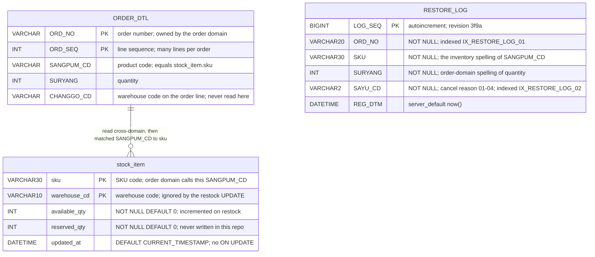

# Inventory Data Model

## Overview

The inventory data model has three layers that do not agree with each other. There are two real
tables with real DDL — `stock_item`, created by a Flyway-style `sql/V1__stock.sql` that predates
Alembic, and `RESTORE_LOG`, created by the Alembic base revision — and two Python dataclasses in
`app/models.py` that describe a third, different shape and are imported by nothing.

Reading them side by side is the point of this artifact. The DDL is the only layer the running
code agrees with: the SQL literals in `app/main.py` name `stock_item.sku`, `available_qty` and
`reserved_qty`, which is exactly what `sql/V1__stock.sql` creates. The dataclasses name
`sku_cd` and `qty` instead, and know nothing about a warehouse.

There is a fourth entity in the picture that this service does not own at all: `ORDER_DTL`.
The restock path reads it directly, across the domain boundary, from the same connection —
`app/db.py` hardcodes `"database": "sellflow_order"`, so the order-domain table is simply
reachable from inventory SQL.

## Key Facts

- `stock_item` is the only table with real DDL in the repository → sql/V1__stock.sql
- `stock_item`'s primary key is composite: `PRIMARY KEY (sku, warehouse_cd)` → sql/V1__stock.sql
- `stock_item` is `ENGINE=InnoDB DEFAULT CHARSET=utf8mb4` → sql/V1__stock.sql
- `available_qty` and `reserved_qty` are `INT NOT NULL DEFAULT 0`; `updated_at` is `DATETIME DEFAULT CURRENT_TIMESTAMP` with no `ON UPDATE` clause, so it records insert time rather than last change → sql/V1__stock.sql
- The DDL file carries its own vocabulary warning: "재고 스키마. 주문 도메인과 용어가 다르다 (SANGPUM_CD ↔ sku)." — "Inventory schema. The vocabulary differs from the order domain (SANGPUM_CD ↔ sku)." → sql/V1__stock.sql
- `RESTORE_LOG` is created by Alembic revision 3f9a with six columns — `LOG_SEQ` (`BigInteger`, autoincrement primary key), `ORD_NO` (`String(20)`), `SKU` (`String(30)`), `SURYANG` (`Integer`), `SAYU_CD` (`String(2)`), `REG_DTM` (`DateTime`, `server_default now()`) — plus `IX_RESTORE_LOG_01` on `ORD_NO` → alembic/versions/20230414_1120-3f9a_add_restore_log.py
- Revision 3f9a is the base of the chain: `down_revision = None`, with a docstring recording why — "stock_item 은 alembic 도입 이전에 sql/V1__stock.sql 로 만들었다. alembic 은 RESTORE_LOG 부터 적용한다." ("stock_item was made with sql/V1__stock.sql before Alembic was introduced; Alembic applies from RESTORE_LOG onward") → alembic/versions/20230414_1120-3f9a_add_restore_log.py
- Revision 8ba1, "add restore log reason index", creates `IX_RESTORE_LOG_02` on `SAYU_CD` and drops it on downgrade — the reason index its name promises → alembic/versions/20240902_0931-8ba1_add_restore_log_reason_i.py
- `RESTORE_LOG` uses the order domain's romanised column names (`ORD_NO`, `SURYANG`, `SAYU_CD`) rather than this service's own vocabulary, except for `SKU`, where it keeps the inventory spelling — so a single table straddles both naming systems → alembic/versions/20230414_1120-3f9a_add_restore_log.py, sql/V1__stock.sql
- `app/models.py` defines `Stock(sku_cd, qty, updated_at)`, whose field names match no column in `stock_item` (`sku_cd` vs `sku`, `qty` vs `available_qty`/`reserved_qty`) and which has no warehouse field at all → app/models.py, sql/V1__stock.sql
- `app/models.py` defines `RestoreLog(ord_no, sku_cd, qty, sayu_cd, result)`, which matches the DDL on only one field name (`sayu_cd`/`SAYU_CD`), renames three (`sku_cd`/`SKU`, `qty`/`SURYANG`, `ord_no`/`ORD_NO` differing only in case), declares a `result` field with no column, and omits `LOG_SEQ` and `REG_DTM` → app/models.py, alembic/versions/20230414_1120-3f9a_add_restore_log.py
- Neither dataclass is imported by any module: a repository-wide grep for `app.models`, `import models`, `RestoreLog` and `Stock(` returns only the class definitions themselves in `app/models.py` → app/models.py
- `app/models.py`'s docstring asserts a scope the DDL contradicts: "재고 모델. SKU 단위로만 관리한다. 창고별 재고는 별도 시스템." — "Inventory model. Managed at SKU granularity only. Per-warehouse stock is a separate system." — yet `stock_item` keys on `(sku, warehouse_cd)` → app/models.py, sql/V1__stock.sql
- The read path queries an order-domain table: `SELECT SANGPUM_CD, SURYANG FROM ORDER_DTL WHERE ORD_NO = %(o)s` → app/main.py
- That cross-domain read is possible because `app/db.py` connects to `"database": "sellflow_order"` rather than an inventory database → app/db.py
- No row is ever written to `RESTORE_LOG` by any code path → app/main.py
- `ORDER_DTL` is keyed on the composite `(ORD_NO, ORD_SEQ)`, so an order with several lines is the normal case, not an edge case → order-service:src/main/resources/db/migration/V1__init.sql
- The restock read uses `fetch_one`, so on a multi-line order exactly one `ORDER_DTL` row is restocked and the rest are silently dropped → app/main.py, order-service:src/main/resources/db/migration/V1__init.sql
- The Alembic chain resolves: `3f9a` (`down_revision = None`) then `8ba1` (`down_revision = "3f9a"`), so `alembic upgrade head` has a base and an order → alembic/versions/20230414_1120-3f9a_add_restore_log.py, alembic/versions/20240902_0931-8ba1_add_restore_log_reason_i.py
- `requirements.txt` now pins `sqlalchemy==2.0.23` and `alembic==1.12.1` alongside `fastapi`, `uvicorn` and `pymysql`, so the migration tooling the revisions import is declared → requirements.txt
- The two migration systems remain disjoint by design, and 3f9a says so: `sql/V1__stock.sql` created `stock_item` before Alembic existed and no revision references it; the Alembic chain covers `RESTORE_LOG` only → sql/V1__stock.sql, alembic/versions/20230414_1120-3f9a_add_restore_log.py
- `alembic.ini` points `sqlalchemy.url` at `mysql://inventory:@localhost:3306/inventory`, a different database from the `sellflow_order` that `app/db.py` actually opens, so even a working migration would not have run against the database the code uses → alembic.ini, app/db.py
- `warehouse_cd` is `VARCHAR(10) NOT NULL` with no `CHECK`, no foreign key and no lookup table; the only warehouse literal anywhere in the five repos is `'GIMPO'`, the default on the order side's `ORDER_DTL.CHANGGO_CD` → sql/V1__stock.sql, order-service:src/main/resources/db/migration/V12__add_warehouse.sql
- That warehouse column was added for a second site that has no code value: V12's header comment reads "용인센터 오픈 대응 / 2024-09-02 물류팀 요청 / 주문팀 반영" ("in response to the Yongin centre opening; requested by the logistics team on 2024-09-02, applied by the order team"), yet the migration sets every existing row to `'GIMPO'` and defines no Yongin code → order-service:src/main/resources/db/migration/V12__add_warehouse.sql
- The restock reason code is not an enum anywhere in this service: `RestockRequest.reason_code` is typed `str`, and eligibility is a plain set membership test against `RESTOCKABLE_REASONS = {"01", "02"}` → app/main.py
- The authoritative definition of the code values lives in the order domain, as `CancelReason`: `01` 파트너 귀책 (partner fault), `02` 시스템 오류 (system error), `03` 고객 변심 (customer change of mind), `04` 배송 실패 (delivery failure) → order-service:src/main/java/kr/co/sellflow/order/domain/CancelReason.java
- The same eligibility set is written down three times in this repo — enforced in `app/main.py`, duplicated unused in `app/config.py`, and asserted by `tests/test_restore.py` against the `app/config.py` copy — so the test cannot detect a change to the enforced one → app/main.py, app/config.py, tests/test_restore.py
- The repository README states the vocabulary split as a deliberate mapping, and states that inventory keeps no order number: "주문 도메인과 용어 체계가 다르다" ("the terminology differs from the order domain"), with `SANGPUM_CD` → `sku`, `SURYANG` → `available_qty` / `reserved_qty`, and `ORD_NO` → "(보관하지 않음)" ("not retained") → README.md

## Entities



### stock_item

The live inventory table (sql/V1__stock.sql).

| Column | Type | Constraints | Notes |
|---|---|---|---|
| `sku` | `VARCHAR(30)` | `NOT NULL`, PK part 1 | The order domain's `SANGPUM_CD` |
| `warehouse_cd` | `VARCHAR(10)` | `NOT NULL`, PK part 2 | 창고 코드 / warehouse code |
| `available_qty` | `INT` | `NOT NULL DEFAULT 0` | Incremented by the restock UPDATE |
| `reserved_qty` | `INT` | `NOT NULL DEFAULT 0` | Read by `GET /stock/{sku}`; never written |
| `updated_at` | `DATETIME` | `DEFAULT CURRENT_TIMESTAMP` | No `ON UPDATE CURRENT_TIMESTAMP`, so a restock does not refresh it |

The composite key matters for behaviour, not only for storage. Because a SKU may have one row
per warehouse, both live SQL statements in `app/main.py` are under-qualified: the `SELECT`
behind `GET /stock/{sku}` filters on `sku` alone and returns whichever single row the driver
hands back first, and the restock `UPDATE ... WHERE sku = %(sku)s` has no `warehouse_cd`
predicate, so it adds the restored quantity to every warehouse row for that SKU. The
consequences are traced in [[PROC-INVENTORY-RESTOCK]].

### RESTORE_LOG

The restore audit trail: a fully specified table that nothing writes.

Revision 3f9a (2023-04-14) is the base of the chain and creates it:

| Column | Type | Constraints | Notes |
|---|---|---|---|
| `LOG_SEQ` | `BigInteger` | primary key, autoincrement | Surrogate key |
| `ORD_NO` | `String(20)` | `NOT NULL` | Order number; matches `ORDER_DTL.ORD_NO`'s width. Indexed by `IX_RESTORE_LOG_01` |
| `SKU` | `String(30)` | `NOT NULL` | The inventory spelling; matches `stock_item.sku`'s width, and the order domain's `SANGPUM_CD` |
| `SURYANG` | `Integer` | `NOT NULL` | Quantity, under the order domain's romanised name rather than `qty` |
| `SAYU_CD` | `String(2)` | `NOT NULL` | Cancel reason code `01`–`04`. Indexed by `IX_RESTORE_LOG_02` (revision 8ba1) |
| `REG_DTM` | `DateTime` | `server_default now()` | Row created |

The revision's own docstring explains why the chain starts here rather than with `stock_item`:
"stock_item 은 alembic 도입 이전에 sql/V1__stock.sql 로 만들었다. alembic 은 RESTORE_LOG 부터
적용한다." ("stock_item was made with sql/V1__stock.sql before Alembic was introduced; Alembic
applies from RESTORE_LOG onward"). `down_revision = None`, so the chain has a base, and
`downgrade()` drops the table.

Revision 8ba1 (2024-09-02) adds the index its title names:

```python
def upgrade():
    op.create_index("IX_RESTORE_LOG_02", "RESTORE_LOG", ["SAYU_CD"])
```

An index on the reason code is a query plan for a specific question — "how many restores by
reason, over a period" — which is precisely the eligibility question `RESTOCKABLE_REASONS`
decides on every call. The table and both its indexes are ready for it.

Nothing writes a row. The restock handler logs to Python's `logging` module and returns, with no
INSERT anywhere (app/main.py), and a grep across all five repos for `RESTORE_LOG`, `RestoreLog`
and `restore_log` returns only the two revisions and the unused dataclass. So the audit trail
exists as schema and has no data path — a sharper finding than the shapelessness it replaced,
because there is now nothing left to blame but the missing INSERT. See
[[PROC-INVENTORY-RESTORE-LOG-LIFECYCLE]].

#### What still does not line up

| # | Gap | Evidence |
|---|---|---|
| 1 | **`env.py` is a stub.** The whole file is `from alembic import context  # noqa: F401` plus a comment deferring to `alembic.ini`. There is no `run_migrations_online`, no engine construction, no `target_metadata`, so the repository provides no runner for the revisions | alembic/env.py |
| 2 | **The migration tool and the application disagree on the database.** `alembic.ini` sets `sqlalchemy.url = mysql://inventory:@localhost:3306/inventory`, while `app/db.py` hardcodes `"database": "sellflow_order"` | alembic.ini, app/db.py |
| 3 | **The dataclass does not describe the table.** `RestoreLog` names `sku_cd`, `qty` and a `result` field the DDL has no column for, and omits `LOG_SEQ` and `REG_DTM` | app/models.py |

The chain's own history is worth noting for the SF-2287 timeline: revision 3f9a is dated
2023-04-14, which falls between SF-2287's `created: 2023-04-03` and its `resolved: 2023-04-21`
(sellflow-docs:context/tickets/SF-2287.md), and the follow-up 8ba1 is dated 2024-09-02, the same
day the order side added `CHANGGO_CD`
(order-service:src/main/resources/db/migration/V12__add_warehouse.sql). Someone built a restore
audit trail during the cancellation-policy change, indexed it seventeen months later, and never
wrote to it; the dates are suggestive, and no commit message, ticket or comment in any repo
connects them, so the link is recorded as chronology rather than causation.

### app/models.py dataclasses — declared, not used

| Dataclass | Fields | Relationship to reality |
|---|---|---|
| `Stock` | `sku_cd: str`, `qty: int`, `updated_at: str` | Field names do not match `stock_item` (`sku_cd` vs `sku`, `qty` vs `available_qty`/`reserved_qty`), and `warehouse_cd` is absent |
| `RestoreLog` | `ord_no: str`, `sku_cd: str`, `qty: int`, `sayu_cd: str`, `result: str` | Predates the DDL it does not match: `sku_cd` vs `SKU`, `qty` vs `SURYANG`, a `result` field with no column, and no `LOG_SEQ` or `REG_DTM` |

Neither is imported anywhere. `grep -rn "app.models\|import models\|RestoreLog\|Stock("` across
the repository returns only the two class definitions in `app/models.py` itself; the routes in
`app/main.py` build responses straight from `pymysql` `DictCursor` dictionaries. The module is
dead code that reads like a specification, which is the trap: a reader who takes `app/models.py`
as the data model will get the column names wrong.

### ORDER_DTL — read across the domain boundary

`ORDER_DTL` is an order-domain table. This service reads it anyway:

```sql
SELECT SANGPUM_CD, SURYANG FROM ORDER_DTL WHERE ORD_NO = %(o)s
```

Only two columns are read from here, `SANGPUM_CD` (product code) and `SURYANG` (quantity), but
the table itself is larger and its shape matters. The order-side DDL creates `ORDER_DTL` with the
composite primary key `(ORD_NO, ORD_SEQ)` and the columns `SANGPUM_CD`, `SURYANG`, `DANGA` and
`PARTNER_ID`, plus `OKSYEON_MYEONG` and `GONGGEUP_GA` (V4), `CHANGGO_CD` (V12) and `OPT_AMT`
(V19) (order-service:src/main/resources/db/migration/V1__init.sql). Two consequences follow for
this service. A single order legitimately has many detail lines, and the restock statement's
`fetch_one` reads only one of them, so a two-line cancellation restocks one SKU and quietly
ignores the other. And `CHANGGO_CD` — a warehouse code on the order line — is the value that
would have qualified the `stock_item` update by warehouse, but the restock query never selects it.

The read is a direct SQL access, not an API call, and it is possible only because `app/db.py`
hardcodes `"database": "sellflow_order"` — the shared instance rather than the `inventory`
database that `.env.sample`, `alembic.ini` and the service registry all describe. Inventory
therefore depends on the physical schema of a table it does not own; a rename or type change
in the order domain would break restock silently. See [[SYS-ORDER]] and [[SYS-INVENTORY]].

## Worked Examples

### Value domains

Neither of the two coded columns in this model is constrained by the database. Both are plain
strings whose meaning lives in code elsewhere, so these tables are reconstructions from the
authoritative definitions, not from DDL.

**`stock_item.warehouse_cd` — 창고 코드 (warehouse code)**

`VARCHAR(10) NOT NULL`, primary-key part 2. No `CHECK`, no foreign key, no lookup table, no seed
data (sql/V1__stock.sql). The value set is therefore not knowable from this repository. One
literal exists anywhere in the five sampled repos:

| Value | Source | Meaning | Status |
|---|---|---|---|
| `GIMPO` | `ALTER TABLE ORDER_DTL ADD COLUMN CHANGGO_CD VARCHAR(10) DEFAULT 'GIMPO'` (order-service:src/main/resources/db/migration/V12__add_warehouse.sql) | 김포 centre | The only warehouse literal in any repo. It is the *order* side's default, on a different column in a different table; nothing asserts that `stock_item` uses the same vocabulary |
| *(none)* | — | 용인센터 (Yongin centre) | Named in V12's comment "용인센터 오픈 대응" ("in response to the Yongin centre opening") as the reason the column was added, yet given no code value in any file. A warehouse the schema was extended for and never learned to name |
| *(unknown others)* | — | — | `sql/V1__stock.sql` ships no seed rows, so nothing enumerates the real set |

Two consequences follow. The column is half the primary key of `stock_item` yet no query in
`app/main.py` filters on it, so its value never affects behaviour inside this service. And
`ORDER_DTL.CHANGGO_CD` — the one place an order line records a warehouse — is not selected by the
restock query, so even the value that exists is not carried across.

**`RestockRequest.reason_code` — 취소 사유 코드 (cancellation reason code)**

Not a column at all: it is a request field on `POST /stock/restock`, typed `str`, tested for
membership in `RESTOCKABLE_REASONS = {"01", "02"}` (app/main.py). It is included here because it
is the only value domain that decides whether this schema is written to. The authoritative
definition is the order domain's `CancelReason` enum:

| Code | Enum constant | Korean label | Meaning | Restocks here? | Business-rules sheet says |
|---|---|---|---|---|---|
| `01` | `PARTNER_GWICHAEK` | 파트너 귀책 | Partner fault (재고 부족, 출고 지연 — out of stock, shipping delay) | **Yes** | 재고 복원 O |
| `02` | `SYSTEM_ORYU` | 시스템 오류 | System error | **Yes** | 재고 복원 O |
| `03` | `GOGAEK_BYEONSIM` | 고객 변심 | Customer changed their mind | No | 재고 복원 X — "배송 시작 후 취소 시 재고 복원 불가" (no restoration when cancelled after delivery has begun) |
| `04` | `BAESONG_SILPAE` | 배송 실패 | Delivery failure (주소불명, 수취거부 — address unknown, refused receipt) | **No** | **재고 복원 O** — "물류팀 확인 후 처리" (handled after logistics-team confirmation) |
| anything else | — | — | — | No | Not listed |

Sources: order-service:src/main/java/kr/co/sellflow/order/domain/CancelReason.java for the
constants and labels; app/main.py for the enforced set; sellflow-docs:context/business-rules.md
for the 재고 복원 column.

Row `04` is the disagreement. The spreadsheet marks it restorable; the code does not restore it,
and the code comment justifying the exclusion names only `03`: "03(고객 변심)은 배송이 시작된 뒤
취소되는 경우가 많아 복원 대상이 아니다." — "03, customer change of mind, is often cancelled
after delivery has started, so it is not a restock case" (app/main.py). `04` is excluded by
omission, without a stated reason. `app/config.py`'s duplicate carries a shorter comment,
"복원 대상 사유코드. 01 파트너귀책, 02 시스템오류." ("restock-eligible reason codes; 01 partner
fault, 02 system error"), which likewise says nothing about `04`. The workflow consequence is
traced in [[PROC-INVENTORY-RESTOCK]].

Note also what is *not* an enum: `CancelReason.of(code)` throws
`IllegalArgumentException("알 수 없는 취소 사유 코드: " + code)` ("unknown cancellation reason
code") on the order side, so unknown codes are rejected there — but `POST /stock/restock` accepts
them and answers 200 with `{"restocked": false, "reason": "not_restockable"}`, making an unknown
code indistinguishable from a known non-restockable one.

### Queries

**The cross-domain join, as the code actually performs it.** There is no SQL `JOIN` anywhere in
this service. The restock path issues two statements on one connection to `sellflow_order`, with
the join performed in Python by passing `items["SANGPUM_CD"]` from the first into the second:

```sql
-- statement 1, in the order domain
SELECT SANGPUM_CD, SURYANG FROM ORDER_DTL WHERE ORD_NO = %(o)s;
-- statement 2, in the inventory domain, using the value read above
UPDATE stock_item SET available_qty = available_qty + %(q)s WHERE sku = %(sku)s;
```

Written as the single statement it is trying to be, the intent — and both of its bugs — become
visible at once:

```sql
UPDATE stock_item s
  JOIN ORDER_DTL d ON d.SANGPUM_CD = s.sku      -- and, correctly, AND d.CHANGGO_CD = s.warehouse_cd
   SET s.available_qty = s.available_qty + d.SURYANG
 WHERE d.ORD_NO = '2026090100123';
```

The real code loses the `CHANGGO_CD = warehouse_cd` predicate, so every warehouse row is credited,
and `fetch_one` collapses the `ORDER_DTL` side to a single line, so a multi-line order restocks
only one of its SKUs (app/main.py, sql/V1__stock.sql,
order-service:src/main/resources/db/migration/V1__init.sql).

**A diagnostic query a human would actually run.** To find SKUs whose stock was credited more than
once for one order — the retry case, since the write has no idempotency guard — there is nothing
to query: `RESTORE_LOG` has the right columns and no writer, and `stock_item.updated_at` has no
`ON UPDATE CURRENT_TIMESTAMP`, so it still holds the row's insert time. The absence is the
finding. No table in this model records that a restock happened.

**A restock on a single-warehouse SKU.** Suppose `stock_item` holds one row,
`('SKU-1001', 'WH-SEOUL', 40, 3, ...)`, and `ORDER_DTL` holds `ORD_NO='2026090100123'`,
`SANGPUM_CD='SKU-1001'`, `SURYANG=2`. `POST /stock/restock` with reason `01` runs
`UPDATE stock_item SET available_qty = available_qty + 2 WHERE sku = 'SKU-1001'`, leaving
`available_qty = 42`. `reserved_qty` stays at 3 and `updated_at` does not move, because the
column has no `ON UPDATE CURRENT_TIMESTAMP` (sql/V1__stock.sql, app/main.py).

**The same restock on a two-warehouse SKU.** Now suppose two rows exist,
`('SKU-1001', 'WH-SEOUL', 40, 3, ...)` and `('SKU-1001', 'WH-BUSAN', 12, 0, ...)`. The same
statement matches both rows, because the `WHERE` clause names only `sku` while the primary key
is `(sku, warehouse_cd)`. Both rows gain 2, so 4 units enter inventory for a 2-unit
cancellation (sql/V1__stock.sql, app/main.py).

**A read after that restock.** `GET /stock/SKU-1001` runs
`SELECT sku, available_qty, reserved_qty FROM stock_item WHERE sku='SKU-1001'` and, through
`fetch_one`, returns exactly one of the two rows, with no warehouse field to say which:

```json
{"sku": "SKU-1001", "available_qty": 42, "reserved_qty": 3}
```

The response is indistinguishable from a single-warehouse answer (app/main.py, app/db.py).

## Related

- [[API-INVENTORY]] — the endpoints that issue these statements
- [[GLOSSARY-INVENTORY]] — `sku`, `warehouse_cd`, `available_qty`, `reserved_qty` and their order-domain counterparts
- [[PROC-INVENTORY-RESTOCK]] — how the under-qualified UPDATE and `fetch_one` shape the workflow
- [[RISK-INVENTORY]] — the empty migrations and the unused model module as defects
- [[SYS-INVENTORY]] — the owning service and the shared-database finding
- [[SYS-ORDER]] — owner of `ORDER_DTL`
