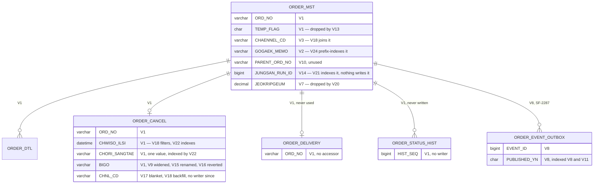

# Order Schema Migration History (V1–V24)

## Overview

order-service's schema is defined by 24 Flyway files spanning 2019-06 to (by their own comments) 2025-11. `application.yml` sets `flyway.enabled: true` and `jpa.hibernate.ddl-auto: none`, so these files are meant to be the sole authority on the schema.

They are sufficient. Every column a later migration references is created by an earlier one, so **V1 through V24 applies in order to an empty database**, and the six tables the entities map are all created here. That was not always the case, and the history is still worth reading, because what the files record is a decade of churn on a schema no one validates: a column renamed and renamed back within at most 18 days after an outage in another team's service, points columns added in 2022 and dropped in 2024, a consolidation baseline reserved in 2025 and still unwritten, and version numbers that stop matching their own comment dates from V15 onward.

This artifact reads all 24 line by line and separates, for each one, what it says it does from what it actually does. It is the answer to Q-010.

Two framing facts before the timeline. First, **nothing validates these files**: CI runs `./gradlew clean build -x test`, and the only migration-related workflow is manual (`on: workflow_dispatch`) and runs `flywayInfo`, which reports which versions were applied rather than checking that they can apply. Second, **the version order and the comment dates diverge from V15 onward** — V14's comment is dated 2025-11-20 and V15's 2024-01 — so the file numbering cannot be read as a chronology past V14.

## Key Facts

- 24 migration files exist, V1 through V24, in `src/main/resources/db/migration/`, and Flyway is the declared schema authority (`flyway.enabled: true`, `jpa.hibernate.ddl-auto: none`) → src/main/resources/application.yml
- **The history is self-contained.** Every column the later migrations touch resolves to an earlier `CREATE`/`ADD`: V18 joins `m.CHAENNEL_CD` (V3) and filters `c.CHWISO_ILSI` (V1); V21 indexes `ORDER_MST(JUNGSAN_RUN_ID)` (V14); V22 indexes `ORDER_CANCEL(CHORI_SANGTAE, CHWISO_ILSI)` (both V1); V24 indexes `ORDER_MST(GOGAEK_MEMO(64))` (V2); V20 drops the two columns V7 added; V13 drops the `TEMP_FLAG` V1 created → src/main/resources/db/migration/V18__backfill_cancel_channel.sql, V21__add_settlement_ref_index.sql, V22__order_cancel_status_index.sql, V24__add_order_memo_search_index.sql, V20__drop_unused_point_columns.sql, V13__cleanup_unused.sql
- **V1 creates five tables, not three**: `ORDER_MST`, `ORDER_DTL`, `ORDER_DELIVERY`, `ORDER_STATUS_HIST` and `ORDER_CANCEL`. With `ORDER_EVENT_OUTBOX` from V8, all six tables the JPA entities map have DDL in this directory → src/main/resources/db/migration/V1__init.sql, src/main/resources/db/migration/V8__add_cancel_event_outbox.sql
- **V15 renamed `ORDER_CANCEL.BIGO` to `MEMO`; V16 renamed it back**, and the reason is in the file: "V15 롤백. 정산 배치 쿼리가 BIGO 를 직접 참조하고 있어 장애. 2024-01-18" ("rollback of V15. The settlement batch query references BIGO directly, causing an outage") → src/main/resources/db/migration/V16__revert_rename_bigo.sql
- The revert is the surviving state — `OrderCancel` maps `@Column(name = "BIGO")` — and the cleanup is still open in 박성민's notes: "- [ ] V15 롤백 정리 (V16 으로 되돌림, 나중에 정리)" → src/main/java/kr/co/sellflow/order/domain/OrderCancel.java, order-service:TASK.md
- **No `BIGO` reference exists in settlement-batch today.** `grep -rn BIGO settlement-batch/` returns nothing, so the query that caused the outage is not findable in the repository it was attributed to → settlement-batch/ (grep)
- **V13 retires a column that lived six years without a single reader**: `ALTER TABLE ORDER_MST DROP COLUMN TEMP_FLAG` removes the `CHAR(1) DEFAULT 'N'` column V1 created in 2019. Plain `DROP COLUMN`, which MySQL 5.7 — the version both order-service's and settlement-batch's READMEs name — accepts. The same file defers `BAESONG_MSG`, a column no migration ever created, on the grounds a batch might reference it → src/main/resources/db/migration/V13__cleanup_unused.sql, src/main/resources/db/migration/V1__init.sql, order-service:README.md
- **V20 reverses V7 exactly**: V7 added `JEOKRIPGEUM` and `HALIN_GEUMAEK` in 2022-08, V20 drops both in 2024-09 because "적립금은 별도 시스템으로 이관됨" ("points were migrated to a separate system") — so loyalty points spent two years in this schema and left it → src/main/resources/db/migration/V7__add_point_columns.sql, V20__drop_unused_point_columns.sql
- **V18 makes historic `CHNL_CD` derived rather than captured**: V17 blanket-set every existing row to `'ADMIN'`, and V18 reclassified a subset to `'APP'` from the *order's* inflow channel, "앱 취소분을 로그 기준으로 재분류" ("reclassify app cancellations on the basis of logs") → src/main/resources/db/migration/V17__add_cancel_channel.sql, V18__backfill_cancel_channel.sql
- **V23 is an empty slot, and says so.** `V23__consolidated_schema.sql` contains four comment lines and not one statement; the comment states plainly that the consolidated dump was never written and that new environments keep applying V1 onward — "아직 작성하지 않았다. 신규 환경은 계속 V1 부터 순차 적용한다." — with an unassigned TODO → src/main/resources/db/migration/V23__consolidated_schema.sql
- V23's comment is dated 2025-02 and scopes itself to V1–V22, while V14's comment is dated 2025-11-20 — the placeholder is dated nine months before one of the migrations it would have to contain → src/main/resources/db/migration/V23__consolidated_schema.sql, V14__add_settlement_ref.sql
- The file set splits cleanly in style: V1–V16, V18, V20 and V23 carry Korean header comments with a date and usually a requesting team; V17, V19, V21, V22 and V24 carry no comment at all beyond a column comment — the two index-only migrations and the two single-`ALTER` ones are the undocumented half → src/main/resources/db/migration/
- **Nothing in CI would catch any of this.** `ci.yml` runs `./gradlew clean build -x test` with the test step commented out since 2023-05-11, and `migration-issue.yml` is `on: workflow_dispatch`, marked "SF-4188 대응용 … 임시" ("for SF-4188 … temporary"), and runs only `flywayInfo` → order-service:.github/workflows/ci.yml, order-service:.github/workflows/migration-issue.yml
- The same pattern recurs in the settlement repository, so it is an organisational habit rather than one team's slip: settlement-batch's `V4__cancel_recon_queue_index.sql` indexes `CANCEL_RECON_QUEUE (STATUS, REG_DT)` while its V1 created `RECV_DTM`, and its V5 adds `PROCESSED_AT`/`PROCESSED_BY` beside V1's existing `PROCESSED_DTM` → settlement-batch:src/main/resources/db/migration/V4__cancel_recon_queue_index.sql
- Cross-team requests are visible in the comments and concentrate on the settlement boundary: V11 "2024-05-16 정산팀 요청" (settlement team request), V14 "2025-11-20 정산팀 요청", V5 and V12 "물류팀 요청" (logistics team request) → src/main/resources/db/migration/V11__outbox_index.sql, V14__add_settlement_ref.sql, V5__add_delivery_columns.sql, V12__add_warehouse.sql

## The Timeline

Version | Date (from the file's own comment) | Stated intent | What it actually does | Evidence
---|---|---|---|---
V1 | 2019-06, 주문팀 | Initial schema | Creates five tables: `ORDER_MST` (9 cols incl. `TEMP_FLAG`, PK `ORD_NO`, 2 indexes), `ORDER_DTL` (6 cols, composite PK, 1 index), `ORDER_DELIVERY` (4 cols, PK `ORD_NO`, 1 index), `ORDER_STATUS_HIST` (5 cols, auto-increment PK, 1 index) and `ORDER_CANCEL` (5 cols, PK `ORD_NO`). Declares the no-FK policy that everything downstream inherits: "주의: FK 제약 없음. 성능 이슈로 2019년 설계 당시 제외함." | `V1__init.sql`
V2 | 2019-09-11, 주문팀 | Order memo column | `ORDER_MST ADD GOGAEK_MEMO VARCHAR(500)` — the column V24 later prefix-indexes | `V2__add_order_memo.sql`
V3 | 2020-02-20, 주문팀 | Inflow channel for the app launch | `ORDER_MST ADD CHAENNEL_CD VARCHAR(20)`, then a blanket `UPDATE ... SET CHAENNEL_CD='WEB' WHERE CHAENNEL_CD IS NULL` — every pre-existing order is declared web-origin. The column V18's backfill later joins on | `V3__add_channel_code.sql`
V4 | 2020-06-08, 주문팀 | Option products | `ORDER_DTL ADD OKSYEON_MYEONG, GONGGEUP_GA` | `V4__order_dtl_option.sql`
V5 | 2020-11-03, 물류팀 요청 | Delivery info | Adds `UNSONGJANG_BEONHO`, `TAEKBAESA_CD` **to `ORDER_MST`**, plus `IX_ORDER_MST_03` — duplicating, on the master row, what V1's `ORDER_DELIVERY.INVOICE_NO`/`TAKBAE_CD` already held. Neither team's copy has a reader | `V5__add_delivery_columns.sql`, `V1__init.sql`
V6 | 2021-04-14, 주문팀 | Replace a low-cardinality index | Drops `IX_ORDER_MST_02 (SANGTAE_CD)`, recreates it as `(SANGTAE_CD, JUMUN_ILSI)`. The only tuning migration in the set; states the reason, gives no measurement | `V6__fix_index.sql`
V7 | 2022-08-22, 주문팀 | Loyalty points | `ORDER_MST ADD JEOKRIPGEUM, HALIN_GEUMAEK` (both `DECIMAL(15,0) DEFAULT 0`) | `V7__add_point_columns.sql`
V8 | 2023-04-18, 주문팀 박성민 | SF-2287 outbox | Creates `ORDER_EVENT_OUTBOX` (6 cols, PK `EVENT_ID`, `IX_ORDER_EVENT_OUTBOX_01 (PUBLISHED_YN, REG_DTM)`) and records the architecture in a comment: "정산 배치의 릴레이 잡이 주기적으로 폴링한다. (별도 브로커 없음)" | `V8__add_cancel_event_outbox.sql`, SF-2287
V9 | 2023-07-05, 주문팀 | Widen the cancel remark (CS request) | `ORDER_CANCEL MODIFY BIGO VARCHAR(2000)` | `V9__order_cancel_bigo_extend.sql`
V10 | 2024-01-29, 주문팀 | Order split/merge | `ORDER_MST ADD PARENT_ORD_NO` + `IX_ORDER_MST_04`. **Column and index only** — no code in any of the five repos reads or writes it | `V10__add_split_merge.sql`
V11 | 2024-05-16, 정산팀 요청 | Relay had slowed down | `CREATE INDEX IX_ORDER_EVENT_OUTBOX_02 ON ORDER_EVENT_OUTBOX (EVENT_TYPE, PUBLISHED_YN)` — 주문팀's table, indexed on 정산팀's access path | `V11__outbox_index.sql`
V12 | 2024-09-02, 물류팀 요청 | Yongin centre opening | `ORDER_DTL ADD CHANGGO_CD VARCHAR(10) DEFAULT 'GIMPO'` | `V12__add_warehouse.sql`
V13 | 2025-03-11, 주문팀 | Clean up unused columns | `ALTER TABLE ORDER_MST DROP COLUMN TEMP_FLAG` — V1's flag column, retired after six years with no reader in any repo. Also leaves a TODO deferring `BAESONG_MSG` "배치에서 참조 가능성 있어 보류" ("held back because a batch might reference it"), a column no migration ever created | `V13__cleanup_unused.sql`, `V1__init.sql`
V14 | 2025-11-20, 정산팀 요청 | Settlement reference for convenience | `ORDER_MST ADD JUNGSAN_RUN_ID BIGINT NULL`, with the warning that it is a cache: "주의: 실제 정산 여부는 SETTLEMENT_DTL 이 정본이다. 본 컬럼은 캐시 성격." **Nothing has ever written it** | `V14__add_settlement_ref.sql`
V15 | 2024-01 (day not recorded) | "비고 컬럼 이름 통일 (BIGO -> MEMO)" — unify the remark column's name | `ORDER_CANCEL CHANGE COLUMN BIGO MEMO VARCHAR(2000) NULL`. Note the version/date inversion against V14 | `V15__rename_bigo_to_memo.sql`
V16 | 2024-01-18 | Roll V15 back | `CHANGE COLUMN MEMO BIGO VARCHAR(2000) NULL`, because "정산 배치 쿼리가 BIGO 를 직접 참조하고 있어 장애" — an outage caused by another team's query against this team's column | `V16__revert_rename_bigo.sql`
V17 | none | Cancellation intake channel | `ORDER_CANCEL ADD CHNL_CD VARCHAR(10) NULL COMMENT '취소 접수 채널 (APP/ADMIN/CS)'`, then `UPDATE ... SET CHNL_CD='ADMIN' WHERE CHNL_CD IS NULL` — **assigns `ADMIN` to the entire table's history**. No code ever writes this column | `V17__add_cancel_channel.sql`
V18 | 2024-03 | Backfill: reclassify app cancellations from logs | `UPDATE ORDER_CANCEL c JOIN ORDER_MST m ... SET c.CHNL_CD='APP' WHERE c.CHNL_CD='ADMIN' AND m.CHAENNEL_CD='APP' AND c.CHWISO_ILSI >= '2023-01-01'`. Runs, but **derives the *cancellation* channel from the *order's* channel** — a value about how the order arrived, written into a column about how the cancellation arrived | `V18__backfill_cancel_channel.sql`
V19 | none | (unstated) | `ORDER_DTL ADD OPT_AMT BIGINT NOT NULL DEFAULT 0`. Overlaps conceptually with V4's `GONGGEUP_GA`; no comment explains the relationship | `V19__order_dtl_option_price.sql`
V20 | 2024-09 | Drop V7's unused point columns — "적립금은 별도 시스템으로 이관됨" ("points were migrated to a separate system") | Drops exactly the two columns V7 added, `JEOKRIPGEUM` and `HALIN_GEUMAEK`. Two years from introduction to removal, with no code having used either | `V20__drop_unused_point_columns.sql`, `V7__add_point_columns.sql`
V21 | none | Index the settlement reference | `CREATE INDEX IDX_ORDER_MST_SETTLE_REF ON ORDER_MST (JUNGSAN_RUN_ID)` — indexes V14's column. Nothing writes or reads that column, so the index has no query to serve | `V21__add_settlement_ref_index.sql`, `V14__add_settlement_ref.sql`
V22 | none | Index cancel status | `CREATE INDEX IDX_ORDER_CANCEL_STATUS ON ORDER_CANCEL (CHORI_SANGTAE, CHWISO_ILSI)` — both V1 columns. The leading column has exactly one distinct value in practice, so it behaves as an index on `CHWISO_ILSI` | `V22__order_cancel_status_index.sql`
V23 | 2025-02 | Consolidated baseline of V1–V22 for new environments | **Nothing — four comment lines and no SQL.** The comment is honest about it: the dump "아직 작성하지 않았다" ("has not been written yet") and new environments "계속 V1 부터 순차 적용한다" ("keep applying from V1 in order"), with an unassigned TODO. Also dated before V14's stated date | `V23__consolidated_schema.sql`
V24 | none | Memo search index | `CREATE INDEX IDX_ORDER_MST_MEMO ON ORDER_MST (GOGAEK_MEMO(64))` — a 64-byte prefix index on V2's column. No query in any repo filters on the memo | `V24__add_order_memo_search_index.sql`, `V2__add_order_memo.sql`

## Entities

### `ORDER_MST` — what each migration did to it

| Migration | Change | Status on the evidence here |
|---|---|---|
| V1 | create: `ORD_NO` PK, `GOGAEK_ID`, `JUMUN_ILSI`, `SANGTAE_CD`, `CHONG_GEUMAEK`, `BAESONG_JUSO`, `TEMP_FLAG`, `REG_DTM`, `UPD_DTM`; `IX_ORDER_MST_01`, `IX_ORDER_MST_02` | applies |
| V2 | `+ GOGAEK_MEMO VARCHAR(500)` | applies |
| V3 | `+ CHAENNEL_CD VARCHAR(20)` + blanket `'WEB'` backfill | applies |
| V5 | `+ UNSONGJANG_BEONHO`, `+ TAEKBAESA_CD`, `+ IX_ORDER_MST_03` | applies |
| V6 | `IX_ORDER_MST_02` → `(SANGTAE_CD, JUMUN_ILSI)` | applies |
| V7 | `+ JEOKRIPGEUM`, `+ HALIN_GEUMAEK` | applies |
| V10 | `+ PARENT_ORD_NO`, `+ IX_ORDER_MST_04` | applies; no code uses it |
| V13 | `− TEMP_FLAG` | applies; removes V1's column after six years with no reader |
| V14 | `+ JUNGSAN_RUN_ID BIGINT` (declared a cache) | applies; **no writer, no reader** |
| V20 | `− JEOKRIPGEUM`, `− HALIN_GEUMAEK` | applies; removes exactly what V7 added |
| V21 | `+ IDX_ORDER_MST_SETTLE_REF (JUNGSAN_RUN_ID)` | applies; indexes a column nothing queries |
| V24 | `+ IDX_ORDER_MST_MEMO (GOGAEK_MEMO(64))` | applies; indexes a column nothing filters on |

Two names are still referenced from outside the migrations and created by none of them: `ORD_DT` (queried by `OrderSearchService`: `SELECT * FROM ORDER_MST WHERE ORD_DT BETWEEN ? AND ?`) and `BAESONG_MSG` (V13's deferral TODO). Neither appears in a migration, so neither affects whether the chain applies — but the first means a production query in this service selects on a column the schema does not define.

### `ORDER_CANCEL` — the most-churned table

| Migration | Change | Status |
|---|---|---|
| V1 | create: `ORD_NO` PK, `CHWISO_ILSI`, `CHWISO_SAYU_CD`, `CHORI_SANGTAE`, `BIGO VARCHAR(500)` | applies |
| V9 | `BIGO` → `VARCHAR(2000)` | applies |
| V15 | `BIGO` → `MEMO` | applied, then undone |
| V16 | `MEMO` → `BIGO` | applies; **the surviving state** |
| V17 | `+ CHNL_CD VARCHAR(10)` + blanket `'ADMIN'` backfill | applies; no application writer |
| V18 | `CHNL_CD` → `'APP'` for a joined subset | applies; joins `ORDER_MST.CHAENNEL_CD`, filters `CHWISO_ILSI` |
| V22 | `+ IDX_ORDER_CANCEL_STATUS (CHORI_SANGTAE, CHWISO_ILSI)` | applies; leading column has one distinct value |

### `ORDER_DTL` and `ORDER_EVENT_OUTBOX`

| Migration | Table | Change | Status |
|---|---|---|---|
| V1 | `ORDER_DTL` | create: composite PK `(ORD_NO, ORD_SEQ)`, `SANGPUM_CD`, `SURYANG`, `DANGA`, `PARTNER_ID`, `IX_ORDER_DTL_01` | applies |
| V4 | `ORDER_DTL` | `+ OKSYEON_MYEONG`, `+ GONGGEUP_GA` | applies |
| V12 | `ORDER_DTL` | `+ CHANGGO_CD DEFAULT 'GIMPO'` | applies |
| V19 | `ORDER_DTL` | `+ OPT_AMT BIGINT NOT NULL DEFAULT 0` | applies |
| V8 | `ORDER_EVENT_OUTBOX` | create + `IX_ORDER_EVENT_OUTBOX_01 (PUBLISHED_YN, REG_DTM)` | applies |
| V11 | `ORDER_EVENT_OUTBOX` | `+ IX_ORDER_EVENT_OUTBOX_02 (EVENT_TYPE, PUBLISHED_YN)` | applies |

`ORDER_EVENT_OUTBOX` is the only table in the set that no migration has ever had to correct — it was created once for SF-2287, indexed once at the consumer's request, and left alone. It is also the newest.

### `ORDER_DELIVERY` and `ORDER_STATUS_HIST`

| Migration | Table | Change | Status |
|---|---|---|---|
| V1 | `ORDER_DELIVERY` | create: PK `ORD_NO`, `INVOICE_NO`, `TAKBAE_CD`, `BAESONG_SANGTAE`, `IX_ORDER_DELIVERY_01 (INVOICE_NO)` | applies; **no reader, no writer** |
| V1 | `ORDER_STATUS_HIST` | create: PK `HIST_SEQ` auto-increment, `ORD_NO`, `BEFORE_CD`, `AFTER_CD`, `REG_DT`, `IX_ORDER_STATUS_HIST_01 (ORD_NO)` | applies; **no reader, no writer** |

Both are created by V1 and mapped column for column by `DeliveryInfo` and `OrderStatusHistory`. Neither has ever been amended, and neither has a caller: their repositories are declared and never injected. They are the two tables the schema got right and the code never used.



What the comments now trace is a column's whole life in the schema: which migration created it, which later one indexed, backfilled or removed it, and whether any code ever touched it. Several were created and dropped without a single reader in between.

## Worked Examples

**1. Checking what the database actually has, rather than what the files say.**

Because the files are not self-consistent, the only reliable move is to ask the database and diff it against the migrations:

```sql
-- What exists, by table, with the migration each column can be attributed to.
SELECT c.TABLE_NAME,
       c.COLUMN_NAME,
       c.COLUMN_TYPE,
       c.IS_NULLABLE,
       c.COLUMN_DEFAULT,
       c.COLUMN_COMMENT
  FROM information_schema.COLUMNS c
 WHERE c.TABLE_SCHEMA = 'sellflow_order'
   AND c.TABLE_NAME IN ('ORDER_MST','ORDER_DTL','ORDER_CANCEL',
                        'ORDER_EVENT_OUTBOX','ORDER_STATUS_HIST','ORDER_DELIVERY')
 ORDER BY c.TABLE_NAME, c.ORDINAL_POSITION;

-- The names worth checking specifically: the two the code references but no migration
-- creates, and the three the migrations dropped. Expect the first two to be absent.
SELECT TABLE_NAME, COLUMN_NAME
  FROM information_schema.COLUMNS
 WHERE TABLE_SCHEMA = 'sellflow_order'
   AND COLUMN_NAME IN ('ORD_DT','BAESONG_MSG',
                       'TEMP_FLAG','JEOKRIPGEUM','HALIN_GEUMAEK',
                       'JUNGSAN_RUN_ID','GOGAEK_MEMO','CHAENNEL_CD');

-- What Flyway believes it applied, including checksums and failures.
SELECT installed_rank, version, description, type, success, installed_on
  FROM flyway_schema_history
 ORDER BY installed_rank;
```

The third query is the decisive one and is the reason `migration-issue.yml` exists at all — but that workflow is manual and runs `flywayInfo`, which reports the same table rather than reconciling it against the DDL. The chain in the repository now applies to an empty database, so the remaining question is narrower than it used to be: whether the environments that were migrated incrementally over seven years match what a fresh V1–V24 run produces. If the second query returns a row for `TEMP_FLAG`, `JEOKRIPGEUM` or `HALIN_GEUMAEK`, some environment did not get V13 or V20.

**2. Reading a column's provenance before trusting its values.**

The lesson of V17/V18 generalises. Before using any column in analysis, ask which migration wrote its historic values:

| Column | Historic values came from | So the values mean |
|---|---|---|
| `ORDER_MST.CHAENNEL_CD` | V3's blanket `UPDATE ... = 'WEB'` | "existed before 2020-02-20", for every pre-V3 row |
| `ORDER_CANCEL.CHNL_CD` = `ADMIN` | V17's blanket `UPDATE` | "existed before V17", not "an agent cancelled it" |
| `ORDER_CANCEL.CHNL_CD` = `APP` | V18's join on `ORDER_MST.CHAENNEL_CD` | "the *order* arrived via the app", not "the *cancellation* did" |
| `ORDER_DTL.CHANGGO_CD` = `GIMPO` | V12's column default | "not assigned to Yongin", not "shipped from Gimpo" |
| `ORDER_CANCEL.CHORI_SANGTAE` = `COMPLETED` | the application constructor, hardcoded | nothing distinguishing — every row has it |

**3. Coded values introduced or backfilled by these migrations.**

`ORDER_CANCEL.CHNL_CD` (V17 comment: `취소 접수 채널 (APP/ADMIN/CS)`):

| Value | Meaning | Written by | Note |
|---|---|---|---|
| `ADMIN` | via CS admin | V17's blanket UPDATE | assigned to all pre-existing rows regardless of origin |
| `APP` | via the customer app | V18's backfill | inferred from `ORDER_MST.CHAENNEL_CD`, and only for rows cancelled on or after 2023-01-01 |
| `CS` | via CS | **nothing** | named in the column comment only |
| `NULL` | unknown | the default for every row inserted since V17 | the application has no channel field |

`ORDER_MST.CHAENNEL_CD` (V3) — no enum, no lookup table; the only value any statement writes is `'WEB'`.

`ORDER_DTL.CHANGGO_CD` (V12) — warehouse code, `DEFAULT 'GIMPO'`; `'YONGIN'` is implied by the migration's stated purpose ("용인센터 오픈 대응" — for the Yongin centre opening) but is never written by any statement in the repository.

`ORDER_EVENT_OUTBOX.PUBLISHED_YN` (V8) — `'N'` on insert, `'Y'` set by settlement-batch's relay; see [[PROC-ORDER-EVENT-OUTBOX-LIFECYCLE]] for why `'Y'` does not mean what it appears to.

`ORDER_CANCEL.CHWISO_SAYU_CD` (V1) — `01`–`04` from the `CancelReason` enum; no migration constrains or documents the vocabulary, and the column is `VARCHAR(2)` with no check constraint.

## The V15/V16 story, in full

It is the shortest-lived change in the history and the most informative, so it is worth telling as a sequence rather than two table rows.

**The setup (V1, 2019-06).** `ORDER_CANCEL.BIGO` — 비고, "remark" — is created as `VARCHAR(500)` in a database with no foreign keys, no views and no access control between schemas. settlement-batch runs against the same MySQL instance by a 2019 decision recorded in its own V1: "주의: sellflow_order 와 동일 인스턴스를 사용한다. (2019년 통합 결정)".

**The pressure (V9, 2023-07-05).** CS asks for more room; the column is widened to 2000. Nobody outside 주문팀 is involved, and nothing breaks — widening is compatible with any reader.

**The change (V15, 2024-01).** 주문팀 renames it to `MEMO` for naming consistency. Within order-service this is a one-line change to an `@Column` annotation. The migration comment gives the rationale in five words and names no consumers.

**The break (V16, 2024-01-18).** The settlement batch's query referencing `BIGO` fails. The fix is to rename the column back — not to fix the query, which would have required a change in another team's repository and deployment. The column is `BIGO` today, and `OrderCancel` maps it as `BIGO`.

**The residue.** TASK.md still lists "V15 롤백 정리" as an open personal-note item, so the two cancelling migrations remain in the history as a pair. And the coupling that forced the revert cannot be found: `grep -rn BIGO settlement-batch/` returns nothing in 2026, and the archived `#settlement-dev` Slack export — which covers 2023-04 through 2026-08 — contains no message mentioning either column name. The outage is attested by exactly one sentence, in the migration that undid its cause.

What the episode establishes, and what a reader should carry forward: in this system, a column name on an order table is a **cross-team interface**, and there is no mechanism — no FK, no view, no contract test, no CI check, no consumer registry beyond `services.yaml`'s four-line queue section — that would tell 주문팀 who depends on one. The same shape recurs elsewhere: settlement-batch writes `ORDER_MST.SANGTAE_CD` directly, inventory-api reads `ORDER_DTL`, and settlement-anomaly joins `ORDER_MST`. V16 is the only case where the coupling announced itself, and it did so as a P-level incident.

## Related

- [[SCH-ORDER]] — the reconstructed current schema these migrations produce
- [[PROC-ORDER-ORDER-MST-LIFECYCLE]] — the columns with no writer, seen from the row's side
- [[PROC-ORDER-ORDER-CANCEL-LIFECYCLE]] — `BIGO`, `CHNL_CD` and `CHORI_SANGTAE` in use
- [[PROC-ORDER-EVENT-OUTBOX-LIFECYCLE]] — the one table V8/V11 got right, and why
- [[RISK-SELLFLOW-DOC-DRIFT]] — the same drift pattern in documents rather than DDL
- [[PAT-SELLFLOW-ROMANISED-NAMING]] — why near-miss column names are endemic here
- [[SYS-ORDER]] — the owning service
