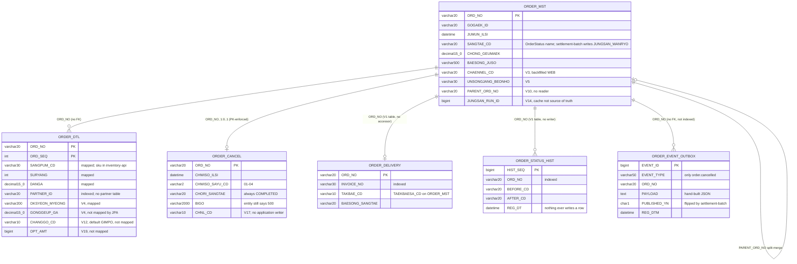

# Order Data Model

## Overview

Six tables in MySQL schema `sellflow_order`, all of them with DDL in this repository. `V1__init.sql` (June 2019) creates five — `ORDER_MST`, `ORDER_DTL`, `ORDER_DELIVERY`, `ORDER_STATUS_HIST` and `ORDER_CANCEL` — and `V8` creates the sixth, `ORDER_EVENT_OUTBOX`; 23 further migrations amend them. Hibernate never touches the DDL (`ddl-auto: none`), so Flyway is the only schema authority, and the migration chain V1 through V24 applies cleanly to an empty database: every column a later migration references is created by an earlier one.

Two decisions shape everything here. First, the 2019 decision to use no foreign keys: "주의: FK 제약 없음. 성능 이슈로 2019년 설계 당시 제외함." ("note: no FK constraints; excluded at design time in 2019 for performance reasons") (`V1__init.sql`). Second, the shared database instance with settlement, which means these tables have writers outside this service — and outside this service's knowledge.

This artifact is the reference for **what the tables are now**: fields, keys, indexes, cardinalities and coded value sets. For **how they got this way** — the rename that was reverted within at most 18 days, the points columns added and dropped two years later, the consolidation baseline that was reserved and never written — see [[SCH-ORDER-MIGRATION-HISTORY]]. The two are deliberately separate, because the history is long enough to bury the reference.

What is worth reading carefully here is no longer the DDL. It is the gap between what the schema provides and what the code uses: two tables nobody touches, a status column five of whose seven values nothing writes, a channel column with no writer, and a search query against a column that exists nowhere.

## Key Facts

- The schema is `sellflow_order` on MySQL, `ENGINE=InnoDB DEFAULT CHARSET=utf8mb4`, with Flyway owning DDL and `spring.jpa.hibernate.ddl-auto: none` → src/main/resources/application.yml, src/main/resources/db/migration/V1__init.sql
- No foreign key constraints exist anywhere, by explicit 2019 design — "FK 제약 없음. 성능 이슈로 2019년 설계 당시 제외함." → src/main/resources/db/migration/V1__init.sql
- Five of the six tables carry `ORD_NO VARCHAR(20)` as their whole or partial key and the sixth (`ORDER_STATUS_HIST`) carries it as an indexed non-key column, so `ORD_NO` is the de facto join key of the entire domain, unenforced by any constraint → src/main/resources/db/migration/V1__init.sql, src/main/resources/db/migration/V8__add_cancel_event_outbox.sql
- The migration chain is self-contained: every column referenced by V13, V18, V20, V21, V22 and V24 is created by an earlier migration — `TEMP_FLAG` by V1, `CHAENNEL_CD` by V3, `JEOKRIPGEUM`/`HALIN_GEUMAEK` by V7, `JUNGSAN_RUN_ID` by V14, `GOGAEK_MEMO` by V2, `CHWISO_ILSI` by V1 — so V1-V24 applies to an empty database without hand-patching → src/main/resources/db/migration/, [[SCH-ORDER-MIGRATION-HISTORY]]
- `ORDER_CANCEL` is keyed on `ORD_NO` alone, so at most one cancellation row can exist per order — partial cancellation is structurally impossible, which matches `PaymentClient`'s standing note "부분취소 미지원. 전액 취소만 호출한다." ("partial cancellation unsupported; only full cancellation is called") → src/main/resources/db/migration/V1__init.sql, src/main/java/kr/co/sellflow/order/payment/PaymentClient.java
- `ORDER_MST.SANGTAE_CD` stores the `OrderStatus` enum **name** (not the Korean label) via `@Enumerated(EnumType.STRING)` in a `VARCHAR(20)` → src/main/java/kr/co/sellflow/order/domain/OrderMst.java
- Only two of the seven `OrderStatus` values have a writer anywhere: `CHWISO`, set by `OrderMst.chwiso()`, and `JUNGSAN_WANRYO`, set by settlement-batch's `MarkSettledTasklet` with a direct `UPDATE ORDER_MST SET SANGTAE_CD='JUNGSAN_WANRYO'`. The other five — `GYEOLJE_WANRYO`, `SANGPUM_JUNBI`, `BAESONG_JUNG`, `BAESONG_WANRYO`, `BANPUM` — are never written by any code in these five repos → src/main/java/kr/co/sellflow/order/domain/OrderMst.java, settlement-batch:src/main/java/kr/co/sellflow/settlement/tasklet/MarkSettledTasklet.java
- The generic status mutator works but is unused: `OrderStatusService.change` loads the order, calls `OrderMst.byeongyeong(OrderStatus)` — a mutator shaped like the existing `chwiso()`, setting `SANGTAE_CD` and `UPD_DTM` — and saves, yet its only caller anywhere is its own unit test → src/main/java/kr/co/sellflow/order/service/OrderStatusService.java, src/main/java/kr/co/sellflow/order/domain/OrderMst.java, src/test/java/kr/co/sellflow/order/service/OrderStatusServiceTest.java
- `ORDER_CANCEL.CHORI_SANGTAE` is written with the hardcoded literal `"COMPLETED"` in the `OrderCancel` constructor and by no other path, so the column is constant in practice — while `V22` indexes it as the leading column of `IDX_ORDER_CANCEL_STATUS` → src/main/java/kr/co/sellflow/order/domain/OrderCancel.java, src/main/resources/db/migration/V22__order_cancel_status_index.sql
- `ORDER_CANCEL.CHNL_CD` has **no application writer at all**: a grep for `CHNL_CD` and `chnlCd` across all five repos matches only V17 and V18, and the `OrderCancel` entity does not map the field — so every row inserted since the 2024-03 backfill carries NULL → src/main/java/kr/co/sellflow/order/domain/OrderCancel.java, src/main/resources/db/migration/V17__add_cancel_channel.sql
- The only definition of the `CHNL_CD` value set anywhere is a MySQL column comment: `COMMENT '취소 접수 채널 (APP/ADMIN/CS)'` ("cancel intake channel") — there is no enum, no lookup table and no constant for it → src/main/resources/db/migration/V17__add_cancel_channel.sql
- `ORDER_EVENT_OUTBOX.EVENT_TYPE` is a `VARCHAR(50)` whose only written value is the constant `OrderEventPublisher.EVT_ORDER_CANCELLED = "order.cancelled"`; the relay in settlement-batch filters on the same string literal, redeclared independently → src/main/java/kr/co/sellflow/order/event/OrderEventPublisher.java, settlement-batch:src/main/java/kr/co/sellflow/settlement/relay/OrderEventRelayJob.java
- `PUBLISHED_YN` is written `'N'` by this service and flipped to `'Y'` only by settlement-batch — order-service never reads the column back, and `OrderEventOutboxRepository` declares no query methods → src/main/java/kr/co/sellflow/order/event/OrderEventOutbox.java, settlement-batch:src/main/java/kr/co/sellflow/settlement/relay/OrderEventRelayJob.java
- `ORDER_DELIVERY` and `ORDER_STATUS_HIST` are created by V1 and their entities match the DDL column for column, but **nothing uses them**: `DeliveryInfoRepository` and `OrderStatusHistoryRepository` are declared and never injected into any class in the repository, and no SQL in any of the five repos names either table → src/main/resources/db/migration/V1__init.sql, src/main/java/kr/co/sellflow/order/repository/DeliveryInfoRepository.java, src/main/java/kr/co/sellflow/order/repository/OrderStatusHistoryRepository.java
- Money columns are not typed consistently: `CHONG_GEUMAEK`, `DANGA` and `GONGGEUP_GA` are `DECIMAL(15,0)` — integer KRW, scale zero — while `OPT_AMT` (V19) is `BIGINT`. The `JEOKRIPGEUM` and `HALIN_GEUMAEK` that V7 added were also `DECIMAL(15,0)`; V20 dropped both in 2024-09 → src/main/resources/db/migration/V1__init.sql, src/main/resources/db/migration/V19__order_dtl_option_price.sql, src/main/resources/db/migration/V20__drop_unused_point_columns.sql
- `CHWISO_SAYU_CD VARCHAR(2)` holds the `CancelReason` codes `01`–`04`, and the enum's javadoc deliberately keeps the consequences out of the schema: "사유별 비용 부담 주체는 코드에 정의하지 않는다. 정산 정책은 재무본부 소관이며 별도 기준표를 따른다." ("the party bearing the cost per reason is not defined in code; settlement policy belongs to the finance division and follows a separate reference table") → src/main/java/kr/co/sellflow/order/domain/CancelReason.java
- The `OrderMst` entity maps only seven columns — `ORD_NO`, `GOGAEK_ID`, `JUMUN_ILSI`, `SANGTAE_CD`, `CHONG_GEUMAEK`, `BAESONG_JUSO`, `UPD_DTM` — so everything added from V2 onward is invisible to JPA and reachable only by raw SQL → src/main/java/kr/co/sellflow/order/domain/OrderMst.java
- The `OrderItem` entity maps `ORDER_DTL`'s real columns — `ORD_NO`, `ORD_SEQ`, `SANGPUM_CD`, `OKSYEON_MYEONG`, `SURYANG`, `DANGA`, `PARTNER_ID` — under an `@IdClass(OrderItem.Pk)` composite key matching V1's `PRIMARY KEY (ORD_NO, ORD_SEQ)`; `OrderItemRepository` is keyed on `OrderItem.Pk`. Three columns added later (`GONGGEUP_GA`, `CHANGGO_CD`, `OPT_AMT`) are still unmapped → src/main/java/kr/co/sellflow/order/domain/OrderItem.java, src/main/java/kr/co/sellflow/order/repository/OrderItemRepository.java, src/main/resources/db/migration/V1__init.sql
- Three of the six tables have readers or writers outside this service — `ORDER_MST` (settlement-batch reads and writes it; settlement-anomaly reads it), `ORDER_DTL` (settlement-batch and inventory-api read it) and `ORDER_EVENT_OUTBOX` (settlement-batch's relay reads and updates it). `ORDER_CANCEL`, `ORDER_DELIVERY` and `ORDER_STATUS_HIST` have no external accessor in any of the five repos. That is the practical reason a rename here is never local — and the reason V15's rename caused a production incident → [[SCH-ORDER-MIGRATION-HISTORY]]
- `ORDER_MST.TEMP_FLAG CHAR(1) DEFAULT 'N'` existed from V1 until V13 dropped it in 2025-03; no entity ever mapped it and no query names it, so its six-year life left no trace in the code → src/main/resources/db/migration/V1__init.sql, src/main/resources/db/migration/V13__cleanup_unused.sql

## Entities

### ORDER_MST — order master

The order itself: one row per order number, carrying the customer, the timestamp, the status and the total. Everything else in the schema hangs off it, and it is the only table in the domain that another service writes.

| Field | Type | Nullable | PK/FK | Index | Notes |
|---|---|---|---|---|---|
| ORD_NO | VARCHAR(20) | NOT NULL | **PK** | (PK) | Order number. Format seen in code and tests: `ORD` + `yyyyMMdd` + 3-digit sequence, e.g. `ORD20230411002`. |
| GOGAEK_ID | VARCHAR(20) | NOT NULL | no FK | IX_ORDER_MST_01 (1st) | Customer id (고객). No customer table exists in this schema. |
| JUMUN_ILSI | DATETIME | NOT NULL | — | IX_ORDER_MST_01 (2nd), IX_ORDER_MST_02 (2nd) | Order placed timestamp (주문일시). |
| SANGTAE_CD | VARCHAR(20) | NOT NULL | — | IX_ORDER_MST_02 (1st) | Order status (상태). Holds an `OrderStatus` **name**. Also written by settlement-batch. |
| CHONG_GEUMAEK | DECIMAL(15,0) | NOT NULL | — | — | Total amount (총금액), integer KRW. Mapped as `BigDecimal`. |
| BAESONG_JUSO | VARCHAR(500) | NULL | — | — | Delivery address (배송주소). |
| REG_DTM | DATETIME | NULL, default CURRENT_TIMESTAMP | — | — | Row created. Not mapped in the JPA entity. |
| TEMP_FLAG | CHAR(1) | NULL, default 'N' | — | — | Present from V1; **dropped by V13** (2025-03). No code ever referenced it. |
| UPD_DTM | DATETIME | NULL | — | — | Set by `OrderMst.chwiso()` and by `MarkSettledTasklet`. |
| GOGAEK_MEMO | VARCHAR(500) | NULL | — | — | Customer memo (V2). Not mapped in the entity. Indexed on its first 64 bytes by V24. |
| CHAENNEL_CD | VARCHAR(20) | NULL | — | — | Inflow channel (V3); backfilled to `'WEB'`. The column V18's cancel-channel backfill joins on. |
| UNSONGJANG_BEONHO | VARCHAR(30) | NULL | — | IX_ORDER_MST_03 | Waybill number (운송장번호) (V5), duplicating `ORDER_DELIVERY.INVOICE_NO`. |
| TAEKBAESA_CD | VARCHAR(10) | NULL | — | — | Carrier code (택배사) (V5). Spelled `TAKBAE_CD` on `ORDER_DELIVERY`. |
| JEOKRIPGEUM | DECIMAL(15,0) | NULL, default 0 | — | — | Points used (적립금), added V7 (2022-08) and **dropped by V20** (2024-09) — "적립금은 별도 시스템으로 이관됨" ("points were migrated to a separate system"). |
| HALIN_GEUMAEK | DECIMAL(15,0) | NULL, default 0 | — | — | Discount amount (할인금액), added V7 and **dropped by V20** alongside it. |
| PARENT_ORD_NO | VARCHAR(20) | NULL | self-reference, no FK | IX_ORDER_MST_04 | Split/merge parent (V10). The columns exist; no code reads or writes them. |
| JUNGSAN_RUN_ID | BIGINT | NULL | soft ref to `SETTLEMENT_RUN` | IDX_ORDER_MST_SETTLE_REF | Settlement run reference (V14), indexed by V21. The migration calls it a cache: "실제 정산 여부는 SETTLEMENT_DTL 이 정본이다. 본 컬럼은 캐시 성격." ("SETTLEMENT_DTL is the source of truth for whether settlement happened; this column is cache-like"). |

Indexes: `IX_ORDER_MST_01 (GOGAEK_ID, JUMUN_ILSI)` · `IX_ORDER_MST_02 (SANGTAE_CD, JUMUN_ILSI)` — V1 created it on `SANGTAE_CD` alone, V6 replaced it because of low cardinality · `IX_ORDER_MST_03 (UNSONGJANG_BEONHO)` · `IX_ORDER_MST_04 (PARENT_ORD_NO)` · `IDX_ORDER_MST_SETTLE_REF (JUNGSAN_RUN_ID)` (V21) · `IDX_ORDER_MST_MEMO (GOGAEK_MEMO(64))` (V24, a 64-byte prefix index).

Two names are still referenced from outside the migrations and created by none of them: `ORD_DT`, which `OrderSearchService` selects on, and `BAESONG_MSG`, named only in V13's deferral TODO — "배치에서 참조 가능성 있어 보류" ("held back because a batch might reference it"). Both are recorded in `known_unknowns`; neither is touched by any migration, so neither blocks the chain. See [[SCH-ORDER-MIGRATION-HISTORY]].

### ORDER_DTL — order line items (JPA: `OrderItem`)

One row per product line on an order: what was bought, how many, at what unit price, and from which partner. It is the only table that names a partner, and therefore the table settlement joins to work out who gets paid.

The JPA entity and the DDL now agree. `OrderItem` declares `@IdClass(OrderItem.Pk)` with `ordNo` and `ordSeq` as its two `@Id` fields, matching V1's `PRIMARY KEY (ORD_NO, ORD_SEQ)`, and maps the romanised column names directly.

| Field | Type | Nullable | PK/FK | Index | Notes |
|---|---|---|---|---|---|
| ORD_NO | VARCHAR(20) | NOT NULL | **PK (1st)**, soft FK → `ORDER_MST` | (PK) | Mapped by the entity as an `@Id` field. |
| ORD_SEQ | INT | NOT NULL | **PK (2nd)** | (PK) | Line sequence. Mapped by the entity as the second `@Id` field. |
| SANGPUM_CD | VARCHAR(30) | NOT NULL | — | — | Product code (상품). inventory-api states the equivalence: "주문 도메인의 SANGPUM_CD 는 여기서 sku 다." ("the order domain's SANGPUM_CD is sku here"). |
| SURYANG | INT | NOT NULL | — | — | Quantity (수량). Mapped as a Java `int`. |
| DANGA | DECIMAL(15,0) | NOT NULL | — | — | Unit price (단가), integer KRW. Mapped as `BigDecimal`. |
| PARTNER_ID | VARCHAR(20) | NOT NULL | soft ref; no partner table in this schema | IX_ORDER_DTL_01 | Seller. The 2022 spec documents seven `/partners/*` endpoints with no table behind them. |
| OKSYEON_MYEONG | VARCHAR(200) | NULL | — | — | Option name (옵션명) (V4). Mapped by the entity. |
| GONGGEUP_GA | DECIMAL(15,0) | NULL | — | — | Supply price (공급가) (V4) — the partner-side cost, distinct from `DANGA`. **Not mapped** by the entity. |
| CHANGGO_CD | VARCHAR(10) | NULL, default 'GIMPO' | — | — | Warehouse (창고) (V12), added for the 용인 (Yongin) centre opening. **Not mapped** by the entity. |
| OPT_AMT | BIGINT | NOT NULL, default 0 | — | — | Option surcharge (V19). The only BIGINT money column in the schema. **Not mapped** by the entity. |

What the entity omits is now the only gap: `GONGGEUP_GA`, `CHANGGO_CD` and `OPT_AMT` — the three columns added after 2020 — have no field on `OrderItem`, so JPA readers see a line item without its supply price, warehouse or option surcharge. Anything that needs those goes through raw SQL, which is what both out-of-service readers already do: settlement-batch's `settlementTargetReader` selects `d.PARTNER_ID, d.SANGPUM_CD, d.SURYANG, d.DANGA` from `ORDER_DTL d`, and inventory-api runs `SELECT SANGPUM_CD, SURYANG FROM ORDER_DTL WHERE ORD_NO = %(o)s` → settlement-batch:src/main/java/kr/co/sellflow/settlement/config/DailySettlementJobConfig.java, inventory-api:app/main.py. `OrderQueryService.items` is the only in-service caller of `OrderItemRepository.findByOrdNo`, and it has no caller outside its own test. See [[RISK-ORDER]].

### ORDER_CANCEL — cancellation record

The fact that an order was cancelled, why, and with what note. One row per order, ever. It is the row the settlement correction process is ultimately arguing about, and the only place the reason code is stored.

| Field | Type | Nullable | PK/FK | Index | Notes |
|---|---|---|---|---|---|
| ORD_NO | VARCHAR(20) | NOT NULL | **PK**, soft FK → `ORDER_MST` | (PK) | One cancellation per order, maximum. A re-cancel is a PK violation, not a second row. |
| CHWISO_ILSI | DATETIME | NOT NULL | — | — | Cancelled at (취소일시); set to `LocalDateTime.now()` in the entity constructor, i.e. application time, not DB time. |
| CHWISO_SAYU_CD | VARCHAR(2) | NOT NULL | — | — | Cancel reason code (취소사유), `01`–`04`. See the enum table below. |
| CHORI_SANGTAE | VARCHAR(20) | NOT NULL | — | IDX_ORDER_CANCEL_STATUS (1st) | Processing state (처리상태); the literal `"COMPLETED"` is the only value ever written. |
| BIGO | VARCHAR(2000) | NULL | — | — | Free-text note (비고). V1 created it at 500, V9 widened it to 2000; the entity still declares `length = 500`. Renamed and un-renamed in V15/V16 — see [[SCH-ORDER-MIGRATION-HISTORY]]. |
| CHNL_CD | VARCHAR(10) | NULL | — | — | Cancel intake channel (V17). **No application writer exists** — only the V17 default and the V18 backfill ever set it. |

Index: `IDX_ORDER_CANCEL_STATUS (CHORI_SANGTAE, CHWISO_ILSI)` (V22) — a usable index whose leading column has exactly one distinct value in practice, so it behaves as an index on `CHWISO_ILSI` alone.

The V18 backfill narrowed its reclassification to `c.CHWISO_ILSI >= '2023-01-01'` and joined `m.CHAENNEL_CD = 'APP'`, so every `CHNL_CD` value on a pre-2023 row is the V17 default rather than an observed channel, and the values that were reclassified are derived from the *order's* inflow channel rather than captured at cancellation time. Combined with the absence of a writer since, `CHNL_CD` is best read as a one-off 2024 estimate, not as data.

### ORDER_EVENT_OUTBOX — cancel event outbox

The service's only outbound signal. `OrderCancelService` inserts one row per cancellation inside the same transaction as the cancellation itself; a job in another service polls the table. There is no message broker — V8 says so: "정산 배치의 릴레이 잡이 주기적으로 폴링한다. (별도 브로커 없음)" ("the settlement batch's relay job polls periodically; no separate broker"). See [[DEC-ORDER-OUTBOX-RELAY]].

| Field | Type | Nullable | PK/FK | Index | Notes |
|---|---|---|---|---|---|
| EVENT_ID | BIGINT AUTO_INCREMENT | NOT NULL | **PK** | (PK) | Surrogate key. Never returned to any API caller. |
| EVENT_TYPE | VARCHAR(50) | NOT NULL | — | IX_ORDER_EVENT_OUTBOX_02 (1st) | Only `order.cancelled` is ever written. |
| ORD_NO | VARCHAR(20) | NOT NULL | soft FK → `ORDER_MST` | — | Not indexed — there is no index by order on this table. |
| PAYLOAD | TEXT | NOT NULL | — | — | Hand-formatted JSON built with `String.format`: `{"ordNo":"...","sayuCd":"..."}`. No serializer, no schema. |
| PUBLISHED_YN | CHAR(1) | NULL, default 'N' | — | IX_ORDER_EVENT_OUTBOX_01 (1st), IX_ORDER_EVENT_OUTBOX_02 (2nd) | Flipped to `'Y'` by settlement-batch's relay, never by this service. |
| REG_DTM | DATETIME | NULL, default CURRENT_TIMESTAMP | — | IX_ORDER_EVENT_OUTBOX_01 (2nd) | Also defaulted in the entity field initialiser, so application time and DB default compete. The relay's `ORDER BY REG_DTM` depends on it. |

Indexes: `IX_ORDER_EVENT_OUTBOX_01 (PUBLISHED_YN, REG_DTM)` (V8, for the relay's poll) · `IX_ORDER_EVENT_OUTBOX_02 (EVENT_TYPE, PUBLISHED_YN)` (V11, added at the settlement team's request after the relay slowed down).

### ORDER_DELIVERY — delivery information (JPA: `DeliveryInfo`)

One delivery record per order: waybill, carrier, delivery status. Created by V1, and the `DeliveryInfo` entity maps all four of its columns. No code reads or writes it — `DeliveryInfoRepository` is declared and never injected anywhere, and no SQL in any of the five repos names the table.

| Field | Type | Nullable | PK/FK | Index | Notes |
|---|---|---|---|---|---|
| ORD_NO | VARCHAR(20) | NOT NULL | **PK**, soft FK → `ORDER_MST` | (PK) | One delivery row per order. |
| INVOICE_NO | VARCHAR(30) | NULL | — | IX_ORDER_DELIVERY_01 | Waybill number. Duplicates `ORDER_MST.UNSONGJANG_BEONHO` conceptually. |
| TAKBAE_CD | VARCHAR(10) | NULL | — | — | Carrier code. Spelled `TAEKBAESA_CD` on `ORDER_MST` — the same concept under two romanisations, both created by migrations. |
| BAESONG_SANGTAE | VARCHAR(20) | NULL | — | — | Delivery status. No enum or lookup defines its values in this repo. |

The entity javadoc states the cardinality and a limitation: "배송 정보. 주문당 1건. 분할배송은 지원하지 않는다 (V10 에서 컬럼만 추가됨)." ("delivery info, one per order; split delivery is not supported — V10 only added the column"). The table is structurally sound and entirely unused, which is the more interesting fact about it → [[PAT-SELLFLOW-ORPHANED-COMPONENTS]].

### ORDER_STATUS_HIST — status transition history

An append-only log of status changes. Created by V1, and the `OrderStatusHistory` entity maps all five columns. `OrderStatusHistoryRepository` is declared and never injected, so nothing in this service writes a history row even when it changes a status.

| Field | Type | Nullable | PK/FK | Index | Notes |
|---|---|---|---|---|---|
| HIST_SEQ | BIGINT AUTO_INCREMENT | NOT NULL | **PK**, entity `GenerationType.IDENTITY` | (PK) | Surrogate key. |
| ORD_NO | VARCHAR(20) | NOT NULL | soft FK → `ORDER_MST` | IX_ORDER_STATUS_HIST_01 | Order number. |
| BEFORE_CD | VARCHAR(20) | NULL | — | — | Previous status code. Nullable, for the first transition. |
| AFTER_CD | VARCHAR(20) | NOT NULL | — | — | New status code. |
| REG_DT | DATETIME | NULL, default CURRENT_TIMESTAMP | — | — | Recorded at. This is the one `REG_DT` in the order schema that genuinely exists. `findByOrdNoOrderByRegDtAsc` exists on the repository and has no caller. |

Its javadoc carries the caveat that matters most: "TODO(성민) 2022-11-08: 정산완료 전이는 여기 안 쌓인다. 배치에서 직접 UPDATE 하기 때문." ("settlement-completed transitions do not accumulate here, because the batch UPDATEs directly"). The stronger finding is that *no* transition accumulates here, because no writer exists at all — the table is ready and nothing fills it. See [[PROC-ORDER-CANCEL]].

### Who else touches these tables

| Reader or writer | Table | Access |
|---|---|---|
| settlement-batch `settlementTargetReader` | ORDER_MST, ORDER_DTL | SELECT, joined on `ORD_NO` → settlement-batch:src/main/java/kr/co/sellflow/settlement/config/DailySettlementJobConfig.java |
| settlement-batch `MarkSettledTasklet` | ORDER_MST | UPDATE `SANGTAE_CD` to `JUNGSAN_WANRYO` and `UPD_DTM` → settlement-batch:src/main/java/kr/co/sellflow/settlement/tasklet/MarkSettledTasklet.java |
| settlement-batch `OrderEventRelayJob` | ORDER_EVENT_OUTBOX | SELECT unpublished, then UPDATE `PUBLISHED_YN` → settlement-batch:src/main/java/kr/co/sellflow/settlement/relay/OrderEventRelayJob.java |
| settlement-anomaly `/detect` | ORDER_MST | SELECT `SANGTAE_CD`, joined to `SETTLEMENT_DTL` → settlement-anomaly:app/main.py |
| inventory-api `/stock/restock` | ORDER_DTL | SELECT `SANGPUM_CD`, `SURYANG` → inventory-api:app/main.py |
| order-service `OrderCancelServiceV1` (deprecated) | SETTLEMENT_DTL | SELECT COUNT, in the other direction → src/main/java/kr/co/sellflow/order/legacy/OrderCancelServiceV1.java |

## Relationships

All cardinalities are conventions, not constraints — there is not one foreign key in the schema.

| From | To | Cardinality | Joined on | Enforced by |
|---|---|---|---|---|
| ORDER_MST | ORDER_DTL | 1 : 0..N | `ORD_NO` | nothing; composite PK `(ORD_NO, ORD_SEQ)` makes lines unique per order |
| ORDER_MST | ORDER_CANCEL | 1 : 0..1 | `ORD_NO` | `ORDER_CANCEL`'s PK on `ORD_NO` — the one cardinality the schema does guarantee |
| ORDER_MST | ORDER_EVENT_OUTBOX | 1 : 0..N | `ORD_NO` | nothing; one row per cancellation today, but nothing prevents more |
| ORDER_MST | ORDER_DELIVERY | 1 : 0..1 | `ORD_NO` | `ORDER_DELIVERY`'s PK on `ORD_NO`; table exists and is unwritten |
| ORDER_MST | ORDER_STATUS_HIST | 1 : 0..N | `ORD_NO` | nothing; table exists and is unwritten |
| ORDER_MST | ORDER_MST | 0..1 : 0..N | `PARENT_ORD_NO` → `ORD_NO` | nothing; no code reads or writes the column |
| ORDER_DTL | (partner) | N : 1 | `PARTNER_ID` | nothing — there is no partner table in this schema |
| ORDER_MST | SETTLEMENT_RUN (other schema) | N : 0..1 | `JUNGSAN_RUN_ID` → `RUN_ID` | nothing; V14 explicitly calls it a cache |



## Worked Examples

### Enum tables

Every coded column in the schema, with where its values are defined and who writes them. Values are quoted exactly as they appear in code or SQL.

**`ORDER_MST.SANGTAE_CD`** — defined by the `OrderStatus` enum; stored as the enum **name**, while error messages render the Korean label → src/main/java/kr/co/sellflow/order/domain/OrderStatus.java

| Stored value | Korean label | Meaning | Written by |
|---|---|---|---|
| `GYEOLJE_WANRYO` | 결제완료 | payment complete | no writer in these five repos |
| `SANGPUM_JUNBI` | 상품준비중 | preparing goods | no writer in these five repos |
| `BAESONG_JUNG` | 배송중 | in delivery | no writer in these five repos |
| `BAESONG_WANRYO` | 배송완료 | delivery complete | no writer in these five repos |
| `JUNGSAN_WANRYO` | 정산완료 | settlement complete | **settlement-batch** `MarkSettledTasklet`, by direct UPDATE |
| `CHWISO` | 취소 | cancelled | `OrderMst.chwiso()`, from `OrderCancelService` |
| `BANPUM` | 반품 | returned | no writer in these five repos |

The enum's own javadoc marks the ownership split: "주의: 이 상태는 정산팀 배치가 설정하며 주문팀에서 직접 변경하지 않는다." ("note: this status is set by the settlement team's batch and is not changed directly by the order team"). `CHWISO` and `BANPUM` are also the two values that block a cancellation — `EnumSet.of(OrderStatus.CHWISO, OrderStatus.BANPUM)` → src/main/java/kr/co/sellflow/order/service/OrderCancelService.java.

**`ORDER_CANCEL.CHWISO_SAYU_CD`** (the `sayuCd` of the cancel API and of the outbox payload) — defined by the `CancelReason` enum → src/main/java/kr/co/sellflow/order/domain/CancelReason.java

| Code | Enum constant | Korean label | Meaning | Documented consequence |
|---|---|---|---|---|
| `01` | `PARTNER_GWICHAEK` | 파트너 귀책 | partner at fault (stock shortage, late dispatch) | cost borne by the partner; restock O; settlement deduction O |
| `02` | `SYSTEM_ORYU` | 시스템 오류 | system error | cost borne by Sellflow; restock O; settlement deduction O |
| `03` | `GOGAEK_BYEONSIM` | 고객 변심 | customer changed their mind | cost borne by Sellflow; restock **X**; settlement deduction O |
| `04` | `BAESONG_SILPAE` | 배송 실패 | delivery failed (bad address, refused) | cost borne by the partner; restock O; settlement deduction O — "물류팀 확인 후 처리" ("handled after logistics team confirmation") |

Consequences are from `sellflow-docs:context/business-rules.md` sheet 취소정책, not from the schema; the enum javadoc explicitly refuses to encode them. Note that inventory-api restocks only `{"01", "02"}` in code, so `04`'s documented restock does not happen → inventory-api:app/main.py. Any other value reaching `CancelReason.of` throws `IllegalArgumentException("알 수 없는 취소 사유 코드: ...")` ("unknown cancel reason code"). Downstream, settlement-batch's relay parses the code out of the payload string and substitutes `"00"` when it cannot find one, so a value outside `01`–`04` can exist in `CANCEL_RECON_QUEUE.SAYU_CD` even though it can never exist here → settlement-batch:src/main/java/kr/co/sellflow/settlement/relay/OrderEventRelayJob.java.

**`ORDER_CANCEL.CHORI_SANGTAE`** — no enum, no lookup table, no constant → src/main/java/kr/co/sellflow/order/domain/OrderCancel.java

| Stored value | Where it comes from | Notes |
|---|---|---|
| `COMPLETED` | hardcoded string literal in the `OrderCancel` constructor, and in the legacy `OrderCancelServiceV1` INSERT | The only value any code writes. |
| *(anything else)* | unknown | The column is `VARCHAR(20)` and V22 indexes it as if it varied. No other value is defined anywhere; recorded in `known_unknowns`. |

**`ORDER_CANCEL.CHNL_CD`** — defined only by a MySQL column comment → src/main/resources/db/migration/V17__add_cancel_channel.sql

| Stored value | Where it comes from | Notes |
|---|---|---|
| `ADMIN` | V17 `UPDATE ... SET CHNL_CD = 'ADMIN' WHERE CHNL_CD IS NULL` | The blanket default applied to every pre-2024 row. |
| `APP` | V18 backfill, for rows with `CHWISO_ILSI >= '2023-01-01'` whose order had `CHAENNEL_CD = 'APP'` | Derived from the order's inflow channel, not observed at cancellation. |
| `CS` | named in the column comment `'취소 접수 채널 (APP/ADMIN/CS)'` only | No migration and no code ever writes it. |
| `NULL` | the absence of any application writer | The expected state of every row inserted after the backfill. |

**`ORDER_EVENT_OUTBOX.EVENT_TYPE`** → src/main/java/kr/co/sellflow/order/event/OrderEventPublisher.java

| Stored value | Where it comes from | Notes |
|---|---|---|
| `order.cancelled` | `OrderEventPublisher.EVT_ORDER_CANCELLED`, the only publish method on the only publisher | settlement-batch's relay declares the same literal independently in its own class; the two constants are not shared. |

**`ORDER_EVENT_OUTBOX.PUBLISHED_YN`** → src/main/java/kr/co/sellflow/order/event/OrderEventOutbox.java, settlement-batch:src/main/java/kr/co/sellflow/settlement/relay/OrderEventRelayJob.java

| Stored value | Written by | Meaning |
|---|---|---|
| `N` | order-service, as both the column default and the entity field initialiser | not yet relayed |
| `Y` | settlement-batch's relay, after it has processed the row | relayed — which means the relay ran, not that anything downstream succeeded |

**`ORDER_MST.CHAENNEL_CD` and `TAEKBAESA_CD`** — no enum exists in code. The only written-down value sets are in the frozen 2022 spec, which lists `WEB`, `APP_IOS`, `APP_AND`, `OPEN_MARKET`, `API` for the inflow channel and `CJ`, `HANJIN`, `LOTTE`, `POST`, `LOGEN` for the carrier, and also declares a payment-method field (`gyeolJeCd`: `CARD`, `BANK`, `VBANK`, `POINT`, `MIXED`) for a column no migration creates → sellflow-docs:raw/specs/order-service-openapi.json. V3 backfilled `CHAENNEL_CD` to `'WEB'`. Whether any of these sets was ever enforced is in `known_unknowns`; they are recorded here because they are the only evidence that exists, not because they are current.

### A cancellation, as it lands in the tables

`OrderCancelService.cancel("ORD20230411002", "03", "고객 요청")` writes, in one transaction → src/main/java/kr/co/sellflow/order/service/OrderCancelService.java:

```sql
-- 1. ORDER_CANCEL: one row, PK = ORD_NO, so a second cancel can never be recorded.
--    CHNL_CD is omitted — the entity does not map it — so it lands NULL.
INSERT INTO ORDER_CANCEL (ORD_NO, CHWISO_ILSI, CHWISO_SAYU_CD, CHORI_SANGTAE, BIGO)
VALUES ('ORD20230411002', NOW(), '03', 'COMPLETED', '고객 요청');

-- 2. ORDER_MST: status flipped, whatever it was (except CHWISO / BANPUM, refused earlier)
UPDATE ORDER_MST SET SANGTAE_CD = 'CHWISO', UPD_DTM = NOW() WHERE ORD_NO = 'ORD20230411002';

-- 3. ORDER_EVENT_OUTBOX: the only signal to settlement
INSERT INTO ORDER_EVENT_OUTBOX (EVENT_TYPE, ORD_NO, PAYLOAD, PUBLISHED_YN)
VALUES ('order.cancelled', 'ORD20230411002', '{"ordNo":"ORD20230411002","sayuCd":"03"}', 'N');
```

Note what is absent: no `ORDER_STATUS_HIST` row, even though the status just changed, and no `CHNL_CD` value, even though the cancellation plainly arrived through some channel.

### Join: cancelled orders that were already settled

The query at the centre of the domain — which cancellations happened after the money had gone out. It uses the real romanised names on both sides of the shared instance, and mirrors how settlement-batch's relay decides whether to enqueue a correction → settlement-batch:src/main/java/kr/co/sellflow/settlement/relay/OrderEventRelayJob.java:

```sql
SELECT  m.ORD_NO,
        m.GOGAEK_ID,
        m.JUMUN_ILSI,
        m.SANGTAE_CD,
        m.CHONG_GEUMAEK,
        c.CHWISO_ILSI,
        c.CHWISO_SAYU_CD,
        c.CHORI_SANGTAE,
        c.CHNL_CD,
        o.PUBLISHED_YN
  FROM  ORDER_MST          m
  JOIN  ORDER_CANCEL       c ON c.ORD_NO = m.ORD_NO
  LEFT JOIN ORDER_EVENT_OUTBOX o
                             ON o.ORD_NO = m.ORD_NO
                            AND o.EVENT_TYPE = 'order.cancelled'
 WHERE  m.SANGTAE_CD = 'CHWISO'
   AND  c.CHWISO_ILSI >= '2026-01-01'
   AND  EXISTS (SELECT 1 FROM SETTLEMENT_DTL s WHERE s.ORD_NO = m.ORD_NO)
 ORDER BY c.CHWISO_ILSI DESC;
```

Four things to know before trusting its output:

1. `SETTLEMENT_DTL` lives in the settlement schema on the **same MySQL instance**, which is the only reason this join is writable as one statement. See [[DEC-SELLFLOW-SHARED-DB]].
2. The `ORDER_EVENT_OUTBOX` join has no index to help it — the outbox is indexed on `(PUBLISHED_YN, REG_DTM)` and `(EVENT_TYPE, PUBLISHED_YN)`, never on `ORD_NO`.
3. `c.CHNL_CD` will be NULL for anything cancelled after the 2024 backfill, so it cannot be used to segment by channel.
4. `m.SANGTAE_CD = 'CHWISO'` and the `SETTLEMENT_DTL` existence check can both be true at once. Before SF-2287 they could not, and that is precisely the change this schema now records.

### Line items and partner exposure for one order

The shape settlement uses to decide who is owed what, using only columns the migrations create:

```sql
SELECT  d.ORD_NO, d.ORD_SEQ, d.PARTNER_ID,
        d.SANGPUM_CD, d.SURYANG, d.DANGA, d.GONGGEUP_GA, d.OPT_AMT,
        (d.SURYANG * d.DANGA) + d.OPT_AMT AS LINE_AMT
  FROM  ORDER_DTL d
 WHERE  d.ORD_NO = 'ORD20230411002'
 ORDER BY d.ORD_SEQ;
```

`LINE_AMT` mixes a `DECIMAL(15,0)` product with a `BIGINT` — the money-typing inconsistency noted above — and there is no guarantee its sum equals `ORDER_MST.CHONG_GEUMAEK`, because `HALIN_GEUMAEK` and `JEOKRIPGEUM` sit on the master row and no constraint ties the two together. See [[DEC-SELLFLOW-MONEY-ROUNDING]].

## Related

- [[SYS-ORDER]] — the service that owns this schema
- [[GLOSSARY-ORDER]] — what the romanised column names mean
- [[SCH-ORDER-MIGRATION-HISTORY]] — how the schema got here: all 24 Flyway migrations in order, the V15/V16 rename-and-revert, and the reserved-but-empty V23 baseline
