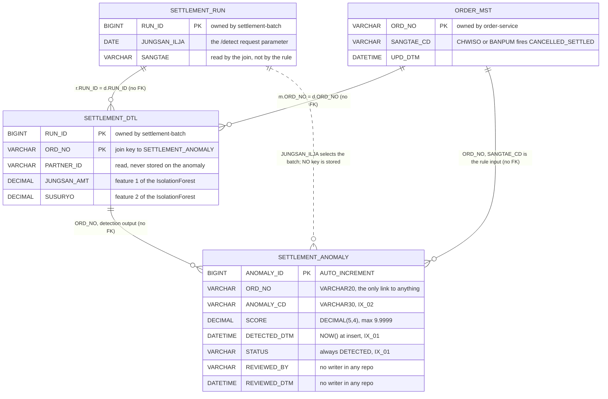

# Settlement Anomaly Data Model

## Overview

One table, `SETTLEMENT_ANOMALY`, holds every detection this service makes. It lives in the same `sellflow_order` database as the settlement tables, which is how the service can join `SETTLEMENT_DTL`, `SETTLEMENT_RUN` and `ORDER_MST` in a single query without an API call.

The data model is small enough that its three internal disagreements are all visible at once: a Pydantic model that describes a different shape from the table, an INSERT that uses the table's real column names while the Pydantic model does not, and a detector that reads its input rows under keys the database driver does not produce.

A fourth disagreement is between the schema and the organisation. Two of the eight columns — `REVIEWED_BY` and `REVIEWED_DTM` — plus one of the two indexes exist to support a review workflow that no code performs and no team owns.

## Key Facts

- `SETTLEMENT_ANOMALY` is defined in a single SQL file with columns `ANOMALY_ID`, `ORD_NO`, `ANOMALY_CD`, `SCORE`, `DETECTED_DTM`, `STATUS`, `REVIEWED_BY`, `REVIEWED_DTM` → sql/V1__anomaly_schema.sql
- That file is the repo's only DDL and is wired to no migration runner: there is no Flyway configuration, no Alembic directory, and `flyway`/`alembic` appear nowhere in `requirements.txt`, so the `V1__` prefix is a naming convention borrowed from settlement-batch rather than an executed migration → sql/V1__anomaly_schema.sql, requirements.txt
- The table carries two indexes: `IX_SETTLEMENT_ANOMALY_01 (STATUS, DETECTED_DTM)` and `IX_SETTLEMENT_ANOMALY_02 (ANOMALY_CD)`. The first is a triage index — status plus recency is the access pattern of a review queue — and no code issues a query that would use it → sql/V1__anomaly_schema.sql, app/main.py
- `SCORE` is `DECIMAL(5,4)`, so a score above 9.9999 would not fit; `CANCELLED_SETTLED` always writes exactly 1.0 → sql/V1__anomaly_schema.sql, model/detector.py
- `AMT_OUTLIER` writes `float(-self.model.score_samples(feat)[0])` from an IsolationForest, which carries no bound that keeps it inside `DECIMAL(5,4)`; silent truncation is possible and is flagged rather than verified → model/detector.py, sql/V1__anomaly_schema.sql
- The `AMT_OUTLIER` threshold is a bare literal in the detector — `if score > 0.85` — with no configuration, no environment variable and no column recording which threshold produced a stored row → model/detector.py
- The README documents four anomaly codes, `AMT_OUTLIER`, `DUP_SETTLE` (중복 정산 / duplicate settlement), `CANCELLED_SETTLED` and `FEE_MISMATCH` (수수료 불일치 / commission mismatch), while `model/detector.py` produces only the first and the third → README.md, model/detector.py
- `ANOMALY_CD` is `VARCHAR(30)`, which accommodates all four documented codes and constrains none of them — there is no `ENUM`, no `CHECK` and no lookup table → sql/V1__anomaly_schema.sql
- Nobody owns what happens after a detection, on either side of the boundary. The README says "후속 조치 프로세스는 본 서비스 범위 밖이다." ("the follow-up action process is outside this service's scope") and the service registry says "이상 탐지만 수행. 조치 주체는 정의되어 있지 않음. TODO" ("detection only; the party responsible for acting is not defined — TODO") → README.md, sources/context/registry/services.yaml
- The registry also records this service's database as `db: MySQL (settlement)`, which matches `.env.template` and contradicts the hardcoded `sellflow_order` in `app/db.py` → sources/context/registry/services.yaml, .env.template, app/db.py
- The INSERT writes five columns and hardcodes `STATUS='DETECTED'` and `DETECTED_DTM=NOW()` → app/main.py
- No code in any of the five repos writes `REVIEWED_BY` or `REVIEWED_DTM` — verified 2026-09-19 by grepping all five repos for `REVIEWED_`, which returns exactly two hits, the two column declarations in the DDL itself → sql/V1__anomaly_schema.sql
- Nothing in any of the five repos *reads* `SETTLEMENT_ANOMALY` either. A grep for the table name across all five repos returns three hits, all inside settlement-anomaly: its README, its DDL and its INSERT. The table has one writer and no reader → app/main.py, sql/V1__anomaly_schema.sql, README.md
- `app/schemas.py` defines `AnomalyRow(run_id, ord_no, anomaly_type, score, status)`, which matches neither the table nor the INSERT: the table has `ANOMALY_CD` rather than `anomaly_type` and has no `RUN_ID` column at all → app/schemas.py, sql/V1__anomaly_schema.sql
- `AnomalyRow` is imported nowhere; `app/main.py` imports only `fetch_all`, `execute` and `AnomalyDetector`, and declares its own inline `DetectRequest` → app/main.py, app/schemas.py
- `app/db.py` sets `cursorclass=pymysql.cursors.DictCursor`, so rows come back keyed by the SQL column names — `RUN_ID`, `ORD_NO`, `PARTNER_ID`, `JUNGSAN_AMT`, `SUSURYO`, `SANGTAE_CD`, all uppercase in the SELECT → app/db.py, app/main.py
- `detector.detect()` reads those rows under lowercase keys: `r["sangtae_cd"]`, `r["ord_no"]`, and `_amount_score` reads `row["jungsan_amt"]` and `row["susuryo"]` → model/detector.py
- The database name is hardcoded to `sellflow_order` in `app/db.py`, ignoring `DB_URL` in `.env.template` which names a `settlement` database → app/db.py, .env.template
- Every INSERT is its own connection, transaction and commit: `app/db.py`'s `execute` opens `pymysql.connect`, executes, commits and closes per call, and `/detect` calls it once per anomaly — so a detection run is not atomic and a partial set cannot be identified after the fact, because no column records which run produced it → app/db.py, app/main.py
- The anomaly service depends on settlement tables it does not own: `SETTLEMENT_DTL`, `SETTLEMENT_RUN` and `ORDER_MST` are all read in the `/detect` query, with no foreign key, no view and no API between them → app/main.py, see [[SCH-SETTLEMENT-BATCH]]

## Entities



The join keys, stated once so they are not re-derived: `SETTLEMENT_RUN.RUN_ID = SETTLEMENT_DTL.RUN_ID`, `ORDER_MST.ORD_NO = SETTLEMENT_DTL.ORD_NO`, and `SETTLEMENT_ANOMALY.ORD_NO` back to either of the latter two. None is a declared foreign key; all three are maintained by the SQL literal in `app/main.py` alone → app/main.py, sql/V1__anomaly_schema.sql

The dotted `SETTLEMENT_RUN ..o{ SETTLEMENT_ANOMALY` edge is the important one. `JUNGSAN_ILJA` chooses which settlement run's rows get examined, so every anomaly row is *caused* by a specific run — and no column records which. The relationship exists in the process and not in the data.

### SETTLEMENT_ANOMALY

| Column | Type | Written by | Notes |
|---|---|---|---|
| ANOMALY_ID | BIGINT AUTO_INCREMENT PK | MySQL | |
| ORD_NO | VARCHAR(20) NOT NULL | `/detect` | No foreign key to `SETTLEMENT_DTL`; the run the anomaly belongs to is not recorded |
| ANOMALY_CD | VARCHAR(30) NOT NULL | `/detect` | Only `CANCELLED_SETTLED` and `AMT_OUTLIER` are producible; `DUP_SETTLE` and `FEE_MISMATCH` are documented in the README only |
| SCORE | DECIMAL(5,4) NOT NULL | `/detect` | 1.0 for the rule hit, the negated IsolationForest score for outliers |
| DETECTED_DTM | DATETIME NOT NULL | `/detect` via `NOW()` | Not defaulted in DDL; the INSERT supplies it explicitly |
| STATUS | VARCHAR(20) DEFAULT 'DETECTED' | `/detect`, explicitly | No transition path exists in code |
| REVIEWED_BY | VARCHAR(30) | nothing | |
| REVIEWED_DTM | DATETIME | nothing | |

Indexes: `IX_SETTLEMENT_ANOMALY_01 (STATUS, DETECTED_DTM)`, `IX_SETTLEMENT_ANOMALY_02 (ANOMALY_CD)` → sql/V1__anomaly_schema.sql

`REVIEWED_BY`, `REVIEWED_DTM` and the non-`DETECTED` values that `STATUS` allows together describe a review workflow. It is not that the writer is merely missing from this repository: both the README and the service registry say in as many words that no such owner has been assigned, so the three columns encode an intent the organisation never staffed → README.md, sources/context/registry/services.yaml

The clearest evidence that this was designed rather than drifted into is the index. `IX_SETTLEMENT_ANOMALY_01 (STATUS, DETECTED_DTM)` is exactly the index you build for "show me the oldest unreviewed anomalies", and there is no query in any of the five repos that selects on `STATUS` at all. The schema was built for a screen that was never built → sql/V1__anomaly_schema.sql, app/main.py

There is no `RUN_ID` column, so an anomaly cannot be attributed to a specific settlement run without joining back through `SETTLEMENT_DTL` on `ORD_NO` — and that join is ambiguous if an order was settled in more than one run, which is exactly what the 2025-07-12 duplicate execution produced → sources/context/runbooks/장애회고_2025-07-12_정산배치_중복실행.md

There is also no uniqueness constraint of any kind beyond the surrogate `ANOMALY_ID`, so re-posting `/detect` for the same `jungsan_ilja` writes the whole detection set again → sql/V1__anomaly_schema.sql, app/main.py

### Observation: the row-key case mismatch

This is stated as an observation, not a confirmed defect, because it was not verified at runtime.

The query in `app/main.py` selects `d.RUN_ID, d.ORD_NO, d.PARTNER_ID, d.JUNGSAN_AMT, d.SUSURYO, m.SANGTAE_CD` with no aliases, and `app/db.py` uses `pymysql.cursors.DictCursor`. A `DictCursor` keys each row by the column name as MySQL returns it, which for these unaliased columns is uppercase.

`model/detector.py` then does:

```python
if r["sangtae_cd"] in CANCELLED_STATES:
    ...
    "ord_no": r["ord_no"],
```

Reading `r["sangtae_cd"]` from a dict whose key is `SANGTAE_CD` raises `KeyError` on the first row. Two file citations bound the observation: app/main.py (the SELECT and the cursor's origin in app/db.py) and model/detector.py (the lowercase reads). Whether some convention outside this repo normalises the keys — a wrapper, a patched cursor class, a different deployed `db.py` — was not determinable. Recorded in `known_unknowns` as not verified at runtime.

### Observation: the unused Pydantic model

```python
class AnomalyRow(BaseModel):
    run_id: str
    ord_no: str
    anomaly_type: str
    score: float
    status: str = "DETECTED"
```
→ app/schemas.py

Three mismatches against reality: `anomaly_type` versus the table's `ANOMALY_CD`; a `run_id` field for a table with no run column; and `run_id: str` where `SETTLEMENT_RUN.RUN_ID` is `BIGINT`. Since nothing imports it, none of these mismatches can fail at runtime — the model is dead weight that describes an intent the table never adopted.

It is worth noticing what that intent was, though: `AnomalyRow` carries a `run_id`. Somebody's first design did attribute an anomaly to a settlement run, and the shipped table does not. The dead model preserves the better schema.

## Worked Examples

### Enum vocabularies

Neither column is a database enum. `ANOMALY_CD` is `VARCHAR(30)` and `STATUS` is `VARCHAR(20) DEFAULT 'DETECTED'`; there is no `ENUM` type, no `CHECK` constraint and no lookup table in the DDL, so both vocabularies below are sets of literals found in code or documentation, each with its provenance → sql/V1__anomaly_schema.sql

**`ANOMALY_CD`**

| Value | Korean | English | Emitted by code? | Score written | Evidence |
|---|---|---|---|---|---|
| `CANCELLED_SETTLED` | 취소 후 정산 잔존 | a cancelled order remained in the settlement | **Yes** | exactly `1.0` | model/detector.py, README.md |
| `AMT_OUTLIER` | 금액 이상 | amount deviates from the partner's historical distribution | **Yes**, when `score > 0.85` | `-model.score_samples(...)`, unbounded | model/detector.py, README.md |
| `DUP_SETTLE` | 중복 정산 | the same order settled more than once | **No** — documented only | — | README.md, sources/apis/settlement/anomaly/openapi.json |
| `FEE_MISMATCH` | 수수료 불일치 | fee differs from the contracted rate | **No** — documented only | — | README.md, sources/apis/settlement/anomaly/openapi.json |

The two unimplemented codes are the two that this schema's neighbours make detectable. `DUP_SETTLE` is a `GROUP BY ORD_NO HAVING COUNT(DISTINCT RUN_ID) > 1` over `SETTLEMENT_DTL`, whose composite PK `(RUN_ID, ORD_NO)` permits exactly that — and the 2025-07-12 incident produced it → sources/context/runbooks/장애회고_2025-07-12_정산배치_중복실행.md, see [[SCH-SETTLEMENT-BATCH]]. `FEE_MISMATCH` is `SUSURYO` against `PARTNER_CONTRACT.FEE_RATE`, and would fire on essentially every row, because the batch hardcodes 0.12 and never reads that table. Both absences are consistent with a detector that was never extended past its first two rules.

**`STATUS`**

| Value | Meaning | Written by | Evidence |
|---|---|---|---|
| `DETECTED` | newly flagged, unreviewed | `/detect`, written explicitly *and* the column default — belt and braces for the only value there is | app/main.py, sql/V1__anomaly_schema.sql |
| *(any reviewed/dismissed state)* | implied by `REVIEWED_BY`, `REVIEWED_DTM` and `IX_..._01 (STATUS, DETECTED_DTM)` | **nothing, anywhere in the five repos** | sql/V1__anomaly_schema.sql |

A one-value enum with a two-column audit trail and a status-first index. The vocabulary is not incomplete by accident; it is a workflow with no second step.

### Join query 1 — the detector's own SELECT, annotated

This is the only read this service performs, verbatim from `app/main.py`:

```sql
SELECT d.RUN_ID, d.ORD_NO, d.PARTNER_ID, d.JUNGSAN_AMT, d.SUSURYO,
       m.SANGTAE_CD
  FROM SETTLEMENT_DTL d
  JOIN SETTLEMENT_RUN r ON r.RUN_ID = d.RUN_ID
  JOIN ORDER_MST      m ON m.ORD_NO = d.ORD_NO
 WHERE r.JUNGSAN_ILJA = %(ilja)s
```
→ app/main.py

Three tables, three owners, one query, no FK:

| Table | Owner | Columns taken | What they are used for |
|---|---|---|---|
| `SETTLEMENT_DTL` | settlement-batch | `RUN_ID`, `ORD_NO`, `PARTNER_ID`, `JUNGSAN_AMT`, `SUSURYO` | `JUNGSAN_AMT` and `SUSURYO` are the two IsolationForest features; `ORD_NO` becomes the anomaly's only stored link; `RUN_ID` and `PARTNER_ID` are selected and then never used |
| `SETTLEMENT_RUN` | settlement-batch | `JUNGSAN_ILJA` (predicate only) | Selects which run's rows to examine; no column from it reaches the detector |
| `ORDER_MST` | order-service | `SANGTAE_CD` | The entire `CANCELLED_SETTLED` rule: `if r["sangtae_cd"] in {"CHWISO","BANPUM"}` |

→ app/main.py, model/detector.py, see [[SCH-SETTLEMENT-BATCH]]

Note that `r.SANGTAE` — the settlement run's own state — is not selected, so a detection run cannot tell whether the run it is examining completed. And because the filter is `JUNGSAN_ILJA` rather than `RUN_ID`, a date with two runs feeds both runs' rows through the detector in one pass, producing two anomalies for one order with nothing in the row to distinguish them.

Then, per hit → app/main.py:

```sql
INSERT INTO SETTLEMENT_ANOMALY
       (ORD_NO, ANOMALY_CD, SCORE, DETECTED_DTM, STATUS)
VALUES ('ORD20260817001', 'CANCELLED_SETTLED', 1.0, NOW(), 'DETECTED')
```

Three of the eight columns are left to MySQL or to nobody: `ANOMALY_ID` auto-increments, `REVIEWED_BY` and `REVIEWED_DTM` stay NULL forever.

### Join query 2 — the triage query no code runs

The query the indexes were built for, written out because nothing in the estate contains it:

```sql
SELECT a.ANOMALY_ID,
       a.ORD_NO,
       a.ANOMALY_CD,
       a.SCORE,
       a.DETECTED_DTM,
       d.RUN_ID,
       d.PARTNER_ID,
       d.JUNGSAN_AMT,
       r.JUNGSAN_ILJA,
       m.SANGTAE_CD AS order_state_now
  FROM SETTLEMENT_ANOMALY a
  JOIN SETTLEMENT_DTL     d ON d.ORD_NO = a.ORD_NO            -- may match >1 row
  JOIN SETTLEMENT_RUN     r ON r.RUN_ID = d.RUN_ID
  JOIN ORDER_MST          m ON m.ORD_NO = a.ORD_NO
 WHERE a.STATUS = 'DETECTED'                                   -- uses IX_..._01
 ORDER BY a.DETECTED_DTM
 LIMIT 100;
```

It uses `IX_SETTLEMENT_ANOMALY_01 (STATUS, DETECTED_DTM)` exactly as designed, and the `WHERE` clause is trivially satisfied by every row in the table, because `DETECTED` is the only status ever written. The `JOIN SETTLEMENT_DTL` line is the one to watch: `a.ORD_NO` has no `RUN_ID` beside it, so an order settled in two runs yields two rows per anomaly and the reviewer must disambiguate by hand → sql/V1__anomaly_schema.sql, sources/context/runbooks/장애회고_2025-07-12_정산배치_중복실행.md

### Join query 3 — cross-check against the correction queue

The `CANCELLED_SETTLED` rule and `CANCEL_RECON_QUEUE` describe the same population by two different routes — one detected by a model service reading `ORDER_MST.SANGTAE_CD`, the other enqueued by a batch relay reading `ORDER_EVENT_OUTBOX`. Comparing them is the highest-value query this schema supports and no code performs it:

```sql
SELECT COALESCE(a.ORD_NO, q.ORD_NO) AS ord_no,
       a.ANOMALY_ID,
       a.DETECTED_DTM,
       q.SEQ          AS queue_seq,
       q.RECV_DTM     AS queued_at,
       q.STATUS       AS queue_status
  FROM      SETTLEMENT_ANOMALY  a
  FULL JOIN CANCEL_RECON_QUEUE  q ON q.ORD_NO = a.ORD_NO
 WHERE a.ANOMALY_CD = 'CANCELLED_SETTLED' OR a.ANOMALY_CD IS NULL;
```

MySQL 5.7 has no `FULL JOIN`, so in practice this is two `LEFT JOIN`s unioned — worth stating, because the shared instance is MySQL 5.7 → settlement-batch:README.md. The three buckets it produces are each meaningful: rows in both (the queue and the detector agree), anomaly-only rows (the order was cancelled but no outbox event ever relayed — the queue under-counts), and queue-only rows (the order sits in the queue but `ORDER_MST.SANGTAE_CD` is no longer a cancelled state, or detection never ran for that date).

Given that `CANCEL_RECON_QUEUE` held 4,127 PENDING rows on 2026-09-01 and no export of `SETTLEMENT_ANOMALY` exists at all, the second and third buckets are unmeasured → sources/raw/exports/cancel_recon_queue_monthly_20260901.csv, see [[RISK-SETTLEMENT-RECON-BACKLOG]]

### One day's detection run, as the code would execute it

Request: `POST /detect` with `{"jungsan_ilja": "2026-08-17"}` → app/main.py

1. The service joins `SETTLEMENT_DTL d`, `SETTLEMENT_RUN r` and `ORDER_MST m`, filtered by `r.JUNGSAN_ILJA = '2026-08-17'` → app/main.py
2. For a row whose `ORDER_MST.SANGTAE_CD` is `CHWISO`, the rule fires and produces `{"ord_no": ..., "code": "CANCELLED_SETTLED", "score": 1.0}` → model/detector.py
3. The service inserts one row per hit, each in its own transaction → app/main.py, app/db.py
4. The response is `{"detected": N, "jungsan_ilja": "2026-08-17"}` → app/main.py
5. Nothing reads the row afterwards. There is no query against `SETTLEMENT_ANOMALY` anywhere in the five repos (verified by grep, 2026-09-19).

Step 2 is the interesting one: the orders it would flag are the same population that accumulates in `CANCEL_RECON_QUEUE`, so this table is an independent second record of the backlog analysed in [[RISK-SETTLEMENT-RECON-BACKLOG]] — assuming the detector runs at all, and assuming somebody looks.

## Related

- [[SYS-SETTLEMENT-ANOMALY]] — the service that owns this table
- [[SCH-SETTLEMENT-BATCH]] — the settlement tables this model reads across
- [[API-SETTLEMENT-ANOMALY]] — the endpoint that writes these rows
- [[RISK-SETTLEMENT-RECON-BACKLOG]] — the overlapping population of post-settlement cancellations
