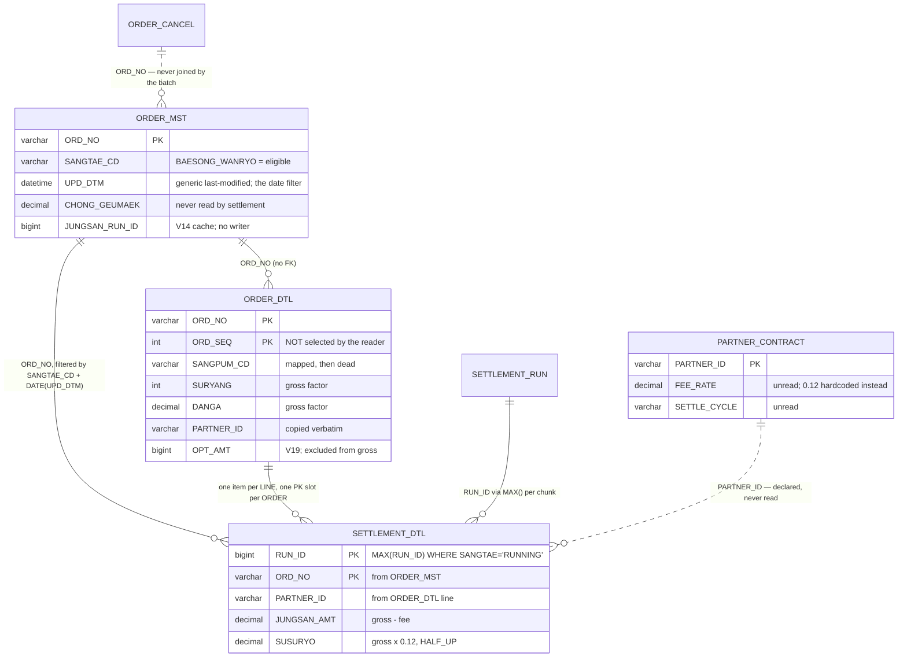

# SETTLEMENT_DTL Field Lineage — from ORDER_MST/ORDER_DTL to the Payout

## Overview

`SETTLEMENT_DTL` is where money becomes a fact: five columns per settled order, two of which are amounts that a partner is paid and a fee Sellflow keeps. Everything in those five columns is derived at runtime by four small pieces of code — a reader SQL string, a row mapper, a one-method processor and a writer — with no intermediate persistence and no reconciliation step.

This artifact traces each column back to its origin column in the order domain, states the transform applied, and names the exact code path. Three findings fall out of the trace: the batch's input set is defined by a status filter that never consults the cancellation tables; the fee is a hardcoded constant that ignores the contract table built to hold it; and the rounding rule the repository's only test asserts is not the rounding rule production uses.

## Key Facts

- Three columns are copied unchanged from the order domain (`ORD_NO`, `PARTNER_ID`), one is resolved from the settlement domain (`RUN_ID`), and two are computed (`SUSURYO`, `JUNGSAN_AMT`). Nothing else is written, and no column of `SETTLEMENT_DTL` is ever updated after insert → settlement-batch:src/main/java/kr/co/sellflow/settlement/job/SettlementItemWriter.java, settlement-batch:src/main/resources/db/migration/V1__settlement_schema.sql
- The input set comes from one SQL string in `DailySettlementJobConfig.settlementTargetReader`: `SELECT m.ORD_NO, d.PARTNER_ID, d.SANGPUM_CD, d.SURYANG, d.DANGA FROM ORDER_MST m JOIN ORDER_DTL d ON d.ORD_NO = m.ORD_NO WHERE m.SANGTAE_CD = 'BAESONG_WANRYO' AND DATE(m.UPD_DTM) = ?` → settlement-batch:src/main/java/kr/co/sellflow/settlement/config/DailySettlementJobConfig.java (lines 71-77)
- **That `WHERE` clause is the whole cancellation policy, and it never mentions cancellation.** `ORDER_CANCEL` is not joined, `CHORI_SANGTAE` is not read, `ORDER_EVENT_OUTBOX` is not consulted. An order is excluded from settlement only if its `SANGTAE_CD` has already been overwritten to something other than `BAESONG_WANRYO` — exclusion is a side effect of a status write, not a rule → settlement-batch:src/main/java/kr/co/sellflow/settlement/config/DailySettlementJobConfig.java
- The reader's own javadoc claims the opposite of what the SQL does: "배송완료 일자 기준이며 주문의 현재 상태나 취소 여부는 조건에 포함하지 않는다. 배송이 완료되었다면 파트너는 이행을 마친 것으로 본다." — "it is based on the delivery-completion date; the order's current status and whether it was cancelled are not part of the condition. If delivery completed, the partner is considered to have fulfilled." The SQL filters on current status (`m.SANGTAE_CD = 'BAESONG_WANRYO'`) as its first predicate → settlement-batch:src/main/java/kr/co/sellflow/settlement/config/DailySettlementJobConfig.java (lines 56-62 vs 71-77)
- The date predicate is `DATE(m.UPD_DTM)`, a generic last-modified timestamp, not a delivery-completion date. Any write to `ORDER_MST` moves it — including `MarkSettledTasklet`'s own `UPD_DTM=NOW()`. There is no `BAESONG_WANRYO_DTM` column in the schema to key on instead → settlement-batch:src/main/java/kr/co/sellflow/settlement/config/DailySettlementJobConfig.java, order-service:src/main/resources/db/migration/V1__init.sql, settlement-batch:src/main/java/kr/co/sellflow/settlement/tasklet/MarkSettledTasklet.java
- Whether the cancellation blindness has ever caused a wrong payout is an open item from the 2025-07-12 postmortem: "[ ] **취소 건이 정산 대상에서 제외되는지 점검** — 2025-07-15 제기, 이후 논의 없음" — "check whether cancelled orders are excluded from settlement targets — raised 2025-07-15, no discussion since" → sellflow-docs:context/runbooks/장애회고_2025-07-12_정산배치_중복실행.md
- `SettlementTargetRowMapper` maps five columns; `SANGPUM_CD` is one of them and is never read again. `SettlementTarget.getSangpumCd()` has no caller, and `SETTLEMENT_DTL` has no product column — the settled row cannot say what was sold → settlement-batch:src/main/java/kr/co/sellflow/settlement/domain/SettlementTargetRowMapper.java, settlement-batch:src/main/java/kr/co/sellflow/settlement/domain/SettlementTarget.java
- Gross is computed in the domain object, not in SQL: `getGross()` returns `danga.multiply(BigDecimal.valueOf(suryang))` — unit price times quantity, one order line at a time. `ORDER_DTL.OPT_AMT` (option price, added by order-service V19) is neither selected nor added, and `ORDER_MST.CHONG_GEUMAEK` (the order's own total) is never read → settlement-batch:src/main/java/kr/co/sellflow/settlement/domain/SettlementTarget.java, order-service:src/main/resources/db/migration/V19__order_dtl_option_price.sql, order-service:src/main/resources/db/migration/V1__init.sql
- **The reader emits one item per `ORDER_DTL` line; the target table's primary key is per order.** `JOIN ORDER_DTL` fans out, and `INSERT INTO SETTLEMENT_DTL (RUN_ID, ORD_NO, ...)` carries no `ON DUPLICATE KEY UPDATE`, so a two-line order produces two inserts with identical `(RUN_ID, ORD_NO)`. There is no aggregation step anywhere between reader and writer → settlement-batch:src/main/java/kr/co/sellflow/settlement/config/DailySettlementJobConfig.java, settlement-batch:src/main/java/kr/co/sellflow/settlement/job/SettlementItemWriter.java, settlement-batch:src/main/resources/db/migration/V1__settlement_schema.sql
- The fee rate is a constant in the processor: `private static final BigDecimal DEFAULT_FEE_RATE = new BigDecimal("0.12")`, applied to every row of every partner → settlement-batch:src/main/java/kr/co/sellflow/settlement/job/SettlementItemProcessor.java (line 19)
- `PARTNER_CONTRACT` exists (V3), has a `FEE_RATE DECIMAL(5,4)`, and has a working repository — `PartnerContractRepository.find(partnerId)` — with no caller anywhere in the five repos. The processor's own javadoc concedes it: "파트너별 계약 수수료율은 PARTNER_CONTRACT 에 있으나, 현재는 기본 수수료율만 적용한다. (2021년 이후 미정비)" — "per-partner contracted rates are in PARTNER_CONTRACT, but only the default rate is applied at present (unmaintained since 2021)" → settlement-batch:src/main/resources/db/migration/V3__add_partner_contract.sql, settlement-batch:src/main/java/kr/co/sellflow/settlement/repository/PartnerContractRepository.java, settlement-batch:src/main/java/kr/co/sellflow/settlement/job/SettlementItemProcessor.java
- The business rules define three tiers — 기본 12.0%, 프리미엄 9.5% (월 거래액 1억 이상), 신규 프로모션 6.0% (입점 3개월 이내) — and then state the reality: "계약별 수수료율은 PARTNER_CONTRACT 에 있으나 2021년 이후 미정비. 현재 전 건 기본 수수료율 적용 중." — "per-contract rates are in PARTNER_CONTRACT but unmaintained since 2021; currently the base rate is applied to everything." A premium partner is therefore charged 12% where 9.5% was agreed, and a promotional partner 12% where 6% was agreed → sellflow-docs:context/business-rules.md
- **Two rounding rules exist and the wrong one is tested.** `SettlementItemProcessor` rounds the fee with `setScale(0, RoundingMode.HALF_UP)`. `MoneyUtil.fee(long, double)` in the same module rounds with `RoundingMode.FLOOR` — and has no caller in production code. The repository's only settlement test, `수수료는_절사한다` ("the fee is truncated"), asserts `MoneyUtil.fee(14999, 0.1) == 1499`, exercising the FLOOR path that no payout ever takes → settlement-batch:src/main/java/kr/co/sellflow/settlement/job/SettlementItemProcessor.java, settlement-batch:src/main/java/kr/co/sellflow/settlement/common/MoneyUtil.java, settlement-batch:src/test/java/kr/co/sellflow/settlement/job/SettlementItemProcessorTest.java
- Both `MoneyUtil` classes document a cross-service split that the live settlement path does not implement. The settlement one says "정산은 절사(FLOOR), 주문은 반올림(HALF_UP). 2022 협의 결과이며 문서화되어 있지 않다" — "settlement truncates, orders round half-up; agreed in 2022 and not documented anywhere"; the order-service one says the same from its side and warns "표시 금액과 지급 금액이 1원 단위로 다를 수 있다" ("displayed and paid amounts can differ by one won"). In fact the production settlement path uses HALF_UP, the same as orders → settlement-batch:src/main/java/kr/co/sellflow/settlement/common/MoneyUtil.java, order-service:src/main/java/kr/co/sellflow/order/common/MoneyUtil.java, settlement-batch:src/main/java/kr/co/sellflow/settlement/job/SettlementItemProcessor.java
- `MoneyUtil` also differs in arithmetic, not just rounding: it computes `BigDecimal.valueOf(amount * rate)` — a `double` multiplication performed before any decimal conversion — whereas the processor multiplies two `BigDecimal`s. Adopting `MoneyUtil` would change results by more than the rounding mode alone → settlement-batch:src/main/java/kr/co/sellflow/settlement/common/MoneyUtil.java
- `RUN_ID` is not carried from the job; the writer re-derives it per chunk with `SELECT MAX(RUN_ID) FROM SETTLEMENT_RUN WHERE SANGTAE='RUNNING'`, so a 1,200-row job issues three separate resolutions and a run row changing state mid-job would split the output across run ids → settlement-batch:src/main/java/kr/co/sellflow/settlement/job/SettlementItemWriter.java

## Entities

### Field lineage: SETTLEMENT_DTL

| Field | Origin | Transform | Code Path |
|---|---|---|---|
| `RUN_ID` `BIGINT` PK1 | `SETTLEMENT_RUN.RUN_ID` | `MAX(RUN_ID)` where `SANGTAE='RUNNING'`; re-resolved **once per chunk of 500**, not once per job | `SettlementItemWriter.currentRunId()` → `SettlementItemWriter.write()` |
| `ORD_NO` `VARCHAR(20)` PK2 | `ORDER_MST.ORD_NO` | none — copied verbatim | reader SQL `m.ORD_NO` → `SettlementTargetRowMapper.mapRow` → `SettlementTarget.ordNo` → writer |
| `PARTNER_ID` `VARCHAR(20)` | `ORDER_DTL.PARTNER_ID` | none — copied verbatim from the **line**, so a multi-partner order yields multiple items with one `ORD_NO` | reader SQL `d.PARTNER_ID` → mapper → writer |
| `SUSURYO` `DECIMAL(15,0)` | `ORDER_DTL.DANGA`, `ORDER_DTL.SURYANG` | `gross = DANGA × SURYANG`; `fee = gross × 0.12` rounded `HALF_UP` to scale 0 | `SettlementTarget.getGross()` → `SettlementItemProcessor.process()` → `setSusuryo` → writer |
| `JUNGSAN_AMT` `DECIMAL(15,0)` | same two columns | `gross − fee`, using the already-rounded fee (so the pair always sums exactly to gross) | `SettlementItemProcessor.process()` → `setJungsanAmt` → writer |

Read but never written anywhere:

| Field | Origin | Fate |
|---|---|---|
| `SANGPUM_CD` | `ORDER_DTL.SANGPUM_CD` | selected, mapped into `SettlementTarget`, never read again; no column exists for it in `SETTLEMENT_DTL` |

Available and deliberately or accidentally excluded:

| Field | Where it lives | Why it does not reach the payout |
|---|---|---|
| `ORDER_DTL.OPT_AMT` | added by order-service V19 | not in the reader's `SELECT` list; not in `getGross()` — option revenue settles at zero |
| `ORDER_MST.CHONG_GEUMAEK` | order total, V1 | never read; no cross-check exists between the order's own total and the settled gross |
| `PARTNER_CONTRACT.FEE_RATE` | V3 | `PartnerContractRepository` has no caller; the processor uses its own constant |
| `ORDER_CANCEL.*` | order-service V1 | never joined; cancellation affects settlement only through `ORDER_MST.SANGTAE_CD` |

### Source tables

`ORDER_MST` (order-service V1) — `ORD_NO` PK, `GOGAEK_ID`, `JUMUN_ILSI`, `SANGTAE_CD`, `CHONG_GEUMAEK`, `BAESONG_JUSO`, `REG_DTM`, `UPD_DTM`; later additions include `PARENT_ORD_NO` (V10) and `JUNGSAN_RUN_ID` (V14). Only `ORD_NO`, `SANGTAE_CD` and `UPD_DTM` participate in settlement.

`ORDER_DTL` (order-service V1) — `(ORD_NO, ORD_SEQ)` PK, `SANGPUM_CD`, `SURYANG`, `DANGA`, `PARTNER_ID`; plus `CHANGGO_CD` (V12) and `OPT_AMT` (V19). Only `PARTNER_ID`, `SANGPUM_CD`, `SURYANG`, `DANGA` are selected — and `ORD_SEQ`, the half of the primary key that distinguishes lines, is **not** among them.

`SETTLEMENT_DTL` (settlement-batch V1) — `(RUN_ID, ORD_NO)` PK, `PARTNER_ID`, `JUNGSAN_AMT`, `SUSURYO`; indexes `IX_SETTLEMENT_DTL_01 (ORD_NO)` and `IX_SETTLEMENT_DTL_02 (PARTNER_ID)`. No FKs exist in either schema — order-service V1 says so outright: "FK 제약 없음. 성능 이슈로 2019년 설계 당시 제외함." ("no FK constraints; excluded at design time in 2019 for performance reasons").



### The path, end to end

```mermaid
flowchart TD
    subgraph order["order-service tables (shared MySQL instance sellflow_order)"]
        OM["ORDER_MST<br/>ORD_NO · SANGTAE_CD · UPD_DTM · CHONG_GEUMAEK"]
        OD["ORDER_DTL<br/>ORD_SEQ · SANGPUM_CD · SURYANG · DANGA · PARTNER_ID · OPT_AMT"]
        OC["ORDER_CANCEL<br/>CHWISO_SAYU_CD · CHORI_SANGTAE"]
    end

    RD["JdbcCursorItemReader — DailySettlementJobConfig<br/>JOIN on ORD_NO<br/>WHERE SANGTAE_CD = 'BAESONG_WANRYO'<br/>AND DATE UPD_DTM = jungsanIlja"]
    OM --> RD
    OD --> RD
    OC -. "never joined — the batch is cancellation-blind" .-> RD

    RM["SettlementTargetRowMapper<br/>maps 5 columns into SettlementTarget"]
    RD --> RM

    GR["SettlementTarget.getGross()<br/>gross = DANGA x SURYANG<br/>(OPT_AMT and CHONG_GEUMAEK excluded)"]
    RM --> GR

    PR["SettlementItemProcessor<br/>fee = gross x 0.12, HALF_UP, scale 0<br/>jungsanAmt = gross - fee"]
    GR --> PR

    PC["PARTNER_CONTRACT.FEE_RATE<br/>PartnerContractRepository — no caller"]
    PC -. "declared, unused" .-> PR

    MU["MoneyUtil.fee — FLOOR<br/>no production caller<br/>asserted by the only unit test"]
    MU -. "not on the payout path" .-> PR

    SR["SETTLEMENT_RUN<br/>MAX RUN_ID WHERE SANGTAE = 'RUNNING'<br/>resolved once per chunk of 500"]

    WR["SettlementItemWriter<br/>INSERT INTO SETTLEMENT_DTL<br/>no ON DUPLICATE KEY"]
    PR --> WR
    SR --> WR

    SD["SETTLEMENT_DTL<br/>RUN_ID · ORD_NO · PARTNER_ID · JUNGSAN_AMT · SUSURYO<br/>PK is per ORDER, input is per LINE"]
    WR --> SD

    MS["MarkSettledTasklet<br/>ORDER_MST.SANGTAE_CD = 'JUNGSAN_WANRYO', UPD_DTM = NOW()"]
    SD --> MS
    MS --> OM
```



## Worked Examples

### 1. Reproducing a settled row from its origins

```sql
-- what the batch read, and what it should have produced, for one order
SELECT m.ORD_NO,
       m.SANGTAE_CD,
       DATE(m.UPD_DTM)                                AS reader_date_key,
       m.CHONG_GEUMAEK                                AS order_total_never_read,
       d.ORD_SEQ,
       d.PARTNER_ID,
       d.SANGPUM_CD                                   AS mapped_then_discarded,
       d.SURYANG, d.DANGA, d.OPT_AMT                  AS opt_amt_excluded,
       (d.DANGA * d.SURYANG)                          AS gross,
       ROUND(d.DANGA * d.SURYANG * 0.12, 0)           AS expected_susuryo,   -- HALF_UP
       FLOOR(d.DANGA * d.SURYANG * 0.12)              AS moneyutil_would_give, -- FLOOR
       (d.DANGA * d.SURYANG) - ROUND(d.DANGA * d.SURYANG * 0.12, 0) AS expected_jungsan_amt,
       s.RUN_ID, s.JUNGSAN_AMT, s.SUSURYO            AS actually_settled
  FROM ORDER_MST m
  JOIN ORDER_DTL d ON d.ORD_NO = m.ORD_NO
  LEFT JOIN SETTLEMENT_DTL s ON s.ORD_NO = m.ORD_NO
 WHERE m.ORD_NO = 'ORD20260831000123';
```

MySQL's `ROUND` is half-away-from-zero on positive values, which matches `RoundingMode.HALF_UP` for the non-negative amounts this domain deals in — so `expected_susuryo` reproduces the processor. The two rounding columns diverge whenever `gross × 0.12` has a fractional part of 0.5 or more.

Three things to watch in the result:

- More than one `ORD_SEQ` row while `SETTLEMENT_DTL` returns a single row per `(RUN_ID, ORD_NO)`: that is the primary-key collision described above. The row that survived, if any, is the first line inserted.
- `opt_amt_excluded > 0`: that revenue was settled at zero.
- `order_total_never_read` disagreeing with the summed `gross`: nothing in the system compares them.

### 2. Which partners are over-charged by the hardcoded rate

```sql
SELECT c.PARTNER_ID, c.FEE_RATE AS contracted, 0.12 AS applied,
       SUM(d.JUNGSAN_AMT + d.SUSURYO)                       AS gross_settled,
       SUM(d.SUSURYO)                                       AS fee_charged,
       ROUND(SUM(d.JUNGSAN_AMT + d.SUSURYO) * c.FEE_RATE)   AS fee_per_contract,
       SUM(d.SUSURYO) - ROUND(SUM(d.JUNGSAN_AMT + d.SUSURYO) * c.FEE_RATE) AS overcharge
  FROM SETTLEMENT_DTL d
  JOIN PARTNER_CONTRACT c ON c.PARTNER_ID = d.PARTNER_ID
 GROUP BY c.PARTNER_ID, c.FEE_RATE
HAVING c.FEE_RATE <> 0.12;
```

`gross` is recoverable as `JUNGSAN_AMT + SUSURYO` precisely because the processor subtracts the *rounded* fee — the two columns always sum back to the exact gross with no residue. Caveat before acting on any result: `PARTNER_CONTRACT` has been unmaintained since 2021 per the business rules, so a mismatch may mean a stale contract row rather than a wrong payout. This is the check `FEE_MISMATCH` would have automated, had it been implemented — see [[PROC-SETTLEMENT-ANOMALY-LIFECYCLE]].

### 3. Enum tables

`ORDER_MST.SANGTAE_CD` — the only order state that matters to this lineage is the filter value; the rest determine whether an order is ever seen.

| Value | Label | Effect on `SETTLEMENT_DTL` |
|---|---|---|
| `GYEOLJE_WANRYO` | 결제완료 (paid) | never read |
| `SANGPUM_JUNBI` | 상품준비중 (preparing) | never read |
| `BAESONG_JUNG` | 배송중 (in delivery) | never read |
| `BAESONG_WANRYO` | 배송완료 (delivered) | **the reader's filter — the sole eligibility condition** |
| `JUNGSAN_WANRYO` | 정산완료 (settled) | written afterwards by `MarkSettledTasklet`; the de-facto re-settlement guard |
| `CHWISO` | 취소 (cancelled) | excluded only because the value is no longer `BAESONG_WANRYO` — never checked explicitly |
| `BANPUM` | 반품 (returned) | same |

→ order-service:src/main/java/kr/co/sellflow/order/domain/OrderStatus.java

Fee rates, and which one the code applies:

| Tier | Rate | Applies to | In code? |
|---|---|---|---|
| 기본 (base) | 12.0% | 계약 미체결 파트너 전체 — all partners without a contract | **yes** — `DEFAULT_FEE_RATE = 0.12`, applied to everyone |
| 프리미엄 (premium) | 9.5% | 월 거래액 1억 이상 — monthly volume ≥ 100M KRW | no |
| 신규 프로모션 (new promotion) | 6.0% | 입점 3개월 이내 — within 3 months of onboarding | no |

→ sellflow-docs:context/business-rules.md, settlement-batch:src/main/java/kr/co/sellflow/settlement/job/SettlementItemProcessor.java

Rounding, by code path:

| Path | Mode | Arithmetic | Used in production? | Tested? |
|---|---|---|---|---|
| `SettlementItemProcessor.process` | `HALF_UP`, scale 0 | `BigDecimal × BigDecimal` | **yes — every payout** | no |
| `settlement-batch` `MoneyUtil.fee` | `FLOOR`, scale 0 | `double` multiply, then `BigDecimal.valueOf` | no caller | **yes — the only test** |
| `order-service` `MoneyUtil.fee` | `HALF_UP`, scale 0 | `double` multiply, then `BigDecimal.valueOf` | order-side display | not in the settlement repo |

Worked figure, from the test's own inputs: `14999 × 0.1` is `1499.9`. `MoneyUtil` returns **1499**; the processor's rule would give **1500**. The test is named 수수료는_절사한다 — "the fee is truncated" — and documents a behaviour that no partner has ever been charged. See [[DEC-SELLFLOW-MONEY-ROUNDING]].

## Related

- [[DEC-SELLFLOW-MONEY-ROUNDING]] — the undocumented 2022 FLOOR/HALF_UP agreement and what the code actually does
- [[PROC-SETTLEMENT-DAILY-BATCH]] — the job that executes this lineage
- [[PROC-SETTLEMENT-RUN-LIFECYCLE]] — the run identity stamped onto every row, and the writer/tasklet divergence
- [[PROC-SETTLEMENT-CANCEL-RECON-QUEUE-LIFECYCLE]] — what happens when a settled order is cancelled after the fact
- [[PROC-SETTLEMENT-ANOMALY-LIFECYCLE]] — the `FEE_MISMATCH` check that was documented but never built
- [[SCH-ORDER]] — the source schema for `ORDER_MST` and `ORDER_DTL`
- [[SCH-SETTLEMENT-BATCH]] — `SETTLEMENT_DTL` in the context of the settlement schema
- [[SYS-SETTLEMENT]] — the owning service
