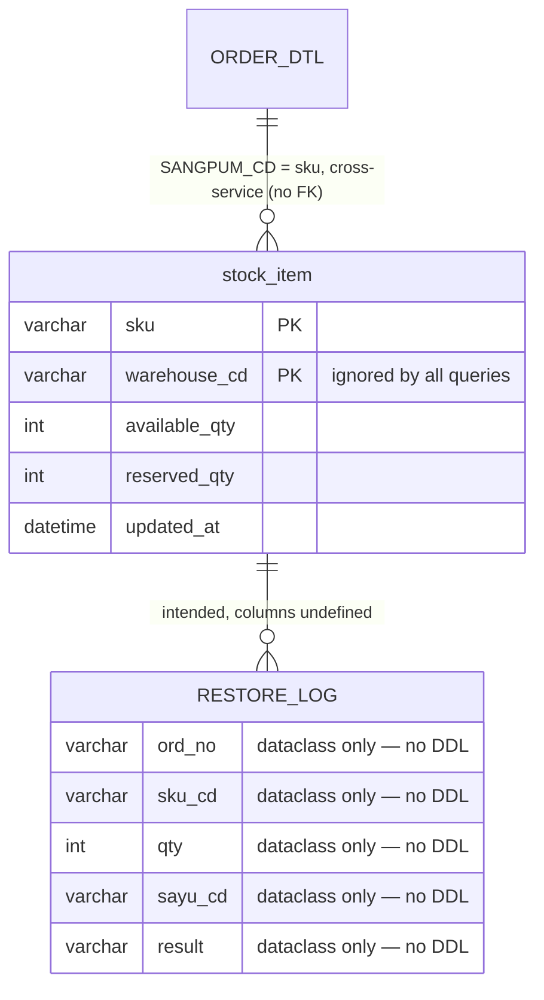

# Schema — Inventory (inventory-api)

> Built from `sql/V1__stock.sql` and the two Alembic revisions under `alembic/versions/`, plus the
> SQL literals in `app/main.py`. Tier 4.
>
> **Two migration systems coexist and do not describe the same schema.** `sql/V1__stock.sql` is a
> Flyway-style file creating `stock_item`; the Alembic chain creates `RESTORE_LOG`. Neither
> mentions the other's table, and the Alembic chain's base revision is missing from the repo.

## Migration churn

| # | Note |
|---|---|
| `sql/V1__stock.sql` | Creates `stock_item`. Not under Alembic control — no Alembic revision creates it. |
| `3f9a` (2023-04-14) | `op.create_table("RESTORE_LOG")` — **table name only, no columns at all.** Its `down_revision` is `"1c22"`, and revision `1c22` does not exist in the repo, so the chain cannot be applied from scratch. |
| `8ba1` (2024-09-02) | Titled `add restore log reason i` (truncated filename suggests "reason index"), but `upgrade()` and `downgrade()` are both `pass` — **an empty migration**. Whatever it was meant to add to `RESTORE_LOG` was never written. |

Net effect: `RESTORE_LOG` has no defined columns anywhere in this repo, and no code reads or
writes it. `app/models.py`'s `RestoreLog` dataclass (`ord_no`, `sku_cd`, `qty`, `sayu_cd`,
`result`) is the only hint at its intended shape, and it is unused.

## Tables

### stock_item — 재고

| Column | Type | Constraints |
|---|---|---|
| sku | VARCHAR(30) | **PK (composite)** |
| warehouse_cd | VARCHAR(10) | **PK (composite)** |
| available_qty | INT | NOT NULL DEFAULT 0 |
| reserved_qty | INT | NOT NULL DEFAULT 0 |
| updated_at | DATETIME | DEFAULT CURRENT_TIMESTAMP |

The PK is `(sku, warehouse_cd)`, but **both queries in `app/main.py` filter on `sku` alone**:
the restock `UPDATE ... WHERE sku = %(sku)s` touches every warehouse row for that SKU, and
`GET /stock/{sku}` returns an arbitrary single row via `fetch_one`. Multi-warehouse is in the
schema but not in the code. `app/models.py`'s `Stock` dataclass (`sku_cd`, `qty`, `updated_at`)
matches neither and is unused.

### RESTORE_LOG — 복원 이력

Created column-less by Alembic `3f9a`. No columns, no code. Intended shape per the unused
`RestoreLog` dataclass: `ord_no`, `sku_cd`, `qty`, `sayu_cd`, `result`.

## Tables read from other services

| Table | Owner | Access |
|---|---|---|
| ORDER_DTL | order-service | `SELECT SANGPUM_CD, SURYANG FROM ORDER_DTL WHERE ORD_NO = ...` in `/stock/restock` |

This is a direct cross-database read into the order schema — inventory-api holds no order number
of its own. The README states the terminology mapping deliberately:

| 주문 도메인 | 재고 도메인 |
|---|---|
| `SANGPUM_CD` | `sku` |
| `SURYANG` | `available_qty` / `reserved_qty` |
| `ORD_NO` | (보관하지 않음) |

Note the restock query uses `fetch_one`, so an order with several `ORDER_DTL` lines restocks only
one of them, and the `available_qty` increment applies that single line's quantity.

## Relationships

