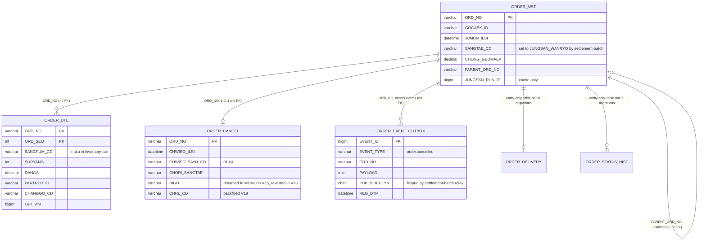

# Schema — Order (order-service)

> Built by reading all 24 Flyway migrations in `src/main/resources/db/migration/` (V1–V24) and
> cross-checking them against the JPA `@Entity` classes in `kr.co.sellflow.order.domain`.
> Tier 4 (code/migration reading). Runtime extraction was not possible — see
> `sources/apis/order/openapi.meta.json` for the pre-flight result.
>
> **Database:** MySQL schema `sellflow_order` (`application.yml`). This instance is **shared with
> settlement-batch and read by settlement-anomaly and inventory-api** — see their schema files.
> `spring.jpa.hibernate.ddl-auto: none`, Flyway owns the schema.
>
> **No foreign keys exist anywhere.** V1 header: `주의: FK 제약 없음. 성능 이슈로 2019년 설계 당시 제외함.`
> All relationships below are by convention only.

## Migration churn (read this before trusting any column)

The migration history contradicts itself in several places. Reflected below is the **stated
current state**, but these are the known discrepancies:

| # | What happened | Evidence |
|---|---|---|
| Rename reverted | `ORDER_CANCEL.BIGO` → `MEMO` (V15, 2024-01) then straight back to `BIGO` (V16, 2024-01-18) because the settlement batch queried `BIGO` directly and broke. Column is `BIGO` today. | V15, V16 |
| Backfill | V18 (2024-03) reclassified `ORDER_CANCEL.CHNL_CD` from `'ADMIN'` to `'APP'` using order inflow channel, for rows since 2023-01-01. Historical `CHNL_CD` values are therefore derived, not captured. | V17, V18 |
| Drop of columns never added under that name | V20 drops `ORDER_MST.JEOKLIP_AMT` and `JEOKLIP_RATE`, but V7 added `JEOKRIPGEUM` and `HALIN_GEUMAEK`. The names do not match, so either V20 is a no-op or V7's columns are still present. **Unresolved.** | V7, V20 |
| Drop of a column never created | V13 `DROP COLUMN IF EXISTS TEMP_FLAG` — `TEMP_FLAG` is created by no migration. Harmless, but shows the history is not self-contained. | V13 |
| Index on a column that does not exist under that name | V21 indexes `ORDER_MST(SETTLE_REF_NO)` but V14 added `JUNGSAN_RUN_ID`. V24 indexes `ORDER_MST(ORD_MEMO(64))` but V2 added `GOGAEK_MEMO`. V22 indexes `ORDER_CANCEL(CHORI_SANGTAE, REG_DT)` but `ORDER_CANCEL` has no `REG_DT` (it has `CHWISO_ILSI`). V18 also joins on `ORDER_MST.INFLOW_CHNL`, while V3 added `CHAENNEL_CD`. | V14/V21, V2/V24, V22, V3/V18 |
| Consolidated squash | V23 (2025-02) is a baseline squash of V1–V22 for new environments only. Its body is **empty in the repo** — only comments — so the "current operating schema dump" it claims to contain is not actually in version control. | V23 |

Net effect: several V19–V24 statements name columns that no earlier migration creates. Either a
set of migrations is missing from the repo, or these statements fail on a clean database. Treat
any column marked *(unverified)* below with suspicion.

## Tables

### ORDER_MST — 주문 마스터
Entity: `OrderMst`

| Column | Type | Constraints | Origin |
|---|---|---|---|
| ORD_NO | VARCHAR(20) | **PK** | V1 |
| GOGAEK_ID | VARCHAR(20) | NOT NULL | V1 |
| JUMUN_ILSI | DATETIME | NOT NULL | V1 |
| SANGTAE_CD | VARCHAR(20) | NOT NULL | V1 |
| CHONG_GEUMAEK | DECIMAL(15,0) | NOT NULL | V1 |
| BAESONG_JUSO | VARCHAR(500) | NULL | V1 |
| REG_DTM | DATETIME | DEFAULT CURRENT_TIMESTAMP | V1 |
| UPD_DTM | DATETIME | NULL | V1 |
| GOGAEK_MEMO | VARCHAR(500) | NULL | V2 |
| CHAENNEL_CD | VARCHAR(20) | NULL, backfilled to `'WEB'` | V3 |
| UNSONGJANG_BEONHO | VARCHAR(30) | NULL | V5 |
| TAEKBAESA_CD | VARCHAR(10) | NULL | V5 |
| JEOKRIPGEUM | DECIMAL(15,0) | DEFAULT 0 — *possibly dropped, see churn table* | V7 |
| HALIN_GEUMAEK | DECIMAL(15,0) | DEFAULT 0 — *possibly dropped, see churn table* | V7 |
| PARENT_ORD_NO | VARCHAR(20) | NULL — 주문 분할/병합 | V10 |
| JUNGSAN_RUN_ID | BIGINT | NULL — cache only. V14: `실제 정산 여부는 SETTLEMENT_DTL 이 정본이다. 본 컬럼은 캐시 성격.` | V14 |

Referenced but never created: `SETTLE_REF_NO` (V21), `ORD_MEMO` (V24), `INFLOW_CHNL` (V18),
`ORD_DT` (queried by `OrderSearchService`), `BAESONG_MSG` (V13 TODO), `TEMP_FLAG` (V13).

**Not mapped by the entity:** `OrderMst` maps only ORD_NO, GOGAEK_ID, JUMUN_ILSI, SANGTAE_CD,
CHONG_GEUMAEK, BAESONG_JUSO, UPD_DTM. Everything from V2 onward is invisible to JPA.

Indexes: `IX_ORDER_MST_01 (GOGAEK_ID, JUMUN_ILSI)` V1 · `IX_ORDER_MST_02 (SANGTAE_CD, JUMUN_ILSI)`
V1 then replaced in V6 (the original single-column index had low cardinality) ·
`IX_ORDER_MST_03 (UNSONGJANG_BEONHO)` V5 · `IX_ORDER_MST_04 (PARENT_ORD_NO)` V10 ·
`IDX_ORDER_MST_SETTLE_REF (SETTLE_REF_NO)` V21 *(unverified column)* ·
`IDX_ORDER_MST_MEMO (ORD_MEMO(64))` V24 *(unverified column)*.

**Cross-service write:** `SANGTAE_CD` is set to `JUNGSAN_WANRYO` by settlement-batch's
`MarkSettledTasklet`, not by order-service. `OrderStatusService` javadoc:
`주의: 정산완료(JUNGSAN_WANRYO) 전이는 이 클래스를 거치지 않는다. 정산 배치가 ORDER_MST 를 직접 갱신한다 (2019 협의, 통합 DB 정책).`
Consequently `ORDER_STATUS_HIST` never records that transition —
`TODO(성민) 2022-11-08: 정산완료 전이는 여기 안 쌓인다. 배치에서 직접 UPDATE 하기 때문.`

### ORDER_DTL — 주문 상세
Entity: `OrderItem` — **and the entity does not match the migrations.**

| Column | Type | Constraints | Origin |
|---|---|---|---|
| ORD_NO | VARCHAR(20) | **PK (composite)** | V1 |
| ORD_SEQ | INT | **PK (composite)** | V1 |
| SANGPUM_CD | VARCHAR(30) | NOT NULL | V1 |
| SURYANG | INT | NOT NULL | V1 |
| DANGA | DECIMAL(15,0) | NOT NULL | V1 |
| PARTNER_ID | VARCHAR(20) | NOT NULL | V1 |
| OKSYEON_MYEONG | VARCHAR(200) | NULL — 옵션명 | V4 |
| GONGGEUP_GA | DECIMAL(15,0) | NULL — 공급가 | V4 |
| CHANGGO_CD | VARCHAR(10) | DEFAULT 'GIMPO' — 용인센터 오픈 대응 | V12 |
| OPT_AMT | BIGINT | NOT NULL DEFAULT 0 | V19 |

`OrderItem` instead declares `ORD_DTL_NO` (as @Id), `ORD_NO`, `SKU_CD`, `OPT_CD`, `QTY`,
`UNIT_AMT` — six columns, of which only `ORD_NO` exists in the migrations. Either a set of
migrations is missing or the entity is dead/aspirational. **Unresolved, and material**: the
settlement reader and inventory-api both query the migration-side names (`SANGPUM_CD`, `SURYANG`,
`DANGA`, `PARTNER_ID`), which is evidence the migration names are the live ones.

Indexes: `IX_ORDER_DTL_01 (PARTNER_ID)` V1.

### ORDER_CANCEL — 주문 취소
Entity: `OrderCancel`

| Column | Type | Constraints | Origin |
|---|---|---|---|
| ORD_NO | VARCHAR(20) | **PK** — one cancel row per order | V1 |
| CHWISO_ILSI | DATETIME | NOT NULL | V1 |
| CHWISO_SAYU_CD | VARCHAR(2) | NOT NULL — `01`~`04` | V1 |
| CHORI_SANGTAE | VARCHAR(20) | NOT NULL — service always writes `'COMPLETED'` | V1 |
| BIGO | VARCHAR(2000) | NULL — V1 (500) → V9 (2000) → V15 renamed to MEMO → V16 renamed back | V1/V9/V15/V16 |
| CHNL_CD | VARCHAR(10) | NULL — `취소 접수 채널 (APP/ADMIN/CS)`, backfilled in V17/V18 | V17 |

Indexes: `IDX_ORDER_CANCEL_STATUS (CHORI_SANGTAE, REG_DT)` V22 *(REG_DT does not exist on this table)*.

`CHWISO_SAYU_CD` values come from the `CancelReason` enum: `01` 파트너 귀책, `02` 시스템 오류,
`03` 고객 변심, `04` 배송 실패. The enum javadoc is explicit that cost allocation is **not**
encoded here: `사유별 비용 부담 주체는 코드에 정의하지 않는다. 정산 정책은 재무본부 소관이며 별도 기준표를 따른다.`
inventory-api independently restocks only `01` and `02`.

### ORDER_EVENT_OUTBOX — 아웃박스 (SF-2287)
Entity: `OrderEventOutbox`

| Column | Type | Constraints | Origin |
|---|---|---|---|
| EVENT_ID | BIGINT | **PK**, AUTO_INCREMENT | V8 |
| EVENT_TYPE | VARCHAR(50) | NOT NULL — only value written is `order.cancelled` | V8 |
| ORD_NO | VARCHAR(20) | NOT NULL | V8 |
| PAYLOAD | TEXT | NOT NULL — `{"ordNo":"...","sayuCd":".."}`, hand-built with String.format | V8 |
| PUBLISHED_YN | CHAR(1) | DEFAULT 'N' | V8 |
| REG_DTM | DATETIME | DEFAULT CURRENT_TIMESTAMP | V8 |

Indexes: `IX_ORDER_EVENT_OUTBOX_01 (PUBLISHED_YN, REG_DTM)` V8 ·
`IX_ORDER_EVENT_OUTBOX_02 (EVENT_TYPE, PUBLISHED_YN)` V11 (added 2024-05 at 정산팀's request after
the relay slowed down).

V8 comment: `정산 배치의 릴레이 잡이 주기적으로 폴링한다. (별도 브로커 없음)` — there is no message
broker. settlement-batch's `OrderEventRelayJob` polls this table every 10 minutes and marks rows
`PUBLISHED_YN='Y'`. order-service does not track downstream outcomes:
`구독 측 처리 결과는 본 서비스에서 추적하지 않는다.`

### ORDER_DELIVERY — 배송 정보
Entity: `DeliveryInfo` (ORD_NO PK, INVOICE_NO, TAKBAE_CD, BAESONG_SANGTAE).
**No migration creates this table.** V5 instead added delivery columns
(`UNSONGJANG_BEONHO`, `TAEKBAESA_CD`) onto `ORDER_MST`. The entity may be dead code, or its
migration is missing. Entity javadoc: `배송 정보. 주문당 1건. 분할배송은 지원하지 않는다 (V10 에서 컬럼만 추가됨).`

### ORDER_STATUS_HIST — 상태 변경 이력
Entity: `OrderStatusHistory` (HIST_SEQ PK auto, ORD_NO, BEFORE_CD, AFTER_CD, REG_DT).
**No migration creates this table either.** Same caveat. Known to be incomplete by design — the
settlement batch's direct UPDATE bypasses it.

## Relationships

## Cross-service reach into these tables

| Reader/writer | Table | Access |
|---|---|---|
| settlement-batch `settlementTargetReader` | ORDER_MST, ORDER_DTL | SELECT, joined on ORD_NO |
| settlement-batch `MarkSettledTasklet` | ORDER_MST | **UPDATE SANGTAE_CD** |
| settlement-batch `OrderEventRelayJob` | ORDER_EVENT_OUTBOX | SELECT + UPDATE PUBLISHED_YN |
| settlement-anomaly `/detect` | ORDER_MST | SELECT (joined to SETTLEMENT_DTL) |
| inventory-api `/stock/restock` | ORDER_DTL | SELECT SANGPUM_CD, SURYANG |
| order-service legacy `OrderCancelServiceV1` | SETTLEMENT_DTL | SELECT COUNT — reads the settlement team's table (deprecated since 2.8.0, retained because a batch may still reference it) |
