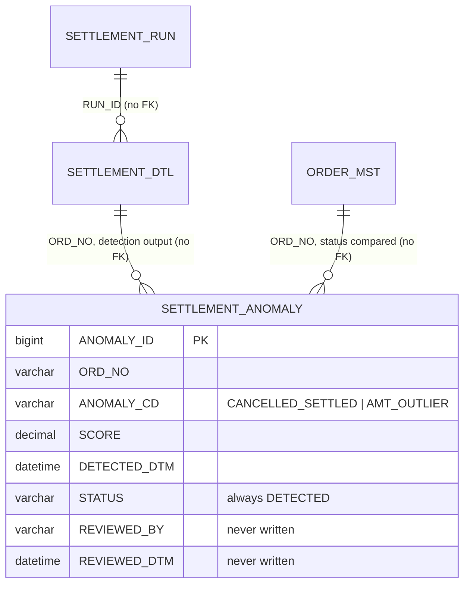

# Schema — Settlement (settlement-anomaly)

> Built from `sql/V1__anomaly_schema.sql` (the repo's only DDL — there is no Alembic or other
> migration tool here) plus the SQL literals in `app/main.py`. Tier 4.
>
> **Database:** `app/db.py` hardcodes `database="sellflow_order"`, i.e. the same shared instance as
> order-service and settlement-batch. `.env.template` (`DB_URL=mysql://anomaly:@localhost:3306/settlement`)
> and the service registry (`db: MySQL (settlement)`) both disagree with the code; `DB_URL` is
> never read by `app/db.py`.

## Tables owned by this service

### SETTLEMENT_ANOMALY — 이상 탐지 결과

| Column | Type | Constraints |
|---|---|---|
| ANOMALY_ID | BIGINT | **PK**, AUTO_INCREMENT |
| ORD_NO | VARCHAR(20) | NOT NULL |
| ANOMALY_CD | VARCHAR(30) | NOT NULL |
| SCORE | DECIMAL(5,4) | NOT NULL |
| DETECTED_DTM | DATETIME | NOT NULL — written as `NOW()` |
| STATUS | VARCHAR(20) | DEFAULT 'DETECTED' — always inserted as `'DETECTED'` |
| REVIEWED_BY | VARCHAR(30) | NULL — **never written by any code in this repo** |
| REVIEWED_DTM | DATETIME | NULL — **never written by any code in this repo** |

Indexes: `IX_SETTLEMENT_ANOMALY_01 (STATUS, DETECTED_DTM)`, `IX_SETTLEMENT_ANOMALY_02 (ANOMALY_CD)`.

`ANOMALY_CD` values actually inserted: `CANCELLED_SETTLED`, `AMT_OUTLIER`.
The README documents two more — `DUP_SETTLE` (중복 정산) and `FEE_MISMATCH` (수수료 불일치) —
that `model/detector.py` does not implement.

`SCORE` is `DECIMAL(5,4)`, so its range is ±9.9999. `CANCELLED_SETTLED` always writes 1.0;
`AMT_OUTLIER` writes `-model.score_samples(...)` from an IsolationForest, which is not bounded to
that range. Possible silent truncation. Flagged, not verified.

The `REVIEWED_BY` / `REVIEWED_DTM` / non-`DETECTED` statuses imply a review workflow that exists
nowhere in this repo. README: `후속 조치 프로세스는 본 서비스 범위 밖이다.` The service registry
says the same about ownership: `이상 탐지만 수행. 조치 주체는 정의되어 있지 않음. TODO`.

## Tables read from other services

| Table | Owner | Access |
|---|---|---|
| SETTLEMENT_DTL | settlement-batch | SELECT RUN_ID, ORD_NO, PARTNER_ID, JUNGSAN_AMT, SUSURYO |
| SETTLEMENT_RUN | settlement-batch | SELECT, joined on RUN_ID, filtered by JUNGSAN_ILJA |
| ORDER_MST | order-service | SELECT SANGTAE_CD, joined on ORD_NO |

The `CANCELLED_SETTLED` rule is precisely a cross-service consistency check: it flags rows where
`SETTLEMENT_DTL` has an entry but `ORDER_MST.SANGTAE_CD` is in `{CHWISO, BANPUM}` — the condition
the settlement reader deliberately does not filter on.

## Unused model

`app/schemas.py` defines `AnomalyRow(run_id, ord_no, anomaly_type, score, status)`. No route or
query uses it, and it does not match the table: there is no `RUN_ID` column on
`SETTLEMENT_ANOMALY`, and the code column is `ANOMALY_CD`, not `anomaly_type`.

## Relationships

