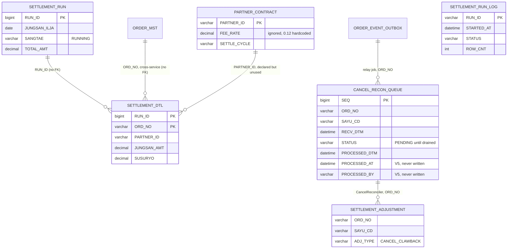

# Schema — Settlement (settlement-batch)

> Built by reading the 6 Flyway migrations in `src/main/resources/db/migration/` (V1–V6) and
> cross-checking against the JDBC statements in `job/`, `tasklet/`, `relay/`, `recon/` and
> `repository/`. Tier 4 (migration reading). Runtime extraction not possible — Gradle project,
> not installable in this fixture.
>
> **Database: the same MySQL instance and schema as order-service — `sellflow_order`**
> (`application.yml`: `jdbc:mysql://${DB_HOST}:3306/sellflow_order`). V1 header:
> `주의: sellflow_order 와 동일 인스턴스를 사용한다. (2019년 통합 결정) ORDER_MST 는 주문팀 소유이나 정산 배치가 SANGTAE_CD 를 갱신한다.`
> The service registry's claim of a separate `MySQL (settlement)` database is not what the config says.
>
> No foreign keys. Spring Batch's own metadata tables are created separately
> (`spring.batch.initialize-schema: always`) and are not described here.

## Migration churn

| # | Note |
|---|---|
| V4 | `CREATE INDEX IDX_CANCEL_RECON_STATUS ON CANCEL_RECON_QUEUE (STATUS, REG_DT)` — `CANCEL_RECON_QUEUE` has no `REG_DT`; its timestamp column is `RECV_DTM` (V1). The statement also duplicates the V1 index `IX_CANCEL_RECON_QUEUE_01 (STATUS, RECV_DTM)`. |
| V5 | Adds `PROCESSED_AT` / `PROCESSED_BY` to `CANCEL_RECON_QUEUE` with the comment `아직 쓰는 코드는 없다.` — and indeed `CancelReconciler` writes the V1 column `PROCESSED_DTM`, not `PROCESSED_AT`. Two parallel "processed at" columns now exist, one of them always NULL. |
| V2/V6 | `SETTLEMENT_RUN_LOG` is created and indexed but **no code in the repo reads or writes it**. It also duplicates `SETTLEMENT_RUN` (V1) with a different key type (`VARCHAR(32)` vs `BIGINT`). |
| V3 | `PARTNER_CONTRACT` is created and a repository exists for it, but the processor never calls it — the 0.12 default rate is hardcoded. |

Two tables written by the code are created by **no migration in this repo**:
`SETTLEMENT_ADJUSTMENT` (written by `CancelReconciler`) and any INSERT into `SETTLEMENT_RUN`
(read by `SettlementItemWriter`, written by nothing).

## Tables

### SETTLEMENT_RUN — 정산 실행

| Column | Type | Constraints |
|---|---|---|
| RUN_ID | BIGINT | **PK**, AUTO_INCREMENT |
| JUNGSAN_ILJA | DATE | NOT NULL |
| SANGTAE | VARCHAR(20) | NOT NULL — code looks for `'RUNNING'` |
| START_DTM | DATETIME | NULL |
| END_DTM | DATETIME | NULL |
| TOTAL_AMT | DECIMAL(18,0) | NULL |

Read by `SettlementItemWriter.currentRunId()` (`SELECT MAX(RUN_ID) ... WHERE SANGTAE='RUNNING'`),
`MarkSettledTasklet` (`SELECT MAX(RUN_ID)`, without the SANGTAE filter) and settlement-anomaly.
**Nothing in either repo inserts the row.** Its writer is unidentified.

### SETTLEMENT_DTL — 정산 상세

| Column | Type | Constraints |
|---|---|---|
| RUN_ID | BIGINT | **PK (composite)** |
| ORD_NO | VARCHAR(20) | **PK (composite)** |
| PARTNER_ID | VARCHAR(20) | NOT NULL |
| JUNGSAN_AMT | DECIMAL(15,0) | NOT NULL — gross minus fee |
| SUSURYO | DECIMAL(15,0) | NOT NULL — fee, `gross * 0.12` HALF_UP |

Indexes: `IX_SETTLEMENT_DTL_01 (ORD_NO)`, `IX_SETTLEMENT_DTL_02 (PARTNER_ID)`.

This is the system of record for "has this order been settled" — V14 of order-service says so
explicitly (`실제 정산 여부는 SETTLEMENT_DTL 이 정본이다`). The composite PK means a re-run under a
new RUN_ID can legitimately produce a second settlement row for the same order, which is what
settlement-anomaly's documented (but unimplemented) `DUP_SETTLE` check would look for.

### CANCEL_RECON_QUEUE — 정산 정정 대기열 (SF-2287)

| Column | Type | Constraints | Origin |
|---|---|---|---|
| SEQ | BIGINT | **PK**, AUTO_INCREMENT | V1 |
| ORD_NO | VARCHAR(20) | NOT NULL | V1 |
| SAYU_CD | VARCHAR(2) | NOT NULL — parsed out of the outbox JSON payload by substring | V1 |
| RECV_DTM | DATETIME | DEFAULT CURRENT_TIMESTAMP | V1 |
| STATUS | VARCHAR(20) | DEFAULT 'PENDING'; `CancelReconciler` sets `'PROCESSED'` | V1 |
| PROCESSED_DTM | DATETIME | NULL — written by `CancelReconciler` | V1 |
| PROCESSED_AT | DATETIME | NULL — **never written** | V5 |
| PROCESSED_BY | VARCHAR(30) | NULL — **never written** | V5 |

Indexes: `IX_CANCEL_RECON_QUEUE_01 (STATUS, RECV_DTM)` V1 ·
`IDX_CANCEL_RECON_STATUS (STATUS, REG_DT)` V4 *(REG_DT does not exist)*.

V1 comment: `SF-2287 대응. 정산 후 취소 건을 수기 정정용으로 적재한다. 정산팀이 주기적으로 확인하여 차월 정산에서 차감한다.`
— the queue was designed for **manual** handling. `CancelReconciler` would automate the drain,
but it is registered on no schedule (see `sources/apis/settlement/batch/openapi.meta.json`).

### PARTNER_CONTRACT — 파트너 계약 (V3)

| Column | Type | Constraints |
|---|---|---|
| PARTNER_ID | VARCHAR(20) | **PK** |
| FEE_RATE | DECIMAL(5,4) | NOT NULL — **not used by the batch** |
| SETTLE_CYCLE | VARCHAR(10) | NOT NULL DEFAULT 'DAILY' |
| UPD_DT | DATETIME | NULL |

`PartnerContract` javadoc: `수수료율은 PARTNER_CONTRACT 에 있으나 2021 이후 정비되지 않았다.`

### SETTLEMENT_RUN_LOG — 실행 로그 (V2, V6) — orphan

| Column | Type | Constraints |
|---|---|---|
| RUN_ID | VARCHAR(32) | **PK** |
| STARTED_AT | DATETIME | NOT NULL |
| ENDED_AT | DATETIME | NULL |
| STATUS | VARCHAR(20) | NOT NULL |
| ROW_CNT | INT | NOT NULL DEFAULT 0 |

Index: `IDX_SETTLEMENT_RUN_LOG_DT (STARTED_AT)` V6. No reader, no writer in this repo.

### SETTLEMENT_ADJUSTMENT — 정정 (no migration)

Written by `CancelReconciler`: `INSERT INTO SETTLEMENT_ADJUSTMENT (ORD_NO, SAYU_CD, ADJ_TYPE)
VALUES (?, ?, 'CANCEL_CLAWBACK')`. Columns beyond those three are unknown; the table is created
by no migration in this repo. Nothing reads it here, and `SettlementReportWriter`'s TODO confirms
adjustments are absent from the partner report.

## Relationships

